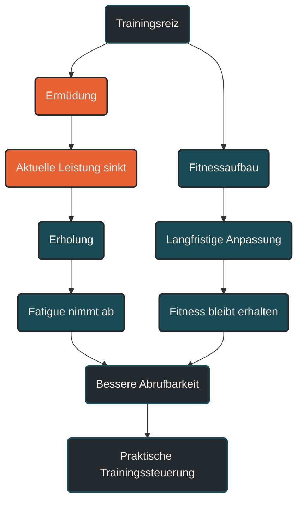

Superkompensation beschreibt die Vorstellung, dass der Körper nach einem Trainingsreiz zunächst ermüdet, sich anschließend erholt und danach kurzfristig leistungsfähiger sein kann als zuvor. [[1]](#quelle-1) Im Ausdauertraining ist das Modell hilfreich, um Belastung und Erholung grundsätzlich zu verstehen. Es ist aber kein vollständiges Steuerungsmodell, weil Fitness und Ermüdung in der Praxis gleichzeitig entstehen. [[2]](#quelle-2)

## Was Superkompensation bedeutet

Das klassische Superkompensationsmodell erklärt Training als Abfolge von vier Phasen. [[1]](#quelle-1) Zuerst setzt ein Trainingsreiz den Körper unter Belastung. Danach sinkt die kurzfristige Leistungsfähigkeit, weil Energie verbraucht wurde, Muskeln und Nervensystem ermüdet sind und verschiedene Regulationsprozesse arbeiten müssen.

In der Erholungsphase versucht der Körper, den Ausgangszustand wiederherzustellen. Wenn der Reiz passend dosiert war und genügend Erholung folgt, kann es zu einer Anpassung kommen. Diese Anpassung wird im Modell als Superkompensation beschrieben: Der Körper erreicht vorübergehend ein etwas höheres Leistungsniveau als vor dem Trainingsreiz. [[1]](#quelle-1)

Einfach gesagt: Training macht nicht während der Einheit besser, sondern durch die Anpassung danach. [[1]](#quelle-1)

## Warum Superkompensation wichtig ist

Superkompensation hilft zu verstehen, warum Training und Erholung zusammengehören. Ein einzelner Trainingsreiz reicht nicht aus, wenn danach keine ausreichende Regeneration folgt. Umgekehrt entsteht ohne Reiz auch keine relevante Anpassung. [[1]](#quelle-1)

Für Ausdauertraining bedeutet das: Belastung muss stark genug sein, um eine Reaktion auszulösen, aber nicht so stark, dass Erholung dauerhaft scheitert. [[1]](#quelle-1) [[6]](#quelle-6) Fortschritt entsteht nicht durch möglichst harte Einzelbelastungen, sondern durch wiederholte, sinnvoll dosierte Reize über längere Zeit.

## Die klassischen Phasen

### Trainingsreiz

Der Trainingsreiz ist die Belastung, die auf den Körper wirkt. Das kann ein lockerer Dauerlauf, ein langer Lauf, ein Intervalltraining oder eine andere Ausdauereinheit sein. Entscheidend ist nicht nur die äußere Belastung wie Pace, Strecke oder Watt, sondern auch die innere Belastung.

### Ermüdung

Nach dem Reiz ist die aktuelle Leistungsfähigkeit zunächst reduziert. Diese Ermüdung kann muskulär, metabolisch, nerval oder mental geprägt sein. Auch Schlaf, Stress, Ernährung und Alltag beeinflussen, wie stark ein Trainingsreiz wirkt. [[6]](#quelle-6) [[7]](#quelle-7)

### Erholung

In der Erholung werden Energiespeicher aufgefüllt, Gewebe repariert und Regulationsprozesse normalisiert. Erholung bedeutet dabei nicht nur Pause. Auch Schlaf, Ernährung, lockere Bewegung und eine sinnvolle Belastungsverteilung gehören dazu. [[7]](#quelle-7)

### Anpassung

Wenn Reiz und Erholung zusammenpassen, kann der Körper belastbarer werden. Im Ausdauersport betrifft das zum Beispiel Herz-Kreislauf-System, Muskulatur, Stoffwechsel, Sehnen, Knochen, Nervensystem und Bewegungsökonomie. [[4]](#quelle-4) [[5]](#quelle-5) Diese Systeme passen sich aber unterschiedlich schnell an. [[4]](#quelle-4)

## Grenzen des Superkompensationsmodells

Das klassische Modell ist nützlich, aber vereinfacht. Es wirkt so, als würde Training immer nach demselben Muster ablaufen: Reiz, Ermüdung, Erholung, Leistungsplus. In der echten Trainingspraxis ist das zu linear. [[2]](#quelle-2)

Fitness und Ermüdung entstehen nicht nacheinander, sondern gleichzeitig. [[2]](#quelle-2) Ein Trainingsblock kann langfristig die Fitness verbessern und trotzdem kurzfristig dazu führen, dass sich ein Sportler müde, schwer oder langsam fühlt. Deshalb kann jemand gut trainiert sein und trotzdem an einzelnen Tagen schlecht performen. [[2]](#quelle-2) [[6]](#quelle-6)

Auch der Zeitpunkt der Anpassung ist nicht für alle Systeme gleich. Das Herz-Kreislauf-System kann sich relativ schnell verbessern, während Sehnen, Knochen und andere passive Strukturen deutlich mehr Zeit brauchen. [[4]](#quelle-4) Deshalb kann sich die Ausdauer bereits besser anfühlen, obwohl die orthopädische Belastbarkeit noch nicht im gleichen Maß nachgezogen hat.

## Fitness-Fatigue als bessere Einordnung

Für die praktische Trainingssteuerung ist das Fitness-Fatigue-Modell oft hilfreicher. [[2]](#quelle-2) Es unterscheidet zwischen zwei Effekten eines Trainingsreizes:

Fitness beschreibt die längerfristige positive Anpassung. Fatigue beschreibt die kurzfristige Ermüdung. Die aktuell abrufbare Leistungsfähigkeit entsteht aus dem Verhältnis beider Faktoren. [[2]](#quelle-2)

Wenn die Fitness steigt, aber die Ermüdung ebenfalls hoch ist, fühlt sich Training schwer an. Wenn die Ermüdung sinkt und die aufgebaute Fitness erhalten bleibt, kann die Leistung deutlich besser abrufbar sein. Genau deshalb funktionieren Entlastungswochen, Tapering und gut geplante Regenerationsphasen. [[3]](#quelle-3)

## Bedeutung für Läufer

Für Läufer ist Superkompensation vor allem als Grundidee wichtig: Belastung allein reicht nicht. Erst die passende Erholung macht Anpassung möglich. [[1]](#quelle-1) [[7]](#quelle-7)

In der Praxis bedeutet das, harte Einheiten nicht isoliert zu betrachten. Ein Intervalltraining, ein langer Lauf oder ein intensiver Trainingsblock wirken immer in einem größeren Zusammenhang. Entscheidend ist, wie sie in die Woche, den Trainingszustand und die Erholungsfähigkeit passen. [[2]](#quelle-2) [[6]](#quelle-6)

Besonders wichtig ist auch, nicht jede Verbesserung sofort erzwingen zu wollen. Wenn mehrere harte Reize zu dicht aufeinander folgen, kann sich Ermüdung anhäufen. Dann sinkt die aktuelle Leistungsfähigkeit, obwohl das Training grundsätzlich wirksam sein kann. [[2]](#quelle-2) [[6]](#quelle-6)

## Häufige Fehler

Ein häufiger Fehler ist die Annahme, dass nach jedem Training automatisch eine Leistungssteigerung folgt. Anpassung ist aber nicht garantiert. Sie hängt davon ab, ob Reiz, Erholung, Ernährung, Schlaf und Gesamtbelastung zusammenpassen. [[6]](#quelle-6) [[7]](#quelle-7)

Ein weiterer Fehler ist, Superkompensation als exakten Kalender zu verstehen. Es gibt keinen festen Zeitpunkt, an dem jeder Sportler nach jeder Einheit optimal angepasst ist. Die Erholung nach einem lockeren Lauf ist anders als nach Intervallen, einem langen Lauf oder einer hohen Wochenbelastung. [[2]](#quelle-2) [[6]](#quelle-6)

Problematisch ist auch, nur die muskuläre Erholung zu betrachten. Ausdauertraining belastet nicht nur Muskeln, sondern auch Nervensystem, Stoffwechsel, Sehnen, Knochen, Immunsystem und mentale Ressourcen. [[4]](#quelle-4) [[5]](#quelle-5)

## Praktische Einordnung

Superkompensation ist ein gutes Einstiegsmodell, um Belastung und Erholung zu verstehen. Für echte Trainingsplanung sollte es aber nicht isoliert verwendet werden. Besser ist die Kombination aus Superkompensation als Grundidee und Fitness-Fatigue als modernerer Einordnung. [[1]](#quelle-1) [[2]](#quelle-2)

Der wichtigste Merksatz lautet: Anpassung entsteht nicht durch Belastung allein, sondern durch das richtige Verhältnis aus Reiz, Erholung, aufgebauter Fitness und verbleibender Ermüdung. [[2]](#quelle-2) [[7]](#quelle-7)

----

----

## Häufige Fragen zur Superkompensation

### Was ist Superkompensation einfach erklärt?

Superkompensation beschreibt die Idee, dass der Körper nach einem passenden Trainingsreiz und ausreichender Erholung kurzfristig leistungsfähiger sein kann als vorher. [[1]](#quelle-1)

### Ist Superkompensation heute noch aktuell?

Ja, als einfaches Erklärmodell. Für konkrete Trainingssteuerung ist sie aber zu linear. In der Praxis sollten Fitness und Ermüdung gleichzeitig betrachtet werden. [[2]](#quelle-2)

### Warum reicht Training allein nicht aus?

Training setzt den Reiz, aber Anpassung entsteht erst in der Erholungsphase. Ohne ausreichende Regeneration kann sich Ermüdung anhäufen und die Leistungsfähigkeit sinken. [[6]](#quelle-6) [[7]](#quelle-7)

### Was ist der Unterschied zum Fitness-Fatigue-Modell?

Superkompensation beschreibt eine einfache Abfolge von Reiz, Ermüdung, Erholung und Anpassung. Das Fitness-Fatigue-Modell erklärt, dass Fitness und Ermüdung gleichzeitig entstehen und gemeinsam die aktuelle Leistungsfähigkeit bestimmen. [[2]](#quelle-2)

Warum fühlt man sich trotz gutem Training manchmal schlechter?

Weil aufgebaute Fitness durch aktuelle Ermüdung überdeckt werden kann. In solchen Phasen ist die Leistungsfähigkeit nicht unbedingt verloren, sondern nur schlechter abrufbar. [[2]](#quelle-2)

Was bedeutet das für die Trainingsplanung?

Belastung und Erholung müssen zusammen geplant werden. Harte Einheiten, lange Läufe, lockere Tage, Entlastungswochen und Tapering sollten so kombiniert werden, dass Fitness aufgebaut wird, ohne Ermüdung dauerhaft zu hoch werden zu lassen. [[3]](#quelle-3) [[6]](#quelle-6)

----

## Quellen

### Quelle 1

[1] Cunanan, A. J., DeWeese, B. H., Wagle, J. P., Carroll, K. M., Sausaman, R., Hornsby, W. G., Haff, G. G., Triplett, N. T., Pierce, K. C. & Stone, M. H. (2018): [The General Adaptation Syndrome: A Foundation for the Concept of Periodization](https://link.springer.com/article/10.1007/s40279-017-0855-3). Sports Medicine.

### Quelle 2

[2] Imbach, F., Sutton-Charani, N., Montmain, J., Candau, R. & Perrey, S. (2022): [The Use of Fitness-Fatigue Models for Sport Performance Modelling: Conceptual Issues and Contributions from Machine-Learning](https://link.springer.com/article/10.1186/s40798-022-00426-x). Sports Medicine - Open.

### Quelle 3

[3] Mujika, I. & Padilla, S. (2003): [Scientific Bases for Precompetition Tapering Strategies](https://europepmc.org/article/MED/12840640). Medicine & Science in Sports & Exercise.

### Quelle 4

[4] Gabbett, T. J. & Oetter, E. (2025): [From Tissue to System: What Constitutes an Appropriate Response to Loading?](https://link.springer.com/article/10.1007/s40279-024-02126-w). Sports Medicine.

### Quelle 5

[5] MoTrPAC Study Group (2024): [Temporal dynamics of the multi-omic response to endurance exercise training](https://www.nature.com/articles/s41586-023-06877-w). Nature.

### Quelle 6

[6] Meeusen, R. et al. (2013): [Prevention, diagnosis, and treatment of the overtraining syndrome: Joint consensus statement of the European College of Sport Science and the American College of Sports Medicine](https://pubmed.ncbi.nlm.nih.gov/23247672/). Medicine & Science in Sports & Exercise.

### Quelle 7

[7] Li, S., Kempe, M., Brink, M. & Lemmink, K. (2024): [Effectiveness of Recovery Strategies After Training and Competition in Endurance Athletes: An Umbrella Review](https://link.springer.com/article/10.1186/s40798-024-00724-6). Sports Medicine - Open.

----

*Hinweis: Dieser Artikel dient der allgemeinen Information und ersetzt keine medizinische oder therapeutische Beratung. Mehr dazu im [**Gesundheits- und Quellenhinweis**](/ausdauersport/disclaimer/).*

 