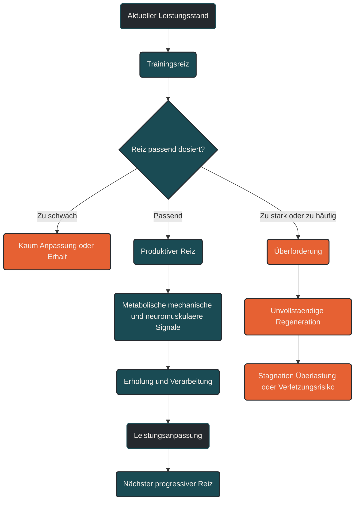

# Trainingsreize

Ein Trainingsreiz ist eine gezielte Belastung, die den Körper aus seinem Gleichgewicht bringt und dadurch Anpassungsprozesse auslöst. Im Ausdauertraining können Trainingsreize durch Intensität, Dauer, Umfang, Häufigkeit, Gelände, Technik, Kraftanforderung oder Erholungsabstände entstehen. Entscheidend ist nicht, dass ein Reiz maximal hart ist, sondern dass er stark genug, spezifisch genug und zum aktuellen Leistungsstand passend dosiert ist.

## Was ein Trainingsreiz ist

Training wirkt über Störung. Eine Laufeinheit, ein Intervalltraining, ein langer Dauerlauf oder ein Berglauf verändert kurzfristig den inneren Zustand des Körpers: Energiereserven werden verbraucht, Stoffwechselprodukte entstehen, Muskeln und Sehnen werden mechanisch belastet, das Herz-Kreislauf-System arbeitet intensiver und das Nervensystem muss Bewegung koordinieren.

Diese Störung ist der Trainingsreiz. Der Körper interpretiert sie als Signal: Die aktuelle Leistungsfähigkeit reicht für diese Anforderung nur begrenzt aus. In der anschließenden Erholung versucht er, sich auf ähnliche Belastungen besser vorzubereiten.

## Reizschwelle: Warum nicht jede Belastung Training ist

Nicht jede Bewegung ist automatisch ein wirksamer Trainingsreiz. Ist die Belastung zu gering, bleibt sie unterhalb der Reizschwelle. Dann erhält der Körper keinen ausreichenden Grund, sich anzupassen. Ist die Belastung passend dosiert, entsteht ein produktiver Reiz. Ist sie zu stark oder zu häufig, kann sie die Regenerationsfähigkeit überfordern.

Die Kunst der Trainingssteuerung liegt deshalb darin, Reize so zu setzen, dass sie Anpassung auslösen, aber nicht dauerhaft mehr Schaden als Nutzen erzeugen.

## Die wichtigsten Reizgrößen

### Intensität

Die Intensität beschreibt, wie anstrengend eine Belastung ist. Im Ausdauertraining kann sie über Tempo, Herzfrequenz, Watt, Laktat, Atemverhalten oder subjektives Belastungsempfinden gesteuert werden. Ein lockerer Dauerlauf, ein Schwellenlauf und ein VO₂max-Intervall setzen sehr unterschiedliche Reize.

### Dauer

Die Dauer beschreibt, wie lange ein Reiz wirkt. Ein kurzer Sprint, ein 30-minütiger Grundlagenlauf und ein dreistündiger Long Run belasten unterschiedliche Systeme. Mit zunehmender Dauer steigen vor allem metabolische, muskuläre und orthopädische Anforderungen.

### Umfang

Der Umfang meint die gesamte Trainingsmenge, zum Beispiel Wochenkilometer, Trainingsstunden oder Höhenmeter. Umfang ist ein zentraler Reiz für aerobe Anpassungen, kann aber bei zu schneller Steigerung auch Überlastung fördern.

### Reizdichte

Die Reizdichte beschreibt den Abstand zwischen Belastungen. Zwei harte Einheiten mit zu wenig Erholung können einzeln sinnvoll sein, zusammen aber zu viel werden. Deshalb ist nicht nur die einzelne Einheit wichtig, sondern ihre Position im Wochenplan.

### Reizhäufigkeit

Die Reizhäufigkeit beschreibt, wie oft ein bestimmter Reiz wiederholt wird. Regelmäßigkeit ist entscheidend für Anpassung. Zu seltene Reize verpuffen, zu häufige Reize können Erholung verhindern.

### Reizqualität

Die Reizqualität beschreibt, welches System gezielt angesprochen wird: Herz-Kreislauf-System, Mitochondrien, Laktatverwertung, Laufökonomie, Sehnensteifigkeit, Kraft, Koordination oder Ermüdungsresistenz. Ein guter Trainingsplan setzt nicht einfach „mehr Training“, sondern unterschiedliche Reizqualitäten zur richtigen Zeit.

## Äußere und innere Belastung

Ein Trainingsreiz hat immer zwei Seiten. Die äußere Belastung ist das, was objektiv geplant oder gemessen wird: 10 Kilometer, 5 × 1.000 Meter, 90 Minuten Radfahren, 400 Höhenmeter oder 250 Watt.

Die innere Belastung ist das, was im Körper tatsächlich ankommt: Herzfrequenz, Atmung, muskuläre Ermüdung, Stoffwechselstress, hormonelle Reaktion, Nervensystembelastung und subjektives Anstrengungsempfinden.

Diese Unterscheidung ist wichtig, weil dieselbe äußere Einheit an zwei Tagen völlig unterschiedlich wirken kann. Schlafmangel, Stress, Hitze, Infekte, Ernährung, Vorbelastung oder mentale Erschöpfung können einen eigentlich moderaten Reiz deutlich härter machen.

## Produktive und unproduktive Reize

Ein produktiver Trainingsreiz ist spezifisch, verarbeitbar und wiederholbar. Er passt zum Ziel, zum Trainingsstand und zur aktuellen Belastbarkeit.

Ein unproduktiver Reiz kann auf drei Arten entstehen:

- Er ist zu schwach und löst kaum Anpassung aus.
- Er ist unspezifisch und trainiert nicht das gewünschte System.
- Er ist zu stark oder zu häufig und verhindert Erholung.

Gerade im Ausdauertraining entsteht Fortschritt nicht dadurch, dass jede Einheit hart ist. Viele Anpassungen entstehen durch kontrollierte Wiederholung: lockere Dauerläufe für aerobe Basis, gezielte Intervalle für hohe Sauerstoffaufnahme, Tempodauerläufe für Schwellenleistung, lange Läufe für Ermüdungsresistenz und Kraft- oder Technikreize für Bewegungsökonomie.

## Trainingsreize im Ausdauertraining

Im Ausdauertraining lassen sich typische Reize grob unterscheiden:

### Aerober Reiz

Lockere bis moderate Dauerbelastungen verbessern die Fähigkeit, Sauerstoff aufzunehmen, zu transportieren und in den Muskelzellen zur Energiegewinnung zu nutzen. Dieser Reiz ist meist gut wiederholbar und bildet die Grundlage langfristiger Leistungsentwicklung.

### Schwellenreiz

Training im Bereich der aeroben oder anaeroben Schwelle verbessert die Fähigkeit, über längere Zeit eine hohe, aber kontrollierbare Intensität zu halten. Dieser Reiz ist wirksam, aber deutlich ermüdender als lockeres Grundlagentraining.

### Hochintensiver Reiz

Intervalle oberhalb der Schwelle setzen starke Reize für VO₂max, Herz-Kreislauf-System, neuromuskuläre Aktivierung und metabolische Toleranz. Sie sind sehr wirksam, benötigen aber ausreichend Abstand zu anderen harten Belastungen.

### Mechanischer Reiz

Bergläufe, Sprints, Sprünge, Krafttraining oder ungewohntes Gelände belasten Muskeln, Sehnen, Knochen und Faszien stärker als ein gleichmäßiger Dauerlauf. Solche Reize können die Belastbarkeit verbessern, müssen aber vorsichtig gesteigert werden.

### Koordinativer Reiz

Lauf-ABC, Techniktraining, Schrittfrequenzarbeit oder lockere Steigerungen trainieren Bewegungsqualität und neuromuskuläre Steuerung. Diese Reize sind oft kurz, aber für Laufökonomie und Verletzungsprävention wichtig.

## Warum mehr nicht automatisch besser ist

Ein Reiz ist nur dann sinnvoll, wenn der Körper ihn in Anpassung übersetzen kann. Wird zu früh, zu hart oder zu monoton belastet, kann aus Training Überlastung werden. Besonders passive Strukturen wie Sehnen, Bänder, Knochen und Knorpel passen sich langsamer an als Muskulatur und Herz-Kreislauf-System. Deshalb fühlt sich die Ausdauer oft schon bereit an, während das Gewebe noch Zeit braucht.

Fortschritt entsteht also nicht durch maximale Einzelbelastungen, sondern durch eine sinnvolle Abfolge aus Reiz, Erholung und erneuter Belastung.

## Praktische Einordnung

Ein guter Trainingsreiz beantwortet immer drei Fragen:

1. Welches System soll verbessert werden?
2. Ist der Reiz stark genug, um Anpassung auszulösen?
3. Ist der Körper aktuell in der Lage, diesen Reiz zu verarbeiten?

Für die Praxis bedeutet das: Lockere Einheiten dürfen wirklich locker sein, harte Einheiten müssen gezielt gesetzt werden, und Steigerungen sollten systematisch erfolgen. Der wirksamste Trainingsreiz ist nicht der härteste, sondern derjenige, der zur richtigen Zeit das richtige System anspricht.

----

----

## Häufige Fragen zu Trainingsreizen

### Was ist ein Trainingsreiz einfach erklärt?

Ein Trainingsreiz ist eine Belastung, die den Körper fordert und dadurch eine Anpassung auslösen kann. Der Reiz kann durch Tempo, Dauer, Umfang, Kraft, Gelände, Technik oder die Häufigkeit von Einheiten entstehen.

### Wann ist ein Trainingsreiz wirksam?

Ein Trainingsreiz ist wirksam, wenn er stark genug ist, um den Körper aus dem Gleichgewicht zu bringen, aber nicht so stark, dass er die Regeneration überfordert. Entscheidend ist das Verhältnis aus Belastung und Erholung.

### Muss ein Trainingsreiz immer hart sein?

Nein. Auch lockere Einheiten können sehr wichtige Trainingsreize setzen, besonders für aerobe Basis, Kapillarisierung, Fettstoffwechsel, Bewegungsroutine und Regenerationsfähigkeit. Harte Reize sind nur ein Teil des Trainings.

### Was passiert, wenn der Trainingsreiz zu schwach ist?

Dann bleibt die Belastung unterhalb der Reizschwelle. Der Körper erhält kaum Anlass, sich anzupassen. Solche Einheiten können trotzdem sinnvoll sein, zum Beispiel zur aktiven Erholung oder zum Erhalt der Bewegungsroutine.

### Was passiert, wenn der Trainingsreiz zu stark ist?

Ein zu starker Reiz kann die Regenerationsfähigkeit überfordern. Kurzfristig entsteht starke Ermüdung, langfristig können Stagnation, Überlastungsbeschwerden, erhöhte Infektanfälligkeit oder Verletzungen entstehen.

### Warum wirkt dieselbe Einheit an verschiedenen Tagen unterschiedlich?

Weil nicht nur die äußere Belastung zählt, sondern auch die innere Belastung. Schlaf, Stress, Ernährung, Hitze, Vorbelastung, Krankheitssymptome und mentale Erschöpfung verändern, wie hart ein Trainingsreiz tatsächlich im Körper ankommt.

### Was ist der Unterschied zwischen Trainingsreiz und Trainingsbelastung?

Trainingsbelastung beschreibt meist das, was getan wird: Kilometer, Minuten, Watt, Tempo oder Höhenmeter. Der Trainingsreiz beschreibt die biologische Wirkung dieser Belastung auf den Körper.

### Welche Trainingsreize gibt es im Ausdauertraining?

Typische Reize sind aerobe Dauerbelastung, Schwellentraining, hochintensive Intervalle, lange Läufe, Bergläufe, Sprints, Krafttraining, Techniktraining und koordinative Reize. Jeder Reiz spricht andere Systeme an.

### Warum sind Pausen für Trainingsreize wichtig?

Pausen ermöglichen die Verarbeitung des Reizes. Ohne ausreichende Erholung bleibt der Körper in Ermüdung, und aus einem eigentlich sinnvollen Trainingsreiz kann eine Überlastung werden.

### Wie erkenne ich, ob ein Trainingsreiz gut dosiert war?

Ein gut dosierter Reiz führt zu spürbarer, aber kontrollierbarer Ermüdung. Die Folgetage bleiben planbar, die Leistung stabilisiert sich oder verbessert sich, und Beschwerden klingen ab statt zuzunehmen.

----

*Hinweis: Dieser Artikel dient der allgemeinen Information und ersetzt keine medizinische oder therapeutische Beratung. Mehr dazu im [**Gesundheits- und Quellenhinweis**](/ausdauersport/disclaimer/).*

