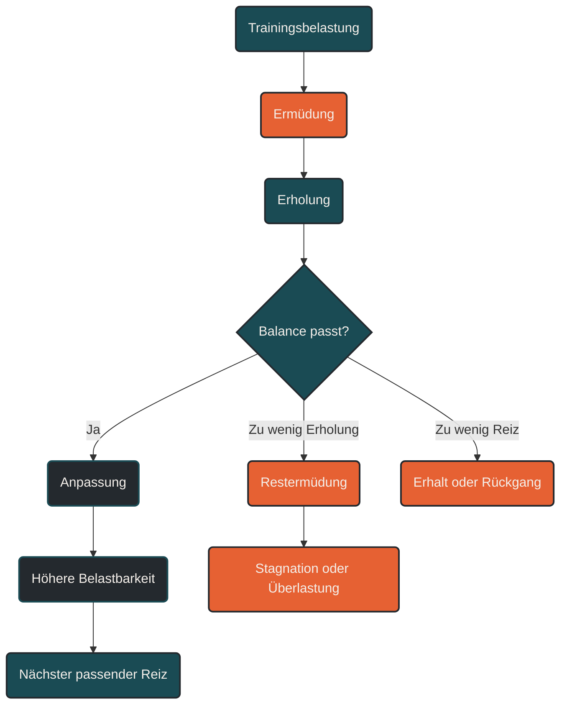

# Belastung und Erholung

Belastung und Erholung sind zwei Seiten desselben Trainingsprozesses. Die Belastung setzt den Reiz, die Erholung ermöglicht die Anpassung. Fortschritt entsteht nicht durch möglichst viele harte Einheiten, sondern durch ein sinnvolles Verhältnis aus Trainingsstress, Regeneration und erneuter Belastung. [[1]](#quelle-1) [[4]](#quelle-4)

## Warum Belastung allein nicht reicht

Training funktioniert nur, wenn ein Reiz stark genug ist, um den Körper aus dem Gleichgewicht zu bringen. Nach einer intensiven Einheit ist die Leistungsfähigkeit zunächst reduziert: Energiespeicher sind geleert, Muskeln und Sehnen wurden beansprucht, das Nervensystem ist ermüdet und Stoffwechselprozesse laufen auf Hochtouren. [[1]](#quelle-1) [[8]](#quelle-8)

Der eigentliche Leistungszuwachs entsteht danach. In der Erholungsphase werden Speicher aufgefüllt, beschädigte Strukturen repariert, Stoffwechselprodukte abgebaut und Anpassungsprozesse eingeleitet. Ohne diese Erholung bleibt Belastung nur Stress. Mit passender Erholung wird sie zu Training. [[4]](#quelle-4) [[5]](#quelle-5) [[6]](#quelle-6)

## Was Belastung bedeutet

Belastung beschreibt die Summe aller Anforderungen, die auf den Körper wirken. Im Ausdauertraining entsteht sie nicht nur durch Tempo, sondern durch mehrere Faktoren: [[2]](#quelle-2) [[3]](#quelle-3)

- Intensität
- Dauer
- Umfang
- Häufigkeit
- Gelände
- Höhenmeter
- Kraftanteil
- Technikanspruch
- Vorermüdung
- Alltag, Schlaf und psychischer Stress

Wichtig ist die Unterscheidung zwischen äußerer und innerer Belastung. Die äußere Belastung ist das, was im Trainingsplan steht: Kilometer, Minuten, Pace, Watt oder Höhenmeter. Die innere Belastung ist das, was im Körper tatsächlich ankommt: Herzfrequenz, Atemarbeit, muskuläre Ermüdung, hormonelle Stressantwort, mentale Erschöpfung und subjektives Belastungsempfinden. [[2]](#quelle-2) [[3]](#quelle-3)

Dieselbe Einheit kann deshalb an zwei Tagen unterschiedlich wirken. Ein lockerer Dauerlauf nach gutem Schlaf kann regenerativ sein. Derselbe Lauf nach Stress, Schlafmangel oder einer harten Vorbelastung kann bereits ein zusätzlicher Stressor werden. [[2]](#quelle-2) [[3]](#quelle-3) [[6]](#quelle-6)

## Was Erholung bedeutet

Erholung ist nicht einfach Nichtstun. Sie ist ein aktiver biologischer Prozess, in dem der Körper Belastung verarbeitet. Dazu gehören die Wiederauffüllung von Glykogenspeichern, die Rehydrierung, die Reparatur muskulärer Mikrotraumata, die Beruhigung des Nervensystems und die Wiederherstellung der zellulären Homöostase. [[4]](#quelle-4) [[5]](#quelle-5) [[6]](#quelle-6)

Erholung umfasst mehrere Ebenen:

### Metabolische Erholung

Nach intensiven oder langen Einheiten müssen Energiereserven wieder aufgefüllt, Flüssigkeit ersetzt und Stoffwechselprodukte abgebaut werden. Dieser Prozess kann relativ schnell beginnen, ist aber nach langen Belastungen nicht immer nach wenigen Stunden abgeschlossen. [[4]](#quelle-4) [[5]](#quelle-5)

### Muskuläre Erholung

Muskeln können nach ungewohnten, langen oder exzentrischen Belastungen Mikrotraumata aufweisen. Das zeigt sich häufig in Muskelkater, Kraftverlust oder einem schweren Laufgefühl. Die Reparatur benötigt Zeit, Schlaf und ausreichende Nährstoffverfügbarkeit. [[4]](#quelle-4) [[5]](#quelle-5) [[13]](#quelle-13)

### Orthopädische Erholung

Sehnen, Bänder, Knochen und Knorpel reagieren anders auf Belastung als Herz-Kreislauf-System und Muskulatur. Gerade Läufer können sich konditionell schon bereit fühlen, während passive Strukturen noch Erholungszeit benötigen. Das ist ein häufiger Grund, warum zu schnelle Umfangs- oder Intensitätssteigerungen Überlastungsbeschwerden begünstigen können. [[7]](#quelle-7) [[9]](#quelle-9)

### Nervensystem und mentale Erholung

Hohe Intensitäten, Wettkämpfe, Schlafmangel und Alltagsstress belasten auch das zentrale Nervensystem. Sinkende Motivation, gereizte Stimmung, schlechte Schlafqualität, ungewöhnlich hoher Ruhepuls oder eine dauerhaft niedrige HRV können Hinweise sein, dass nicht nur die Muskulatur, sondern das gesamte System Erholung braucht. Einzelwerte sollten dabei vorsichtig interpretiert werden; belastbarer sind Trends über mehrere Tage und die Kombination mit subjektivem Befinden. [[3]](#quelle-3) [[6]](#quelle-6) [[8]](#quelle-8) [[12]](#quelle-12)

## Das Prinzip der Balance

Ein Trainingsreiz ist produktiv, wenn er den Körper fordert, aber noch verarbeitet werden kann. Ist die Belastung zu gering, entsteht kaum Anpassung. Ist sie zu hoch oder folgt sie zu dicht auf vorherige Reize, sammelt sich Restermüdung an. [[1]](#quelle-1) [[7]](#quelle-7) [[8]](#quelle-8)

Das Ziel ist nicht völlige Frische nach jeder Einheit. Kurzfristige Ermüdung ist normal und sogar notwendig. Problematisch wird es, wenn die Ermüdung chronisch wird und die Leistungsfähigkeit nicht mehr zurückkehrt. Dann verschiebt sich Training von Anpassung zu Überlastung. [[3]](#quelle-3) [[8]](#quelle-8) [[10]](#quelle-10)

Gute Trainingsplanung setzt deshalb auf Rhythmus: [[3]](#quelle-3) [[11]](#quelle-11)

- harte Einheiten gezielt platzieren
- lockere Einheiten wirklich locker halten
- Ruhetage nicht als Schwäche verstehen
- Belastungswochen mit Entlastungsphasen kombinieren
- Fortschritt über Wochen statt über einzelne Einheiten bewerten

## Belastung und Erholung in der Trainingswoche

Eine sinnvolle Trainingswoche besteht nicht aus maximal vielen harten Reizen, sondern aus einer steuerbaren Abfolge. Nach intensiven Intervallen, langen Läufen, Bergläufen oder Krafttraining braucht der Körper ausreichend Zeit, um den Reiz zu verarbeiten. Leichte Dauerläufe, aktive Erholung oder Ruhetage können dabei helfen, ohne zusätzliche hohe Belastung Bewegung und Durchblutung aufrechtzuerhalten. [[3]](#quelle-3) [[4]](#quelle-4) [[11]](#quelle-11)

Der wichtigste Fehler ist die sogenannte Grauzone: lockere Einheiten werden zu schnell gelaufen, harte Einheiten werden nicht mehr richtig hart, und der Körper bleibt dauerhaft mittelstark belastet. Dadurch fehlt sowohl die Qualität der Reize als auch die Tiefe der Erholung. [[11]](#quelle-11)

## Woran man unzureichende Erholung erkennt

Warnsignale für ein ungünstiges Verhältnis aus Belastung und Erholung sind: [[3]](#quelle-3) [[8]](#quelle-8) [[10]](#quelle-10) [[12]](#quelle-12)

- ungewöhnlich schwere Beine über mehrere Tage
- sinkende Leistung bei gleicher Anstrengung
- erhöhter Ruhepuls
- auffällig niedrige HRV
- schlechter Schlaf
- Reizbarkeit oder Motivationsverlust
- häufige Infekte
- Schmerzen an Sehnen, Knochen oder Gelenken
- dauerhaft erhöhte subjektive Belastung bei lockeren Einheiten

Ein einzelnes Signal ist noch kein Problem. Entscheidend ist das Muster. Wenn mehrere Zeichen gleichzeitig auftreten und länger anhalten, sollte die Belastung reduziert werden. [[3]](#quelle-3) [[8]](#quelle-8) [[10]](#quelle-10)

## Praktische Einordnung

Belastung und Erholung sollten nicht als Gegensätze verstanden werden. Erholung ist kein Trainingsausfall, sondern der Teil des Trainings, in dem Anpassung entsteht. Besonders im Ausdauersport zählt nicht die härteste einzelne Einheit, sondern die wiederholbare Struktur. [[1]](#quelle-1) [[4]](#quelle-4) [[11]](#quelle-11)

Der wirksamste Trainingsplan ist deshalb nicht der Plan mit der meisten Belastung. Es ist der Plan, bei dem der Körper die gesetzten Reize regelmäßig verarbeiten kann. Fortschritt entsteht, wenn Belastung hoch genug ist, um Anpassung auszulösen, und Erholung ausreichend ist, damit diese Anpassung tatsächlich stattfinden kann. [[1]](#quelle-1) [[4]](#quelle-4) [[7]](#quelle-7) [[8]](#quelle-8)

----

----

## Häufige Fragen zu Belastung und Erholung

### Warum ist Erholung im Training so wichtig?

Erholung ist die Phase, in der der Körper den Trainingsreiz verarbeitet. Während der Belastung entsteht zunächst Ermüdung. Erst danach werden Speicher aufgefüllt, Gewebe repariert und Anpassungsprozesse gestartet. [[1]](#quelle-1) [[4]](#quelle-4)

### Bedeutet Erholung, dass ich gar nichts tun darf?

Nein. Erholung kann passiv oder aktiv sein. Passive Erholung bedeutet Ruhe, Schlaf und Entlastung. Aktive Erholung kann ein sehr lockerer Lauf, Radfahren mit niedriger Intensität, Spazierengehen oder leichtes Mobilisieren sein. Entscheidend ist, dass die Einheit den Körper nicht zusätzlich stark belastet. [[4]](#quelle-4)

### Wie merke ich, dass ich zu wenig erhole?

Typische Hinweise sind schwere Beine, schlechter Schlaf, sinkende Leistung, ungewöhnlich hoher Ruhepuls, niedrige HRV, Reizbarkeit, Motivationsverlust oder Schmerzen an Sehnen und Gelenken. Besonders wichtig ist nicht ein einzelnes Signal, sondern die Kombination mehrerer Warnzeichen. [[3]](#quelle-3) [[8]](#quelle-8) [[10]](#quelle-10) [[12]](#quelle-12)

### Kann ich auch zu viel erholen?

Ja. Wenn Trainingsreize zu selten oder zu schwach gesetzt werden, fehlt dem Körper der Anlass zur Anpassung. Erholung ist wichtig, aber sie muss mit regelmäßigen, passenden Reizen kombiniert werden. [[1]](#quelle-1)

### Warum fühlen sich Muskeln oft schneller bereit an als Sehnen oder Gelenke?

Muskeln sind besser durchblutet und regenerieren meist schneller. Sehnen, Bänder, Knochen und Knorpel reagieren anders auf Belastung und brauchen für belastbare strukturelle Anpassungen eine passende Dosierung aus Reiz und Erholung. Deshalb können Überlastungen entstehen, obwohl sich die Ausdauer bereits gut anfühlt. [[7]](#quelle-7) [[9]](#quelle-9)

### Sollte ich bei Muskelkater trainieren?

Leichte Bewegung kann sinnvoll sein, wenn sie locker bleibt und keine Schmerzen verstärkt. Harte Intervalle, Bergläufe, Sprünge oder Krafttraining sind bei starkem Muskelkater meist ungünstig, weil das Gewebe bereits belastet ist und zusätzliche mechanische Spannung die Erholung verzögern kann. [[4]](#quelle-4) [[13]](#quelle-13)

### Ist ein Ruhetag verlorenes Training?

Nein. Ein Ruhetag kann ein sehr wirksamer Bestandteil des Trainings sein. Er ermöglicht, dass vorherige Reize verarbeitet werden und die nächste Qualitätseinheit wieder wirklich produktiv wird. [[1]](#quelle-1) [[4]](#quelle-4)

### Wie viele harte Einheiten pro Woche sind sinnvoll?

Das hängt von Trainingsstand, Umfang, Alter, Schlaf, Stress und Ziel ab. Für viele Ausdauerathleten reichen ein bis drei harte Reize pro Woche. Der Rest sollte so locker sein, dass die Qualität der Schlüsselsessions erhalten bleibt. [[3]](#quelle-3) [[8]](#quelle-8) [[11]](#quelle-11)

### Was ist der Unterschied zwischen Ermüdung und Überlastung?

Ermüdung ist eine normale kurzfristige Folge von Training. Überlastung entsteht, wenn Belastung über längere Zeit größer ist als die Erholungsfähigkeit. Dann sinkt die Leistungsfähigkeit, Beschwerden nehmen zu und Anpassung bleibt aus. [[8]](#quelle-8) [[10]](#quelle-10)

### Warum sind lockere Einheiten oft zu schnell?

Viele Athleten laufen lockere Einheiten in einer mittleren Intensität, weil es sich zunächst angenehm produktiv anfühlt. Diese Grauzone kann aber die Erholung stören und gleichzeitig die Qualität harter Einheiten verschlechtern. Wirklich lockere Einheiten sollen Erholung ermöglichen und die aerobe Basis stärken. [[11]](#quelle-11)

----

## Quellen

### Quelle 1

[1] Cunanan, A. J., DeWeese, B. H., Wagle, J. P., Carroll, K. M., Sausaman, R., Hornsby, W. G., Haff, G. G., Triplett, N. T., Pierce, K. C. & Stone, M. H. (2018): [The General Adaptation Syndrome: A Foundation for the Concept of Periodization](https://link.springer.com/article/10.1007/s40279-017-0855-3). Sports Medicine.

### Quelle 2

[2] Impellizzeri, F. M., Marcora, S. M. & Coutts, A. J. (2019): [Internal and External Training Load: 15 Years On](https://pubmed.ncbi.nlm.nih.gov/30614348/). International Journal of Sports Physiology and Performance.

### Quelle 3

[3] Bourdon, P. C., Cardinale, M., Murray, A. et al. (2017): [Monitoring Athlete Training Loads: Consensus Statement](https://journals.humankinetics.com/view/journals/ijspp/12/s2/article-pS2-161.xml). International Journal of Sports Physiology and Performance.

### Quelle 4

[4] Li, S., Kempe, M., Brink, M. & Lemmink, K. (2024): [Effectiveness of Recovery Strategies After Training and Competition in Endurance Athletes: An Umbrella Review](https://link.springer.com/article/10.1186/s40798-024-00724-6). Sports Medicine - Open.

### Quelle 5

[5] Thomas, D. T., Erdman, K. A. & Burke, L. M. (2016): [Nutrition and Athletic Performance](https://www.jandonline.org/article/S2212-2672(15)01802-X/fulltext). Journal of the Academy of Nutrition and Dietetics.

### Quelle 6

[6] Walsh, N. P., Halson, S. L., Sargent, C. et al. (2021): [Sleep and the Athlete: Narrative Review and 2021 Expert Consensus Recommendations](https://bjsm.bmj.com/content/55/7/356). British Journal of Sports Medicine.

### Quelle 7

[7] Gabbett, T. J. & Oetter, E. (2025): [From Tissue to System: What Constitutes an Appropriate Response to Loading?](https://link.springer.com/article/10.1007/s40279-024-02126-w). Sports Medicine.

### Quelle 8

[8] Meeusen, R. et al. (2013): [Prevention, diagnosis, and treatment of the overtraining syndrome: Joint consensus statement of the European College of Sport Science and the American College of Sports Medicine](https://pubmed.ncbi.nlm.nih.gov/23247672/). Medicine & Science in Sports & Exercise.

### Quelle 9

[9] Soligard, T., Schwellnus, M., Alonso, J. M. et al. (2016): [How much is too much? Part 1: International Olympic Committee consensus statement on load in sport and risk of injury](https://bjsm.bmj.com/content/50/17/1030). British Journal of Sports Medicine.

### Quelle 10

[10] Schwellnus, M., Soligard, T., Alonso, J. M. et al. (2016): [How much is too much? Part 2: International Olympic Committee consensus statement on load in sport and risk of illness](https://bjsm.bmj.com/content/50/17/1043). British Journal of Sports Medicine.

### Quelle 11

[11] Seiler, S. (2010): [What is Best Practice for Training Intensity and Duration Distribution in Endurance Athletes?](https://journals.humankinetics.com/abstract/journals/ijspp/5/3/article-p276.xml). International Journal of Sports Physiology and Performance.

### Quelle 12

[12] Esco, M. R., Fields, A. D., Mohammadnabi, M. A. & Kliszczewicz, B. M. (2026): [Monitoring Training Adaptation and Recovery Status in Athletes Using Heart Rate Variability via Mobile Devices: A Narrative Review](https://pmc.ncbi.nlm.nih.gov/articles/PMC12787763/). Sensors.

### Quelle 13

[13] Dupuy, O., Douzi, W., Theurot, D., Bosquet, L. & Dugué, B. (2018): [An Evidence-Based Approach for Choosing Post-exercise Recovery Techniques to Reduce Markers of Muscle Damage, Soreness, Fatigue, and Inflammation: A Systematic Review With Meta-Analysis](https://www.frontiersin.org/journals/physiology/articles/10.3389/fphys.2018.00403/full). Frontiers in Physiology.

----

*Hinweis: Dieser Artikel dient der allgemeinen Information und ersetzt keine medizinische oder therapeutische Beratung. Mehr dazu im [**Gesundheits- und Quellenhinweis**](/ausdauersport/disclaimer/).*

