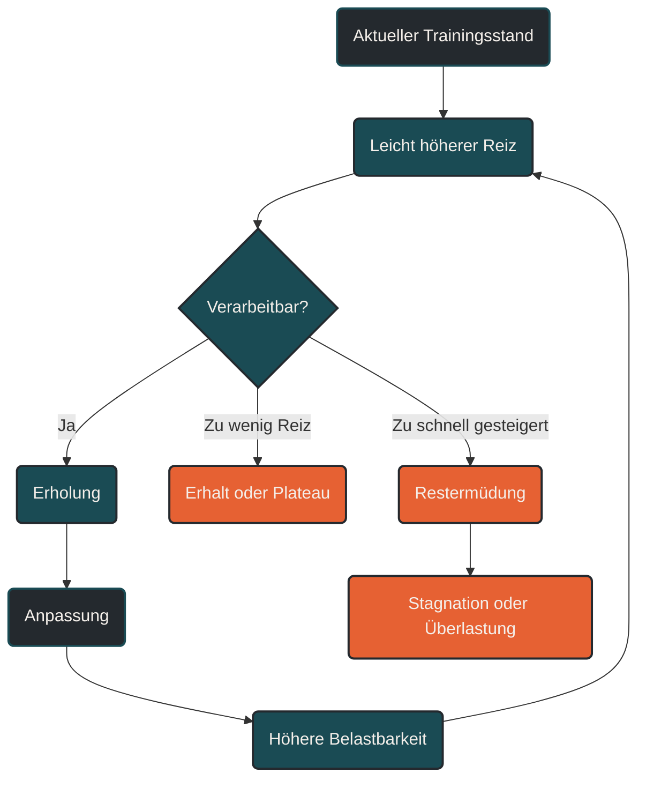

# Progressive Überlastung

Progressive Überlastung bedeutet, dass Trainingsreize im Laufe der Zeit schrittweise gesteigert werden, damit der Körper weiterhin Anpassungen entwickeln muss. Die Belastung wird dabei nicht beliebig erhöht, sondern so dosiert, dass sie den aktuellen Leistungsstand leicht übersteigt und trotzdem ausreichend verarbeitet werden kann.

## Was progressive Überlastung bedeutet

Der Körper passt sich an das an, was regelmäßig von ihm verlangt wird. Wird ein Trainingsreiz wiederholt, der anfangs fordernd war, wird er mit der Zeit vertrauter. Die gleiche Strecke, das gleiche Tempo oder die gleiche Intervallstruktur erzeugen dann weniger Anpassungsdruck als zu Beginn.

Progressive Überlastung setzt genau hier an: Training muss sich langfristig verändern, damit der Körper neue Gründe zur Anpassung bekommt. Das kann durch mehr Umfang, längere Dauer, höhere Intensität, kürzere Pausen, mehr Höhenmeter, anspruchsvolleres Gelände, mehr Kraftanteil oder höhere technische Anforderungen geschehen.

Wichtig ist: Progressiv bedeutet nicht maximal. Es bedeutet schrittweise, geplant und verarbeitbar.

## Warum gleichbleibendes Training irgendwann nicht mehr reicht

Ein Trainingsreiz wirkt vor allem dann, wenn er den Körper aus dem gewohnten Gleichgewicht bringt. Wird immer gleich trainiert, sinkt die relative Belastung: Was früher ein Reiz war, wird später zur Routine. Dadurch kann die Leistung stagnieren.

Das ist im Ausdauertraining besonders sichtbar. Ein lockerer Dauerlauf über 30 Minuten kann für Einsteiger ein starker Reiz sein. Für einen gut trainierten Läufer ist dieselbe Einheit möglicherweise nur noch Erhalt oder aktive Erholung. Damit weitere Entwicklung entsteht, muss die Belastung mit dem Leistungsstand mitwachsen.

## Die wichtigsten Stellschrauben

Progressive Überlastung kann über verschiedene Wege entstehen. Nicht alle sollten gleichzeitig erhöht werden.

### Umfang

Der Umfang beschreibt die gesamte Trainingsmenge, zum Beispiel Wochenkilometer, Trainingsstunden oder Höhenmeter. Umfang ist eine zentrale Stellschraube für die aerobe Basis, sollte aber langsam gesteigert werden, weil Sehnen, Knochen und Gelenke oft langsamer reagieren als Herz-Kreislauf-System und Muskulatur.

### Intensität

Die Intensität beschreibt, wie hart eine Belastung ist. Sie kann über Pace, Herzfrequenz, Watt, Laktat, Atemverhalten oder subjektives Belastungsempfinden gesteuert werden. Intensitätssteigerungen sind wirksam, aber ermüdender als reine Umfangssteigerungen.

### Dauer

Die Dauer einzelner Einheiten verändert den Reiz deutlich. Ein langer Lauf belastet Stoffwechsel, Muskulatur, Sehnen und mentale Ermüdungsresistenz anders als mehrere kurze Einheiten mit gleicher Gesamtdauer.

### Reizdichte

Die Reizdichte beschreibt, wie eng Belastungen aufeinander folgen. Wird der Abstand zwischen harten Einheiten kleiner, steigt die Gesamtbelastung, auch wenn die einzelnen Einheiten unverändert bleiben.

### Spezifität

Je näher ein Reiz am Ziel liegt, desto spezifischer ist die Anpassung. Wer für einen Marathon trainiert, braucht andere progressive Reize als jemand, der 5 Kilometer schneller laufen möchte.

### Mechanische Belastung

Sprünge, Bergläufe, Sprints, Krafttraining oder ungewohntes Gelände erhöhen die mechanische Belastung. Diese Reize können Belastbarkeit und Laufökonomie verbessern, müssen aber besonders vorsichtig gesteigert werden.

## Warum zu schnelle Steigerung problematisch ist

Das Herz-Kreislauf-System und die Muskulatur reagieren oft schneller als passive Strukturen. Ein Athlet kann sich konditionell bereit fühlen, obwohl Sehnen, Bänder, Knochen oder Knorpel noch nicht ausreichend angepasst sind.

Genau hier entsteht das Risiko: Wird Umfang, Intensität oder mechanische Belastung zu schnell erhöht, kann aus einem sinnvollen Trainingsreiz eine Überlastung werden. Typische Folgen sind stagnierende Leistung, ungewöhnlich lange Ermüdung, Sehnenreizungen, Gelenkbeschwerden oder Stressreaktionen am Knochen.

Progressive Überlastung ist deshalb immer an Erholung gekoppelt. Nur eine Belastung, die verarbeitet werden kann, führt zu stabiler Anpassung.

## Progressive Überlastung im Ausdauertraining

Im Ausdauertraining gibt es mehrere sinnvolle Wege, progressiv zu steigern:

### Mehr aerobe Arbeit

Die Grundlage entsteht häufig über mehr lockere Trainingszeit. Das kann bedeuten, einzelne Läufe leicht zu verlängern, eine zusätzliche lockere Einheit einzubauen oder den langen Lauf schrittweise auszubauen.

### Höhere Qualität

Später kann die Qualität einzelner Einheiten steigen: längere Intervalle, etwas schnelleres Schwellentraining, mehr Wiederholungen oder kürzere Pausen. Entscheidend ist, dass harte Einheiten gezielt bleiben und nicht jede Einheit unkontrolliert intensiver wird.

### Mehr Belastbarkeit

Progression betrifft nicht nur Kondition. Auch Krafttraining, Lauf-ABC, kurze Steigerungen, Bergsprints oder Plyometrie können progressiv aufgebaut werden, um Bewegungsökonomie, Sehnensteifigkeit und mechanische Belastbarkeit zu verbessern.

### Bessere Wiederholbarkeit

Ein unterschätzter Fortschritt ist, wenn ein Athlet dieselbe Qualität häufiger stabil abrufen kann. Wer nach einer harten Einheit schneller wieder belastbar ist, hat ebenfalls Anpassung entwickelt.

## Praktische Regeln für die Steuerung

Progressive Überlastung funktioniert am besten, wenn immer nur wenige Stellschrauben gleichzeitig verändert werden. Wer Umfang, Intensität, Häufigkeit und Kraftanteil gleichzeitig erhöht, kann kaum erkennen, welcher Reiz wirkt und welcher überfordert.

Sinnvoller ist eine klare Reihenfolge:

1. Erst Regelmäßigkeit herstellen.
2. Dann Umfang moderat steigern.
3. Danach einzelne Qualitätseinheiten gezielt entwickeln.
4. Mechanische Zusatzreize vorsichtig einbauen.
5. Entlastungsphasen bewusst planen.

Entlastungswochen sind dabei kein Rückschritt. Sie geben dem Körper die Möglichkeit, vorherige Belastungen zu verarbeiten und die nächste Steigerung vorzubereiten.

## Woran man eine gute Progression erkennt

Eine gute Steigerung fühlt sich fordernd, aber kontrollierbar an. Die Leistung wird stabiler, lockere Einheiten bleiben wirklich locker, harte Einheiten können mit Qualität ausgeführt werden, und Beschwerden nehmen nicht zu.

Warnsignale für eine zu schnelle Progression sind dagegen: dauerhaft schwere Beine, sinkende Leistung trotz höherer Anstrengung, Schlafprobleme, erhöhter Ruhepuls, auffällig niedrige HRV, Motivationsverlust, gereizte Stimmung oder Schmerzen an Sehnen, Knochen und Gelenken.

## Der wichtigste Merksatz

Progressive Überlastung bedeutet nicht, jede Woche härter zu trainieren. Sie bedeutet, den Körper langfristig genau so weit zu fordern, dass Anpassung notwendig wird, ohne die Fähigkeit zur Erholung zu verlieren.

----

----

## Häufige Fragen zur progressiven Überlastung

### Was ist progressive Überlastung einfach erklärt?

Progressive Überlastung bedeutet, dass Training im Laufe der Zeit schrittweise anspruchsvoller wird. Der Körper bekommt dadurch immer wieder einen neuen, aber verarbeitbaren Anlass zur Anpassung.

### Bedeutet progressive Überlastung, dass ich jede Woche mehr machen muss?

Nein. Progression muss nicht jede Woche stattfinden. Manchmal ist es sinnvoller, eine Belastung mehrere Wochen zu stabilisieren oder bewusst zu reduzieren, bevor der nächste Schritt folgt.

### Welche Trainingsfaktoren kann ich progressiv steigern?

Typische Stellschrauben sind Umfang, Intensität, Dauer, Häufigkeit, Pausengestaltung, Höhenmeter, Gelände, Kraftanteil, Technikanspruch und mechanische Belastung.

### Sollte ich zuerst Umfang oder Intensität steigern?

Für viele Ausdauerathleten ist es sinnvoll, zuerst Regelmäßigkeit und lockeren Umfang aufzubauen. Intensität sollte gezielter eingesetzt werden, weil sie deutlich mehr Ermüdung erzeugt.

### Warum ist zu schnelle Progression gefährlich?

Zu schnelle Steigerung kann die Regenerationsfähigkeit überfordern. Besonders Sehnen, Bänder, Knochen und Knorpel passen sich langsamer an als Muskulatur und Herz-Kreislauf-System. Dadurch können Überlastungsbeschwerden entstehen.

### Ist die 10-Prozent-Regel Pflicht?

Nein. Sie kann eine grobe Orientierung sein, ist aber kein Naturgesetz. Entscheidend sind Trainingsstand, Verletzungshistorie, Schlaf, Stress, Untergrund, Intensität und die bisherige Belastung.

### Gilt progressive Überlastung auch für lockere Läufe?

Ja. Auch lockere Läufe können progressiv aufgebaut werden, zum Beispiel durch etwas längere Dauer, höhere Wochenkonstanz oder mehr aerobe Gesamtzeit. Sie müssen dafür nicht hart werden.

### Gilt progressive Überlastung auch für Krafttraining?

Ja. Im Krafttraining kann Progression durch mehr Gewicht, mehr Wiederholungen, mehr Sätze, größere Bewegungsamplitude, langsamere exzentrische Phasen oder bessere Bewegungskontrolle entstehen.

### Woran erkenne ich, dass die Progression funktioniert?

Ein gutes Zeichen ist, wenn du mehr Belastung tolerierst, ohne dass lockere Einheiten schwerer werden oder Beschwerden zunehmen. Auch stabilere Leistung, bessere Erholung und kontrollierbare Ermüdung sprechen für eine passende Progression.

### Woran erkenne ich, dass ich zu schnell gesteigert habe?

Warnsignale sind anhaltende Müdigkeit, schlechter Schlaf, sinkende Leistung, ungewöhnlich hoher Ruhepuls, auffällig niedrige HRV, Schmerzen an Sehnen oder Gelenken und eine dauerhaft hohe Anstrengung bei eigentlich lockeren Einheiten.

### Was ist der Unterschied zwischen progressiver Überlastung und Übertraining?

Progressive Überlastung ist eine geplante, verarbeitbare Steigerung. Übertraining oder nicht-funktionelles Overreaching entsteht, wenn Belastung dauerhaft größer ist als die Erholungsfähigkeit.

### Was sollte ich nach Krankheit oder Verletzung beachten?

Nach Krankheit oder Verletzung sollte die Progression deutlich vorsichtiger sein. Der Wiedereinstieg beginnt mit reduzierter Belastung, stabiler Beschwerdefreiheit und kleinen Steigerungen, bevor Intensität oder Umfang wieder erhöht werden.

----

*Hinweis: Dieser Artikel dient der allgemeinen Information und ersetzt keine medizinische oder therapeutische Beratung. Mehr dazu im [**Gesundheits- und Quellenhinweis**](/ausdauersport/disclaimer/).*

