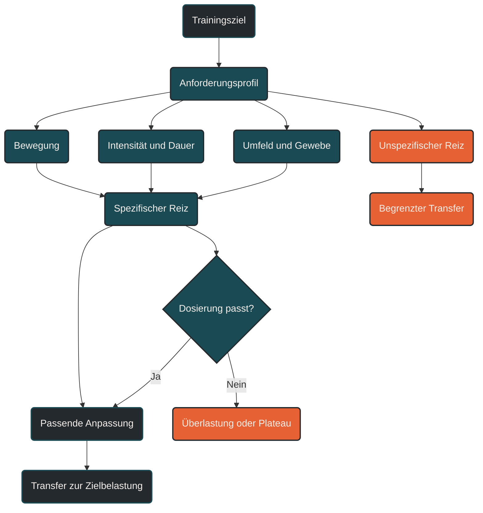

# Spezifität

Spezifität bedeutet: Der Körper passt sich vor allem an die Anforderungen an, die im Training tatsächlich gestellt werden. [[1]](#quelle-1) Ein Trainingsreiz wirkt also nicht allgemein, sondern spezifisch auf bestimmte Energiesysteme, Bewegungsmuster, Muskelgruppen, Gewebe, Intensitäten und Belastungsdauern. Wer für eine bestimmte Leistung trainiert, muss deshalb zunehmend die Anforderungen dieser Leistung im Training abbilden. [[1]](#quelle-1) [[3]](#quelle-3)

## Was Spezifität bedeutet

Training ist immer eine Botschaft an den Körper. Diese Botschaft lautet nicht einfach „werde fitter“, sondern sehr konkret: Halte dieses Tempo länger aus, stabilisiere diesen Bewegungsablauf, nutze diese Energiequelle effizienter, vertrage diese mechanische Belastung oder koordiniere diese Muskelgruppen präziser.

Das Prinzip der Spezifität beschreibt genau diesen Zusammenhang. Der Körper passt sich an die Art der Belastung an, nicht nur an die Menge der Belastung. [[1]](#quelle-1) Ein langer lockerer Dauerlauf, ein VO₂max-Intervall, ein Bergsprint, ein Technikdrill und ein Krafttraining setzen deshalb unterschiedliche Anpassungssignale. [[1]](#quelle-1) [[4]](#quelle-4) [[6]](#quelle-6)

Für Ausdauertraining bedeutet das: Die beste Einheit ist nicht automatisch die härteste Einheit, sondern diejenige, die das richtige System für das jeweilige Ziel anspricht.

## Warum Spezifität im Ausdauersport wichtig ist

Ausdauerleistung entsteht aus mehreren Komponenten: Herz-Kreislauf-Leistung, Stoffwechsel, Laufökonomie, muskuläre Belastbarkeit, Sehnensteifigkeit, Bewegungskoordination, mentale Ermüdungsresistenz und Energieversorgung. [[2]](#quelle-2) [[6]](#quelle-6) Diese Systeme reagieren unterschiedlich auf Training.

Ein Marathonläufer braucht andere spezifische Reize als ein 5-km-Läufer. Ein Trailrunner braucht andere Anforderungen als ein Straßenläufer. Ein Triathlet muss andere Bewegungsmuster koordinieren als ein reiner Läufer. Selbst innerhalb einer Sportart unterscheiden sich die Anforderungen je nach Distanz, Intensität, Untergrund, Höhenprofil und Wettkampfdauer. [[3]](#quelle-3) [[10]](#quelle-10) [[11]](#quelle-11)

Spezifität sorgt dafür, dass Training nicht nur allgemeine Fitness erzeugt, sondern in die Zielbelastung übertragbar wird.

## Die wichtigsten Ebenen der Spezifität

### Bewegungsspezifität

Der Körper passt sich an Bewegungen an, die regelmäßig ausgeführt werden. [[1]](#quelle-1) Laufen, Radfahren und Schwimmen trainieren zwar alle das Herz-Kreislauf-System, aber sie unterscheiden sich deutlich in Bewegungsmuster, Muskelarbeit, Gelenkwinkeln, Kraftübertragung und mechanischer Belastung. [[5]](#quelle-5)

Deshalb kann Radfahren die aerobe Basis unterstützen, ersetzt aber nicht vollständig die laufspezifische Belastbarkeit von Sehnen, Knochen, Faszien und Laufkoordination. [[5]](#quelle-5) [[8]](#quelle-8) Ebenso kann Schwimmen regenerativ und aerob wertvoll sein, trainiert aber nicht die Stoßbelastung des Laufens.

### Intensitätsspezifität

Unterschiedliche Intensitäten setzen unterschiedliche physiologische Signale. [[3]](#quelle-3) [[4]](#quelle-4) Lockere Dauerläufe fördern vor allem aerobe Basis, Kapillarisierung und metabolische Effizienz. Schwellentraining verbessert die Fähigkeit, eine hohe kontrollierbare Belastung länger zu halten. Hochintensive Intervalle setzen stärkere Reize für VO₂max, neuromuskuläre Aktivierung und hohe Laktatdynamik. [[4]](#quelle-4)

Ein Zieltempo lässt sich deshalb nicht allein durch allgemeines Ausdauertraining vorbereiten. [[1]](#quelle-1) [[3]](#quelle-3) Je näher ein Wettkampf rückt, desto wichtiger wird es, bestimmte Intensitäten gezielt zu üben.

### Dauerspezifität

Auch die Dauer einer Belastung ist spezifisch. Ein 5-km-Rennen erfordert eine hohe Intensität über relativ kurze Zeit. Ein Marathon verlangt über Stunden Energieeffizienz, muskuläre Ermüdungsresistenz, Glykogenmanagement und stabile Laufmechanik. [[10]](#quelle-10) Ein Ultramarathon verschiebt den Schwerpunkt noch stärker in Richtung Time-on-Feet, Verdauungstoleranz, muskuläre Robustheit und mentale Steuerung. [[11]](#quelle-11)

Wer lange Belastungen vorbereiten will, braucht deshalb nicht nur Geschwindigkeit, sondern auch spezifische Dauerreize.

### Gewebespezifität

Muskeln, Sehnen, Knochen, Knorpel und Faszien reagieren nicht identisch auf Training. [[7]](#quelle-7) [[8]](#quelle-8) Ein lockerer Dauerlauf belastet Gewebe anders als Bergabpassagen, Sprünge, Sprints oder Krafttraining. Besonders passive Strukturen brauchen spezifische, aber vorsichtig gesteigerte Reize, um belastbarer zu werden. [[7]](#quelle-7) [[8]](#quelle-8)

Das erklärt, warum Krafttraining, Lauf-ABC, Plyometrie oder Bergläufe nicht einfach Zusatztraining sind. Richtig eingesetzt können sie gezielt die mechanische Belastbarkeit verbessern, die für ökonomisches und verletzungsresistentes Laufen wichtig ist. [[6]](#quelle-6) [[8]](#quelle-8)

### Koordinative Spezifität

Leistung hängt nicht nur davon ab, wie stark einzelne Muskeln sind, sondern wie präzise sie zusammenarbeiten. [[1]](#quelle-1) [[6]](#quelle-6) Lauftechnik, Schrittfrequenz, Bodenkontaktzeit, Fußaufsatz, Hüftstreckung und Rumpfstabilität sind koordinative Faktoren. Sie verbessern sich vor allem durch Bewegungen, die dem Zielmuster ähnlich sind.

Deshalb haben Lauf-ABC, Steigerungsläufe, kurze Sprints oder technische Drills ihren Platz im Ausdauertraining. Sie trainieren nicht primär die Ausdauer, sondern die Qualität der Bewegung.

### Umgebungsspezifität

Auch Gelände, Untergrund, Temperatur, Höhenmeter und Wettkampfsituation sind Teil der Spezifität. [[1]](#quelle-1) [[9]](#quelle-9) [[12]](#quelle-12) Wer einen flachen Straßenlauf vorbereitet, braucht andere Reize als jemand, der einen welligen Trail läuft. Wer bei Hitze startet, sollte Hitzeverträglichkeit berücksichtigen. [[9]](#quelle-9) Wer viele Höhenmeter läuft, muss bergauf und bergab spezifisch vorbereitet sein. [[12]](#quelle-12)

## Spezifität bedeutet nicht Einseitigkeit

Ein häufiger Fehler ist die Annahme, Spezifität bedeute, nur noch im Wettkampftempo oder nur noch in der Wettkampfdisziplin zu trainieren. [[1]](#quelle-1) [[3]](#quelle-3) Das wäre zu eng gedacht.

Spezifisches Training braucht eine allgemeine Grundlage. Ohne aerobe Basis, Belastbarkeit, Kraft, Mobilität und Erholung können spezifische Reize nicht gut verarbeitet werden. Je weiter ein Wettkampf entfernt ist, desto allgemeiner darf und sollte Training sein. Je näher der Zieltermin rückt, desto stärker verschiebt sich der Schwerpunkt in Richtung Zielbelastung. [[1]](#quelle-1) [[3]](#quelle-3)

Spezifität ist also kein Ersatz für Grundlagenarbeit. Sie ist die gezielte Zuspitzung auf das, was später wirklich gebraucht wird.

## Beispiele aus dem Ausdauertraining

### 5 Kilometer

Für 5 Kilometer sind VO₂max, Laufökonomie, hohe Geschwindigkeit, Laktattoleranz und Tempowechselfähigkeit besonders wichtig. [[2]](#quelle-2) [[4]](#quelle-4) Spezifische Einheiten können kurze bis mittlere Intervalle, Renntempoabschnitte, Steigerungen und Technikdrills sein.

### 10 Kilometer

Beim 10-km-Lauf wird die Schwellenleistung wichtiger. [[2]](#quelle-2) [[3]](#quelle-3) Spezifisches Training kombiniert zügige Dauerabschnitte, Intervalle im Bereich von 10-km-Tempo und Einheiten zur Ermüdungsresistenz.

### Halbmarathon

Der Halbmarathon verlangt eine hohe, aber kontrollierbare Intensität über längere Zeit. [[2]](#quelle-2) [[3]](#quelle-3) Spezifisch sind längere Tempodauerläufe, Schwellenintervalle, längere Läufe mit Endbeschleunigung und stabile Energieversorgung.

### Marathon

Der Marathon ist stark von aerober Effizienz, Glykogenmanagement, muskulärer Haltbarkeit und gleichmäßiger Laufökonomie geprägt. [[2]](#quelle-2) [[10]](#quelle-10) Spezifisch sind lange Läufe, längere Abschnitte im Marathonrenntempo, Verpflegungstraining und die Fähigkeit, auch bei Ermüdung technisch stabil zu bleiben.

### Trail und Ultramarathon

Trail- und Ultrabelastungen erfordern zusätzlich Höhenmeter, wechselnde Untergründe, exzentrische Belastbarkeit bergab, mentale Steuerung, Magen-Darm-Toleranz und lange Belastungsdauer. [[11]](#quelle-11) [[12]](#quelle-12) Spezifisch sind hier Time-on-Feet, technische Trails, Bergauf- und Bergabpassagen sowie Verpflegungsstrategien unter realistischen Bedingungen.

## Warum unspezifisches Training begrenzten Transfer hat

Unspezifisches Training kann wertvoll sein, aber sein Transfer ist begrenzt. Radfahren kann die aerobe Kapazität verbessern, aber es trainiert nicht die exzentrische Stoßbelastung des Laufens. [[5]](#quelle-5) [[8]](#quelle-8) Krafttraining kann Muskeln stärken, aber ohne Übertragung in laufspezifische Koordination entsteht nicht automatisch bessere Laufökonomie. [[1]](#quelle-1) [[6]](#quelle-6) Schnelles Intervalltraining kann die VO₂max steigern, aber es ersetzt keinen langen Lauf für Marathonbelastbarkeit. [[4]](#quelle-4) [[10]](#quelle-10)

Das bedeutet nicht, dass unspezifische Reize schlecht sind. Sie müssen nur richtig eingeordnet werden: als Grundlage, Ergänzung, Entlastung oder vorbereitender Baustein – nicht automatisch als direkter Ersatz für die Zielbelastung.

## Praktische Einordnung

Ein spezifischer Trainingsreiz beantwortet immer die Frage: Was soll später besser funktionieren?

Wenn das Ziel ein Marathon ist, muss Training zunehmend lange, gleichmäßige, ermüdungsresistente Belastungen abbilden. [[10]](#quelle-10) Wenn das Ziel eine bessere Laufökonomie ist, müssen Bewegungstechnik, Muskel-Sehnen-Funktion und neuromuskuläre Präzision trainiert werden. [[6]](#quelle-6) [[7]](#quelle-7) Wenn das Ziel ein Trailrennen ist, müssen Untergrund, Höhenmeter und bergabspezifische Belastung vorbereitet werden. [[11]](#quelle-11) [[12]](#quelle-12)

Der wichtigste Merksatz lautet: Der Körper wird gut in dem, was er regelmäßig und passend dosiert übt. [[1]](#quelle-1) Spezifität macht Training zielgerichtet – aber nur dann, wenn sie mit progressiver Überlastung, Erholung und Individualisierung kombiniert wird. [[1]](#quelle-1) [[7]](#quelle-7)

----

----

## Häufige Fragen zur Spezifität im Training

### Was bedeutet Spezifität im Training?

Spezifität bedeutet, dass sich der Körper vor allem an genau die Belastungen anpasst, die regelmäßig trainiert werden. [[1]](#quelle-1) Entscheidend sind Bewegungsmuster, Intensität, Dauer, Muskelgruppen, Gewebe, Untergrund und Zielbelastung.

### Warum ist Spezifität im Ausdauertraining wichtig?

Weil Ausdauerleistung nicht nur aus allgemeiner Fitness besteht. [[2]](#quelle-2) Ein 5-km-Lauf, ein Marathon, ein Trailrennen und ein Triathlon stellen unterschiedliche Anforderungen. Spezifisches Training sorgt dafür, dass die Anpassungen zum tatsächlichen Ziel passen.

### Bedeutet Spezifität, dass ich nur noch im Wettkampftempo trainieren soll?

Nein. Wettkampftempo ist nur ein Teil der Spezifität. Grundlagenläufe, Techniktraining, Krafttraining, lange Läufe und Regeneration bleiben wichtig. Spezifität nimmt meist zu, je näher der Wettkampf rückt. [[1]](#quelle-1) [[3]](#quelle-3)

### Was ist der Unterschied zwischen Spezifität und progressiver Überlastung?

Progressive Überlastung beschreibt die schrittweise Steigerung eines Reizes. Spezifität beschreibt, ob dieser Reiz zum Ziel passt. [[1]](#quelle-1) Ein Training kann progressiv sein, aber trotzdem unspezifisch, wenn es nicht die relevanten Anforderungen vorbereitet.

### Kann Radfahren Lauftraining ersetzen?

Radfahren kann die aerobe Ausdauer unterstützen und orthopädisch entlasten. [[5]](#quelle-5) Es ersetzt aber nicht vollständig die laufspezifische Stoßbelastung, Sehnenanpassung, Laufkoordination und exzentrische Muskelarbeit des Laufens. [[5]](#quelle-5) [[8]](#quelle-8)

### Kann Schwimmen spezifisch für Läufer sein?

Schwimmen ist nicht laufspezifisch im engeren Sinn, kann aber sinnvoll ergänzen. [[5]](#quelle-5) Es unterstützt Ausdauer, aktive Regeneration, Rumpfstabilität und Entlastung. Für Laufleistung braucht es trotzdem regelmäßig laufspezifische Reize.

### Warum sind Lauf-ABC und Technikdrills spezifisch?

Sie trainieren Bewegungsmuster, Fußaufsatz, Schrittfrequenz, Bodenkontaktzeit, Vorspannung und neuromuskuläre Koordination. [[1]](#quelle-1) Damit verbessern sie nicht primär die Ausdauer, sondern die Qualität der Laufbewegung.

### Ist Krafttraining spezifisch für Ausdauersport?

Krafttraining ist dann spezifisch nützlich, wenn es die Anforderungen der Zielbewegung unterstützt. [[1]](#quelle-1) [[6]](#quelle-6) Für Läufer sind zum Beispiel Waden, Hüfte, Rumpfstabilität, Beinachse, reaktive Kraft und Sehnensteifigkeit besonders relevant.

### Wie spezifisch sollte Training in der Grundlagenphase sein?

In der Grundlagenphase darf Training allgemeiner sein. [[1]](#quelle-1) [[3]](#quelle-3) Ziel ist eine breite Basis aus aerober Kapazität, Belastbarkeit, Technik und Regenerationsfähigkeit. Die Spezifität steigt später in Richtung Zielwettkampf.

### Wie spezifisch sollte Training kurz vor dem Wettkampf sein?

Kurz vor dem Wettkampf sollten wichtige Einheiten stärker an Zieltempo, Zieldauer, Untergrund, Höhenprofil, Verpflegung und Rennrhythmus angepasst werden. [[3]](#quelle-3) [[9]](#quelle-9) [[10]](#quelle-10) Gleichzeitig muss die Belastung so dosiert bleiben, dass keine unnötige Ermüdung entsteht.

### Was passiert, wenn Training zu unspezifisch ist?

Dann entsteht zwar möglicherweise allgemeine Fitness, aber nur begrenzter Transfer zum Ziel. [[1]](#quelle-1) [[5]](#quelle-5) Ein Athlet kann sich fit fühlen, aber trotzdem Probleme bekommen, wenn die konkrete Wettkampfanforderung nicht vorbereitet wurde.

### Was passiert, wenn Training zu früh zu spezifisch wird?

Zu frühe oder zu einseitige Spezifität kann Überlastung, mentale Ermüdung oder Plateaus fördern. [[7]](#quelle-7) [[8]](#quelle-8) Besonders intensive, mechanische oder wettkampfnahe Reize sollten auf einer belastbaren Grundlage aufbauen.

### Wie erkenne ich einen spezifischen Trainingsreiz?

Ein spezifischer Reiz passt zur Frage: Was muss im Ziel besser funktionieren? [[1]](#quelle-1) Tempo, Dauer, Technik, Muskelarbeit, Untergrund, Höhenprofil, Energieversorgung oder mentale Belastung sollten eine erkennbare Verbindung zum Ziel haben.

----

## Quellen

### Quelle 1

[1] Stone, M. H., Hornsby, W. G., Haff, G. G., Fry, A. C., Suarez, D. G., Liu, J. & Pierce, K. C. (2022): [Training Specificity for Athletes: Emphasis on Strength-Power Training: A Narrative Review](https://www.mdpi.com/2411-5142/7/4/102). Journal of Functional Morphology and Kinesiology.

### Quelle 2

[2] Joyner, M. J. & Coyle, E. F. (2008): [Endurance exercise performance: the physiology of champions](https://pubmed.ncbi.nlm.nih.gov/17901124/). The Journal of Physiology.

### Quelle 3

[3] Seiler, S. (2010): [What is Best Practice for Training Intensity and Duration Distribution in Endurance Athletes?](https://journals.humankinetics.com/view/journals/ijspp/5/3/article-p276.xml). International Journal of Sports Physiology and Performance.

### Quelle 4

[4] Buchheit, M. & Laursen, P. B. (2013): [High-Intensity Interval Training, Solutions to the Programming Puzzle. Part II: Anaerobic Energy, Neuromuscular Load and Practical Applications](https://link.springer.com/article/10.1007/s40279-013-0066-5). Sports Medicine.

### Quelle 5

[5] Menges, T. M., Dindorf, C., Dully, J. D. & Fröhlich, M. (2026): [Cross-training between running and cycling: effects on VO₂max and running performance — a systematic review and meta-analysis](https://www.frontiersin.org/journals/sports-and-active-living/articles/10.3389/fspor.2026.1843803/full). Frontiers in Sports and Active Living.

### Quelle 6

[6] Llanos-Lagos, C., Ramirez-Campillo, R., Moran, J. & Sáez de Villarreal, E. et al. (2024): [Effect of Strength Training Programs in Middle- and Long-Distance Runners’ Economy at Different Running Speeds: A Systematic Review with Meta-analysis](https://link.springer.com/article/10.1007/s40279-023-01978-y). Sports Medicine.

### Quelle 7

[7] Gabbett, T. J. & Oetter, E. (2025): [From Tissue to System: What Constitutes an Appropriate Response to Loading?](https://link.springer.com/article/10.1007/s40279-024-02126-w). Sports Medicine.

### Quelle 8

[8] Hamstra-Wright, K. L., Huxel Bliven, K. C. & Napier, C. (2021): [Training Load Capacity, Cumulative Risk, and Bone Stress Injuries: A Narrative Review of a Holistic Approach](https://www.frontiersin.org/journals/sports-and-active-living/articles/10.3389/fspor.2021.665683/full). Frontiers in Sports and Active Living.

### Quelle 9

[9] Racinais, S., Alonso, J. M., Coutts, A. J., Flouris, A. D., Girard, O., González-Alonso, J., Hausswirth, C., Jay, O., Lee, J. K. W., Mitchell, N., Nassis, G. P., Nybo, L., Pluim, B. M., Roelands, B., Sawka, M. N., Wingo, J. E. & Périard, J. D. (2015): [Consensus recommendations on training and competing in the heat](https://bjsm.bmj.com/content/49/18/1164). British Journal of Sports Medicine.

### Quelle 10

[10] Jeukendrup, A. E. (2011): [Nutrition for endurance sports: marathon, triathlon, and road cycling](https://pubmed.ncbi.nlm.nih.gov/21916794/). Journal of Sports Sciences.

### Quelle 11

[11] Knechtle, B. & Nikolaidis, P. T. (2018): [Physiology and Pathophysiology in Ultra-Marathon Running](https://www.frontiersin.org/journals/physiology/articles/10.3389/fphys.2018.00634/full). Frontiers in Physiology.

### Quelle 12

[12] Coratella, G., Varesco, G., Rozand, V., Cuinet, B., Sansoni, V., Lombardi, G., Vernillo, G. & Mourot, L. et al. (2024): [Downhill running increases markers of muscle damage and impairs the maximal voluntary force production as well as the late phase of the rate of voluntary force development](https://link.springer.com/article/10.1007/s00421-023-05412-z). European Journal of Applied Physiology.

----

*Hinweis: Dieser Artikel dient der allgemeinen Information und ersetzt keine medizinische oder therapeutische Beratung. Mehr dazu im [**Gesundheits- und Quellenhinweis**](/ausdauersport/disclaimer/).*

