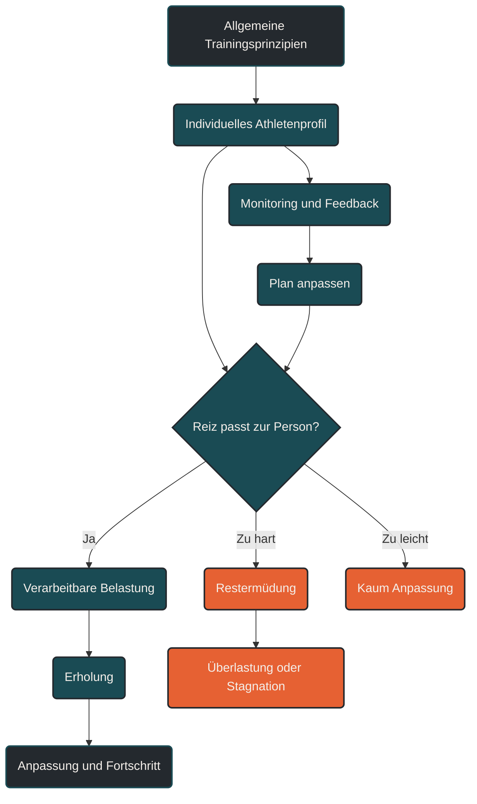

# Individualisierung

Individualisierung bedeutet, dass Training an die konkrete Person angepasst wird: an Leistungsstand, Trainingsalter, Ziel, Alltag, Erholung, Verletzungshistorie, Gesundheit, Motivation und Reaktion auf Belastung. Ein guter Trainingsplan ist deshalb kein starres Schema, sondern ein steuerbares System, das allgemeine Trainingsprinzipien auf den einzelnen Athleten überträgt.

## Was Individualisierung bedeutet

Trainingsprinzipien gelten allgemein, aber ihre Anwendung ist individuell. Zwei Athleten können denselben Trainingsplan absolvieren und völlig unterschiedlich darauf reagieren. Für den einen ist ein Intervalltraining ein produktiver Reiz, für den anderen ist es an diesem Tag zu viel. Für den einen ist ein langer Lauf gut verarbeitbar, für den anderen erzeugt er mehrere Tage Restermüdung oder orthopädische Beschwerden.

Individualisierung beschreibt genau diese Anpassung: Training wird nicht nur nach Lehrbuch geplant, sondern nach der Frage, was ein bestimmter Athlet zu einem bestimmten Zeitpunkt sinnvoll verarbeiten kann.

Das Ziel ist nicht, Training beliebig zu machen. Das Ziel ist, die bekannten Prinzipien – Reiz, Erholung, progressive Überlastung und Spezifität – so zu dosieren, dass sie zur Person passen.

## Warum Standardpläne nur begrenzt funktionieren

Standardpläne können eine gute Orientierung geben. Sie zeigen, wie eine Trainingswoche aufgebaut sein kann, welche Einheiten sinnvoll sind und wie Progression grundsätzlich funktioniert. Ihr Problem ist aber: Sie kennen den Athleten nicht.

Ein Standardplan weiß nicht, wie gut jemand schläft, wie stressig der Alltag ist, ob alte Achillessehnenprobleme bestehen, wie schnell sich die Muskulatur erholt, ob die Herzfrequenzzonen korrekt bestimmt wurden oder wie hoch die tatsächliche Belastung der letzten Wochen war.

Deshalb kann derselbe Plan für drei Personen drei verschiedene Effekte haben:

- Für Person A ist er zu leicht und erzeugt kaum Anpassung.
- Für Person B ist er passend und führt zu Fortschritt.
- Für Person C ist er zu hart und erhöht das Risiko für Überlastung.

Individualisierung macht aus einem Plan ein steuerbares Trainingssystem.

## Die wichtigsten Faktoren der Individualisierung

### Leistungsstand

Einsteiger, Fortgeschrittene und erfahrene Athleten benötigen unterschiedliche Reize. Was für Anfänger bereits eine starke Belastung ist, kann für trainierte Athleten nur Grundlagentraining sein. Umgekehrt können fortgeschrittene Einheiten für Einsteiger deutlich zu viel sein.

### Trainingsalter

Trainingsalter beschreibt, wie lange jemand bereits strukturiert trainiert. Ein hohes Trainingsalter bedeutet meist bessere Belastungstoleranz, stabilere Technik und mehr Erfahrung im Umgang mit Ermüdung. Ein niedriges Trainingsalter erfordert vorsichtigere Progression, auch wenn die Motivation hoch ist.

### Ziel

Ein 5-km-Lauf, ein Marathon, ein Triathlon, ein Trailrennen oder ein Ultramarathon stellen unterschiedliche Anforderungen. Individualisierung bedeutet, dass Training nicht nur allgemein besser machen soll, sondern zum konkreten Ziel passt.

### Alltag und Stress

Training ist nicht der einzige Stressor. Beruf, Familie, Schlafmangel, Reisen, psychischer Druck und Ernährung beeinflussen, wie viel Belastung verarbeitet werden kann. Ein Trainingsplan muss deshalb zum realen Leben passen, nicht nur zur sportlichen Wunschvorstellung.

### Erholungsfähigkeit

Menschen regenerieren unterschiedlich schnell. Schlafqualität, Ernährung, Alter, hormonelle Situation, Trainingshistorie und psychische Belastung beeinflussen, wann der nächste harte Reiz sinnvoll ist.

### Verletzungshistorie

Frühere Beschwerden an Achillessehne, Knie, Hüfte, Rücken oder Plantarfaszie verändern die Belastungssteuerung. Individualisierung bedeutet hier, mechanische Reize nicht einfach zu vermeiden, sondern vorsichtig und systematisch aufzubauen.

### Gesundheitliche Voraussetzungen

Bei Vorerkrankungen, ungewöhnlichen Symptomen oder dem Einstieg in intensives Ausdauertraining können medizinische Abklärung und sportmedizinische Vorsorge sinnvoll sein. Trainingsindividualisierung ersetzt keine Diagnostik, sondern berücksichtigt deren Ergebnisse.

### Mentale Faktoren

Motivation, Wettkampfangst, Perfektionismus, FOMO und die Bereitschaft zur Erholung beeinflussen Training stark. Manche Athleten müssen eher gebremst werden, andere brauchen Struktur, um regelmäßig genug Reize zu setzen.

## Innere und äußere Belastung

Ein zentraler Punkt der Individualisierung ist die Unterscheidung zwischen äußerer und innerer Belastung.

Die äußere Belastung ist das, was objektiv geplant oder gemessen wird: Kilometer, Minuten, Pace, Watt, Höhenmeter oder Wiederholungen.

Die innere Belastung ist das, was im Körper tatsächlich ankommt: Herzfrequenz, Atemarbeit, muskuläre Ermüdung, Nervensystembelastung, Stimmung, Schlafqualität und subjektives Belastungsempfinden.

Ein Plan kann äußerlich gleich bleiben, innerlich aber völlig anders wirken. 10 Kilometer locker sind nach gutem Schlaf etwas anderes als 10 Kilometer locker nach einer stressigen Woche, bei Hitze oder mit beginnenden Infektsymptomen.

## Individualisierung in der Trainingssteuerung

Individualisierung bedeutet nicht, jeden Tag spontan alles zu ändern. Ein Plan braucht Struktur. Aber die Struktur muss anpassbar bleiben.

Sinnvoll ist eine Kombination aus festen Leitplanken und flexibler Steuerung:

- harte Einheiten bleiben Schlüsselsessions
- lockere Einheiten bleiben bewusst locker
- Umfang wird schrittweise gesteigert
- Warnsignale führen zu Anpassung
- Fortschritt wird über Wochen bewertet
- Tagesform beeinflusst die konkrete Ausführung

Ein Beispiel: Wenn eine intensive Einheit geplant ist, aber Schlaf, Ruhepuls, HRV, Muskelgefühl und Motivation deutlich auf Ermüdung hinweisen, kann die Einheit verschoben oder durch lockeres Training ersetzt werden. Das ist kein Scheitern des Plans, sondern intelligente Plansteuerung.

## Monitoring als Werkzeug

Monitoring hilft, Individualisierung objektiver zu machen. Es ersetzt nicht das Körpergefühl, kann es aber ergänzen.

Nützliche Signale sind:

- Ruhepuls
- HRV-Trend
- Schlafdauer und Schlafqualität
- subjektive Erholung
- Muskelgefühl
- Schmerzen oder Steifigkeit
- Stimmung und Motivation
- Leistung bei gleicher Anstrengung
- Pace-Herzfrequenz-Verhältnis
- Belastung der letzten 7 bis 28 Tage

Wichtig ist der Trend, nicht ein einzelner Wert. Eine niedrige HRV an einem Tag ist noch kein Problem. Mehrere Warnzeichen über mehrere Tage sind dagegen ein Hinweis, dass die geplante Belastung angepasst werden sollte.

## Individualisierung und Trainingszonen

Auch Trainingszonen müssen individuell bestimmt werden. Pauschale Prozentwerte der maximalen Herzfrequenz sind nur grobe Näherungen. Zwei Athleten mit gleicher maximaler Herzfrequenz können unterschiedliche Schwellen, unterschiedliche Laufökonomie und unterschiedliche Belastungstoleranz haben.

Besser ist eine Kombination aus Leistungsdiagnostik, Feldtests, subjektivem Belastungsempfinden, Atemverhalten und regelmäßigem Abgleich mit der realen Trainingspraxis.

Eine Zone ist nur dann nützlich, wenn sie im Alltag zur tatsächlichen physiologischen Belastung passt.

## Individualisierung bedeutet nicht Bequemlichkeit

Ein häufiger Fehler ist, Individualisierung mit Beliebigkeit zu verwechseln. Individualisierung heißt nicht, harte Einheiten immer zu vermeiden oder nur nach Lust zu trainieren. Sie bedeutet, Reize so zu setzen, dass sie zur Person passen und langfristig wiederholbar bleiben.

Manchmal bedeutet Individualisierung mehr Belastung, wenn ein Athlet unterfordert ist. Manchmal bedeutet sie weniger Belastung, wenn Ermüdung, Stress oder Gewebereaktion dagegen sprechen. Entscheidend ist nicht das Ego, sondern die Anpassungsfähigkeit.

## Beispiele aus der Praxis

### Einsteiger

Einsteiger profitieren meist stärker von Regelmäßigkeit als von hoher Intensität. Die Individualisierung liegt hier vor allem in vorsichtiger Umfangssteigerung, Gehpausen, Technikbasis und orthopädischer Belastbarkeit.

### Fortgeschrittene Läufer

Fortgeschrittene brauchen gezieltere Reize. Hier werden Intensitäten, lange Läufe, Schwellenarbeit und Erholungsphasen genauer gesteuert. Individualisierung bedeutet, die wirksamsten Reize zu setzen, ohne in chronische Restermüdung zu geraten.

### Master-Athleten

Mit zunehmendem Alter können Regeneration, Muskelproteinsynthese, Sehnenanpassung, Schlaf und Verletzungshistorie wichtiger werden. Das bedeutet nicht automatisch weniger Training, aber oft präzisere Belastungssteuerung, mehr Fokus auf Kraft, Ernährung und Erholung.

### Athleten mit Verletzungshistorie

Bei wiederkehrenden Beschwerden muss Training nicht nur konditionell, sondern auch mechanisch individualisiert werden. Untergrund, Schuhwerk, Höhenmeter, Sprints, Sprünge, Krafttraining und Wochenumfang werden so gesteuert, dass Belastbarkeit aufgebaut statt überfordert wird.

## Praktische Einordnung

Individualisierung ist das Prinzip, das alle anderen Trainingsprinzipien auf den einzelnen Athleten überträgt. Superkompensation erklärt, warum Erholung nötig ist. Trainingsreize erklären, was Anpassung auslöst. Progressive Überlastung erklärt, warum Reize steigen müssen. Spezifität erklärt, warum Training zum Ziel passen muss. Individualisierung entscheidet, wie all das konkret für eine Person umgesetzt wird.

Der wichtigste Merksatz lautet: Der beste Trainingsplan ist nicht der härteste, modernste oder komplexeste Plan. Der beste Trainingsplan ist der, den ein Athlet langfristig verarbeiten, anpassen und wiederholen kann.

----

----

## Häufige Fragen zur Individualisierung im Training

### Was bedeutet Individualisierung im Training?

Individualisierung bedeutet, dass Training an die einzelne Person angepasst wird. Entscheidend sind Leistungsstand, Trainingsalter, Ziel, Erholung, Alltag, Gesundheit, Verletzungshistorie und die tatsächliche Reaktion auf Belastung.

### Warum funktioniert derselbe Trainingsplan nicht für alle?

Weil Menschen unterschiedlich auf Belastung reagieren. Schlaf, Stress, Trainingshistorie, Technik, Gewebebelastbarkeit, Ernährung und Erholungsfähigkeit bestimmen, ob ein Reiz produktiv, zu schwach oder überfordernd ist.

### Sind Standardpläne deshalb schlecht?

Nein. Standardpläne können eine gute Orientierung geben. Sie sollten aber nicht blind abgearbeitet werden. Sinnvoll wird ein Standardplan erst, wenn er an die eigene Belastbarkeit, den Alltag und die aktuelle Entwicklung angepasst wird.

### Was ist der Unterschied zwischen Spezifität und Individualisierung?

Spezifität fragt, ob das Training zum Ziel passt. Individualisierung fragt, ob dieses Training zur Person passt. Ein Marathontraining kann sehr spezifisch sein, aber trotzdem zu hart oder unpassend für einen bestimmten Athleten.

### Welche Faktoren sollten individuell angepasst werden?

Wichtige Stellschrauben sind Umfang, Intensität, Häufigkeit, Dauer, Pausen, Untergrund, Höhenmeter, Krafttraining, Technikarbeit, Erholungsphasen und Wettkampfspezifik.

### Wie erkenne ich, ob mein Training gut individualisiert ist?

Ein gutes Zeichen ist, wenn Belastung fordernd, aber verarbeitbar bleibt. Die Leistung entwickelt sich über Wochen, lockere Einheiten bleiben kontrolliert, harte Einheiten haben Qualität, und Beschwerden nehmen nicht zu.

### Welche Rolle spielt HRV bei der Individualisierung?

HRV kann Hinweise auf die Belastung des autonomen Nervensystems geben. Sie ist besonders nützlich als Trend über mehrere Tage. Eine niedrige HRV kann ein Signal sein, Belastung zu reduzieren oder eine harte Einheit zu verschieben.

### Reicht Körpergefühl als Steuerung aus?

Körpergefühl ist wichtig, aber nicht immer zuverlässig. Viele Athleten unterschätzen Ermüdung oder überschätzen ihre Tagesform. Besser ist die Kombination aus subjektivem Gefühl, Trainingsdaten, Schlaf, Ruhepuls, HRV und Leistungsentwicklung.

### Bedeutet Individualisierung, dass ich harte Einheiten vermeiden soll?

Nein. Individualisierung bedeutet nicht Schonung um jeden Preis. Harte Reize bleiben wichtig, wenn sie zum Ziel passen und verarbeitet werden können. Entscheidend ist das richtige Maß zur richtigen Zeit.

### Wie oft sollte ein Trainingsplan angepasst werden?

Kleine Anpassungen können wöchentlich oder sogar tagesaktuell sinnvoll sein. Größere Änderungen sollten anhand von Trends erfolgen, zum Beispiel nach mehreren Wochen stagnierender Leistung, wiederkehrenden Beschwerden oder deutlich veränderter Erholung.

### Was ist bei Verletzungshistorie besonders wichtig?

Bei früheren Beschwerden sollte die mechanische Belastung vorsichtig gesteigert werden. Dazu gehören Laufumfang, Untergrund, Höhenmeter, Tempo, Sprints, Sprünge und Krafttraining. Ziel ist nicht Vermeidung, sondern kontrollierter Aufbau von Belastbarkeit.

### Brauchen ältere Athleten grundsätzlich weniger Training?

Nicht automatisch. Viele Master-Athleten können sehr leistungsfähig trainieren. Häufig brauchen sie aber präzisere Erholungssteuerung, bessere Kraft- und Mobilitätsarbeit, angepasste Ernährung und eine vorsichtigere Progression mechanischer Reize.

### Wann sollte medizinisch abgeklärt werden?

Bei ungewohnten Brustschmerzen, Atemnot, Schwindel, Herzrhythmusstörungen, wiederkehrenden Schmerzen, längeren Leistungseinbrüchen oder vor dem Einstieg in intensives Training bei bestehenden Risikofaktoren sollte ärztlich oder sportmedizinisch abgeklärt werden.

### Was ist der wichtigste Fehler bei Individualisierung?

Der häufigste Fehler ist, nur den Plan zu individualisieren, aber nicht die Reaktion darauf zu beobachten. Individualisierung ist kein einmaliger Planungsakt, sondern ein fortlaufender Abgleich zwischen Reiz, Erholung und tatsächlicher Anpassung.

----

*Hinweis: Dieser Artikel dient der allgemeinen Information und ersetzt keine medizinische oder therapeutische Beratung. Mehr dazu im [**Gesundheits- und Quellenhinweis**](/ausdauersport/disclaimer/).*

