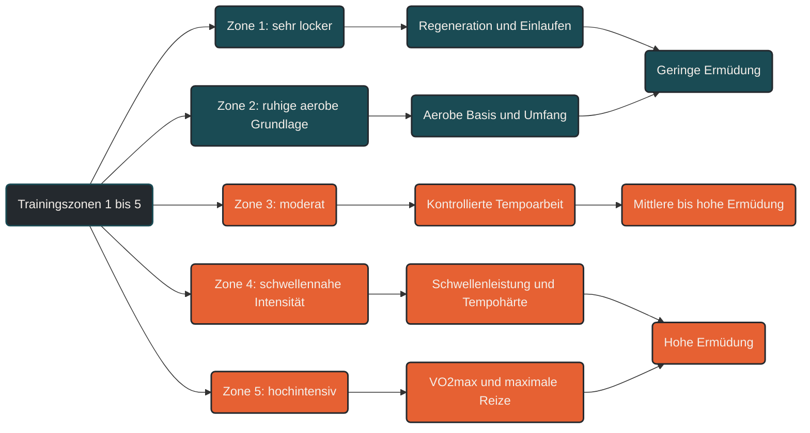

# Zone 1–5

Trainingszonen helfen, Ausdauertraining gezielter zu steuern. Sie teilen Belastungen in unterschiedliche Intensitätsbereiche ein und machen sichtbar, ob eine Einheit eher der Regeneration, dem Grundlagentraining, der Schwellenentwicklung oder der hochintensiven Leistungssteigerung dient. [[1]](#quelle-1) [[2]](#quelle-2)

Das 5-Zonen-Modell ist dabei kein starres Gesetz, sondern ein praktisches Orientierungssystem. Je nach Methode können die Zonen über Herzfrequenz, Pace, Watt, Laktat, Atemverhalten oder subjektives Belastungsempfinden bestimmt werden. [[1]](#quelle-1) [[2]](#quelle-2) [[3]](#quelle-3)

## Warum Trainingszonen wichtig sind

Viele Ausdauersportler trainieren zu oft im mittleren Intensitätsbereich. Die Einheiten fühlen sich dann produktiv an, erzeugen aber viel Ermüdung und lassen wenig Raum für echte Erholung oder qualitativ hochwertige intensive Reize. [[4]](#quelle-4) [[5]](#quelle-5)

Trainingszonen helfen, diese Belastung besser zu verteilen. Lockere Einheiten bleiben wirklich locker, intensive Einheiten werden gezielt gesetzt und moderate Belastungen bekommen eine klare Funktion im Trainingsplan. [[4]](#quelle-4) [[6]](#quelle-6)

## Die fünf Trainingszonen

### Zone 1

Zone 1 ist sehr locker. Die Belastung fühlt sich leicht an, die Atmung bleibt ruhig und eine Unterhaltung ist problemlos möglich. [[1]](#quelle-1) [[3]](#quelle-3)

Diese Zone eignet sich für Regeneration, Einlaufen, Auslaufen und sehr leichte Grundlageneinheiten. Sie belastet den Körper wenig und kann helfen, Durchblutung und Erholung zu unterstützen. [[6]](#quelle-6) [[10]](#quelle-10)

### Zone 2

Zone 2 liegt im ruhigen aeroben Bereich. Die Belastung ist kontrolliert, gleichmäßig und über längere Zeit gut durchhaltbar. [[1]](#quelle-1) [[3]](#quelle-3) [[6]](#quelle-6)

Diese Zone ist für viele Ausdauersportler die wichtigste Grundlage. Sie verbessert die aerobe Leistungsfähigkeit, unterstützt den Fettstoffwechsel, fördert die Belastungsverträglichkeit und ermöglicht größere Trainingsumfänge ohne dauerhaft hohe Ermüdung. [[4]](#quelle-4) [[6]](#quelle-6)

### Zone 3

Zone 3 ist moderat. Die Belastung fühlt sich deutlich anstrengender an als Zone 2, bleibt aber noch kontrollierbar. [[1]](#quelle-1) [[2]](#quelle-2)

Dieser Bereich kann für Tempodauerläufe, längere kontrollierte Belastungen oder spezifische Vorbereitung sinnvoll sein. Gleichzeitig ist Zone 3 kritisch, weil sie oft unbewusst zu häufig genutzt wird. Zu viel Training in diesem Bereich kann zu chronischer Ermüdung führen. [[4]](#quelle-4) [[5]](#quelle-5) [[10]](#quelle-10)

### Zone 4

Zone 4 liegt im Bereich hoher, aber noch begrenzt kontrollierbarer Intensität. Häufig wird sie mit Schwellenbelastungen verbunden. [[2]](#quelle-2) [[3]](#quelle-3)

Training in Zone 4 verbessert die Fähigkeit, ein hohes Tempo über längere Zeit zu halten. Diese Zone ist besonders relevant für Wettkampftempo, Schwellenleistung und Tempohärte. [[2]](#quelle-2) [[7]](#quelle-7)

### Zone 5

Zone 5 beschreibt sehr hohe bis maximale Intensitäten. Diese Belastungen sind nur kurz aufrechtzuerhalten und werden meist in Intervallen trainiert. [[1]](#quelle-1) [[8]](#quelle-8)

Zone 5 setzt starke Reize für maximale Sauerstoffaufnahme, Herz-Kreislauf-System, neuromuskuläre Aktivierung und hohe Leistungsfähigkeit. Gleichzeitig ist sie belastend und benötigt ausreichend Erholung. [[7]](#quelle-7) [[8]](#quelle-8) [[9]](#quelle-9)

## Zonen sind Orientierung, keine exakten Grenzen

Trainingszonen gehen fließend ineinander über. Der Körper schaltet nicht plötzlich von einer Zone in die nächste. Auch Tagesform, Müdigkeit, Hitze, Stress, Schlaf, Ernährung und Gelände können beeinflussen, wie sich eine Intensität anfühlt. [[2]](#quelle-2) [[9]](#quelle-9) [[10]](#quelle-10)

Deshalb sollten Zonen nicht nur nach Zahlen beurteilt werden. Herzfrequenz, Pace oder Watt sind hilfreich, aber auch Atemverhalten und subjektives Belastungsempfinden sind wichtige Hinweise. [[2]](#quelle-2) [[3]](#quelle-3) [[9]](#quelle-9)

## Praktische Einordnung

Zone 1 und 2 bilden die Grundlage vieler Ausdauerprogramme. Sie ermöglichen regelmäßiges Training, ohne den Körper ständig stark zu belasten. [[4]](#quelle-4) [[6]](#quelle-6)

Zone 3 sollte bewusst eingesetzt werden, nicht automatisch entstehen. Sie kann wertvoll sein, wenn sie zum Ziel der Einheit passt. [[4]](#quelle-4) [[5]](#quelle-5)

Zone 4 und 5 setzen starke Leistungsreize, sollten aber gezielt geplant werden. Ihr Nutzen entsteht nicht durch möglichst häufige Wiederholung, sondern durch passende Dosierung und ausreichende Regeneration. [[7]](#quelle-7) [[8]](#quelle-8) [[10]](#quelle-10)

## Zusammenfassung

Das 5-Zonen-Modell hilft, Trainingsintensitäten verständlich zu strukturieren. Zone 1 und 2 stehen für lockere bis ruhige aerobe Belastungen, Zone 3 für moderate Intensität, Zone 4 für schwellennahe Belastungen und Zone 5 für hochintensive Reize. [[1]](#quelle-1) [[2]](#quelle-2)

Entscheidend ist nicht, jede Zone möglichst oft zu trainieren, sondern die Zonen passend zum Trainingsziel einzusetzen. Gutes Ausdauertraining entsteht durch die richtige Mischung aus lockeren, moderaten und intensiven Einheiten. [[4]](#quelle-4) [[5]](#quelle-5) [[6]](#quelle-6)

----

----

## Häufige Fragen zu den Zonen 1–5

### Was bedeutet Zone 1 bis 5 im Ausdauertraining?

Zone 1 bis 5 beschreibt unterschiedliche Intensitätsbereiche im Ausdauertraining. Zone 1 ist sehr locker, Zone 2 ruhig aerob, Zone 3 moderat, Zone 4 schwellennahe Belastung und Zone 5 hochintensiv. [[1]](#quelle-1) [[2]](#quelle-2)

### Welche Zone ist für Grundlagenausdauer wichtig?

Für die Grundlagenausdauer sind vor allem Zone 1 und Zone 2 wichtig. Besonders Zone 2 wird häufig genutzt, um die aerobe Basis, den Fettstoffwechsel und die Belastungsverträglichkeit zu verbessern. [[4]](#quelle-4) [[6]](#quelle-6)

### Warum sollte nicht jedes Training hart sein?

Harte Einheiten setzen starke Reize, erzeugen aber auch viel Ermüdung. Wenn zu oft hart trainiert wird, fehlt dem Körper die Erholung, um sich anzupassen. Fortschritt entsteht durch das Verhältnis aus Belastung und Regeneration. [[8]](#quelle-8) [[10]](#quelle-10)

### Ist Zone 3 schlecht?

Zone 3 ist nicht schlecht. Sie wird nur problematisch, wenn sie unbewusst zu häufig trainiert wird. Dann kann sie viel Ermüdung erzeugen, ohne dass lockere oder intensive Einheiten ihre volle Wirkung entfalten. [[4]](#quelle-4) [[5]](#quelle-5)

### Wofür ist Zone 4 sinnvoll?

Zone 4 ist sinnvoll, um die Schwellenleistung und Tempohärte zu verbessern. Sie hilft dabei, ein hohes Tempo über längere Zeit kontrolliert aufrechtzuerhalten. [[2]](#quelle-2) [[7]](#quelle-7)

### Wofür ist Zone 5 sinnvoll?

Zone 5 wird für sehr intensive Reize genutzt, zum Beispiel in Intervallen. Sie kann die maximale Sauerstoffaufnahme, die neuromuskuläre Aktivierung und die Leistungsfähigkeit bei hohen Intensitäten verbessern. [[7]](#quelle-7) [[8]](#quelle-8)

### Wie bestimme ich meine Trainingszonen?

Trainingszonen können über Herzfrequenz, Pace, Watt, Laktat, Atemverhalten oder subjektives Belastungsempfinden bestimmt werden. Am genauesten sind individuelle Tests, aber auch einfache Orientierung über Atmung und Gefühl kann im Alltag hilfreich sein. [[2]](#quelle-2) [[3]](#quelle-3)

### Sind Trainingszonen exakt?

Nein. Trainingszonen sind Orientierungshilfen. Die Übergänge sind fließend und können durch Tagesform, Müdigkeit, Hitze, Stress, Schlaf, Ernährung oder Gelände beeinflusst werden. [[2]](#quelle-2) [[9]](#quelle-9)

### Welche Zone sollte ich am meisten trainieren?

Bei vielen Ausdauersportlern liegt der größte Anteil des Trainings im niedrigen Intensitätsbereich, also vor allem in Zone 1 und Zone 2. Die genaue Verteilung hängt aber von Ziel, Leistungsstand, Trainingsumfang und Regenerationsfähigkeit ab. [[4]](#quelle-4) [[6]](#quelle-6) [[10]](#quelle-10)

## Quellen

### Quelle 1

[1] Bishop, D. J., Beck, B., Biddle, S. J. H., Denay, K., Ferri, A., Gibala, M. J., Headley, S., Jones, A. M., Jung, M., Lee, M. J., Moholdt, T., Newton, R. U., Nimphius, S., Pescatello, L. S., Saner, N. J. & Tzarimas, C. (2025): [Physical Activity and Exercise Intensity Terminology: A Joint ACSM Expert Statement and ESSA Consensus Statement](https://www.sciencedirect.com/science/article/pii/S1440244024005590). Medicine & Science in Sports & Exercise.

### Quelle 2

[2] Mann, T., Lamberts, R. P. & Lambert, M. I. (2013): [Methods of Prescribing Relative Exercise Intensity: Physiological and Practical Considerations](https://link.springer.com/article/10.1007/s40279-013-0045-x). Sports Medicine.

### Quelle 3

[3] Bok, D., Rakovac, M. & Foster, C. (2022): [An Examination and Critique of Subjective Methods to Determine Exercise Intensity: The Talk Test, Feeling Scale, and Rating of Perceived Exertion](https://link.springer.com/article/10.1007/s40279-022-01690-3). Sports Medicine.

### Quelle 4

[4] Seiler, S. (2010): [What is Best Practice for Training Intensity and Duration Distribution in Endurance Athletes?](https://journals.humankinetics.com/abstract/journals/ijspp/5/3/article-p276.xml). International Journal of Sports Physiology and Performance.

### Quelle 5

[5] Stöggl, T. & Sperlich, B. (2014): [Polarized training has greater impact on key endurance variables than threshold, high intensity, or high volume training](https://pubmed.ncbi.nlm.nih.gov/24550842/). Frontiers in Physiology.

### Quelle 6

[6] Matomäki, P. (2025): [Why low-intensity endurance training for athletes?](https://link.springer.com/article/10.1007/s00421-025-05843-w). European Journal of Applied Physiology.

### Quelle 7

[7] Helgerud, J., Høydal, K., Wang, E., Karlsen, T., Berg, P., Bjerkaas, M., Simonsen, T., Helgesen, C., Hjorth, N., Bach, R. & Hoff, J. (2007): [Aerobic high-intensity intervals improve VO2max more than moderate training](https://pubmed.ncbi.nlm.nih.gov/17414804/). Medicine & Science in Sports & Exercise.

### Quelle 8

[8] Laursen, P. B. & Jenkins, D. G. (2002): [The Scientific Basis for High-Intensity Interval Training](https://link.springer.com/article/10.2165/00007256-200232010-00003). Sports Medicine.

### Quelle 9

[9] Impellizzeri, F. M., Marcora, S. M. & Coutts, A. J. (2019): [Internal and External Training Load: 15 Years On](https://pubmed.ncbi.nlm.nih.gov/30614348/). International Journal of Sports Physiology and Performance.

### Quelle 10

[10] Bourdon, P. C., Cardinale, M., Murray, A., Gastin, P., Kellmann, M., Varley, M. C., Gabbett, T. J., Coutts, A. J., Burgess, D. J., Gregson, W. & Cable, N. T. (2017): [Monitoring Athlete Training Loads: Consensus Statement](https://journals.humankinetics.com/view/journals/ijspp/12/s2/article-pS2-161.xml). International Journal of Sports Physiology and Performance.

----

*Hinweis: Dieser Artikel dient der allgemeinen Information und ersetzt keine medizinische oder therapeutische Beratung. Mehr dazu im [**Gesundheits- und Quellenhinweis**](/ausdauersport/disclaimer/).*

