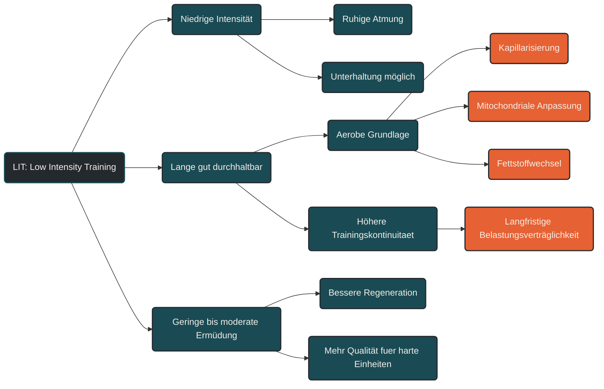

# LIT (Low Intensity Training)

Low Intensity Training, kurz LIT, beschreibt Training mit niedriger Intensität. Die Belastung ist kontrolliert, ruhig und über längere Zeit gut durchhaltbar. Im Ausdauersport bildet LIT die Grundlage für viele Anpassungen, weil es regelmäßiges Training ermöglicht, ohne den Körper dauerhaft stark zu ermüden. [[1]](#quelle-1) [[4]](#quelle-4) [[5]](#quelle-5)

LIT ist nicht „zu leicht“, sondern ein gezielt eingesetzter Trainingsbereich. Es verbessert die aerobe Basis, unterstützt den Fettstoffwechsel, fördert die Belastungsverträglichkeit und schafft die Grundlage dafür, intensivere Einheiten später besser zu verkraften. [[4]](#quelle-4) [[5]](#quelle-5) [[6]](#quelle-6)

## Was Low Intensity Training bedeutet

LIT findet überwiegend im niedrigen aeroben Intensitätsbereich statt. Die Atmung bleibt ruhig, eine Unterhaltung ist meist problemlos möglich und die Belastung fühlt sich kontrolliert an. [[1]](#quelle-1) [[2]](#quelle-2) [[3]](#quelle-3)

Je nach Modell entspricht LIT häufig Zone 1 bis Zone 2. Entscheidend ist aber nicht nur die Zahl der Zone, sondern das Belastungsgefühl: Die Einheit soll locker genug bleiben, um nicht zu einer versteckten moderaten oder harten Belastung zu werden. [[2]](#quelle-2) [[3]](#quelle-3) [[4]](#quelle-4)

## Warum LIT wichtig ist

Viele zentrale Ausdaueranpassungen entstehen nicht durch maximale Härte, sondern durch wiederholte, gut verkraftbare Reize. LIT erlaubt hohe Trainingshäufigkeit und längere Umfänge, ohne den Körper jedes Mal stark zu belasten. [[4]](#quelle-4) [[5]](#quelle-5) [[8]](#quelle-8)

Dadurch kann der Körper über Zeit effizienter werden. Herz-Kreislauf-System, Muskulatur, Stoffwechsel und Erholungsfähigkeit passen sich an wiederkehrende aerobe Belastungen an. [[5]](#quelle-5) [[6]](#quelle-6)

## Physiologische Wirkung von LIT

LIT unterstützt vor allem die aerobe Energiegewinnung. Der Körper lernt, Sauerstoff effizienter zu nutzen und Belastungen länger aufrechtzuerhalten. [[6]](#quelle-6)

Typische Anpassungen sind eine bessere Grundlagenausdauer, eine verbesserte Kapillarisierung, eine stärkere mitochondriale Leistungsfähigkeit, ein ökonomischerer Fettstoffwechsel und eine höhere Belastungsverträglichkeit. [[6]](#quelle-6)

Diese Anpassungen wirken unspektakulär, sind aber für langfristige Leistungsentwicklung entscheidend. Gerade bei Ausdauerathleten entsteht der Wert von LIT häufig nicht aus einer einzelnen Einheit, sondern aus der wiederholbaren Summe vieler niedriger Belastungen. [[4]](#quelle-4) [[5]](#quelle-5)

## LIT und Regeneration

LIT kann auch eine regenerative Funktion haben, wenn die Belastung wirklich niedrig bleibt. Sehr lockere Einheiten können die Durchblutung fördern, muskuläre Steifigkeit reduzieren und den Übergang zwischen intensiveren Trainingstagen erleichtern. [[8]](#quelle-8) [[9]](#quelle-9)

Dabei ist wichtig: LIT ist nur dann regenerationsfreundlich, wenn es nicht zu schnell oder zu lang wird. Eine eigentlich lockere Einheit kann durch zu hohes Tempo, zu viele Höhenmeter oder zu lange Dauer trotzdem belastend werden. [[7]](#quelle-7) [[8]](#quelle-8)

## Häufiger Fehler: LIT zu hart trainieren

Ein häufiger Fehler ist, lockere Einheiten zu intensiv zu laufen, zu fahren oder zu schwimmen. Die Einheit fühlt sich dann noch kontrolliert an, liegt aber bereits im moderaten Bereich. [[2]](#quelle-2) [[3]](#quelle-3) [[4]](#quelle-4)

Dadurch entsteht zusätzliche Ermüdung, ohne dass die Einheit klar locker oder klar intensiv ist. Über Wochen kann das dazu führen, dass die Qualität der harten Einheiten sinkt und die Erholung schlechter wird. [[4]](#quelle-4) [[8]](#quelle-8) [[9]](#quelle-9)

## Praktische Einordnung

LIT sollte sich ruhig, kontrolliert und wiederholbar anfühlen. Nach einer echten LIT-Einheit sollte man sich nicht völlig erschöpft fühlen. [[3]](#quelle-3) [[5]](#quelle-5)

Im Training kann LIT für lockere Dauerläufe, ruhige Radeinheiten, entspannte Schwimmeinheiten, Regenerationstage, längere Grundlageneinheiten oder umfangsorientierte Trainingsphasen genutzt werden. [[4]](#quelle-4) [[5]](#quelle-5)

Besonders wertvoll ist LIT, wenn es konsequent locker bleibt und nicht unbewusst in Moderate Intensity Training abrutscht. Dann kann es helfen, Trainingskontinuität aufzubauen, Erholung zwischen harten Einheiten zu ermöglichen und die Gesamtbelastung besser steuerbar zu machen. [[4]](#quelle-4) [[7]](#quelle-7) [[8]](#quelle-8)

## Zusammenfassung

Low Intensity Training ist ein zentraler Baustein im Ausdauertraining. Es verbessert die aerobe Grundlage, unterstützt langfristige Anpassungen und ermöglicht regelmäßiges Training mit vergleichsweise geringer Ermüdung. [[4]](#quelle-4) [[5]](#quelle-5) [[6]](#quelle-6)

Der Nutzen von LIT entsteht nicht durch hohe Intensität, sondern durch Kontinuität, passende Dauer und saubere Dosierung. Wer lockere Einheiten wirklich locker hält, schafft die Grundlage für bessere Belastbarkeit, bessere Erholung und qualitativ hochwertigere intensive Reize. [[4]](#quelle-4) [[5]](#quelle-5) [[10]](#quelle-10)

----

----

## Häufige Fragen zum LIT (Low Intensity Training)

### Was bedeutet LIT im Ausdauertraining?

LIT steht für Low Intensity Training und beschreibt Training mit niedriger Intensität. Die Belastung ist locker, kontrolliert und über längere Zeit gut durchhaltbar.

### In welcher Zone liegt LIT?

LIT liegt je nach Zonenmodell meist in Zone 1 bis Zone 2. Entscheidend ist, dass die Belastung niedrig bleibt und nicht unbewusst in den moderaten Bereich rutscht.

### Warum ist LIT wichtig?

LIT verbessert die aerobe Grundlage, unterstützt den Fettstoffwechsel, fördert die Belastungsverträglichkeit und ermöglicht regelmäßiges Training mit geringerer Ermüdung.

### Ist LIT nur für Anfänger sinnvoll?

Nein. LIT ist auch für fortgeschrittene und leistungsorientierte Ausdauersportler wichtig. Es bildet die Grundlage, auf der intensivere Trainingsreize besser verarbeitet werden können.

### Kann man mit LIT schneller werden?

Ja, indirekt. LIT verbessert die aerobe Basis und Belastbarkeit. Dadurch können später intensivere Einheiten besser umgesetzt und verkraftet werden.

### Warum sollte LIT nicht zu hart sein?

Wenn LIT zu intensiv wird, entsteht unnötige Ermüdung. Die Einheit ist dann nicht mehr wirklich locker und kann die Erholung sowie die Qualität späterer harter Einheiten beeinträchtigen.

### Woran erkenne ich LIT?

LIT fühlt sich locker und kontrolliert an. Die Atmung bleibt ruhig, eine Unterhaltung ist meist möglich und die Einheit sollte nicht das Gefühl einer harten Belastung hinterlassen.

### Ist LIT dasselbe wie Regenerationstraining?

Nicht immer. LIT kann regenerativ wirken, wenn es sehr locker und passend dosiert ist. Längere LIT-Einheiten können aber trotz niedriger Intensität eine relevante Trainingsbelastung darstellen.

### Wie oft sollte man LIT trainieren?

Das hängt von Trainingsziel, Leistungsstand, Umfang und Regeneration ab. In vielen Ausdauerprogrammen macht LIT einen großen Teil des Trainings aus, weil es gut verkraftbar ist und langfristige Anpassungen unterstützt.

----

## Quellen

### Quelle 1

[1] Bishop, D. J., Beck, B., Biddle, S. J. H., Denay, K., Ferri, A., Gibala, M. J., Headley, S., Jones, A. M., Jung, M., Lee, M. J., Moholdt, T., Newton, R. U., Nimphius, S., Pescatello, L. S., Saner, N. J. & Tzarimas, C. (2025): [Physical Activity and Exercise Intensity Terminology: A Joint ACSM Expert Statement and ESSA Consensus Statement](https://www.sciencedirect.com/science/article/pii/S1440244024005590). Medicine & Science in Sports & Exercise.

### Quelle 2

[2] Mann, T., Lamberts, R. P. & Lambert, M. I. (2013): [Methods of Prescribing Relative Exercise Intensity: Physiological and Practical Considerations](https://link.springer.com/article/10.1007/s40279-013-0045-x). Sports Medicine.

### Quelle 3

[3] Bok, D., Rakovac, M. & Foster, C. (2022): [An Examination and Critique of Subjective Methods to Determine Exercise Intensity: The Talk Test, Feeling Scale, and Rating of Perceived Exertion](https://link.springer.com/article/10.1007/s40279-022-01690-3). Sports Medicine.

### Quelle 4

[4] Seiler, S. (2010): [What is Best Practice for Training Intensity and Duration Distribution in Endurance Athletes?](https://journals.humankinetics.com/abstract/journals/ijspp/5/3/article-p276.xml). International Journal of Sports Physiology and Performance.

### Quelle 5

[5] Matomäki, P. (2025): [Why low-intensity endurance training for athletes?](https://link.springer.com/article/10.1007/s00421-025-05843-w). European Journal of Applied Physiology.

### Quelle 6

[6] Mølmen, K. S., Almquist, N. W. & Skattebo, Ø. (2025): [Effects of Exercise Training on Mitochondrial and Capillary Growth in Human Skeletal Muscle: A Systematic Review and Meta-Regression](https://link.springer.com/article/10.1007/s40279-024-02120-2). Sports Medicine.

### Quelle 7

[7] Impellizzeri, F. M., Marcora, S. M. & Coutts, A. J. (2019): [Internal and External Training Load: 15 Years On](https://pubmed.ncbi.nlm.nih.gov/30614348/). International Journal of Sports Physiology and Performance.

### Quelle 8

[8] Bourdon, P. C., Cardinale, M., Murray, A., Gastin, P., Kellmann, M., Varley, M. C., Gabbett, T. J., Coutts, A. J., Burgess, D. J., Gregson, W. & Cable, N. T. (2017): [Monitoring Athlete Training Loads: Consensus Statement](https://journals.humankinetics.com/view/journals/ijspp/12/s2/article-pS2-161.xml). International Journal of Sports Physiology and Performance.

### Quelle 9

[9] Kellmann, M., Bertollo, M., Bosquet, L., Brink, M., Coutts, A. J., Duffield, R., Erlacher, D., Halson, S. L., Hecksteden, A., Heidari, J., Kallus, K. W., Meeusen, R., Mujika, I., Robazza, C., Skorski, S., Venter, R. & Beckmann, J. (2018): [Recovery and Performance in Sport: Consensus Statement](https://journals.humankinetics.com/view/journals/ijspp/13/2/article-p240.xml). International Journal of Sports Physiology and Performance.

### Quelle 10

[10] Laursen, P. B. & Jenkins, D. G. (2002): [The Scientific Basis for High-Intensity Interval Training](https://link.springer.com/article/10.2165/00007256-200232010-00003). Sports Medicine.

----

*Hinweis: Dieser Artikel dient der allgemeinen Information und ersetzt keine medizinische oder therapeutische Beratung. Mehr dazu im [**Gesundheits- und Quellenhinweis**](/ausdauersport/disclaimer/).*
