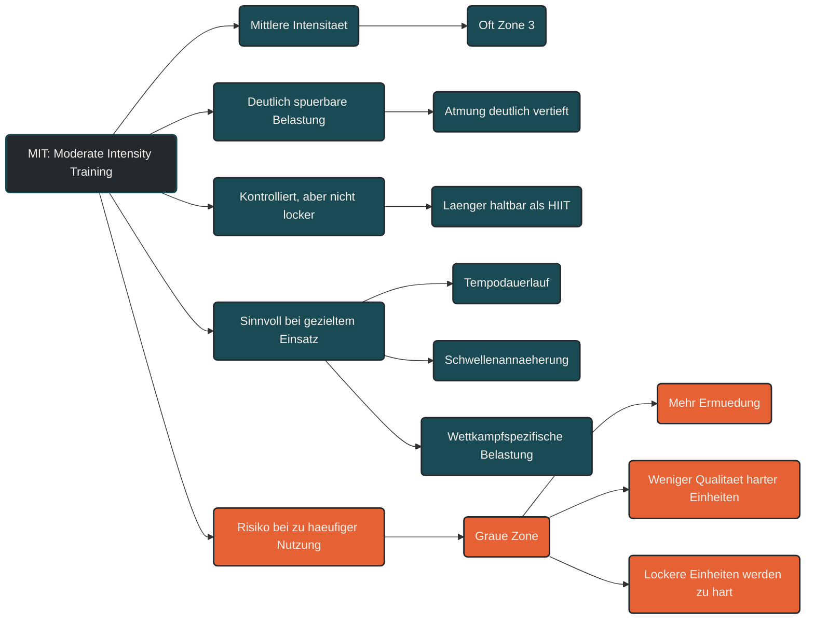

# MIT (Moderate Intensity)

Moderate Intensity Training, kurz MIT, beschreibt Training mit mittlerer Intensität. Die Belastung ist deutlich spürbar, aber noch kontrollierbar. Sie liegt zwischen lockerem Grundlagentraining und hochintensiven Einheiten. [[1]](#quelle-1) [[2]](#quelle-2) [[6]](#quelle-6)

MIT kann im Ausdauertraining sinnvoll sein, wenn es gezielt eingesetzt wird. Es verbessert die Fähigkeit, längere Belastungen mit höherem Tempo zu halten, kann die Schwellenentwicklung unterstützen und bereitet auf wettkampfnähere Intensitäten vor. [[5]](#quelle-5) [[7]](#quelle-7)

## Was Moderate Intensity Training bedeutet

MIT liegt meist oberhalb des lockeren aeroben Bereichs, aber unterhalb sehr hoher Intensitäten. Die Atmung ist deutlich vertieft, eine Unterhaltung ist nur noch eingeschränkt möglich und die Belastung fühlt sich konzentriert, aber nicht maximal an. [[1]](#quelle-1) [[2]](#quelle-2) [[3]](#quelle-3)

Je nach Modell entspricht MIT häufig dem mittleren Intensitätsbereich, oft etwa Zone 3. Im Drei-Zonen-Modell liegt MIT typischerweise zwischen erster und zweiter ventilatorischer beziehungsweise Laktatschwelle; im Fünf-Zonen-Modell wird dieser Bereich häufig weiter unterteilt. [[6]](#quelle-6) [[7]](#quelle-7)

## Warum MIT wichtig sein kann

Moderate Intensitäten können helfen, die Lücke zwischen lockerer Grundlage und intensiver Tempoarbeit zu schließen. Sie trainieren die Fähigkeit, über längere Zeit kontrolliert Druck zu machen, ohne sofort in sehr hohe Belastungsbereiche zu gehen. [[5]](#quelle-5) [[7]](#quelle-7)

MIT kann besonders für Tempodauerläufe, längere Intervalle, wettkampfnahes Training oder spezifische Vorbereitungsphasen sinnvoll sein. Entscheidend ist, dass die Einheit eine klare Aufgabe hat und nicht nur entsteht, weil lockeres Training zu schnell ausgeführt wird. [[4]](#quelle-4) [[5]](#quelle-5) [[8]](#quelle-8)

## Physiologische Wirkung von MIT

MIT fordert das Herz-Kreislauf-System, den Stoffwechsel und die Muskulatur stärker als Low Intensity Training. Der Körper arbeitet weiterhin überwiegend aerob, muss aber bereits deutlich mehr Energie bereitstellen. [[2]](#quelle-2) [[6]](#quelle-6)

Dadurch kann MIT die aerobe Leistungsfähigkeit, die Tempohärte, die Laktatverarbeitung und die Belastungstoleranz bei mittleren bis höheren Intensitäten verbessern. Besonders schwellennahe Belastungen sind deshalb in der Leistungsdiagnostik und Trainingssteuerung relevant. [[7]](#quelle-7) [[8]](#quelle-8)

## Die Gefahr der grauen Zone

MIT ist nicht grundsätzlich schlecht. Problematisch wird es, wenn zu viele Einheiten unbewusst im moderaten Bereich landen. [[4]](#quelle-4) [[5]](#quelle-5)

Dann sind lockere Einheiten nicht mehr locker genug, harte Einheiten aber oft nicht mehr qualitativ hochwertig genug. Dadurch entsteht viel Ermüdung, ohne dass die Trainingsreize klar voneinander getrennt sind. [[4]](#quelle-4) [[9]](#quelle-9) [[10]](#quelle-10)

Diese sogenannte graue Zone ist ein häufiger Grund dafür, dass Training anstrengend wirkt, aber die Leistungsentwicklung stagniert. Studien zur Trainingsintensitätsverteilung zeigen deshalb häufig, dass gut geplantes Ausdauertraining moderate Belastungen bewusst dosiert und nicht jede Einheit in diesen Bereich verschiebt. [[4]](#quelle-4) [[5]](#quelle-5) [[8]](#quelle-8)

## MIT bewusst einsetzen

Moderate Intensität sollte eine klare Aufgabe im Trainingsplan haben. Sie kann sinnvoll sein, wenn eine Einheit gezielt Tempo, Schwellenannäherung oder wettkampfspezifische Belastbarkeit trainieren soll. [[5]](#quelle-5) [[7]](#quelle-7)

Sie sollte aber nicht automatisch entstehen, weil lockere Einheiten zu schnell gelaufen, gefahren oder geschwommen werden. Dafür ist die Kombination aus Herzfrequenz, Pace oder Watt, Atemverhalten, Talk-Test und subjektivem Belastungsempfinden hilfreich. [[2]](#quelle-2) [[3]](#quelle-3) [[9]](#quelle-9)

## Praktische Einordnung

MIT fühlt sich oft produktiv an, weil man merkt, dass man arbeitet. Genau deshalb wird dieser Bereich leicht zu häufig genutzt. [[3]](#quelle-3) [[4]](#quelle-4)

Sinnvoll ist MIT vor allem dann, wenn Dauer, Intensität und Erholung bewusst geplant sind. Nach einer moderaten Einheit sollte genug Raum bleiben, damit wirklich lockere Einheiten locker bleiben und intensive Einheiten mit guter Qualität durchgeführt werden können. [[9]](#quelle-9) [[10]](#quelle-10)

## Zusammenfassung

Moderate Intensity Training ist ein nützlicher, aber sensibler Trainingsbereich. Es kann Tempohärte, Schwellenannäherung und längere kontrollierte Belastungen verbessern. [[5]](#quelle-5) [[7]](#quelle-7)

Der Nutzen von MIT entsteht nicht dadurch, möglichst oft moderat zu trainieren, sondern durch bewusste Dosierung. Wer moderate Intensität gezielt einsetzt und von lockeren sowie hochintensiven Einheiten trennt, kann sie sinnvoll in die Trainingssteuerung integrieren. [[4]](#quelle-4) [[8]](#quelle-8) [[9]](#quelle-9)

----

----

## Häufige Fragen zum MIT (Moderate Intensity)

### Was bedeutet MIT im Ausdauertraining?

MIT steht für Moderate Intensity Training und beschreibt Training mit mittlerer Intensität. Die Belastung ist deutlich spürbar, aber noch kontrolliert durchhaltbar.

### In welcher Zone liegt MIT?

MIT liegt je nach Modell häufig im Bereich von Zone 3. Die genaue Einordnung hängt vom Zonenmodell, der Sportart und der individuellen Leistungsfähigkeit ab.

### Ist MIT schlecht?

Nein. MIT ist nicht schlecht. Es wird nur problematisch, wenn zu viele Einheiten unbewusst im moderaten Bereich stattfinden und dadurch dauerhaft viel Ermüdung entsteht.

### Wofür ist MIT sinnvoll?

MIT kann für Tempodauerläufe, längere kontrollierte Belastungen, Schwellenannäherung und wettkampfspezifisches Training sinnvoll sein.

### Warum wird MIT als graue Zone bezeichnet?

Der Begriff graue Zone beschreibt Training, das nicht mehr wirklich locker, aber auch nicht wirklich hochintensiv ist. Wenn zu viel Training dort stattfindet, kann es viel Ermüdung erzeugen, ohne klare Trainingsqualität zu liefern.

### Wie fühlt sich MIT an?

MIT fühlt sich kontrolliert anstrengend an. Die Atmung ist deutlich vertieft, eine Unterhaltung ist nur eingeschränkt möglich, aber die Belastung ist noch nicht maximal.

### Was ist der Unterschied zwischen LIT und MIT?

LIT ist niedrigintensiv, locker und lange gut durchhaltbar. MIT ist spürbar intensiver, belastender und sollte bewusster dosiert werden.

### Was ist der Unterschied zwischen MIT und HIIT?

MIT ist moderat und länger kontrolliert durchhaltbar. HIIT besteht aus sehr intensiven Belastungsabschnitten, die nur kurz oder intervallartig möglich sind.

### Wie oft sollte MIT trainiert werden?

Das hängt von Ziel, Leistungsstand, Trainingsumfang und Regeneration ab. MIT sollte gezielt eingesetzt werden und nicht automatisch jede lockere Einheit ersetzen.

----

## Quellen

### Quelle 1

[1] Bishop, D. J., Beck, B., Biddle, S. J. H., Denay, K., Ferri, A., Gibala, M. J., Headley, S., Jones, A. M., Jung, M., Lee, M. J., Moholdt, T., Newton, R. U., Nimphius, S., Pescatello, L. S., Saner, N. J. & Tzarimas, C. (2025): [Physical Activity and Exercise Intensity Terminology: A Joint American College of Sports Medicine (ACSM) Expert Statement and Exercise and Sport Science Australia (ESSA) Consensus Statement](https://www.sciencedirect.com/science/article/pii/S1440244024005590). Medicine & Science in Sports & Exercise.

### Quelle 2

[2] Mann, T., Lamberts, R. P. & Lambert, M. I. (2013): [Methods of Prescribing Relative Exercise Intensity: Physiological and Practical Considerations](https://link.springer.com/article/10.1007/s40279-013-0045-x). Sports Medicine.

### Quelle 3

[3] Bok, D., Rakovac, M. & Foster, C. (2022): [An Examination and Critique of Subjective Methods to Determine Exercise Intensity: The Talk Test, Feeling Scale, and Rating of Perceived Exertion](https://link.springer.com/article/10.1007/s40279-022-01690-3). Sports Medicine.

### Quelle 4

[4] Seiler, S. (2010): [What is Best Practice for Training Intensity and Duration Distribution in Endurance Athletes?](https://journals.humankinetics.com/abstract/journals/ijspp/5/3/article-p276.xml). International Journal of Sports Physiology and Performance.

### Quelle 5

[5] Esteve-Lanao, J., Foster, C., Seiler, S. & Lucia, A. (2007): [Impact of Training Intensity Distribution on Performance in Endurance Athletes](https://europepmc.org/article/MED/17685689). Journal of Strength and Conditioning Research.

### Quelle 6

[6] Gao, Y., Wang, Y., Liu, S. & Liu, Y. (2025): [Recent advances in training intensity distribution theory for cyclic endurance sports: theoretical foundations, model comparisons, and periodization characteristics](https://www.frontiersin.org/journals/physiology/articles/10.3389/fphys.2025.1657892/full). Frontiers in Physiology.

### Quelle 7

[7] Faude, O., Kindermann, W. & Meyer, T. (2009): [Lactate Threshold Concepts: How Valid are They?](https://link.springer.com/article/10.2165/00007256-200939060-00003). Sports Medicine.

### Quelle 8

[8] Stöggl, T. & Sperlich, B. (2014): [Polarized training has greater impact on key endurance variables than threshold, high intensity, or high volume training](https://www.frontiersin.org/journals/physiology/articles/10.3389/fphys.2014.00033/full). Frontiers in Physiology.

### Quelle 9

[9] Impellizzeri, F. M., Marcora, S. M. & Coutts, A. J. (2019): [Internal and External Training Load: 15 Years On](https://pubmed.ncbi.nlm.nih.gov/30614348/). International Journal of Sports Physiology and Performance.

### Quelle 10

[10] Bourdon, P. C., Cardinale, M., Murray, A., Gastin, P., Kellmann, M., Varley, M. C., Gabbett, T. J., Coutts, A. J., Burgess, D. J., Gregson, W. & Cable, N. T. (2017): [Monitoring Athlete Training Loads: Consensus Statement](https://journals.humankinetics.com/view/journals/ijspp/12/s2/article-pS2-161.xml). International Journal of Sports Physiology and Performance.

----

*Hinweis: Dieser Artikel dient der allgemeinen Information und ersetzt keine medizinische oder therapeutische Beratung. Mehr dazu im [**Gesundheits- und Quellenhinweis**](/ausdauersport/disclaimer/).*
