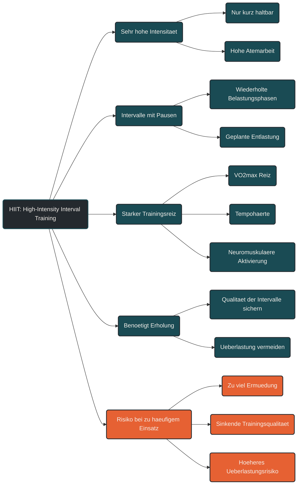

# HIIT (High-Intensity Interval Training)

High-Intensity Interval Training, kurz HIIT, beschreibt Training mit sehr intensiven Belastungsabschnitten und geplanten Erholungsphasen. Die Belastungen sind deutlich härter als lockeres oder moderates Training und können nur für begrenzte Zeit aufrechterhalten werden. [[1]](#quelle-1) [[2]](#quelle-2)

Im Ausdauertraining wird HIIT eingesetzt, um starke Reize für Herz-Kreislauf-System, Sauerstoffaufnahme, Tempohärte, Laktatverarbeitung und neuromuskuläre Leistungsfähigkeit zu setzen. [[1]](#quelle-1) [[4]](#quelle-4) Entscheidend ist dabei nicht, möglichst oft hart zu trainieren, sondern intensive Reize gezielt zu dosieren. [[6]](#quelle-6) [[10]](#quelle-10)

## Was High-Intensity Interval Training bedeutet

HIIT besteht aus wiederholten intensiven Abschnitten, die durch Pausen oder sehr lockere Entlastungsphasen unterbrochen werden. Dadurch kann eine hohe Intensität mehrfach erreicht werden, ohne dass die Belastung dauerhaft gehalten werden muss. [[2]](#quelle-2) [[3]](#quelle-3)

Je nach Trainingsziel können die Intervalle kurz, mittel oder länger sein. Auch die Pausenlänge, Wiederholungszahl und Intensität verändern die Wirkung der Einheit. [[2]](#quelle-2) [[3]](#quelle-3)

## Warum HIIT wichtig sein kann

HIIT kann starke Anpassungen auslösen, weil der Körper in Bereichen arbeitet, die mit lockerem Training kaum erreicht werden. Besonders Herz-Kreislauf-System, Atmung, Muskulatur und Energiestoffwechsel werden intensiv gefordert. [[1]](#quelle-1) [[5]](#quelle-5)

Richtig eingesetzt kann HIIT helfen, die maximale Sauerstoffaufnahme, die Leistungsfähigkeit bei hohen Geschwindigkeiten oder Leistungen und die Fähigkeit zur wiederholten Belastung zu verbessern. [[4]](#quelle-4) [[7]](#quelle-7)

## Physiologische Wirkung von HIIT

HIIT fordert den Körper auf mehreren Ebenen. Die Sauerstoffaufnahme steigt stark an, das Herz-Kreislauf-System arbeitet nahe an hohen Leistungsbereichen und die Muskulatur muss schnelle, kraftvolle und wiederholte Belastungen verarbeiten. [[1]](#quelle-1) [[2]](#quelle-2)

Dabei können Anpassungen an VO₂max, Laktatverarbeitung, neuromuskulärer Aktivierung, Pufferkapazität und Belastungstoleranz entstehen. [[1]](#quelle-1) [[5]](#quelle-5) Gleichzeitig erzeugt HIIT aber auch hohe Ermüdung. [[9]](#quelle-9) [[10]](#quelle-10)

## HIIT braucht Erholung

Der Nutzen von HIIT entsteht nicht während der Belastung allein, sondern durch die Anpassung danach. Deshalb benötigt hochintensives Training ausreichend Regeneration. [[10]](#quelle-10) [[11]](#quelle-11)

Wenn HIIT zu häufig eingesetzt wird, kann die Qualität der Intervalle sinken. Der Körper sammelt Ermüdung, lockere Einheiten werden schwerer und das Risiko für Überlastung steigt. [[9]](#quelle-9) [[11]](#quelle-11) [[12]](#quelle-12)

## Häufiger Fehler: zu oft zu hart

Ein häufiger Fehler ist, HIIT als Abkürzung zu betrachten. Weil intensive Intervalle effektiv wirken können, werden sie oft zu häufig oder zu unspezifisch eingesetzt. [[6]](#quelle-6) [[10]](#quelle-10)

Dann entsteht zwar viel Anstrengung, aber nicht automatisch bessere Leistungsentwicklung. Ohne ausreichende Grundlage, saubere Technik und passende Erholung kann HIIT mehr belasten als aufbauen. [[6]](#quelle-6) [[11]](#quelle-11) [[12]](#quelle-12)

## Praktische Einordnung

HIIT sollte eine klare Aufgabe im Trainingsplan haben. Es kann für VO₂max-Reize, intensive Tempointervalle, wiederholte Belastungen, wettkampfspezifische Intensitäten oder gezielte Leistungsentwicklung genutzt werden. [[2]](#quelle-2) [[3]](#quelle-3)

Die Einheit sollte so geplant sein, dass die Intensität wirklich hoch bleibt und die Ausführung nicht durch zu kurze Pausen, zu viele Wiederholungen oder Restermüdung zerfällt. [[3]](#quelle-3) [[8]](#quelle-8) [[10]](#quelle-10)

## Zusammenfassung

High-Intensity Interval Training ist ein wirksames, aber belastendes Werkzeug im Ausdauertraining. Es setzt starke Reize für hohe Leistungsbereiche, Sauerstoffaufnahme, Tempohärte und neuromuskuläre Aktivierung. [[1]](#quelle-1) [[4]](#quelle-4) [[5]](#quelle-5)

Der Nutzen von HIIT entsteht durch gezielte Dosierung, gute Ausführung und ausreichende Erholung. Wer jede Einheit hart macht, trainiert nicht automatisch besser. HIIT wirkt am besten, wenn es klar von lockeren und moderaten Einheiten getrennt und sinnvoll in den Trainingsplan eingebaut wird. [[6]](#quelle-6) [[7]](#quelle-7) [[10]](#quelle-10)

----

----

## Häufige Fragen zu HIIT (High-Intensity Interval Training)

### Was bedeutet HIIT im Ausdauertraining?

HIIT steht für High-Intensity Interval Training. Gemeint sind wiederholte sehr intensive Belastungsabschnitte, die durch Pausen oder sehr lockere Entlastungsphasen unterbrochen werden. [[2]](#quelle-2)

### In welcher Zone liegt HIIT?

HIIT liegt je nach Zonenmodell meist im oberen Intensitätsbereich, häufig in Zone 4 bis 5. Entscheidend ist nicht nur die Zonenzahl, sondern ob die Belastung wirklich hoch genug ist, um den gewünschten Reiz zu setzen. [[8]](#quelle-8)

### Wofür ist HIIT sinnvoll?

HIIT kann genutzt werden, um VO₂max, hohe Leistungsbereiche, wiederholte Belastungsfähigkeit, Tempohärte und neuromuskuläre Aktivierung zu trainieren. [[1]](#quelle-1) [[4]](#quelle-4)

### Ist HIIT besser als lockeres Training?

Nicht grundsätzlich. HIIT setzt starke Reize, ersetzt aber nicht die aerobe Grundlage. In vielen Ausdauerprogrammen entsteht der Nutzen gerade durch die Kombination aus vielen lockeren Einheiten und wenigen gezielten intensiven Reizen. [[6]](#quelle-6) [[7]](#quelle-7)

### Wie fühlt sich HIIT an?

HIIT fühlt sich sehr anstrengend an. Die Atmung ist stark erhöht, Sprechen ist kaum möglich, und die Belastung kann nur kurz oder intervallartig aufrechterhalten werden. [[2]](#quelle-2) [[8]](#quelle-8)

### Warum braucht HIIT Erholung?

HIIT erzeugt eine hohe innere Belastung. Wenn die Erholung nicht ausreicht, sinkt die Qualität der Intervalle, Restermüdung sammelt sich an und das Risiko für nicht-funktionelles Overreaching oder Überlastung kann steigen. [[9]](#quelle-9) [[10]](#quelle-10) [[11]](#quelle-11)

### Wie oft sollte man HIIT trainieren?

Das hängt von Trainingsstand, Umfang, Ziel, Sportart und Erholungsfähigkeit ab. Für viele Ausdauerathleten sind wenige gezielte HIIT-Einheiten pro Woche ausreichend; der größere Teil des Trainings liegt meist niedriger in der Intensität. [[6]](#quelle-6) [[10]](#quelle-10)

### Was ist der Unterschied zwischen MIT und HIIT?

MIT ist moderat und länger kontrolliert durchhaltbar. HIIT ist deutlich intensiver, wird meist in Intervallen organisiert und benötigt wegen der hohen Belastung mehr Regeneration. [[2]](#quelle-2) [[8]](#quelle-8)

### Was ist ein häufiger Fehler bei HIIT?

Ein häufiger Fehler ist, HIIT zu oft oder ohne klare Zielsetzung einzubauen. Dann entsteht viel Anstrengung, aber nicht automatisch bessere Anpassung. [[6]](#quelle-6) [[11]](#quelle-11)

### Für wen ist HIIT besonders vorsichtig zu dosieren?

Besonders vorsichtig sollte HIIT bei Einsteigern, nach Krankheit oder Verletzung, bei hoher Alltagsbelastung, bei ungewöhnlichen Symptomen oder bei gesundheitlichen Risikofaktoren eingesetzt werden. In solchen Fällen kann medizinische oder sportmedizinische Abklärung sinnvoll sein. [[11]](#quelle-11) [[12]](#quelle-12)

----

## Quellen

### Quelle 1

Laursen, P. B., & Jenkins, D. G. (2002). The Scientific Basis for High-Intensity Interval Training: Optimising Training Programmes and Maximising Performance in Highly Trained Endurance Athletes. Sports Medicine.  
Quelle: [Springer](https://link.springer.com/article/10.2165/00007256-200232010-00003)

### Quelle 2

Buchheit, M., & Laursen, P. B. (2013). High-Intensity Interval Training, Solutions to the Programming Puzzle. Part I: Cardiopulmonary Emphasis. Sports Medicine.  
Quelle: [Springer](https://link.springer.com/article/10.1007/s40279-013-0029-x)

### Quelle 3

Buchheit, M., & Laursen, P. B. (2013). High-Intensity Interval Training, Solutions to the Programming Puzzle. Part II: Anaerobic Energy, Neuromuscular Load and Practical Applications. Sports Medicine.  
Quelle: [Springer](https://link.springer.com/article/10.1007/s40279-013-0066-5)

### Quelle 4

Milanović, Z., Sporiš, G., & Weston, M. (2015). Effectiveness of High-Intensity Interval Training and Continuous Endurance Training for VO₂max Improvements: A Systematic Review and Meta-Analysis of Controlled Trials. Sports Medicine.  
Quelle: [PubMed](https://pubmed.ncbi.nlm.nih.gov/26243014/)

### Quelle 5

MacInnis, M. J., & Gibala, M. J. (2017). Physiological Adaptations to Interval Training and the Role of Exercise Intensity. The Journal of Physiology.  
Quelle: [PubMed](https://pubmed.ncbi.nlm.nih.gov/27748956/)

### Quelle 6

Seiler, S. (2010). What is Best Practice for Training Intensity and Duration Distribution in Endurance Athletes? International Journal of Sports Physiology and Performance.  
Quelle: [Human Kinetics](https://journals.humankinetics.com/abstract/journals/ijspp/5/3/article-p276.xml)

### Quelle 7

Stöggl, T., & Sperlich, B. (2014). Polarized Training Has Greater Impact on Key Endurance Variables than Threshold, High Intensity, or High Volume Training. Frontiers in Physiology.  
Quelle: [Frontiers](https://www.frontiersin.org/journals/physiology/articles/10.3389/fphys.2014.00033/full)

### Quelle 8

Mann, T., Lamberts, R. P., & Lambert, M. I. (2013). Methods of Prescribing Relative Exercise Intensity: Physiological and Practical Considerations. Sports Medicine.  
Quelle: [Springer](https://link.springer.com/article/10.1007/s40279-013-0045-x)

### Quelle 9

Impellizzeri, F. M., Marcora, S. M., & Coutts, A. J. (2019). Internal and External Training Load: 15 Years On. International Journal of Sports Physiology and Performance.  
Quelle: [PubMed](https://pubmed.ncbi.nlm.nih.gov/30614348/)

### Quelle 10

Bourdon, P. C., Cardinale, M., Murray, A., et al. (2017). Monitoring Athlete Training Loads: Consensus Statement. International Journal of Sports Physiology and Performance.  
Quelle: [Human Kinetics](https://journals.humankinetics.com/view/journals/ijspp/12/s2/article-pS2-161.xml)

### Quelle 11

Meeusen, R., Duclos, M., Foster, C., et al. (2013). Prevention, Diagnosis, and Treatment of the Overtraining Syndrome: Joint Consensus Statement of the European College of Sport Science and the American College of Sports Medicine. Medicine & Science in Sports & Exercise.  
Quelle: [PubMed](https://pubmed.ncbi.nlm.nih.gov/23247672/)

### Quelle 12

Soligard, T., Schwellnus, M., Alonso, J.-M., et al. (2016). How Much Is Too Much? Part 1: International Olympic Committee Consensus Statement on Load in Sport and Risk of Injury. British Journal of Sports Medicine.  
Quelle: [BJSM](https://bjsm.bmj.com/content/50/17/1030)

----

*Hinweis: Dieser Artikel dient der allgemeinen Information und ersetzt keine medizinische oder therapeutische Beratung. Mehr dazu im [**Gesundheits- und Quellenhinweis**](/ausdauersport/disclaimer/).*

