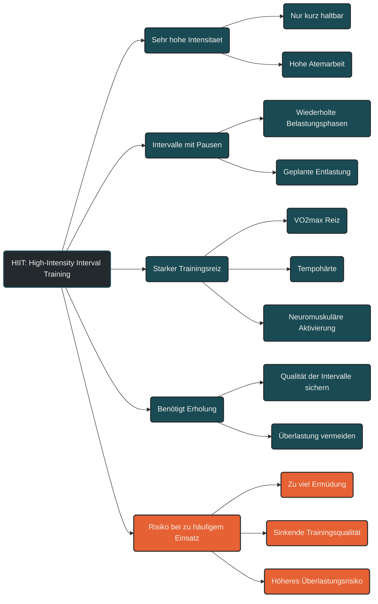

# HIIT (High-Intensity Interval Training)

High-Intensity Interval Training, kurz HIIT, beschreibt Training mit sehr intensiven Belastungsabschnitten und geplanten Erholungsphasen. Die Belastungen sind deutlich härter als lockeres oder moderates Training und können nur für begrenzte Zeit aufrechterhalten werden.

Im Ausdauertraining wird HIIT eingesetzt, um starke Reize für Herz-Kreislauf-System, Sauerstoffaufnahme, Tempohärte, Laktatverarbeitung und neuromuskuläre Leistungsfähigkeit zu setzen. Entscheidend ist dabei nicht, möglichst oft hart zu trainieren, sondern intensive Reize gezielt zu dosieren.

## Was High-Intensity Interval Training bedeutet

HIIT besteht aus wiederholten intensiven Abschnitten, die durch Pausen oder sehr lockere Entlastungsphasen unterbrochen werden. Dadurch kann eine hohe Intensität mehrfach erreicht werden, ohne dass die Belastung dauerhaft gehalten werden muss.

Je nach Trainingsziel können die Intervalle kurz, mittel oder länger sein. Auch die Pausenlänge, Wiederholungszahl und Intensität verändern die Wirkung der Einheit.

## Warum HIIT wichtig sein kann

HIIT kann starke Anpassungen auslösen, weil der Körper in Bereichen arbeitet, die mit lockerem Training kaum erreicht werden. Besonders Herz-Kreislauf-System, Atmung, Muskulatur und Energiestoffwechsel werden intensiv gefordert.

Richtig eingesetzt kann HIIT helfen, die maximale Sauerstoffaufnahme, die Leistungsfähigkeit bei hohen Geschwindigkeiten oder Leistungen und die Fähigkeit zur wiederholten Belastung zu verbessern.

## Physiologische Wirkung von HIIT

HIIT fordert den Körper auf mehreren Ebenen. Die Sauerstoffaufnahme steigt stark an, das Herz-Kreislauf-System arbeitet nahe an hohen Leistungsbereichen und die Muskulatur muss schnelle, kraftvolle und wiederholte Belastungen verarbeiten.

Dabei können Anpassungen an VO₂max, Laktatverarbeitung, neuromuskulärer Aktivierung, Pufferkapazität und Belastungstoleranz entstehen. Gleichzeitig erzeugt HIIT aber auch hohe Ermüdung.

## HIIT braucht Erholung

Der Nutzen von HIIT entsteht nicht während der Belastung allein, sondern durch die Anpassung danach. Deshalb benötigt hochintensives Training ausreichend Regeneration.

Wenn HIIT zu häufig eingesetzt wird, kann die Qualität der Intervalle sinken. Der Körper sammelt Ermüdung, lockere Einheiten werden schwerer und das Risiko für Überlastung steigt.

## Häufiger Fehler: zu oft zu hart

Ein häufiger Fehler ist, HIIT als Abkürzung zu betrachten. Weil intensive Intervalle effektiv wirken können, werden sie oft zu häufig oder zu unspezifisch eingesetzt.

Dann entsteht zwar viel Anstrengung, aber nicht automatisch bessere Leistungsentwicklung. Ohne ausreichende Grundlage, saubere Technik und passende Erholung kann HIIT mehr belasten als aufbauen.

## Praktische Einordnung

HIIT sollte eine klare Aufgabe im Trainingsplan haben. Es kann für VO₂max-Reize, intensive Tempointervalle, wiederholte Belastungen, wettkampfspezifische Intensitäten oder gezielte Leistungsentwicklung genutzt werden.

Die Einheit sollte so geplant sein, dass die Intensität wirklich hoch bleibt und die Ausführung nicht durch zu kurze Pausen, zu viele Wiederholungen oder Restermüdung zerfällt.

## Zusammenfassung

High-Intensity Interval Training ist ein wirksames, aber belastendes Werkzeug im Ausdauertraining. Es setzt starke Reize für hohe Leistungsbereiche, Sauerstoffaufnahme, Tempohärte und neuromuskuläre Aktivierung.

Der Nutzen von HIIT entsteht durch gezielte Dosierung, gute Ausführung und ausreichende Erholung. Wer jede Einheit hart macht, trainiert nicht automatisch besser. HIIT wirkt am besten, wenn es klar von lockeren und moderaten Einheiten getrennt und sinnvoll in den Trainingsplan eingebaut wird.

----

----

## Häufige Fragen zur progressiven Überlastung

### Was ist progressive Überlastung einfach erklärt?

Progressive Überlastung bedeutet, dass Training im Laufe der Zeit schrittweise anspruchsvoller wird. Der Körper bekommt dadurch immer wieder einen neuen, aber verarbeitbaren Anlass zur Anpassung.

### Bedeutet progressive Überlastung, dass ich jede Woche mehr machen muss?

Nein. Progression muss nicht jede Woche stattfinden. Manchmal ist es sinnvoller, eine Belastung mehrere Wochen zu stabilisieren oder bewusst zu reduzieren, bevor der nächste Schritt folgt.

### Welche Trainingsfaktoren kann ich progressiv steigern?

Typische Stellschrauben sind Umfang, Intensität, Dauer, Häufigkeit, Pausengestaltung, Höhenmeter, Gelände, Kraftanteil, Technikanspruch und mechanische Belastung.

### Sollte ich zuerst Umfang oder Intensität steigern?

Für viele Ausdauerathleten ist es sinnvoll, zuerst Regelmäßigkeit und lockeren Umfang aufzubauen. Intensität sollte gezielter eingesetzt werden, weil sie deutlich mehr Ermüdung erzeugt.

### Warum ist zu schnelle Progression gefährlich?

Zu schnelle Steigerung kann die Regenerationsfähigkeit überfordern. Besonders Sehnen, Bänder, Knochen und Knorpel passen sich langsamer an als Muskulatur und Herz-Kreislauf-System. Dadurch können Überlastungsbeschwerden entstehen.

### Ist die 10-Prozent-Regel Pflicht?

Nein. Sie kann eine grobe Orientierung sein, ist aber kein Naturgesetz. Entscheidend sind Trainingsstand, Verletzungshistorie, Schlaf, Stress, Untergrund, Intensität und die bisherige Belastung.

### Gilt progressive Überlastung auch für lockere Läufe?

Ja. Auch lockere Läufe können progressiv aufgebaut werden, zum Beispiel durch etwas längere Dauer, höhere Wochenkonstanz oder mehr aerobe Gesamtzeit. Sie müssen dafür nicht hart werden.

### Gilt progressive Überlastung auch für Krafttraining?

Ja. Im Krafttraining kann Progression durch mehr Gewicht, mehr Wiederholungen, mehr Sätze, größere Bewegungsamplitude, langsamere exzentrische Phasen oder bessere Bewegungskontrolle entstehen.

### Woran erkenne ich, dass die Progression funktioniert?

Ein gutes Zeichen ist, wenn du mehr Belastung tolerierst, ohne dass lockere Einheiten schwerer werden oder Beschwerden zunehmen. Auch stabilere Leistung, bessere Erholung und kontrollierbare Ermüdung sprechen für eine passende Progression.

### Woran erkenne ich, dass ich zu schnell gesteigert habe?

Warnsignale sind anhaltende Müdigkeit, schlechter Schlaf, sinkende Leistung, ungewöhnlich hoher Ruhepuls, auffällig niedrige HRV, Schmerzen an Sehnen oder Gelenken und eine dauerhaft hohe Anstrengung bei eigentlich lockeren Einheiten.

### Was ist der Unterschied zwischen progressiver Überlastung und Übertraining?

Progressive Überlastung ist eine geplante, verarbeitbare Steigerung. Übertraining oder nicht-funktionelles Overreaching entsteht, wenn Belastung dauerhaft größer ist als die Erholungsfähigkeit.

### Was sollte ich nach Krankheit oder Verletzung beachten?

Nach Krankheit oder Verletzung sollte die Progression deutlich vorsichtiger sein. Der Wiedereinstieg beginnt mit reduzierter Belastung, stabiler Beschwerdefreiheit und kleinen Steigerungen, bevor Intensität oder Umfang wieder erhöht werden.

----

*Hinweis: Dieser Artikel dient der allgemeinen Information und ersetzt keine medizinische oder therapeutische Beratung. Mehr dazu im [**Gesundheits- und Quellenhinweis**](/ausdauersport/disclaimer/).*

