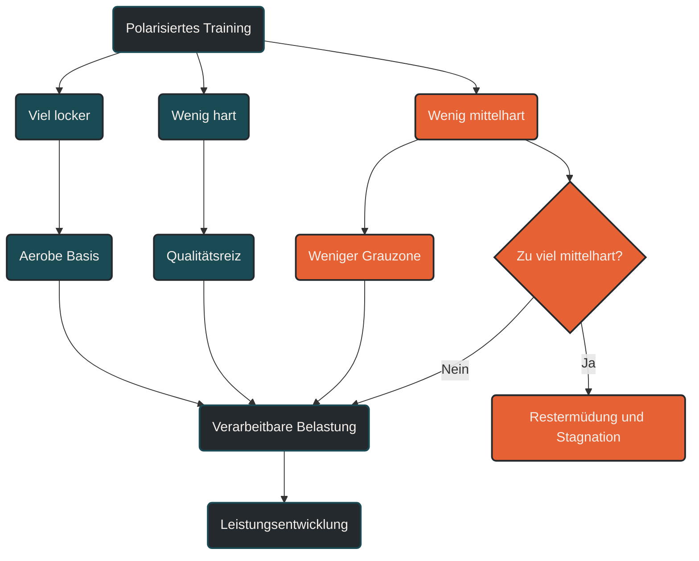

# Polarisiertes Training

Polarisiertes Training ist eine Belastungsverteilung, bei der der größte Teil des Trainings sehr locker und ein kleiner Teil sehr intensiv durchgeführt wird. Der mittlere Intensitätsbereich wird bewusst begrenzt. Ziel ist es, viele gut verarbeitbare Ausdauerreize mit wenigen gezielten Hochintensitätsreizen zu kombinieren, ohne dauerhaft in einer ermüdenden Grauzone zu trainieren.

## Was polarisiertes Training bedeutet

Polarisiertes Training beschreibt nicht eine einzelne Trainingsmethode, sondern eine Verteilung der Trainingsintensitäten. Der Grundgedanke ist einfach: Die meisten Einheiten werden locker genug absolviert, um aerobe Anpassungen aufzubauen und Erholung zu ermöglichen. Ein kleinerer Anteil wird sehr intensiv trainiert, um starke Reize für Sauerstoffaufnahme, Herz-Kreislauf-System, neuromuskuläre Aktivierung und Leistungsfähigkeit zu setzen.

Der mittlere Bereich wird nicht vollständig verboten, aber deutlich begrenzt. Genau dort entsteht häufig das Problem vieler Ausdauerathleten: Lockere Einheiten werden zu schnell, harte Einheiten verlieren Qualität, und der Körper bleibt dauerhaft mittelstark belastet.

Polarisiertes Training versucht, diese Vermischung zu vermeiden.

## Die Grundidee der Verteilung

Häufig wird polarisiertes Training vereinfacht als 80/20-Modell beschrieben. Das bedeutet: ungefähr 80 Prozent der Einheiten oder Trainingszeit liegen im niedrigen Intensitätsbereich, etwa 20 Prozent im hohen Intensitätsbereich.

Diese Zahlen sind keine starre Regel. Entscheidend ist das Prinzip:

- viel niedrigintensives Training
- wenig, aber gezielt hochintensives Training
- begrenzter Anteil im mittleren Bereich

Je nach Sportart, Trainingsstand, Saisonphase und Ziel kann die konkrete Verteilung variieren.

## Niedrige Intensität

Der niedrige Intensitätsbereich umfasst lockere, gut kontrollierbare Belastungen. Im Laufen sind das meist ruhige Dauerläufe, regenerative Einheiten oder längere Grundlagenbelastungen. Die Atmung bleibt kontrolliert, Gespräche sind möglich, und die Einheit erzeugt keine starke Restermüdung.

Diese Einheiten bilden die Basis. Sie verbessern aerobe Kapazität, Kapillarisierung, mitochondriale Anpassung, Fettstoffwechsel, Bewegungsroutine und Belastungsverträglichkeit. Gleichzeitig sind sie wichtig, weil sie häufig wiederholt werden können.

## Hohe Intensität

Der hohe Intensitätsbereich umfasst harte, klar gesetzte Reize. Dazu gehören Intervalle oberhalb der Schwelle, VO2max-nahe Belastungen, kurze intensive Wiederholungen, Bergintervalle oder wettkampfspezifische intensive Abschnitte.

Diese Einheiten sind wirksam, aber ermüdend. Deshalb brauchen sie Abstand, Vorbereitung und Erholung. Im polarisierten Training sollen harte Einheiten wirklich qualitativ hochwertig sein, statt durch zu viel mittelharte Vorbelastung verwässert zu werden.

## Mittlere Intensität

Der mittlere Intensitätsbereich liegt zwischen locker und sehr hart. Er fühlt sich oft produktiv an, ist aber nicht automatisch optimal. Viele Athleten trainieren hier zu häufig, weil diese Intensität mental angenehm wirkt: nicht locker genug für echte Erholung, aber auch nicht hart genug für einen klaren Hochintensitätsreiz.

Das Problem ist nicht, dass mittlere Intensität wertlos wäre. Schwellentraining, Tempodauerläufe oder Marathonpace können sehr sinnvoll sein. Im polarisierten Modell wird dieser Bereich aber bewusst sparsam eingesetzt, damit die Gesamtbelastung steuerbar bleibt.

## Warum polarisiertes Training funktionieren kann

Polarisiertes Training nutzt zwei unterschiedliche Anpassungswege.

Die lockeren Einheiten liefern viel Trainingsvolumen mit vergleichsweise geringer Ermüdung. Dadurch kann der Körper regelmäßig aerobe Reize verarbeiten.

Die intensiven Einheiten setzen starke Signale für maximale Sauerstoffaufnahme, Herz-Kreislauf-Leistung, neuromuskuläre Rekrutierung und hohe metabolische Belastung.

Der zentrale Vorteil liegt in der Trennung: Locker bleibt locker, hart bleibt hart. Dadurch wird die Qualität der Schlüsselsessions geschützt, während gleichzeitig ausreichend Umfang aufgebaut werden kann.

## Unterschied zu pyramidalem Training

Polarisiertes Training und pyramidal aufgebautes Training werden oft verwechselt.

Beim polarisierten Training liegt der Schwerpunkt auf sehr vielen niedrigen Intensitäten und wenigen hohen Intensitäten. Der mittlere Bereich bleibt vergleichsweise klein.

Beim pyramidalen Training liegt ebenfalls der größte Anteil im niedrigen Bereich, aber der mittlere Bereich ist größer als der hohe Bereich. Die Verteilung nimmt also von niedrig zu mittel zu hoch stufenweise ab.

Vereinfacht:

Polarisiert bedeutet: viel locker, wenig mittel, etwas hart.

Pyramidal bedeutet: viel locker, etwas mittel, wenig hart.

Beide Modelle können funktionieren. Welches besser passt, hängt von Ziel, Trainingsstand, Sportart, Saisonphase und individueller Verträglichkeit ab.

## Bedeutung für Läufer

Für Läufer ist polarisiertes Training besonders interessant, weil harte Laufreize orthopädisch belastend sind. Wer zu oft mittelhart läuft, sammelt viel Ermüdung, ohne zwingend bessere Qualität zu erzeugen.

Ein polarisiertes Modell kann helfen, lockere Läufe wirklich locker zu halten und intensive Einheiten gezielt zu platzieren. Dadurch bleibt die Belastung klarer steuerbar.

Typische Beispiele sind:

- mehrere lockere Dauerläufe pro Woche
- ein längerer ruhiger Lauf
- ein bis zwei intensive Qualitätseinheiten
- wenig ungeplantes Training in der Grauzone

Bei verletzungsanfälligen Läufern kann ein Teil der lockeren Belastung auch über Radfahren oder Schwimmen ergänzt werden, wenn dadurch die aerobe Arbeit erhalten bleibt und die Stoßbelastung reduziert wird.

## Häufiger Fehler: zu hart an lockeren Tagen

Der häufigste Fehler ist nicht, dass die harten Einheiten zu leicht sind. Der häufigste Fehler ist, dass die lockeren Einheiten zu schnell gelaufen werden.

Dadurch verschiebt sich die Belastungsverteilung unbemerkt in Richtung mittlere Intensität. Das Training fühlt sich fleißig an, aber die Erholung wird schlechter. Die Folge: harte Einheiten verlieren Qualität, Ermüdung steigt, und langfristig kann die Leistungsentwicklung stagnieren.

Polarisiertes Training verlangt deshalb Disziplin nach unten. Locker bedeutet wirklich locker.

## Für wen polarisiertes Training sinnvoll sein kann

Polarisiertes Training kann besonders sinnvoll sein für Athleten, die bereits regelmäßig trainieren und ihre Belastung besser steuern möchten. Es eignet sich auch für Sportler, die häufig zu schnell in lockeren Einheiten laufen oder bei denen harte Einheiten durch dauerhafte Restermüdung an Qualität verlieren.

Für Einsteiger ist das Modell nur eingeschränkt übertragbar. Dort steht zunächst Regelmäßigkeit, Belastungsverträglichkeit und saubere Intensitätskontrolle im Vordergrund. Hochintensive Einheiten sollten erst vorsichtig aufgebaut werden.

## Praktische Einordnung

Polarisiertes Training ist kein Dogma. Es ist ein Steuerungsmodell. Es hilft, die Trainingswoche klarer zu strukturieren und die häufige Vermischung von locker, mittelhart und hart zu vermeiden.

Der wichtigste Merksatz lautet: Polarisiertes Training macht die leichten Einheiten leichter und die harten Einheiten gezielter. Der Fortschritt entsteht nicht durch dauerhaftes Mittelhart, sondern durch das Zusammenspiel aus viel verarbeitbarer Basisarbeit und wenigen klaren Spitzenreizen.

----

----

## Häufige Fragen zu polarisiertem Training

### Was ist polarisiertes Training einfach erklärt?

Polarisiertes Training bedeutet, dass der größte Teil des Trainings locker und ein kleiner Teil sehr intensiv ist. Der mittlere Intensitätsbereich wird bewusst begrenzt, damit Erholung und Qualität der harten Einheiten erhalten bleiben.

### Bedeutet polarisiertes Training immer 80/20?

Nein. 80/20 ist eine vereinfachte Orientierung, aber keine starre Regel. Wichtig ist die Grundlogik: viel niedrige Intensität, wenig hohe Intensität und ein begrenzter Anteil mittlerer Belastung.

### Was zählt als niedrige Intensität?

Niedrige Intensität ist eine Belastung, die gut kontrollierbar bleibt. Die Atmung ist ruhig, Gespräche sind möglich, und die Einheit erzeugt keine starke Restermüdung. Im Lauftraining entspricht das meist lockeren Dauerläufen oder regenerativen Einheiten.

### Was zählt als hohe Intensität?

Hohe Intensität umfasst harte Reize wie Intervalle oberhalb der Schwelle, VO2max-nahe Belastungen, Bergintervalle oder kurze intensive Wiederholungen. Diese Einheiten sind wirksam, aber ermüdend und brauchen ausreichende Erholung.

### Ist mittlere Intensität schlecht?

Nein. Mittlere Intensität ist nicht grundsätzlich schlecht. Schwellentraining, Tempodauerläufe oder Marathonpace können sehr sinnvoll sein. Im polarisierten Training wird dieser Bereich nur bewusst begrenzt, damit nicht jede Einheit mittelhart wird.

### Was ist die Grauzone?

Die Grauzone ist der Bereich, in dem Training zu hart für echte Erholung, aber oft nicht hart genug für einen klaren Spitzenreiz ist. Viele Ausdauerathleten trainieren dort zu häufig, weil sich diese Intensität produktiv anfühlt.

### Was ist der Unterschied zwischen polarisiertem und pyramidalem Training?

Beim polarisierten Training gibt es viel niedrige Intensität, wenig mittlere Intensität und einen kleinen Anteil hoher Intensität. Beim pyramidalen Training gibt es ebenfalls viel niedrige Intensität, aber mehr mittlere als hohe Intensität.

### Für wen ist polarisiertes Training geeignet?

Es eignet sich besonders für Athleten, die regelmäßig trainieren, ihre Intensitäten besser trennen möchten oder häufig zu schnell in lockeren Einheiten unterwegs sind. Für Einsteiger sollte Hochintensität vorsichtig und schrittweise aufgebaut werden.

### Wie viele harte Einheiten pro Woche passen dazu?

Das hängt von Trainingsstand, Umfang, Ziel und Erholung ab. Für viele Ausdauerathleten reichen ein bis zwei harte Einheiten pro Woche. Entscheidend ist, dass sie qualitativ gut ausgeführt und ausreichend verarbeitet werden.

### Kann polarisiertes Training auch im Marathontraining funktionieren?

Ja, aber mit Einschränkungen. Marathontraining braucht oft auch spezifische Abschnitte im Marathon- oder Schwellenbereich. Deshalb ist Marathontraining häufig nicht rein polarisiert, sondern kombiniert polarisierte Elemente mit spezifischen Tempoeinheiten.

### Warum laufen viele ihre lockeren Einheiten zu schnell?

Weil mittlere Intensität sich oft nach Arbeit anfühlt, ohne sofort zu überfordern. Langfristig kann das aber die Erholung verschlechtern und die Qualität harter Einheiten reduzieren.

### Wie erkenne ich, ob ich zu viel mittelhart trainiere?

Typische Hinweise sind dauerhaft schwere Beine, stagnierende Leistung, fehlende Qualität in Intervallen, erhöhter Ruhepuls, schlechter Schlaf oder das Gefühl, dass lockere Einheiten nie wirklich locker sind.

### Muss ich beim polarisierten Training Herzfrequenzzonen nutzen?

Herzfrequenzzonen können helfen, sind aber nicht zwingend. Auch Atemverhalten, subjektives Belastungsempfinden, Pace, Watt oder Laktat können zur Steuerung genutzt werden. Wichtig ist, dass niedrige und hohe Intensitäten klar getrennt bleiben.

### Ist polarisiertes Training besser als jedes andere Modell?

Nein. Es ist ein sinnvolles Modell, aber nicht automatisch für jeden Athleten, jede Sportart und jede Saisonphase optimal. Pyramidal Training, Schwellentraining oder blockweise Periodisierung können je nach Ziel ebenfalls passend sein.

----

*Hinweis: Dieser Artikel dient der allgemeinen Information und ersetzt keine medizinische oder therapeutische Beratung. Mehr dazu im [**Gesundheits- und Quellenhinweis**](/ausdauersport/disclaimer/).*

