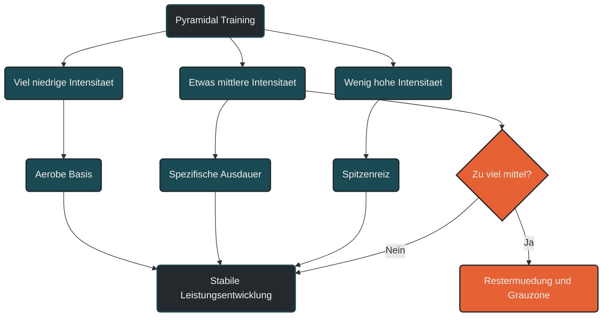

# Pyramidal Training

Pyramidal Training ist eine Belastungsverteilung, bei der der größte Teil des Trainings in niedriger Intensität stattfindet, ein kleinerer Anteil im mittleren Intensitätsbereich und der kleinste Anteil in hoher Intensität. Im Gegensatz zum polarisierten Training wird der mittlere Bereich nicht stark vermieden, sondern gezielt und kontrolliert genutzt. [[1]](#quelle-1) [[5]](#quelle-5)

## Was Pyramidal Training bedeutet

Pyramidal Training beschreibt eine Trainingsverteilung, die wie eine Pyramide aufgebaut ist. Die breite Basis besteht aus vielen lockeren Einheiten. Darüber liegt ein kleinerer Anteil moderater bis zügiger Belastungen. Die Spitze bilden wenige hochintensive Reize. [[1]](#quelle-1)

Das Grundprinzip lautet:

Viel locker, etwas mittel, wenig hart.

Damit unterscheidet sich Pyramidal Training vom polarisierten Training. Beide Modelle setzen auf viel niedrige Intensität, aber beim pyramidalen Training spielt der mittlere Intensitätsbereich eine größere Rolle. [[1]](#quelle-1) [[5]](#quelle-5)

## Die Intensitätsverteilung

Beim pyramidalen Training nimmt der Umfang mit steigender Intensität ab. Je intensiver ein Reiz ist, desto seltener wird er eingesetzt. [[1]](#quelle-1)

Typisch ist diese Logik:

- niedrige Intensität als größte Trainingsbasis
- mittlere Intensität als gezielte Entwicklungszone
- hohe Intensität als kleiner, dosierter Spitzenreiz

Die genaue Verteilung hängt von Trainingsstand, Ziel, Sportart, Saisonphase und individueller Belastbarkeit ab. Pyramidal Training ist deshalb kein starres Zahlenmodell, sondern ein Steuerungsprinzip. [[5]](#quelle-5) [[7]](#quelle-7) [[8]](#quelle-8)

## Niedrige Intensität als Basis

Der größte Teil des Trainings findet locker statt. Diese Einheiten verbessern aerobe Grundlagen, Stoffwechselökonomie, Kapillarisierung, mitochondriale Anpassung und Belastungsverträglichkeit. [[1]](#quelle-1) [[2]](#quelle-2)

Im Lauftraining sind das ruhige Dauerläufe, regenerative Einheiten und längere Grundlagenläufe. Die Belastung bleibt kontrollierbar, die Atmung ruhig, und die Einheit sollte keine starke Restermüdung erzeugen. [[9]](#quelle-9)

Diese Basis ist entscheidend, weil sie häufig wiederholt werden kann. Ohne ausreichend niedrige Intensität wird die Gesamtbelastung schnell zu hoch. [[2]](#quelle-2) [[7]](#quelle-7)

## Mittlere Intensität als Entwicklungsbereich

Der mittlere Intensitätsbereich ist beim pyramidalen Training kein Fehler, sondern ein gezielt genutzter Bestandteil. Dazu gehören zum Beispiel zügige Dauerläufe, Schwellenläufe, längere Tempoblöcke, Marathonpace-Abschnitte oder kontrollierte Belastungen knapp unterhalb oder im Bereich der Schwelle. [[1]](#quelle-1) [[6]](#quelle-6)

Diese Einheiten sind spezifischer und belastender als lockere Dauerläufe, aber meist besser kontrollierbar als sehr harte Intervalle. Sie verbessern die Fähigkeit, über längere Zeit eine hohe, aber stabile Intensität zu halten. [[4]](#quelle-4) [[9]](#quelle-9)

Gerade für Halbmarathon, Marathon und längere Ausdauerbelastungen kann dieser Bereich sehr wichtig sein. Eine große Analyse von Marathon-Trainingsdaten fand bei Marathonläufern überwiegend pyramidal geprägte Intensitätsverteilungen, besonders bei schnelleren Läufern mit hohem Anteil niedriger Intensität. [[6]](#quelle-6)

## Hohe Intensität als Spitze

Hohe Intensität wird im pyramidalen Training sparsam eingesetzt. Dazu gehören kurze harte Intervalle, VO2max-nahe Belastungen, Bergintervalle oder schnelle Wiederholungen. [[10]](#quelle-10)

Diese Reize sind wirksam, aber ermüdend. Sie können Sauerstoffaufnahme, neuromuskuläre Aktivierung, Laufökonomie bei höherem Tempo und metabolische Toleranz verbessern. Weil sie stark belasten, bilden sie nur die Spitze der Pyramide. [[10]](#quelle-10) [[7]](#quelle-7)

## Unterschied zu polarisiertem Training

Polarisiertes Training trennt die Intensitäten stärker. Es setzt auf sehr viel niedrige Intensität, wenige sehr intensive Reize und möglichst wenig Training im mittleren Bereich. [[1]](#quelle-1) [[3]](#quelle-3)

Pyramidal Training nutzt ebenfalls viel niedrige Intensität, lässt aber mehr Raum für mittlere Intensität. Dadurch entsteht eine stufenförmige Verteilung: viel locker, weniger mittel, noch weniger hart. [[1]](#quelle-1) [[5]](#quelle-5)

Vereinfacht:

Polarisiert bedeutet: viel locker, wenig mittel, etwas hart.

Pyramidal bedeutet: viel locker, etwas mittel, wenig hart.

Beide Modelle können sinnvoll sein. Entscheidend ist, welches Modell zum Ziel, zur Belastbarkeit und zur Trainingsphase passt. Neuere Vergleichsarbeiten zeigen, dass die Wirkung von Trainingsintensitätsverteilungen nicht losgelöst von Leistungsniveau, Ausgangslage und Studiendesign bewertet werden sollte. [[5]](#quelle-5)

## Warum Pyramidal Training funktionieren kann

Pyramidal Training funktioniert, weil es Belastung schrittweise staffelt. Die lockere Basis ermöglicht Umfang und Wiederholbarkeit. Der mittlere Bereich entwickelt spezifische Ausdauerleistung. Die hohe Intensität setzt gelegentlich starke Spitzenreize. [[1]](#quelle-1) [[6]](#quelle-6)

Dadurch entsteht eine Trainingsstruktur, die für viele Ausdauerathleten gut kontrollierbar ist. Sie vermeidet einerseits dauerhaft hartes Training, nutzt andererseits aber den mittleren Bereich gezielt, statt ihn grundsätzlich zu meiden. [[5]](#quelle-5) [[7]](#quelle-7)

Besonders bei längeren Wettkampfdistanzen kann diese Verteilung sinnvoll sein, weil dort nicht nur maximale Intensität zählt, sondern die Fähigkeit, lange in einem kontrollierten, zügigen Bereich zu arbeiten. [[6]](#quelle-6)

## Bedeutung für Läufer

Für Läufer ist Pyramidal Training besonders interessant, wenn das Ziel längere Distanzen sind. Halbmarathon, Marathon und Ultrabelastungen erfordern nicht nur lockere Grundlagenausdauer und gelegentliche Spitzenreize, sondern auch die Fähigkeit, mittlere bis hohe Belastungen lange stabil zu halten. [[6]](#quelle-6)

Typische Beispiele sind:

- viele lockere Dauerläufe
- ein langer Lauf
- ein kontrollierter Tempodauerlauf
- gelegentliche Intervalle oder Bergreize
- gezielte Entlastung nach intensiveren Phasen

Wichtig ist, dass der mittlere Bereich nicht unkontrolliert wächst. Wenn fast jede Einheit zügig wird, entsteht kein pyramidales Training mehr, sondern dauerhafte Grauzonenbelastung. [[1]](#quelle-1) [[7]](#quelle-7)

## Häufiger Fehler: Die Pyramide kippt

Der größte Fehler beim pyramidalen Training ist, dass die Basis zu klein wird. Wenn lockere Einheiten zu schnell gelaufen werden und mittlere Intensität zu häufig vorkommt, verschiebt sich die gesamte Trainingsverteilung nach oben. [[1]](#quelle-1) [[8]](#quelle-8)

Dann entsteht eine Belastungsstruktur, die dauerhaft ermüdet. Die Athleten trainieren oft fleißig, aber nicht mehr sauber gesteuert. Lockere Einheiten sind nicht locker genug, harte Einheiten verlieren Qualität, und die Erholung wird schlechter. [[7]](#quelle-7) [[8]](#quelle-8)

Pyramidal Training funktioniert nur, wenn die niedrige Intensität wirklich die Basis bleibt. [[2]](#quelle-2)

## Für wen Pyramidal Training sinnvoll sein kann

Pyramidal Training kann besonders sinnvoll sein für Ausdauerathleten, die längere Wettkampfdistanzen vorbereiten oder gut auf kontrollierte Tempoarbeit reagieren. Es passt häufig gut zu Marathontraining, Halbmarathontraining, längeren Radeinheiten oder allgemein zu Phasen, in denen spezifische Ausdauerleistung aufgebaut werden soll. [[5]](#quelle-5) [[6]](#quelle-6)

Für Einsteiger sollte auch dieses Modell vorsichtig umgesetzt werden. Zuerst stehen Regelmäßigkeit, lockere Belastbarkeit und saubere Intensitätskontrolle im Vordergrund. Mittlere und hohe Intensitäten sollten erst schrittweise ergänzt werden. [[7]](#quelle-7) [[9]](#quelle-9)

## Praktische Einordnung

Pyramidal Training ist kein Kompromiss aus beliebigem Training. Es ist eine klare Belastungsverteilung mit breiter lockerer Basis, kontrollierter mittlerer Entwicklungszone und wenigen intensiven Spitzenreizen. [[1]](#quelle-1)

Der wichtigste Merksatz lautet: Pyramidal Training baut Leistung von unten nach oben auf. Erst kommt die lockere Basis, dann gezielte mittlere Belastung, und erst zuletzt die hochintensive Spitze.

----

----

## Häufige Fragen zu Pyramidal Training

### Was ist Pyramidal Training einfach erklärt?

Pyramidal Training ist eine Trainingsverteilung mit viel niedriger Intensität, etwas mittlerer Intensität und wenig hoher Intensität. Die Trainingsmenge nimmt mit steigender Intensität ab. [[1]](#quelle-1)

### Warum heißt es pyramidal?

Weil die Verteilung wie eine Pyramide aufgebaut ist. Unten steht die breite Basis aus lockeren Einheiten. Darüber liegt ein kleinerer mittlerer Bereich. Die Spitze bilden wenige harte Einheiten. [[1]](#quelle-1)

### Was ist der Unterschied zwischen Pyramidal Training und polarisiertem Training?

Beim polarisierten Training wird der mittlere Intensitätsbereich stark begrenzt. Beim pyramidalen Training wird er gezielt genutzt, bleibt aber kleiner als der niedrige Intensitätsbereich und größer als der hochintensive Anteil. [[1]](#quelle-1) [[5]](#quelle-5)

### Ist mittlere Intensität beim pyramidalen Training erwünscht?

Ja. Mittlere Intensität ist ein wichtiger Bestandteil, solange sie kontrolliert eingesetzt wird. Sie kann Schwellenleistung, Tempohärte, Marathonpace und spezifische Ausdauer verbessern. [[4]](#quelle-4) [[6]](#quelle-6)

### Was zählt als niedrige Intensität?

Niedrige Intensität umfasst lockere, gut kontrollierbare Belastungen. Die Atmung bleibt ruhig, Gespräche sind möglich, und die Einheit erzeugt keine starke Restermüdung. [[9]](#quelle-9)

### Was zählt als mittlere Intensität?

Mittlere Intensität liegt zwischen locker und sehr hart. Dazu gehören zügige Dauerläufe, Schwellenläufe, längere Tempoblöcke oder kontrollierte Abschnitte im Marathon- oder Halbmarathontempo. [[9]](#quelle-9)

### Was zählt als hohe Intensität?

Hohe Intensität umfasst harte Intervalle, VO2max-nahe Belastungen, Bergintervalle oder schnelle Wiederholungen. Diese Reize sind stark wirksam, aber auch deutlich ermüdender. [[10]](#quelle-10)

### Für wen ist Pyramidal Training geeignet?

Pyramidal Training eignet sich besonders für Ausdauerathleten, die längere Distanzen vorbereiten oder von kontrollierter Tempoarbeit profitieren. Es kann gut zu Halbmarathon, Marathon, Radsport und längeren Ausdauerzielen passen. [[6]](#quelle-6)

### Ist Pyramidal Training besser als polarisiertes Training?

Nicht grundsätzlich. Beide Modelle können funktionieren. Pyramidal Training passt oft gut zu längeren Distanzen und spezifischer Tempoarbeit. Polarisiertes Training kann sinnvoll sein, wenn Intensitäten stärker getrennt werden sollen. [[5]](#quelle-5)

### Kann Pyramidal Training im Marathontraining sinnvoll sein?

Ja. Marathontraining enthält häufig viele lockere Kilometer, aber auch gezielte Abschnitte im Marathon- oder Schwellenbereich. Deshalb ist Marathontraining oft eher pyramidal als rein polarisiert. [[6]](#quelle-6)

### Was ist der häufigste Fehler beim pyramidalen Training?

Der häufigste Fehler ist, dass zu viele Einheiten in den mittleren Bereich rutschen. Dann wird die lockere Basis zu klein, die Ermüdung steigt, und harte Einheiten verlieren Qualität. [[7]](#quelle-7) [[8]](#quelle-8)

### Wie erkenne ich, ob ich zu viel mittlere Intensität trainiere?

Typische Hinweise sind schwere Beine, stagnierende Leistung, schlechter Schlaf, erhöhter Ruhepuls, niedrige HRV, fehlende Qualität in harten Einheiten oder das Gefühl, dass lockere Einheiten nicht mehr wirklich locker sind. Entscheidend ist nicht ein einzelnes Signal, sondern der Verlauf über mehrere Tage und Wochen. [[7]](#quelle-7) [[8]](#quelle-8)

### Brauche ich Herzfrequenzzonen für Pyramidal Training?

Herzfrequenzzonen können helfen, sind aber nicht zwingend. Auch Atemverhalten, Pace, Watt, Laktat oder subjektives Belastungsempfinden können genutzt werden. Wichtig ist, dass die Intensitätsbereiche klar unterschieden werden. [[8]](#quelle-8) [[9]](#quelle-9)

### Ist Pyramidal Training für Einsteiger geeignet?

Grundsätzlich ja, aber nur vereinfacht. Einsteiger sollten zuerst eine lockere Basis und regelmäßige Belastbarkeit aufbauen. Mittlere und hohe Intensitäten sollten vorsichtig und schrittweise ergänzt werden. [[7]](#quelle-7)

### Wie viele harte Einheiten passen in ein pyramidales Modell?

Das hängt von Trainingsstand, Ziel und Erholung ab. Für viele Athleten reichen wenige harte Reize pro Woche. Der Schwerpunkt bleibt auf niedriger und moderat eingesetzter mittlerer Intensität. [[7]](#quelle-7) [[10]](#quelle-10)

----

## Quellen

### Quelle 1

Thomas L. Stöggl, Billy Sperlich: [The training intensity distribution among well-trained and elite endurance athletes](https://www.frontiersin.org/journals/physiology/articles/10.3389/fphys.2015.00295/full), Frontiers in Physiology, 2015.

### Quelle 2

Stephen Seiler: [What is Best Practice for Training Intensity and Duration Distribution in Endurance Athletes?](https://journals.humankinetics.com/abstract/journals/ijspp/5/3/article-p276.xml), International Journal of Sports Physiology and Performance, 2010.

### Quelle 3

Stephen Seiler, Glenn Øvrevik Kjerland: [Quantifying training intensity distribution in elite endurance athletes: is there evidence for an optimal distribution?](https://onlinelibrary.wiley.com/doi/10.1111/j.1600-0838.2004.00418.x), Scandinavian Journal of Medicine & Science in Sports, 2006.

### Quelle 4

Jonathan Esteve-Lanao, Carl Foster, Stephen Seiler, Alejandro Lucia: [Impact of training intensity distribution on performance in endurance athletes](https://pubmed.ncbi.nlm.nih.gov/17685689/), Journal of Strength and Conditioning Research, 2007.

### Quelle 5

Michael A. Rosenblat et al.: [Which Training Intensity Distribution Intervention will Produce the Greatest Improvements in Maximal Oxygen Uptake and Time-Trial Performance in Endurance Athletes?](https://link.springer.com/article/10.1007/s40279-024-02149-3), Sports Medicine, 2025.

### Quelle 6

Sports Medicine: [The Training Intensity Distribution of Marathon Runners Across Performance Levels](https://link.springer.com/article/10.1007/s40279-024-02137-7), Sports Medicine, 2024.

### Quelle 7

Pitre C. Bourdon et al.: [Monitoring Athlete Training Loads: Consensus Statement](https://journals.humankinetics.com/view/journals/ijspp/12/s2/article-pS2-161.xml), International Journal of Sports Physiology and Performance, 2017.

### Quelle 8

Franco M. Impellizzeri, Samuele M. Marcora, Aaron J. Coutts: [Internal and External Training Load: 15 Years On](https://pubmed.ncbi.nlm.nih.gov/30614348/), International Journal of Sports Physiology and Performance, 2019.

### Quelle 9

Theresa N. Mann, Robert P. Lamberts, Michael I. Lambert: [Methods of Prescribing Relative Exercise Intensity: Physiological and Practical Considerations](https://link.springer.com/article/10.1007/s40279-013-0045-x), Sports Medicine, 2013.

### Quelle 10

Paul B. Laursen, David G. Jenkins: [The Scientific Basis for High-Intensity Interval Training](https://link.springer.com/article/10.2165/00007256-200232010-00003), Sports Medicine, 2002.

----

*Hinweis: Dieser Artikel dient der allgemeinen Information und ersetzt keine medizinische oder therapeutische Beratung. Mehr dazu im [**Gesundheits- und Quellenhinweis**](/ausdauersport/disclaimer/).*
