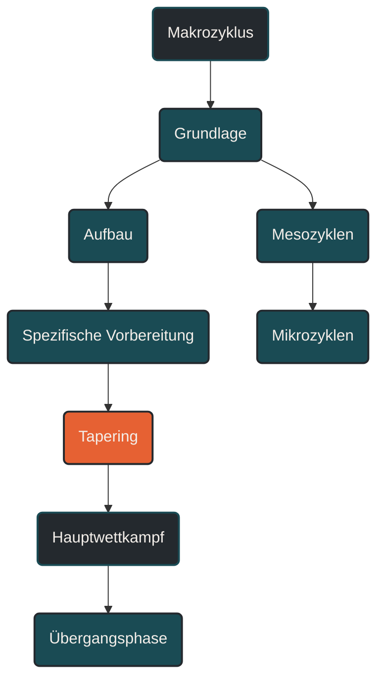

# Makrozyklus

Ein Makrozyklus ist der langfristige Trainingsabschnitt, der ein größeres Ziel vorbereitet. Im Ausdauertraining umfasst er häufig mehrere Monate bis zu einer ganzen Saison. Er verbindet Grundlagenaufbau, spezifische Vorbereitung, Wettkampfphase und Erholung zu einer geplanten Gesamtstruktur.

## Was ein Makrozyklus ist

Der Makrozyklus ist die größte Planungseinheit innerhalb der Periodisierung. Er beantwortet die Frage, wohin sich das Training über einen längeren Zeitraum entwickeln soll.

Während eine einzelne Trainingseinheit einen konkreten Reiz setzt und ein Mikrozyklus meist eine Trainingswoche beschreibt, ordnet der Makrozyklus diese kleineren Bausteine in einen langfristigen Zusammenhang ein. Er sorgt dafür, dass Training nicht zufällig aneinandergereiht wird, sondern auf ein Ziel zuläuft.

Ein Makrozyklus kann zum Beispiel auf einen Marathon, einen Halbmarathon, eine Triathlon-Saison, einen Trailwettkampf oder eine allgemeine Leistungsentwicklung ausgerichtet sein.

## Warum ein Makrozyklus wichtig ist

Ausdauerleistung entsteht nicht durch einzelne harte Einheiten, sondern durch wiederholte, aufeinander aufbauende Trainingsphasen. Der Körper braucht Zeit, um aerobe Basis, muskuläre Belastbarkeit, Stoffwechselanpassungen, Technik, Ermüdungsresistenz und Wettkampfspezifik zu entwickeln.

Ein Makrozyklus verhindert, dass alle Trainingsziele gleichzeitig verfolgt werden. Stattdessen werden Schwerpunkte gesetzt:

Zuerst wird häufig eine belastbare Grundlage aufgebaut. Danach werden Umfang, Intensität und spezifische Reize schrittweise entwickelt. Später rückt die Zielbelastung stärker in den Vordergrund. Vor dem Hauptwettkampf wird die Belastung reduziert, damit die Leistungsfähigkeit am entscheidenden Tag verfügbar ist.

## Typische Dauer eines Makrozyklus

Die Dauer eines Makrozyklus hängt vom Ziel ab. Im Ausdauertraining kann er unterschiedlich lang sein:

* mehrere Monate bei einem konkreten Wettkampfziel
* eine Saison bei mehreren Wettkämpfen
* ein Jahr bei langfristigem Leistungsaufbau
* mehrere Makrozyklen pro Jahr bei mehreren Hauptzielen

Ein 12- bis 20-wöchiger Marathonaufbau kann ein Makrozyklus sein. Auch eine gesamte Wettkampfsaison mit Grundlagenphase, Aufbauphase, Wettkampfphase und Übergangsphase kann als Makrozyklus geplant werden.

Entscheidend ist nicht die exakte Länge, sondern die Funktion: Der Makrozyklus bildet den übergeordneten Rahmen.

## Aufbau eines Makrozyklus

Ein Makrozyklus besteht meist aus mehreren Trainingsphasen. Diese Phasen können je nach Sportart, Ziel und Leistungsstand unterschiedlich heißen, folgen aber häufig einer ähnlichen Logik.

### Grundlagenphase

In der Grundlagenphase wird die allgemeine Belastbarkeit aufgebaut. Der Schwerpunkt liegt häufig auf niedrigintensivem Training, regelmäßigem Umfang, Technik, Kraftbasis und stabiler Trainingsroutine.

Ziel ist nicht maximale Form, sondern ein Fundament, auf dem spätere intensivere und spezifischere Reize verarbeitet werden können.

### Aufbauphase

In der Aufbauphase steigen Umfang, Intensität oder spezifische Anforderungen schrittweise an. Die Trainingsreize werden gezielter, ohne bereits vollständig wettkampfnah sein zu müssen.

Hier können längere Läufe, Schwellenreize, erste Intervalle, Krafttraining oder sportartspezifische Technikarbeit stärker eingebunden werden.

### Spezifische Vorbereitungsphase

In dieser Phase nähert sich das Training stärker der Zielbelastung. Tempo, Dauer, Untergrund, Höhenmeter, Pacing, Verpflegung oder Wettkampfrhythmus werden gezielter vorbereitet.

Für einen Marathon bedeutet das zum Beispiel längere Läufe, Abschnitte im Marathonrenntempo und Verpflegungstraining. Für einen 5-km-Lauf können VO2max-nahe Intervalle, Renntempoabschnitte und Laufökonomie stärker im Vordergrund stehen.

### Wettkampfphase

In der Wettkampfphase geht es darum, die aufgebaute Leistungsfähigkeit abrufbar zu machen. Belastung und Erholung werden genauer gesteuert, damit Qualitätseinheiten und Wettkämpfe nicht durch unnötige Restermüdung beeinträchtigt werden.

Nicht jede Woche muss maximal belasten. Entscheidend ist, dass Form, Frische und spezifische Leistungsfähigkeit zusammenkommen.

### Tapering

Vor einem Hauptwettkampf wird die Trainingsbelastung gezielt reduziert. Das Ziel ist, Ermüdung abzubauen, ohne die zuvor aufgebaute Anpassung zu verlieren.

Tapering ist deshalb kein einfaches Pausieren, sondern eine geplante Entlastung mit Erhalt wichtiger Reize.

### Übergangsphase

Nach einem Hauptziel folgt häufig eine Übergangsphase. Sie dient körperlicher und mentaler Erholung. Umfang und Intensität werden reduziert, alternative Bewegungsformen können genutzt werden, und kleinere Beschwerden können ausheilen.

Diese Phase ist wichtig, damit der nächste Makrozyklus nicht mit angesammelter Restermüdung beginnt.

## Makrozyklus und Trainingsziel

Ein Makrozyklus muss zum Ziel passen. Ein Marathon-Makrozyklus sieht anders aus als ein Makrozyklus für 5 Kilometer, Triathlon, Trailrunning oder allgemeine Grundlagenausdauer.

### 5 Kilometer

Der Makrozyklus kann stärker auf VO2max, Laufökonomie, Tempowechsel, kurze intensive Intervalle und Renntempo ausgerichtet sein.

### Halbmarathon

Hier gewinnen Schwellenleistung, Tempohärte, längere Intervalle und kontrollierte Dauerbelastung an Bedeutung.

### Marathon

Der Schwerpunkt liegt stärker auf aerober Effizienz, langen Läufen, muskulärer Ermüdungsresistenz, Energieversorgung und stabiler Pace über lange Dauer.

### Trail und Ultramarathon

Hier werden zusätzlich Höhenmeter, Untergrund, bergab-spezifische Belastung, Time-on-Feet, Verpflegung und mentale Steuerung wichtiger.

## Makrozyklus und Belastungssteuerung

Ein guter Makrozyklus steigert Belastung nicht linear bis zum Wettkampf. Er enthält Belastungsphasen und Entlastungsphasen. Dadurch kann der Körper Trainingsreize verarbeiten und Anpassung entwickeln.

Typisch ist ein Wechsel aus mehreren aufbauenden Wochen und einer reduzierten Woche. Diese Entlastung kann als Deload geplant werden. Der Makrozyklus legt fest, wann solche Entlastungen sinnvoll sind und wie sie in das Gesamtziel passen.

Ohne diese Struktur entsteht häufig ein Problem: Athleten trainieren einige Wochen motiviert, sammeln aber immer mehr Restermüdung. Die Leistung stagniert, Beschwerden nehmen zu, und die Qualität der Einheiten sinkt.

## Makrozyklus, Mesozyklus und Mikrozyklus

Der Makrozyklus ist der große Rahmen. Er wird in Mesozyklen unterteilt. Ein Mesozyklus umfasst meist mehrere Wochen und hat einen klaren Schwerpunkt, zum Beispiel Grundlagenaufbau, Schwellenentwicklung oder spezifische Wettkampfvorbereitung.

Die Mesozyklen bestehen wiederum aus Mikrozyklen. Ein Mikrozyklus ist häufig eine Trainingswoche mit konkreten Einheiten, Ruhetagen und Belastungsrhythmus.

Vereinfacht:

Makrozyklus bedeutet Saison oder großer Zielblock.

Mesozyklus bedeutet mehrwöchiger Trainingsabschnitt.

Mikrozyklus bedeutet Trainingswoche oder kurzer Belastungsrhythmus.

## Häufige Fehler bei Makrozyklen

Ein häufiger Fehler ist, zu früh zu spezifisch zu trainieren. Wer schon viele Monate vor dem Wettkampf ständig im Zieltempo arbeitet, riskiert mentale Ermüdung, Plateaus und Überlastung.

Ein zweiter Fehler ist fehlende Entlastung. Ein Makrozyklus ohne Deloads oder ruhige Phasen wirkt auf dem Papier ambitioniert, ist in der Praxis aber oft schlecht wiederholbar.

Ein dritter Fehler ist zu wenig Zielklarheit. Wenn gleichzeitig Grundlagenausdauer, maximale Geschwindigkeit, Marathonpace, Kraft, Technik und Wettkämpfe verbessert werden sollen, fehlt häufig ein klarer Schwerpunkt.

## Praktische Einordnung

Ein Makrozyklus macht Training planbar, ohne es starr zu machen. Er gibt Richtung, Reihenfolge und Schwerpunkte vor. Gleichzeitig muss er flexibel genug bleiben, um auf Krankheit, Stress, Verletzung, Leistungsentwicklung oder veränderte Ziele zu reagieren.

Der wichtigste Merksatz lautet: Der Makrozyklus ist der rote Faden des Trainingsjahres. Er sorgt dafür, dass einzelne Einheiten, Wochen und Trainingsblöcke nicht isoliert stehen, sondern auf ein gemeinsames Ziel hinarbeiten.

----

----

## Häufige Fragen zum Makrozyklus

### Was ist ein Makrozyklus einfach erklärt?

Ein Makrozyklus ist der große Trainingsrahmen über mehrere Monate oder eine Saison. Er legt fest, wie Training langfristig aufgebaut, gesteigert, zugespitzt und wieder entlastet wird.

### Wie lange dauert ein Makrozyklus?

Ein Makrozyklus kann mehrere Monate bis zu einem ganzen Jahr dauern. Die genaue Länge hängt vom Ziel, der Sportart, dem Trainingsstand und der Anzahl wichtiger Wettkämpfe ab.

### Was ist der Unterschied zwischen Makrozyklus, Mesozyklus und Mikrozyklus?

Der Makrozyklus ist der große Gesamtplan. Der Mesozyklus ist ein mehrwöchiger Abschnitt innerhalb dieses Plans. Der Mikrozyklus ist meist eine einzelne Trainingswoche oder ein kurzer Belastungsrhythmus.

### Braucht jeder Ausdauerathlet einen Makrozyklus?

Nicht jeder braucht einen komplexen Jahresplan. Aber jeder Athlet profitiert von einer langfristigen Struktur, wenn Fortschritt, Belastbarkeit und Erholung gezielt entwickelt werden sollen.

### Wie sieht ein Makrozyklus im Marathontraining aus?

Ein Marathon-Makrozyklus enthält meist Grundlagenaufbau, längere Läufe, spezifische Marathonpace-Abschnitte, Verpflegungstraining, Tapering und eine Erholungsphase nach dem Wettkampf.

### Wie sieht ein Makrozyklus für 5 Kilometer aus?

Ein 5-km-Makrozyklus kann stärker auf Laufökonomie, VO2max, kurze Intervalle, Renntempo, Schwellenarbeit und Tempowechselfähigkeit ausgerichtet sein.

### Warum gehört eine Entlastungsphase in den Makrozyklus?

Entlastungsphasen helfen, Ermüdung abzubauen und Anpassung zu ermöglichen. Ohne geplante Entlastung kann sich Restermüdung aufbauen und die Leistung stagnieren.

### Was ist der Unterschied zwischen Tapering und Übergangsphase?

Tapering findet vor einem Wettkampf statt und reduziert Ermüdung bei Erhalt der Form. Die Übergangsphase folgt nach einem Wettkampf oder Zielblock und dient der körperlichen und mentalen Erholung.

### Kann ein Makrozyklus mehrere Wettkämpfe enthalten?

Ja. Ein Makrozyklus kann mehrere Wettkämpfe enthalten. Meist gibt es dann Hauptwettkämpfe und weniger wichtige Vorbereitungswettkämpfe, damit die Belastung sinnvoll gesteuert bleibt.

### Was passiert, wenn ein Makrozyklus zu starr geplant ist?

Ein zu starrer Makrozyklus berücksichtigt Krankheit, Stress, Verletzungen oder unerwartete Leistungsentwicklung zu wenig. Gute Planung braucht Struktur, aber auch Anpassungsfähigkeit.

### Was ist der häufigste Fehler bei einem Makrozyklus?

Häufig wird zu früh zu hart oder zu spezifisch trainiert. Dadurch entstehen Plateaus, Restermüdung oder Überlastung, bevor die wichtigste Trainingsphase überhaupt erreicht ist.

### Woran erkenne ich einen guten Makrozyklus?

Ein guter Makrozyklus hat ein klares Ziel, sinnvolle Trainingsphasen, geplante Entlastung, zunehmende Spezifität und genug Flexibilität, um auf die tatsächliche Entwicklung des Athleten zu reagieren.

----

*Hinweis: Dieser Artikel dient der allgemeinen Information und ersetzt keine medizinische oder therapeutische Beratung. Mehr dazu im [**Gesundheits- und Quellenhinweis**](/ausdauersport/disclaimer/).*

