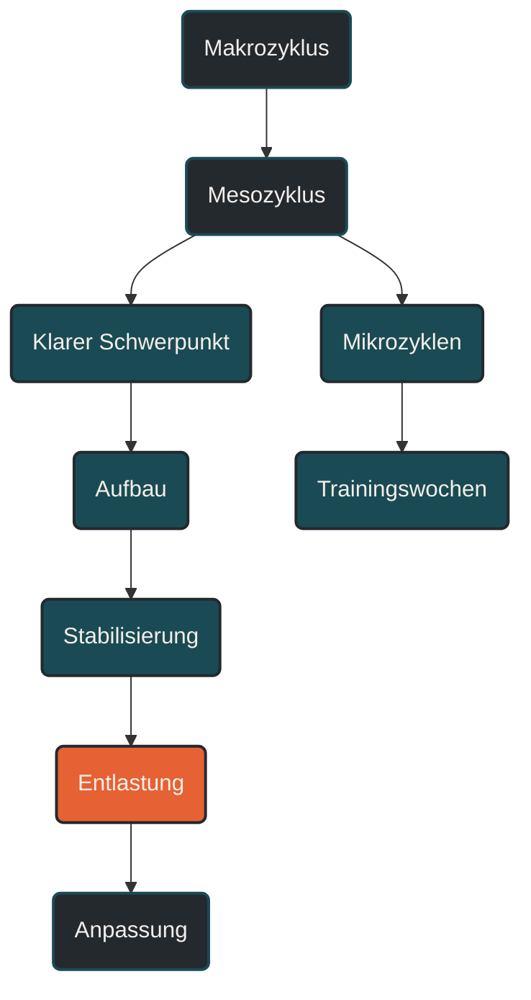

# Mesozyklus

Ein Mesozyklus ist ein mehrwöchiger Trainingsabschnitt innerhalb eines Makrozyklus. Er bündelt mehrere Mikrozyklen zu einem klaren Trainingsschwerpunkt, zum Beispiel Grundlagenaufbau, Umfangssteigerung, Schwellenentwicklung, VO2max-Training, spezifische Wettkampfvorbereitung oder Entlastung. [[1]](#quelle-1) [[2]](#quelle-2)

## Was ein Mesozyklus ist

Der Mesozyklus ist die mittlere Ebene der Periodisierung. Er verbindet den langfristigen Gesamtplan mit der konkreten Trainingswoche. [[1]](#quelle-1) [[2]](#quelle-2)

Während der Makrozyklus den großen Rahmen vorgibt, beschreibt der Mesozyklus einen überschaubaren Trainingsblock mit einem bestimmten Ziel. Ein Mikrozyklus ist meist eine einzelne Woche. Mehrere Mikrozyklen zusammen ergeben einen Mesozyklus. [[1]](#quelle-1) [[2]](#quelle-2)

Ein Mesozyklus beantwortet die Frage: Welcher Trainingsschwerpunkt soll in den nächsten Wochen entwickelt werden? [[2]](#quelle-2)

## Warum Mesozyklen wichtig sind

Ausdauerleistung entsteht nicht dadurch, jede Woche zufällig andere Reize zu setzen. Der Körper braucht wiederholte, ähnliche, aber sinnvoll gesteigerte Reize, damit Anpassung entstehen kann. [[1]](#quelle-1) [[2]](#quelle-2)

Ein Mesozyklus schafft dafür Struktur. Er legt fest, welche Fähigkeit über mehrere Wochen im Vordergrund steht. Dadurch wird Training nicht beliebig, sondern bekommt eine klare Richtung. [[1]](#quelle-1) [[2]](#quelle-2)

Beispiele für solche Schwerpunkte sind:

* aerobe Basis aufbauen
* Umfang stabilisieren
* lange Läufe entwickeln
* Schwellenleistung verbessern
* VO2max-Reize setzen
* Kraft und Belastbarkeit aufbauen
* Wettkampfspezifik vorbereiten
* Ermüdung abbauen

Der Vorteil liegt darin, dass ein Schwerpunkt lang genug trainiert wird, um wirksam zu sein, aber nicht so lange, dass Monotonie, Überlastung oder Plateaus entstehen. [[2]](#quelle-2) [[9]](#quelle-9)

## Typische Dauer eines Mesozyklus

Ein Mesozyklus dauert häufig drei bis sechs Wochen. Sehr verbreitet sind vierwöchige Blöcke, zum Beispiel drei Belastungswochen und eine Entlastungswoche. [[1]](#quelle-1) [[2]](#quelle-2)

Die genaue Länge hängt aber vom Ziel, Trainingsstand, Alter, Erholungsfähigkeit, Verletzungshistorie und Wettkampfkalender ab. [[3]](#quelle-3) [[4]](#quelle-4)

Einsteiger profitieren oft von kürzeren und vorsichtigeren Blöcken. Fortgeschrittene Athleten können längere oder intensivere Mesozyklen vertragen, brauchen aber ebenfalls geplante Entlastung. [[4]](#quelle-4) [[8]](#quelle-8) [[9]](#quelle-9)

## Aufbau eines Mesozyklus

Ein Mesozyklus besteht meist aus mehreren Mikrozyklen. Diese Mikrozyklen können progressiv aufgebaut, stabilisiert oder entlastend gestaltet sein. [[1]](#quelle-1) [[2]](#quelle-2)

### Belastungsaufbau

In den ersten Wochen wird die Belastung häufig schrittweise gesteigert. Das kann über Umfang, Dauer, Intensität, Reizdichte, Höhenmeter oder spezifische Inhalte geschehen. [[1]](#quelle-1) [[3]](#quelle-3)

Wichtig ist, nicht alle Stellschrauben gleichzeitig zu erhöhen. Wird Umfang, Intensität und Häufigkeit gleichzeitig gesteigert, wird der Reiz schwer kontrollierbar. [[3]](#quelle-3) [[4]](#quelle-4) [[8]](#quelle-8)

### Stabilisierung

Nach einer Steigerung kann eine Phase sinnvoll sein, in der die Belastung nicht weiter erhöht, sondern stabil wiederholt wird. Das hilft dem Körper, Anpassung zu festigen und Belastbarkeit aufzubauen. [[1]](#quelle-1) [[4]](#quelle-4)

Stabilisierung ist kein Stillstand. Sie kann ein wichtiger Teil langfristiger Entwicklung sein.

### Entlastung

Viele Mesozyklen enden mit einer Entlastungswoche. Dabei werden Umfang und/oder Intensität reduziert, damit Restermüdung abgebaut wird und Anpassung entstehen kann. [[4]](#quelle-4) [[9]](#quelle-9) [[10]](#quelle-10)

Diese Entlastung wird häufig als Deload bezeichnet. Sie ist besonders wichtig, wenn die vorherigen Wochen belastend waren oder wenn mehrere Mesozyklen hintereinander folgen. [[4]](#quelle-4) [[9]](#quelle-9)

## Mesozyklus und Trainingsschwerpunkt

Jeder Mesozyklus sollte einen klaren Schwerpunkt haben. Das bedeutet nicht, dass nur eine einzige Fähigkeit trainiert wird. Es bedeutet, dass die wichtigsten Reize bewusst priorisiert werden. [[1]](#quelle-1) [[2]](#quelle-2)

### Grundlagen-Mesozyklus

Ein Grundlagen-Mesozyklus legt den Schwerpunkt auf niedrige Intensität, regelmäßigen Umfang und Belastungsverträglichkeit. Er eignet sich besonders für den Saisonbeginn, den Wiedereinstieg oder den Aufbau nach einer Pause. [[5]](#quelle-5)

### Umfangs-Mesozyklus

Ein Umfangs-Mesozyklus erhöht die Trainingsmenge schrittweise. Im Lauftraining kann das über mehr Wochenkilometer, längere Dauerläufe oder einen längeren Long Run geschehen. [[3]](#quelle-3) [[4]](#quelle-4)

Der Umfang sollte vorsichtig gesteigert werden, weil passive Strukturen wie Sehnen, Knochen und Gelenke oft langsamer reagieren als Herz-Kreislauf-System und Muskulatur. [[8]](#quelle-8)

### Schwellen-Mesozyklus

Ein Schwellen-Mesozyklus entwickelt die Fähigkeit, eine zügige, aber kontrollierbare Intensität länger aufrechtzuerhalten. Typische Inhalte sind Tempodauerläufe, Schwellenintervalle oder längere kontrollierte Belastungen. [[6]](#quelle-6)

Dieser Schwerpunkt ist besonders relevant für 10 Kilometer, Halbmarathon, Marathon und viele längere Ausdauerziele. [[5]](#quelle-5) [[6]](#quelle-6)

### VO2max-Mesozyklus

Ein VO2max-Mesozyklus setzt gezielte hochintensive Reize. Typisch sind Intervalle oberhalb der Schwelle, kurze bis mittlere Belastungsabschnitte und ausreichende Pausen. [[7]](#quelle-7)

Diese Reize sind wirksam, aber ermüdend. Deshalb brauchen sie klare Platzierung und ausreichend Erholung. [[4]](#quelle-4) [[7]](#quelle-7) [[9]](#quelle-9)

### Spezifischer Mesozyklus

Ein spezifischer Mesozyklus bereitet gezielt die Zielbelastung vor. Für einen Marathon können das lange Läufe, Marathonpace-Abschnitte und Verpflegungstraining sein. Für Trailrunning können Höhenmeter, Untergrundwechsel und bergab-spezifische Belastung im Vordergrund stehen. [[1]](#quelle-1) [[11]](#quelle-11) [[12]](#quelle-12)

Je näher ein Hauptwettkampf rückt, desto wichtiger wird die Spezifität des Mesozyklus. [[1]](#quelle-1) [[10]](#quelle-10)

### Entlastungs-Mesozyklus

Ein Entlastungs-Mesozyklus reduziert Belastung bewusst über mehrere Wochen. Das kann nach einer langen Saison, nach Krankheit, nach Verletzung oder nach einem Hauptwettkampf sinnvoll sein. [[4]](#quelle-4) [[9]](#quelle-9)

Ziel ist nicht Leistungssteigerung um jeden Preis, sondern Wiederherstellung, Stabilisierung und Vorbereitung auf den nächsten Aufbau. [[9]](#quelle-9) [[10]](#quelle-10)

## Mesozyklus im Verhältnis zum Makrozyklus

Der Makrozyklus gibt das langfristige Ziel vor. Der Mesozyklus setzt dieses Ziel in mehrere Trainingsblöcke um. [[1]](#quelle-1) [[2]](#quelle-2)

Ein Marathon-Makrozyklus kann zum Beispiel so aufgebaut sein:

1. Grundlagen-Mesozyklus
2. Umfangs-Mesozyklus
3. Schwellen-Mesozyklus
4. spezifischer Marathon-Mesozyklus
5. Tapering-Phase
6. Übergangsphase

Jeder Mesozyklus erfüllt dabei eine eigene Funktion. Zusammen bilden sie den roten Faden des gesamten Trainingsaufbaus. [[1]](#quelle-1) [[2]](#quelle-2)

## Mesozyklus im Verhältnis zum Mikrozyklus

Der Mikrozyklus ist die konkrete Umsetzung innerhalb einer Woche oder eines kurzen Rhythmus. Er enthält die einzelnen Einheiten, Ruhetage, lockeren Läufe, Qualitätseinheiten und langen Läufe. [[1]](#quelle-1)

Der Mesozyklus sorgt dafür, dass diese Wochen nicht isoliert nebeneinanderstehen. Er entscheidet, ob eine Woche aufbaut, stabilisiert oder entlastet. [[1]](#quelle-1) [[2]](#quelle-2)

Vereinfacht:

Der Makrozyklus sagt, wohin das Training führen soll.

Der Mesozyklus sagt, welcher Schwerpunkt in den nächsten Wochen entwickelt wird.

Der Mikrozyklus sagt, wie die konkrete Trainingswoche aussieht.

## Progressive Belastung im Mesozyklus

Ein Mesozyklus nutzt häufig progressive Überlastung. Die Belastung wird also schrittweise erhöht, damit der Körper weiterhin Anpassungen entwickeln muss. [[1]](#quelle-1) [[3]](#quelle-3)

Diese Progression kann unterschiedlich aussehen:

* längerer Dauerlauf
* mehr Wochenumfang
* mehr Wiederholungen
* längere Intervalle
* kürzere Pausen
* mehr Höhenmeter
* höhere spezifische Belastung
* bessere Wiederholbarkeit bei gleicher Belastung

Progression bedeutet aber nicht, jede Woche härter zu trainieren. Manchmal ist es sinnvoller, eine Belastung zu wiederholen, bevor sie erhöht wird. [[3]](#quelle-3) [[4]](#quelle-4)

## Entlastung innerhalb des Mesozyklus

Ohne Entlastung kann sich Restermüdung aufbauen. Deshalb enthalten viele Mesozyklen eine geplante Reduktion der Belastung. [[4]](#quelle-4) [[9]](#quelle-9)

Ein klassisches Muster ist:

* Woche 1: Einstieg in den Schwerpunkt
* Woche 2: Belastung steigern
* Woche 3: höchste Belastung
* Woche 4: Entlastung

Dieses Muster ist aber nur ein Beispiel. Manche Athleten brauchen früher Entlastung, andere können längere Blöcke verarbeiten. Entscheidend ist die individuelle Reaktion. [[3]](#quelle-3) [[4]](#quelle-4)

## Häufige Fehler bei Mesozyklen

Ein häufiger Fehler ist ein unklarer Schwerpunkt. Wenn in einem Block gleichzeitig maximale Geschwindigkeit, lange Läufe, Schwelle, Kraft, Umfang und Wettkampfspezifik stark entwickelt werden sollen, wird der Mesozyklus überladen. [[1]](#quelle-1) [[2]](#quelle-2)

Ein zweiter Fehler ist zu schnelle Progression. Besonders im Lauftraining kann sich die Ausdauer schneller verbessern als die Belastbarkeit von Sehnen, Knochen und Gelenken. [[8]](#quelle-8)

Ein dritter Fehler ist fehlende Entlastung. Ein Mesozyklus ohne geplante Reduktion wirkt auf dem Papier produktiv, kann aber in der Praxis zu Restermüdung, Stagnation oder Überlastung führen. [[4]](#quelle-4) [[9]](#quelle-9)

Ein vierter Fehler ist zu wenig Wiederholung. Anpassung braucht wiederholte Reize. Wer jede Woche völlig andere Inhalte trainiert, erschwert gezielte Entwicklung. [[1]](#quelle-1) [[2]](#quelle-2)

## Praktische Einordnung

Ein Mesozyklus macht Trainingsplanung überschaubar. Er ist lang genug, um einen Schwerpunkt wirksam zu entwickeln, aber kurz genug, um regelmäßig zu prüfen, ob der Plan funktioniert. [[1]](#quelle-1) [[4]](#quelle-4)

Nach jedem Mesozyklus sollte bewertet werden:

* Wurde der Schwerpunkt erreicht?
* Wie hat der Körper reagiert?
* Haben sich Leistung oder Belastbarkeit verbessert?
* Gab es Warnsignale?
* Muss der nächste Block angepasst werden?

Der wichtigste Merksatz lautet: Der Mesozyklus ist der Trainingsblock, in dem ein bestimmter Entwicklungsschwerpunkt über mehrere Wochen systematisch aufgebaut, verarbeitet und überprüft wird. [[1]](#quelle-1) [[2]](#quelle-2) [[4]](#quelle-4)

----

----

## Häufige Fragen zum Mesozyklus

### Was ist ein Mesozyklus einfach erklärt?

Ein Mesozyklus ist ein Trainingsblock über mehrere Wochen. Er hat einen klaren Schwerpunkt, zum Beispiel Grundlagenaufbau, Schwellentraining, VO2max-Training, Umfangssteigerung oder spezifische Wettkampfvorbereitung. [[1]](#quelle-1) [[2]](#quelle-2)

### Wie lange dauert ein Mesozyklus?

Ein Mesozyklus dauert häufig drei bis sechs Wochen. Sehr verbreitet sind vierwöchige Blöcke, zum Beispiel drei Wochen Belastungsaufbau und eine Woche Entlastung. [[1]](#quelle-1) [[2]](#quelle-2)

### Was ist der Unterschied zwischen Makrozyklus, Mesozyklus und Mikrozyklus?

Der Makrozyklus ist der langfristige Gesamtplan. Der Mesozyklus ist ein mehrwöchiger Trainingsblock innerhalb dieses Plans. Der Mikrozyklus ist meist eine konkrete Trainingswoche. [[1]](#quelle-1) [[2]](#quelle-2)

### Warum braucht ein Mesozyklus einen Schwerpunkt?

Ein Schwerpunkt sorgt dafür, dass Trainingsreize gezielt wirken können. Ohne Schwerpunkt werden oft zu viele Ziele gleichzeitig verfolgt, wodurch Anpassung, Erholung und Trainingsqualität leiden können. [[1]](#quelle-1) [[2]](#quelle-2) [[9]](#quelle-9)

### Welche Schwerpunkte kann ein Mesozyklus haben?

Typische Schwerpunkte sind aerobe Basis, Umfang, lange Läufe, Schwelle, VO2max, Kraft, Technik, Belastbarkeit, Wettkampfspezifik oder Entlastung. [[2]](#quelle-2) [[5]](#quelle-5) [[6]](#quelle-6) [[7]](#quelle-7)

### Muss jeder Mesozyklus mit einer Entlastungswoche enden?

Nein. Eine Entlastungswoche ist häufig sinnvoll, aber nicht immer zwingend. Entscheidend sind Trainingsstand, Belastung, Erholung, Alter, Alltag und individuelle Reaktion auf den Trainingsblock. [[3]](#quelle-3) [[4]](#quelle-4)

### Was bedeutet Progression im Mesozyklus?

Progression bedeutet, dass die Belastung im Verlauf des Blocks schrittweise entwickelt wird. Das kann über Umfang, Intensität, Dauer, Pausen, Höhenmeter oder spezifische Anforderungen geschehen. [[1]](#quelle-1) [[3]](#quelle-3)

### Kann ein Mesozyklus auch der Erholung dienen?

Ja. Ein Mesozyklus kann bewusst entlastend geplant werden, zum Beispiel nach einer Wettkampfphase, nach Krankheit, nach Verletzung oder nach einem sehr belastenden Trainingsblock. [[4]](#quelle-4) [[9]](#quelle-9)

### Was ist ein typisches Beispiel für einen vierwöchigen Mesozyklus?

Ein häufiges Muster ist: Woche 1 Einstieg, Woche 2 Steigerung, Woche 3 höchste Belastung, Woche 4 Entlastung. Dieses Muster muss aber individuell angepasst werden. [[1]](#quelle-1) [[3]](#quelle-3)

### Was ist der häufigste Fehler bei Mesozyklen?

Der häufigste Fehler ist ein überladener Trainingsblock. Wenn zu viele Fähigkeiten gleichzeitig stark entwickelt werden sollen, steigt das Risiko für Restermüdung, schlechte Qualität und Überlastung. [[2]](#quelle-2) [[9]](#quelle-9)

### Wie erkenne ich, ob ein Mesozyklus funktioniert hat?

Ein Mesozyklus funktioniert, wenn der geplante Schwerpunkt verbessert wurde, die Belastung verarbeitet werden konnte und keine anhaltenden Warnsignale wie Schmerzen, Schlafprobleme oder Leistungseinbruch entstanden sind. [[4]](#quelle-4) [[8]](#quelle-8) [[9]](#quelle-9)

### Wie hängt der Mesozyklus mit dem Wettkampfziel zusammen?

Der Mesozyklus setzt die langfristige Zielplanung in konkrete Trainingsblöcke um. Je näher der Wettkampf rückt, desto spezifischer werden die Schwerpunkte des Mesozyklus. [[1]](#quelle-1) [[10]](#quelle-10)

----

## Quellen

### Quelle 1: Periodisierung als systematische Trainingsplanung

Lorenz, D. S., Reiman, M. P., & Walker, J. C. (2010). Periodization: Current Review and Suggested Implementation for Athletic Rehabilitation. Sports Health, 2(6), 509–518.  
Quelle: [PubMed](https://pubmed.ncbi.nlm.nih.gov/23015982/)

### Quelle 2: Blockperiodisierung und Mesozyklus-Blöcke

Issurin, V. B. (2010). New Horizons for the Methodology and Physiology of Training Periodization. Sports Medicine, 40, 189–206.  
Quelle: [Springer Sports Medicine](https://link.springer.com/article/10.2165/11319770-000000000-00000)

### Quelle 3: Innere und äußere Trainingsbelastung

Impellizzeri, F. M., Marcora, S. M., & Coutts, A. J. (2019). Internal and External Training Load: 15 Years On. International Journal of Sports Physiology and Performance, 14(2), 270–273.  
Quelle: [PubMed](https://pubmed.ncbi.nlm.nih.gov/30614348/)

### Quelle 4: Monitoring von Trainingsbelastung

Bourdon, P. C., Cardinale, M., Murray, A., et al. (2017). Monitoring Athlete Training Loads: Consensus Statement. International Journal of Sports Physiology and Performance, 12(Suppl 2), S2-161–S2-170.  
Quelle: [Human Kinetics](https://journals.humankinetics.com/view/journals/ijspp/12/s2/article-pS2-161.xml)

### Quelle 5: Trainingsintensitätsverteilung im Ausdauertraining

Seiler, S. (2010). What is Best Practice for Training Intensity and Duration Distribution in Endurance Athletes? International Journal of Sports Physiology and Performance, 5(3), 276–291.  
Quelle: [Human Kinetics](https://journals.humankinetics.com/abstract/journals/ijspp/5/3/article-p276.xml)

### Quelle 6: Schwellenkonzepte im Ausdauertraining

Faude, O., Kindermann, W., & Meyer, T. (2009). Lactate Threshold Concepts: How Valid are They? Sports Medicine, 39, 469–490.  
Quelle: [Springer Sports Medicine](https://link.springer.com/article/10.2165/00007256-200939060-00003)

### Quelle 7: Hochintensive Intervalle im Ausdauertraining

Laursen, P. B., & Jenkins, D. G. (2002). The Scientific Basis for High-Intensity Interval Training: Optimising Training Programmes and Maximising Performance in Highly Trained Endurance Athletes. Sports Medicine, 32, 53–73.  
Quelle: [Springer Sports Medicine](https://link.springer.com/article/10.2165/00007256-200232010-00003)

### Quelle 8: Trainingsbelastung und Verletzungsrisiko

Soligard, T., Schwellnus, M., Alonso, J. M., et al. (2016). How much is too much? International Olympic Committee consensus statement on load in sport and risk of injury. British Journal of Sports Medicine, 50(17), 1030–1041.  
Quelle: [British Journal of Sports Medicine](https://bjsm.bmj.com/content/50/17/1030)

### Quelle 9: Overreaching, Übertraining und fehlende Erholung

Meeusen, R., Duclos, M., Foster, C., et al. (2013). Prevention, diagnosis, and treatment of the overtraining syndrome: Joint consensus statement of the European College of Sport Science and the American College of Sports Medicine. Medicine & Science in Sports & Exercise, 45(1), 186–205.  
Quelle: [PubMed](https://pubmed.ncbi.nlm.nih.gov/23247672/)

### Quelle 10: Tapering und gezielte Entlastung bei Ausdauerathleten

Wang, Z., Wang, Y. T., Gao, W., & Zhong, Y. (2023). Effects of tapering on performance in endurance athletes: A systematic review and meta-analysis. PLoS ONE, 18(5), e0282838.  
Quelle: [PubMed](https://pubmed.ncbi.nlm.nih.gov/37163550/)

### Quelle 11: Ernährung und Verpflegung bei Ausdauerwettkämpfen

Jeukendrup, A. E. (2011). Nutrition for endurance sports: marathon, triathlon, and road cycling. Journal of Sports Sciences, 29 Suppl 1, S91–S99.  
Quelle: [PubMed](https://pubmed.ncbi.nlm.nih.gov/21916794/)

### Quelle 12: Ernährung und Belastungsanforderungen im Ultramarathon

Tiller, N. B., Roberts, J. D., Beasley, L., et al. (2019). International Society of Sports Nutrition Position Stand: nutritional considerations for single-stage ultra-marathon training and racing. Journal of the International Society of Sports Nutrition, 16, 50.  
Quelle: [PubMed](https://pubmed.ncbi.nlm.nih.gov/31699159/)

----

*Hinweis: Dieser Artikel dient der allgemeinen Information und ersetzt keine medizinische oder therapeutische Beratung. Mehr dazu im [**Gesundheits- und Quellenhinweis**](/ausdauersport/disclaimer/).*

