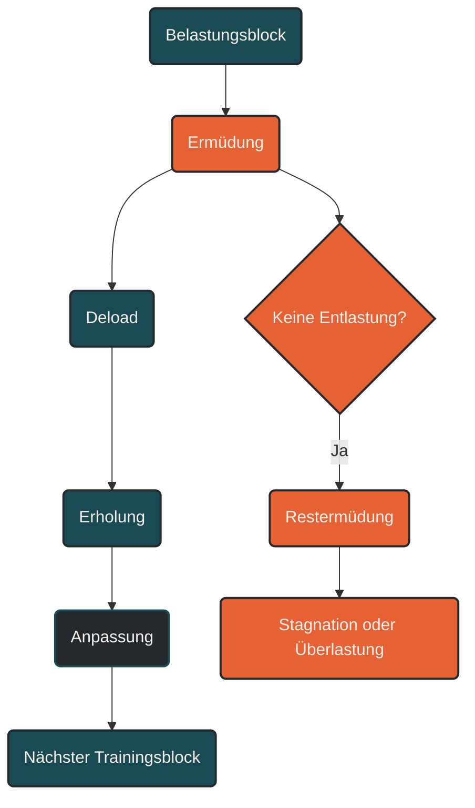

# Deload

Ein Deload ist eine geplante Entlastungsphase im Training. Dabei werden Umfang, Intensität oder Trainingsdichte vorübergehend reduziert, damit Ermüdung abgebaut und Anpassung ermöglicht wird. Ein Deload ist kein Trainingsausfall, sondern ein bewusst eingesetztes Werkzeug der Periodisierung.

## Was ein Deload ist

Ein Deload beschreibt eine kurze Phase mit reduzierter Trainingsbelastung. Er wird meist nach mehreren belastenden Trainingswochen eingeplant, um Restermüdung abzubauen und die nächste Trainingsphase vorzubereiten.

Im Ausdauertraining bedeutet ein Deload nicht automatisch komplette Pause. Häufig wird weiter trainiert, aber mit weniger Umfang, weniger Intensität, weniger mechanischer Belastung oder mehr Erholung zwischen den Einheiten.

Der Deload beantwortet die Frage: Wann braucht der Körper Zeit, um die gesetzten Reize wirklich zu verarbeiten?

## Warum ein Deload wichtig ist

Training setzt Reize. Anpassung entsteht aber nicht während der Belastung, sondern in der anschließenden Verarbeitung. Wenn über mehrere Wochen Belastung aufgebaut wird, sammelt sich Ermüdung an. Das ist bis zu einem gewissen Grad normal und gewollt.

Problematisch wird es, wenn die Ermüdung nicht mehr ausreichend abgebaut wird. Dann sinkt die Qualität der Einheiten, lockere Läufe fühlen sich schwer an, die Motivation fällt, Schlaf und Erholung verschlechtern sich oder erste Beschwerden entstehen.

Ein Deload unterbricht diese Entwicklung. Er reduziert den Trainingsstress, ohne die Trainingsstruktur vollständig aufzugeben.

## Deload und Superkompensation

Ein Deload unterstützt das Prinzip der Superkompensation. Nach einer Belastungsphase ist der Körper zunächst ermüdet. Wird die Belastung gezielt reduziert, kann der Organismus Reparatur, Wiederauffüllung und Anpassung besser abschließen.

Der Deload ist deshalb nicht nur Erholung, sondern ein Teil des Leistungsaufbaus. Er sorgt dafür, dass vorherige Trainingsreize nicht einfach zu chronischer Ermüdung werden, sondern in höhere Belastbarkeit übersetzt werden können.

## Deload innerhalb der Periodisierung

Ein Deload kann auf verschiedenen Ebenen der Periodisierung vorkommen.

### Im Mikrozyklus

Innerhalb einer Trainingswoche kann ein Deload durch zusätzliche Ruhetage, weniger Qualitätseinheiten oder kürzere lockere Einheiten entstehen.

### Im Mesozyklus

Sehr häufig wird ein Deload am Ende eines mehrwöchigen Trainingsblocks eingesetzt. Ein klassisches Muster ist drei Wochen Belastungsaufbau und eine Woche Entlastung.

### Im Makrozyklus

Innerhalb des langfristigen Trainingsplans können mehrere Deloads eingeplant werden. Sie markieren Übergänge zwischen Trainingsphasen, helfen nach Wettkämpfen oder bereiten intensivere Blöcke vor.

## Was im Deload reduziert wird

Ein Deload kann unterschiedlich gestaltet werden. Nicht immer müssen alle Trainingsfaktoren gleichzeitig reduziert werden.

### Umfang reduzieren

Die häufigste Methode ist eine Reduktion des Trainingsumfangs. Das bedeutet weniger Wochenkilometer, weniger Trainingsstunden oder kürzere Einheiten.

Diese Variante ist besonders sinnvoll, wenn die allgemeine Ermüdung hoch ist oder der Körper auf die Gesamtmenge reagiert.

### Intensität reduzieren

Bei hoher nervlicher, muskulärer oder metabolischer Ermüdung kann die Intensität reduziert werden. Harte Intervalle, Tempodauerläufe oder intensive Bergreize werden gestrichen oder deutlich abgeschwächt.

Diese Variante schützt vor Überlastung und hilft, die Qualität späterer Schlüsselsessions wiederherzustellen.

### Reizdichte reduzieren

Auch der Abstand zwischen Belastungen kann verändert werden. Mehr Ruhetage oder mehr lockere Tage zwischen anspruchsvollen Einheiten senken die Gesamtbelastung deutlich.

### Mechanische Belastung reduzieren

Im Lauftraining ist die mechanische Belastung besonders wichtig. Ein Deload kann bedeuten, weniger harte Untergründe, weniger Bergabpassagen, keine Sprints, keine Sprünge und weniger Krafttraining mit hoher exzentrischer Belastung einzusetzen.

Das ist besonders relevant bei Sehnen-, Knochen-, Gelenk- oder Faszienbeschwerden.

### Komplexität reduzieren

Auch mentale und koordinative Belastung kann reduziert werden. Ein Deload kann bewusst einfache, ruhige Einheiten enthalten, statt viele strukturierte Vorgaben, Zielpaces oder technische Anforderungen zu setzen.

## Wie stark sollte ein Deload sein?

Die Reduktion hängt vom Trainingsstand, der vorherigen Belastung und der individuellen Erholung ab. Häufig wird der Umfang um etwa 20 bis 50 Prozent reduziert. Das ist aber nur eine grobe Orientierung.

Ein leichter Deload kann ausreichen, wenn die Ermüdung moderat ist. Ein stärkerer Deload ist sinnvoll, wenn mehrere Warnsignale auftreten oder ein sehr belastender Trainingsblock vorausging.

Entscheidend ist nicht eine feste Prozentzahl, sondern die Wirkung: Nach dem Deload sollte der Athlet erholter, stabiler und wieder aufnahmefähiger für neue Reize sein.

## Deload bedeutet nicht Formverlust

Viele Athleten fürchten, dass sie durch eine Entlastungswoche Form verlieren. In der Praxis ist ein sinnvoller Deload meist das Gegenteil: Er macht sichtbar, welche Leistungsfähigkeit unter der angesammelten Ermüdung bereits vorhanden war.

Kurzfristig weniger Training führt nicht automatisch zu Leistungsabbau. Wenn vorher ausreichend trainiert wurde, kann eine reduzierte Woche helfen, Frische und Trainingsqualität zurückzubringen.

Formverlust entsteht eher durch lange Inaktivität oder dauerhaft zu geringe Reize, nicht durch eine geplante, zeitlich begrenzte Entlastung.

## Wann ein Deload sinnvoll ist

Ein Deload kann geplant oder reaktiv eingesetzt werden.

### Geplanter Deload

Ein geplanter Deload wird bereits im Trainingsplan vorgesehen. Typisch ist eine Entlastungswoche nach mehreren aufbauenden Wochen.

Das ist besonders sinnvoll bei strukturiertem Training, höherem Umfang, intensiven Blöcken oder Athleten mit Verletzungshistorie.

### Reaktiver Deload

Ein reaktiver Deload wird eingesetzt, wenn Warnsignale auftreten. Dazu gehören anhaltende Müdigkeit, schlechter Schlaf, erhöhte subjektive Belastung, Leistungseinbruch, ungewöhnlich hoher Ruhepuls, auffällig niedrige HRV, Motivationsverlust oder beginnende Schmerzen.

Ein reaktiver Deload ist keine Schwäche. Er verhindert, dass aus normaler Ermüdung Überlastung wird.

## Deload im Lauftraining

Im Lauftraining ist ein Deload besonders wichtig, weil neben Herz-Kreislauf-System und Muskulatur auch passive Strukturen belastet werden. Sehnen, Knochen, Knorpel und Faszien passen sich langsamer an als die Ausdauer.

Ein Läufer kann sich konditionell bereit fühlen, obwohl die mechanische Belastbarkeit noch nicht ausreichend erholt ist. Deshalb sollte ein Deload nicht nur nach Herzfrequenz oder Atemgefühl bewertet werden, sondern auch nach Muskelgefühl, Sehnenreaktionen, Gelenken und allgemeiner Belastbarkeit.

Typische Deload-Maßnahmen im Lauftraining sind:

* Wochenkilometer reduzieren
* Long Run kürzen
* Intervalle durch lockere Läufe ersetzen
* Tempoanteile reduzieren
* Bergabbelastung vermeiden
* zusätzliche Ruhetage einbauen
* Krafttraining leichter gestalten
* Schlaf und Ernährung priorisieren

## Deload im Vergleich zu Tapering

Deload und Tapering werden oft verwechselt, haben aber unterschiedliche Funktionen.

Ein Deload dient der Entlastung innerhalb des Trainingsprozesses. Er wird genutzt, um Ermüdung abzubauen und den nächsten Trainingsblock vorzubereiten.

Tapering findet vor einem wichtigen Wettkampf statt. Ziel ist, die Leistung zum Starttermin zu maximieren, indem Ermüdung reduziert und die Form erhalten wird.

Vereinfacht:

Deload bereitet den nächsten Trainingsblock vor.

Tapering bereitet den Wettkampf vor.

## Deload im Vergleich zu Pause

Ein Deload ist nicht dasselbe wie eine komplette Trainingspause. Bei einer Pause wird Training meist vollständig unterbrochen. Bei einem Deload bleibt häufig eine reduzierte Trainingsstruktur erhalten.

Eine Pause kann sinnvoll sein, wenn Krankheit, Verletzung, starke Erschöpfung oder mentale Überlastung vorliegen. Ein Deload ist dagegen die kontrollierte Entlastung, bevor es so weit kommt.

## Häufige Fehler beim Deload

Ein häufiger Fehler ist, den Deload zu spät einzusetzen. Viele Athleten warten, bis Leistung und Motivation bereits deutlich gefallen sind oder Beschwerden auftreten.

Ein zweiter Fehler ist, den Deload zu hart zu gestalten. Wenn die Entlastungswoche nur auf dem Papier leichter ist, aber weiterhin viele mittlere oder intensive Reize enthält, erfüllt sie ihre Funktion nicht.

Ein dritter Fehler ist, im Deload aus Angst vor Formverlust zusätzliche Einheiten einzubauen. Dadurch wird die Erholung unterbrochen, und der nächste Trainingsblock beginnt mit Restermüdung.

Ein vierter Fehler ist, jede Entlastung als Rückschritt zu betrachten. In Wirklichkeit ist Deload ein aktiver Teil der Leistungsentwicklung.

## Praktische Einordnung

Ein Deload macht Training nachhaltiger. Er schützt nicht vor jeder Überlastung, aber er reduziert das Risiko, dass sich Ermüdung unbemerkt ansammelt.

Der wichtigste Merksatz lautet: Ein Deload ist keine verlorene Trainingszeit. Er ist die Phase, in der der Körper die vorherige Trainingsarbeit verarbeitet und sich auf den nächsten Belastungsblock vorbereitet.

----

----

## Häufige Fragen zum Deload

### Was ist ein Deload einfach erklärt?

Ein Deload ist eine geplante Entlastungsphase im Training. Umfang, Intensität oder Trainingsdichte werden vorübergehend reduziert, damit Ermüdung abgebaut und Anpassung ermöglicht wird.

### Wie lange dauert ein Deload?

Ein Deload dauert häufig etwa eine Woche. Je nach Trainingsstand, Belastung, Erholung und Ziel kann er aber auch kürzer oder länger sein.

### Bedeutet Deload komplette Pause?

Nein. Ein Deload bedeutet meistens nicht komplette Pause, sondern reduziertes Training. Es wird weiter trainiert, aber leichter, kürzer oder mit mehr Erholung.

### Wann sollte ich einen Deload einplanen?

Ein Deload ist sinnvoll nach mehreren belastenden Trainingswochen, nach intensiven Blöcken, bei steigender Restermüdung oder wenn Warnsignale wie schlechter Schlaf, schwere Beine, Leistungseinbruch oder beginnende Beschwerden auftreten.

### Wie stark sollte ich im Deload reduzieren?

Häufig wird der Umfang um etwa 20 bis 50 Prozent reduziert. Die genaue Reduktion hängt davon ab, wie stark die vorherige Belastung war und wie gut der Körper regeneriert.

### Soll ich im Deload Intensität behalten?

Das hängt vom Ziel ab. Manchmal bleiben kurze, lockere Aktivierungen erhalten. Harte Intervalle, lange Tempobelastungen oder stark ermüdende Einheiten werden meistens reduziert oder gestrichen.

### Verliere ich durch einen Deload Fitness?

Ein sinnvoll geplanter Deload führt normalerweise nicht zu Formverlust. Er hilft oft sogar, vorhandene Leistungsfähigkeit wieder sichtbar zu machen, weil Ermüdung abgebaut wird.

### Was ist der Unterschied zwischen Deload und Tapering?

Ein Deload entlastet innerhalb des Trainingsprozesses und bereitet den nächsten Trainingsblock vor. Tapering findet vor einem Wettkampf statt und soll die Leistungsfähigkeit am Starttag maximieren.

### Was ist der Unterschied zwischen Deload und Ruhetag?

Ein Ruhetag ist ein einzelner Tag ohne Training oder mit sehr leichter Bewegung. Ein Deload ist eine geplante Entlastungsphase über mehrere Tage oder eine ganze Woche.

### Brauchen Einsteiger einen Deload?

Ja, oft sogar besonders. Einsteiger bauen Belastbarkeit noch auf und reagieren häufig sensibel auf Umfangssteigerungen. Deloads helfen, Überlastung zu vermeiden.

### Brauchen erfahrene Athleten einen Deload?

Ja. Erfahrene Athleten können oft mehr Belastung tolerieren, sammeln aber ebenfalls Ermüdung. Deloads helfen, Trainingsqualität langfristig zu erhalten.

### Woran erkenne ich, dass ein Deload funktioniert hat?

Nach einem Deload sollten sich lockere Einheiten leichter anfühlen, die Motivation steigen, Schlaf und Erholung stabiler werden und Beschwerden oder schwere Beine abnehmen.

### Was ist der häufigste Fehler beim Deload?

Der häufigste Fehler ist, die Entlastung nicht ernst zu nehmen. Wenn im Deload weiterhin zu viel mittelhart oder intensiv trainiert wird, kann die Ermüdung nicht ausreichend abgebaut werden.

### Kann ein Deload auch mental helfen?

Ja. Ein Deload kann mentale Erholung fördern, Trainingsdruck senken und neue Motivation für den nächsten Trainingsblock schaffen.

----

*Hinweis: Dieser Artikel dient der allgemeinen Information und ersetzt keine medizinische oder therapeutische Beratung. Mehr dazu im [**Gesundheits- und Quellenhinweis**](/ausdauersport/disclaimer/).*

