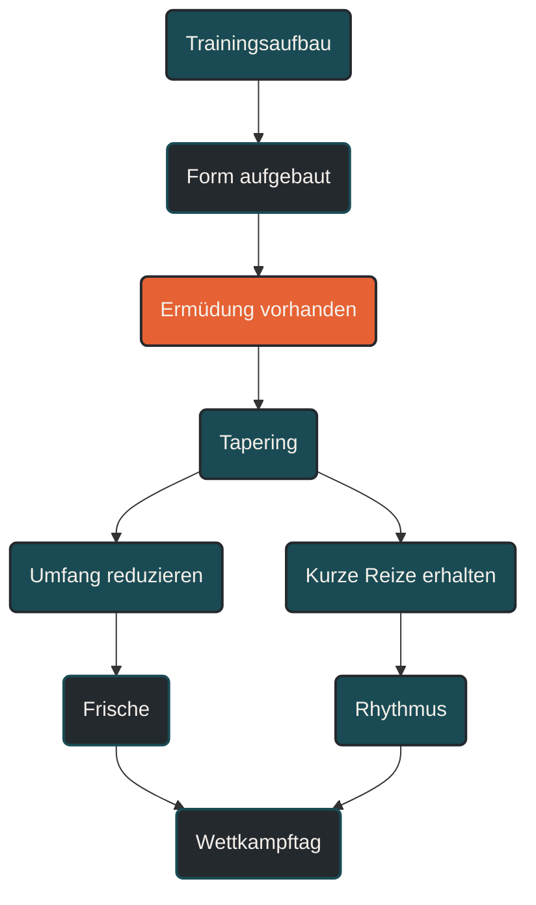

# Tapering

Tapering ist die geplante Reduktion der Trainingsbelastung vor einem wichtigen Wettkampf. Ziel ist es, angesammelte Ermüdung abzubauen, ohne die zuvor aufgebaute Leistungsfähigkeit zu verlieren. Ein gutes Tapering macht nicht fitter durch neues Training, sondern macht die vorhandene Form am Wettkampftag besser abrufbar.

## Was Tapering ist

Tapering beschreibt die letzte Entlastungsphase vor einem Zielwettkampf. In dieser Phase wird das Training bewusst reduziert. Der Körper soll frischer werden, Energiespeicher auffüllen, muskuläre Ermüdung abbauen und die Trainingsanpassungen der vorherigen Wochen stabilisieren.

Tapering ist kein zufälliges Wenigertrainieren. Es ist ein geplanter Teil der Periodisierung. Die Belastung wird gesenkt, aber wichtige Reize bleiben in reduzierter Form erhalten.

Der zentrale Gedanke lautet: Ermüdung soll sinken, Form soll bleiben.

## Warum Tapering wichtig ist

In den Wochen vor einem Wettkampf ist der Körper häufig gut trainiert, aber auch ermüdet. Umfang, lange Läufe, Tempoeinheiten, Krafttraining, Alltag und mentale Anspannung können sich aufaddieren.

Wenn diese Ermüdung bis zum Wettkampftag bestehen bleibt, kann die Leistungsfähigkeit nicht vollständig abgerufen werden. Die Form ist dann zwar aufgebaut, aber unter Müdigkeit verdeckt.

Tapering hilft, diese verdeckte Leistungsfähigkeit freizulegen. Der Athlet startet nicht mit maximalem Trainingsreiz, sondern mit möglichst guter Balance aus Fitness, Frische und spezifischer Aktivierung.

## Unterschied zwischen Tapering und Deload

Tapering und Deload ähneln sich, haben aber unterschiedliche Ziele.

Ein Deload entlastet innerhalb des Trainingsprozesses. Er bereitet den nächsten Trainingsblock vor.

Tapering entlastet vor einem Wettkampf. Es bereitet einen konkreten Leistungszeitpunkt vor.

Vereinfacht:

Deload bedeutet Erholung für weiteres Training.

Tapering bedeutet Frische für den Wettkampf.

## Was beim Tapering reduziert wird

Beim Tapering wird vor allem die Gesamtbelastung reduziert. Das kann über verschiedene Stellschrauben geschehen.

### Umfang reduzieren

Die wichtigste Stellschraube ist meistens der Trainingsumfang. Wochenkilometer, Trainingsstunden, Dauer der Einheiten und lange Läufe werden reduziert.

Dadurch sinkt die Gesamtmüdigkeit deutlich. Gleichzeitig bleibt die Bewegungsroutine erhalten.

### Intensität gezielt erhalten

Die Intensität wird nicht zwingend komplett gestrichen. Kurze, kontrollierte Abschnitte in höherem Tempo können sinnvoll sein, damit das Nervensystem, die Lauftechnik und das Wettkampfgefühl aktiv bleiben.

Entscheidend ist die Dosierung. Die Intensität soll aktivieren, nicht ermüden.

### Reizdichte reduzieren

Auch die Häufigkeit harter Reize wird reduziert. Zwischen anspruchsvolleren Abschnitten liegen mehr lockere Tage oder Ruhetage.

Dadurch kann sich der Körper erholen, ohne komplett aus dem Trainingsrhythmus zu fallen.

### Mechanische Belastung reduzieren

Im Lauftraining ist besonders wichtig, die mechanische Belastung zu senken. Lange Läufe, harte Bergabpassagen, sehr intensive Sprints, ungewohnte Kraftübungen oder plyometrische Reize sollten kurz vor dem Wettkampf vorsichtig eingesetzt oder vermieden werden.

Ziel ist, muskuläre Frische zu erzeugen und kleine Reizungen nicht in die Wettkampfwoche mitzunehmen.

## Wie lange Tapering dauert

Die Dauer hängt von Wettkampfdistanz, Trainingsumfang, Ermüdung, Leistungsstand und individueller Erholungsfähigkeit ab.

Kurze Wettkämpfe brauchen oft ein kürzeres Tapering. Längere Wettkämpfe wie Marathon, Ultramarathon oder lange Triathlons brauchen meist mehr Zeit, um Ermüdung abzubauen.

Typische Orientierungen sind:

* wenige Tage bis eine Woche bei kürzeren Wettkämpfen
* etwa ein bis zwei Wochen bei 5 km, 10 km oder Halbmarathon
* etwa zwei bis drei Wochen bei Marathon oder längeren Belastungen

Diese Werte sind keine starren Regeln. Entscheidend ist, wie stark die vorherige Trainingsbelastung war und wie gut der Athlet auf Entlastung reagiert.

## Tapering im Ausdauertraining

Im Ausdauertraining soll Tapering die zuvor aufgebauten Anpassungen erhalten. Dazu gehören aerobe Basis, Schwellenleistung, Bewegungsökonomie, muskuläre Belastbarkeit und wettkampfspezifisches Tempo.

Ein gutes Tapering reduziert deshalb nicht alles gleichmäßig. Es erhält wichtige Signale, aber senkt die Ermüdung.

Bei Läufern bedeutet das häufig:

* weniger Wochenkilometer
* kürzerer Long Run
* weniger Tempoumfang
* kurze Aktivierungen im Wettkampftempo
* mehr lockere Läufe
* zusätzliche Ruhetage
* keine ungewohnten Übungen
* Schlaf und Ernährung priorisieren

## Tapering vor kurzen Wettkämpfen

Vor kurzen Wettkämpfen wie 5 km oder 10 km steht oft die Frische des Nervensystems im Vordergrund. Die Beine sollen locker, reaktiv und schnell sein.

Der Umfang wird reduziert, aber kurze schnelle Abschnitte können erhalten bleiben. Diese Reize sollten nicht erschöpfen, sondern Spannung und Rhythmus erzeugen.

Ein häufiger Fehler ist, in der letzten Woche noch große Formverbesserungen erzwingen zu wollen. Kurz vor dem Wettkampf geht es nicht mehr um Aufbau, sondern um Abrufbarkeit.

## Tapering vor Halbmarathon

Beim Halbmarathon müssen Frische und Tempohärte zusammenkommen. Der Umfang wird reduziert, längere Tempoanteile werden verkürzt, und einige kontrollierte Abschnitte im geplanten Wettkampftempo können erhalten bleiben.

Ziel ist, das Renntempo vertraut zu halten, ohne die muskuläre und metabolische Ermüdung erneut stark zu erhöhen.

## Tapering vor Marathon

Beim Marathon ist Tapering besonders wichtig, weil die vorherige Trainingsphase meist hohe Umfänge, lange Läufe und spezifische Belastungen enthält.

In den letzten Wochen werden lange Läufe deutlich reduziert. Auch der Gesamtumfang sinkt. Gleichzeitig können kurze Abschnitte im Marathonrenntempo erhalten bleiben, damit Rhythmus, Pacing und Bewegungsgefühl stabil bleiben.

Ein Marathon-Tapering sollte auch Ernährung, Schlaf, Stressmanagement, Verpflegungstest und Materialplanung berücksichtigen. Kurz vor dem Marathon sollten keine neuen Schuhe, neuen Übungen oder ungewohnten Experimente eingeführt werden.

## Tapering und Peaking

Tapering und Peaking hängen eng zusammen. Tapering ist der Prozess der Entlastung. Peaking ist der angestrebte Zustand, in dem die Leistungsfähigkeit zum richtigen Zeitpunkt besonders gut abrufbar ist.

Tapering ist also ein Weg. Peaking ist das Ziel.

Ein gutes Tapering erhöht die Chance, dass Peaking gelingt. Es garantiert aber nicht automatisch Bestform, weil Schlaf, Stress, Ernährung, Tagesform, Gesundheit und Pacing ebenfalls eine Rolle spielen.

## Was im Körper während des Taperings passiert

Während des Taperings kann der Körper mehrere Dinge besser abschließen:

* muskuläre Reparatur
* Auffüllen von Glykogenspeichern
* Abbau von Restermüdung
* Stabilisierung des Nervensystems
* Normalisierung von Schlaf und Stressreaktion
* Wiederherstellung von Motivation und mentaler Frische
* Erhalt der Bewegungsökonomie durch kurze Aktivierungen

Das erklärt, warum sich Athleten nach einem guten Tapering oft leichter, frischer und reaktiver fühlen.

## Das Tapering-Gefühl

Tapering fühlt sich nicht immer sofort gut an. Manche Athleten werden nervös, weil sie weniger trainieren. Andere fühlen sich in den ersten Tagen träge, müde oder unruhig.

Das ist nicht ungewöhnlich. Der Körper stellt von Aufbau auf Erholung und Abrufbarkeit um. Wichtig ist, nicht aus Unsicherheit zusätzliches Training einzubauen.

Tapering verlangt Vertrauen in die vorherige Trainingsarbeit.

## Häufige Fehler beim Tapering

Ein häufiger Fehler ist, zu spät zu reduzieren. Dann bleibt zu viel Ermüdung bis zum Wettkampf bestehen.

Ein zweiter Fehler ist, zu stark zu reduzieren und jede Aktivierung zu streichen. Dann kann sich der Körper zwar erholen, aber Spannung, Rhythmus und Wettkampfgefühl können verloren gehen.

Ein dritter Fehler ist, in der Taperphase noch neue Reize zu setzen. Neue Schuhe, ungewohnte Kraftübungen, harte Sprints, lange Bergabläufe oder Experimente mit Ernährung können kurz vor dem Wettkampf mehr Risiko als Nutzen bringen.

Ein vierter Fehler ist, die frei werdende Zeit mit Stress zu füllen. Tapering funktioniert besser, wenn auch Schlaf, Alltag und mentale Belastung berücksichtigt werden.

## Praktische Einordnung

Tapering ist die Brücke zwischen Trainingsaufbau und Wettkampfleistung. Die harte Arbeit ist zu diesem Zeitpunkt weitgehend erledigt. Jetzt geht es darum, die Form nicht durch zu viel Ermüdung zu verdecken.

Der wichtigste Merksatz lautet: Tapering ist nicht weniger Training aus Bequemlichkeit, sondern gezielte Entlastung, damit die aufgebaute Leistungsfähigkeit am Wettkampftag verfügbar wird.

----

----

## Häufige Fragen zum Tapering

### Was ist Tapering einfach erklärt?

Tapering ist die geplante Reduktion der Trainingsbelastung vor einem Wettkampf. Ziel ist es, Ermüdung abzubauen und die vorhandene Form am Wettkampftag abrufbar zu machen.

### Bedeutet Tapering komplette Pause?

Nein. Tapering bedeutet meistens reduziertes Training, nicht vollständige Pause. Umfang und Belastung sinken, aber kurze aktivierende Reize können erhalten bleiben.

### Wie lange sollte Tapering dauern?

Das hängt von Wettkampfdistanz, Trainingsumfang und individueller Erholung ab. Für kürzere Wettkämpfe reichen oft wenige Tage bis etwa eine Woche. Für Marathon oder längere Belastungen sind häufig zwei bis drei Wochen sinnvoll.

### Was wird beim Tapering reduziert?

Meist wird vor allem der Trainingsumfang reduziert. Zusätzlich können lange Läufe, Tempoanteile, Krafttraining, Reizdichte und mechanische Belastung reduziert werden.

### Soll Intensität im Tapering erhalten bleiben?

Ja, oft in kleiner Dosierung. Kurze kontrollierte Abschnitte können helfen, Rhythmus und Spannung zu erhalten. Sie dürfen aber nicht so hart sein, dass neue Ermüdung entsteht.

### Warum fühle ich mich im Tapering manchmal schlecht?

Das ist nicht ungewöhnlich. Manche Athleten fühlen sich während der Entlastung zunächst träge, nervös oder unruhig. Der Körper stellt sich von Belastung auf Erholung und Wettkampfbereitschaft um.

### Verliere ich durch Tapering Form?

Ein sinnvoll geplantes Tapering führt normalerweise nicht zu Formverlust. Es hilft, die vorhandene Form sichtbar zu machen, weil angesammelte Ermüdung sinkt.

### Was ist der Unterschied zwischen Tapering und Deload?

Ein Deload entlastet innerhalb des Trainingsprozesses und bereitet den nächsten Trainingsblock vor. Tapering entlastet vor einem Wettkampf und bereitet einen konkreten Leistungszeitpunkt vor.

### Was ist der Unterschied zwischen Tapering und Peaking?

Tapering ist der Entlastungsprozess vor dem Wettkampf. Peaking ist der gewünschte Zustand, in dem die Leistungsfähigkeit zum richtigen Zeitpunkt besonders gut abrufbar ist.

### Wie sieht Tapering vor einem Marathon aus?

Vor einem Marathon werden meist Wochenumfang, lange Läufe und Tempoumfang reduziert. Kurze Abschnitte im Marathonrenntempo können erhalten bleiben, damit Rhythmus und Pacing stabil bleiben.

### Was ist der häufigste Fehler beim Tapering?

Ein häufiger Fehler ist, in der Taperphase aus Unsicherheit zu viel zu trainieren. Dadurch bleibt Restermüdung bestehen und die Leistungsfähigkeit kann am Wettkampftag schlechter abrufbar sein.

### Sollte man im Tapering neue Dinge ausprobieren?

Nein. Kurz vor dem Wettkampf sollten keine neuen Schuhe, ungewohnte Kraftübungen, neue Ernährungsexperimente oder neue Trainingsmethoden eingeführt werden.

### Warum ist Schlaf im Tapering wichtig?

Schlaf unterstützt Erholung, hormonelle Regulation, muskuläre Reparatur und mentale Frische. Tapering funktioniert besser, wenn auch Alltag und Schlaf berücksichtigt werden.

### Kann Tapering auch mental helfen?

Ja. Ein gutes Tapering kann mentale Frische zurückbringen, Wettkampfdruck senken und Vertrauen in die Vorbereitung stärken.

----

*Hinweis: Dieser Artikel dient der allgemeinen Information und ersetzt keine medizinische oder therapeutische Beratung. Mehr dazu im [**Gesundheits- und Quellenhinweis**](/ausdauersport/disclaimer/).*

