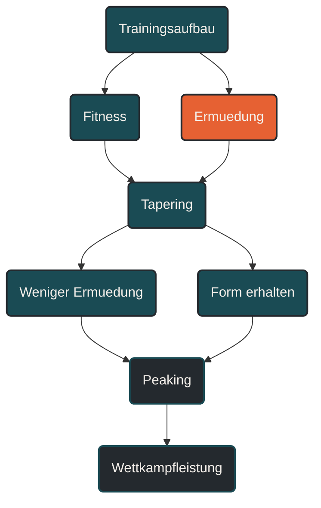

# Peaking

Peaking beschreibt den Zustand, in dem ein Athlet seine bestmögliche Leistungsfähigkeit zu einem bestimmten Zeitpunkt abrufen kann. Im Ausdauertraining entsteht Peaking durch langfristigen Trainingsaufbau, passende Spezifität, kontrollierte Entlastung, ausreichende Erholung und ein gutes Tapering vor dem Hauptwettkampf. [[1]](#quelle-1) [[2]](#quelle-2) [[3]](#quelle-3)

## Was Peaking bedeutet

Peaking bedeutet, dass die Form zum richtigen Zeitpunkt ihren Höhepunkt erreicht. Es geht nicht darum, dauerhaft in Bestform zu sein, sondern die Leistungsfähigkeit für einen bestimmten Wettkampf oder eine wichtige Leistungsüberprüfung optimal verfügbar zu machen. [[1]](#quelle-1) [[2]](#quelle-2)

Ein Peak entsteht nicht in den letzten Tagen vor dem Wettkampf. Er ist das Ergebnis des gesamten Trainingsaufbaus. Grundlagenphase, Aufbauphase, spezifische Vorbereitung, Deloads, Tapering, Regeneration, Ernährung, Schlaf und mentale Frische wirken zusammen. [[4]](#quelle-4) [[5]](#quelle-5) [[8]](#quelle-8) [[10]](#quelle-10)

Der zentrale Gedanke lautet: Die beste Leistung entsteht, wenn Fitness hoch und Ermüdung niedrig genug ist. [[1]](#quelle-1) [[2]](#quelle-2)

## Warum Peaking wichtig ist

Viele Athleten sind im Training gut vorbereitet, können ihre Leistung aber am Wettkampftag nicht vollständig abrufen. Der Grund liegt oft nicht in fehlender Fitness, sondern in falschem Timing. [[1]](#quelle-1) [[3]](#quelle-3)

Wenn die Belastung zu lange hoch bleibt, ist der Körper am Wettkampftag noch ermüdet. Wenn zu früh oder zu stark reduziert wird, kann Spannung, Rhythmus oder spezifisches Gefühl verloren gehen. Peaking versucht, genau diese Balance zu treffen. [[2]](#quelle-2) [[3]](#quelle-3) [[7]](#quelle-7)

Ziel ist ein Zustand, in dem der Athlet gleichzeitig trainiert, erholt, spezifisch vorbereitet und mental bereit ist.

## Peaking und Periodisierung

Peaking ist eng mit Periodisierung verbunden. Der langfristige Trainingsplan soll nicht nur allgemein fitter machen, sondern die Form zu einem bestimmten Zeitpunkt zuspitzen. [[4]](#quelle-4)

### Makrozyklus

Der Makrozyklus legt das Hauptziel fest. Er bestimmt, wann der Peak erreicht werden soll und welche Trainingsphasen dorthin führen. [[4]](#quelle-4)

### Mesozyklus

Die Mesozyklen entwickeln nacheinander wichtige Fähigkeiten, zum Beispiel aerobe Basis, Umfang, Schwelle, VO2max, Kraft, Tempohärte oder Wettkampfspezifik. [[4]](#quelle-4) [[12]](#quelle-12)

### Mikrozyklus

Die Mikrozyklen setzen diese Schwerpunkte in konkrete Trainingswochen um. Sie steuern Belastung, Entlastung, Qualitätseinheiten und Regeneration. [[4]](#quelle-4) [[6]](#quelle-6)

### Tapering

Das Tapering ist die letzte Entlastungsphase vor dem Wettkampf. Es reduziert Ermüdung und erhält wichtige Reize. Dadurch wird Peaking wahrscheinlicher. [[2]](#quelle-2) [[3]](#quelle-3) [[11]](#quelle-11)

## Peaking ist nicht Dauerform

Ein häufiger Irrtum ist die Vorstellung, man könne dauerhaft auf Peak-Niveau trainieren oder starten. Peakform ist zeitlich begrenzt. Sie entsteht durch Zuspitzung und kann nicht beliebig lange gehalten werden. [[1]](#quelle-1) [[7]](#quelle-7)

Wer versucht, wochen- oder monatelang in Bestform zu bleiben, riskiert Stagnation, mentale Ermüdung, Überlastung oder Leistungsabfall. [[7]](#quelle-7)

Deshalb werden Wettkämpfe meist priorisiert:

* Hauptwettkampf
* Vorbereitungswettkampf
* Trainingswettkampf
* Testlauf

Nicht jeder Wettkampf braucht einen vollständigen Peak.

## Was Peaking beeinflusst

Peaking hängt von mehreren Faktoren ab.

### Trainingsfitness

Die Grundlage ist die zuvor aufgebaute Leistungsfähigkeit. Ohne ausreichend Training gibt es wenig, was durch Tapering oder Entlastung freigelegt werden kann. [[1]](#quelle-1) [[2]](#quelle-2)

### Restermüdung

Zu viel Restermüdung verhindert, dass Fitness sichtbar wird. Peaking braucht deshalb gezielte Entlastung, aber keine vollständige Inaktivität. [[1]](#quelle-1) [[2]](#quelle-2) [[3]](#quelle-3)

### Spezifität

Die Vorbereitung muss zur Zielbelastung passen. Ein Marathon-Peak verlangt andere Reize als ein 5-km-Peak, ein Trailrennen oder ein Triathlon. [[4]](#quelle-4) [[9]](#quelle-9)

### Timing

Der Zeitpunkt der Entlastung ist entscheidend. Wird zu spät reduziert, bleibt Ermüdung. Wird zu früh reduziert, kann die spezifische Spannung sinken. [[2]](#quelle-2) [[3]](#quelle-3) [[11]](#quelle-11)

### Erholung

Schlaf, Ernährung, Flüssigkeit, mentale Ruhe und Alltagsstress beeinflussen stark, ob die Form tatsächlich abrufbar ist. [[8]](#quelle-8) [[9]](#quelle-9) [[10]](#quelle-10)

### Gesundheit

Kleine Beschwerden, Infekte oder ungewohnte Reize kurz vor dem Wettkampf können Peaking stören. Deshalb sollte die letzte Phase möglichst stabil und risikoarm gestaltet werden. [[6]](#quelle-6) [[7]](#quelle-7)

## Peaking im Ausdauertraining

Im Ausdauertraining ist Peaking besonders anspruchsvoll, weil mehrere Systeme zusammenpassen müssen:

* Herz-Kreislauf-System
* Energiestoffwechsel
* muskuläre Belastbarkeit
* Bewegungsökonomie
* Nervensystem
* Pacing
* Ernährung
* mentale Steuerung

Ein guter Peak bedeutet nicht nur, schnell zu sein. Es bedeutet, die Zielbelastung ökonomisch, kontrolliert und mit möglichst wenig unnötiger Ermüdung abrufen zu können. [[1]](#quelle-1) [[6]](#quelle-6)

## Peaking für kurze Wettkämpfe

Bei kurzen Wettkämpfen wie 5 Kilometer oder 10 Kilometer stehen Frische, Reaktivität, Laufökonomie, VO2max-nahe Leistungsfähigkeit und Renntempo im Vordergrund. [[2]](#quelle-2) [[11]](#quelle-11)

Das Tapering ist meist kürzer. Kurze schnelle Abschnitte können helfen, Spannung zu erhalten. Zu viel Umfang oder zu harte Intervalle kurz vor dem Rennen können den Peak jedoch verdecken. [[2]](#quelle-2) [[3]](#quelle-3)

Ziel ist, sich am Start wach, locker und schnell zu fühlen.

## Peaking für Halbmarathon

Beim Halbmarathon müssen Tempohärte, Schwellenleistung und Frische zusammenkommen. Der Athlet braucht genug Erholung, darf aber das Gefühl für das Zieltempo nicht verlieren. [[2]](#quelle-2) [[4]](#quelle-4)

Kurze kontrollierte Abschnitte im Halbmarathontempo können sinnvoll sein. Lange ermüdende Tempoeinheiten sollten in der unmittelbaren Wettkampfwoche vermieden werden.

## Peaking für Marathon

Beim Marathon ist Peaking besonders stark von Ermüdungsmanagement abhängig. Die Vorbereitung enthält meist lange Läufe, hohe Umfänge und spezifische Belastungen. Diese Reize bauen Form auf, erzeugen aber auch deutliche Restermüdung. [[6]](#quelle-6) [[9]](#quelle-9) [[13]](#quelle-13)

Ein Marathon-Peak entsteht, wenn lange Läufe, Marathonpace, Energieversorgung, muskuläre Belastbarkeit und mentale Stabilität vorbereitet sind, während die Ermüdung durch Tapering deutlich reduziert wurde. [[2]](#quelle-2) [[3]](#quelle-3) [[8]](#quelle-8) [[13]](#quelle-13)

Wichtig sind außerdem:

* gefüllte Glykogenspeicher
* stabile Verdauung
* erprobte Wettkampfernährung
* passendes Material
* ruhiger Schlaf
* realistisches Pacing

Kurz vor dem Marathon sollten keine Experimente mehr stattfinden. [[8]](#quelle-8) [[9]](#quelle-9)

## Peaking für Trail und Ultra

Bei Trail- und Ultrabelastungen bedeutet Peaking nicht nur maximale Geschwindigkeit. Entscheidend sind Belastbarkeit, muskuläre Ermüdungsresistenz, bergauf- und bergab-spezifische Fähigkeiten, Ernährung, mentale Ruhe und Materialroutine. [[6]](#quelle-6) [[8]](#quelle-8) [[9]](#quelle-9)

Der Peak ist hier oft weniger explosiv und stärker auf Stabilität ausgerichtet. Ziel ist, lange leistungsfähig zu bleiben, statt nur kurzfristig maximale Intensität abzurufen.

## Peaking und mentale Frische

Peaking ist nicht nur körperlich. Mentale Frische spielt eine große Rolle. Ein Athlet kann körperlich vorbereitet sein, aber durch Stress, Unsicherheit, Überanalyse oder Wettkampfdruck blockiert werden. [[10]](#quelle-10)

Eine gute Peakphase reduziert deshalb nicht nur Trainingsbelastung, sondern auch unnötige Komplexität. Der Plan wird einfacher. Die wichtigsten Abläufe sind bekannt. Material, Ernährung, Pacing und Logistik sind geklärt.

Mentale Ruhe entsteht durch Vorbereitung, nicht durch kurzfristige Kontrolle.

## Peaking und Formgefühl

Viele Athleten erwarten, dass sie sich in der Peakphase jeden Tag hervorragend fühlen. Das ist nicht realistisch. Manche fühlen sich während des Taperings zeitweise träge, nervös oder ungewohnt unausgelastet. [[2]](#quelle-2) [[10]](#quelle-10)

Peaking zeigt sich oft erst am Wettkampftag oder in kurzen Aktivierungen davor. Deshalb sollte das tägliche Körpergefühl nicht überinterpretiert werden.

Wichtig ist die Gesamttendenz:

* weniger schwere Beine
* bessere Motivation
* stabiler Schlaf
* mehr Bewegungsfreude
* gute Reaktion auf kurze Aktivierungen
* keine neuen Beschwerden

## Wie lange ein Peak anhält

Ein Peak ist zeitlich begrenzt. Je nach Sportart, Trainingszustand und Belastung kann er wenige Tage bis einige Wochen nutzbar sein. Ein einzelner Hauptwettkampf lässt sich gezielter ansteuern als eine lange Serie wichtiger Wettkämpfe. [[1]](#quelle-1) [[2]](#quelle-2) [[12]](#quelle-12)

Wenn mehrere Wettkämpfe eng beieinander liegen, muss entschieden werden, ob die Form gehalten, neu aufgebaut oder nach einem Hauptwettkampf bewusst entlastet wird.

## Mehrere Peaks pro Saison

Mehrere Peaks pro Saison sind möglich, aber begrenzt. Jeder Peak benötigt Aufbau, Zuspitzung, Entlastung und Erholung. Wer zu viele Hauptziele setzt, verliert häufig die klare Struktur. [[4]](#quelle-4) [[12]](#quelle-12)

Sinnvoll ist eine Hierarchie:

* ein oder zwei Hauptziele
* mehrere Vorbereitungswettkämpfe
* Trainingswettkämpfe ohne vollständigen Peak

So bleibt der Makrozyklus steuerbar.

## Häufige Fehler beim Peaking

Ein häufiger Fehler ist, zu lange hart zu trainieren. Aus Angst, Form zu verlieren, wird die Belastung bis kurz vor dem Wettkampf hochgehalten. Dadurch bleibt Ermüdung bestehen. [[2]](#quelle-2) [[7]](#quelle-7)

Ein zweiter Fehler ist, zu früh komplett herauszunehmen. Dann sinkt zwar Müdigkeit, aber auch Spannung, Rhythmus und Wettkampfgefühl können verloren gehen. [[2]](#quelle-2) [[3]](#quelle-3)

Ein dritter Fehler ist, den Peak mit neuen Reizen erzwingen zu wollen. Neue Schuhe, neue Ernährung, ungewohnte Kraftübungen, harte Sprints oder Experimente kurz vor dem Wettkampf erhöhen das Risiko. [[6]](#quelle-6) [[8]](#quelle-8)

Ein vierter Fehler ist, jeden Wettkampf als Hauptwettkampf zu behandeln. Dadurch fehlt langfristig die klare Priorisierung.

## Praktische Einordnung

Peaking ist kein einzelner Trick in der Wettkampfwoche. Es ist das Ergebnis einer gut geplanten Periodisierung. Der Peak entsteht, wenn die langfristig aufgebaute Fitness durch passende Entlastung, Spezifität, Erholung und mentale Ruhe zum richtigen Zeitpunkt verfügbar wird. [[1]](#quelle-1) [[2]](#quelle-2) [[4]](#quelle-4) [[10]](#quelle-10)

Der wichtigste Merksatz lautet: Peaking bedeutet nicht, in letzter Minute Form aufzubauen, sondern die vorhandene Form zum richtigen Zeitpunkt freizulegen.

----

----

## Häufige Fragen zum Peaking

### Was ist Peaking einfach erklärt?

Peaking bedeutet, die bestmögliche Leistungsfähigkeit zu einem bestimmten Zeitpunkt abrufen zu können. Im Sport ist damit meist der Hauptwettkampf gemeint.

### Was ist der Unterschied zwischen Peaking und Tapering?

Tapering ist der Entlastungsprozess vor dem Wettkampf. Peaking ist der gewünschte Zustand, in dem die Form am Wettkampftag besonders gut abrufbar ist.

### Kann man dauerhaft in Peakform sein?

Nein. Peakform ist zeitlich begrenzt. Wer versucht, dauerhaft in Bestform zu bleiben, riskiert Restermüdung, Stagnation, mentale Ermüdung oder Überlastung.

### Wie entsteht ein Peak?

Ein Peak entsteht durch langfristigen Trainingsaufbau, passende Spezifität, geplante Entlastung, gutes Tapering, Erholung, stabile Gesundheit und mentale Frische.

### Wie lange hält ein Peak an?

Das ist individuell unterschiedlich. Ein Peak kann wenige Tage bis einige Wochen nutzbar sein. Je gezielter ein Hauptwettkampf vorbereitet wird, desto präziser kann der Peak gesetzt werden.

### Kann man mehrere Peaks pro Saison planen?

Ja, aber nur begrenzt. Jeder Peak braucht Aufbau, Zuspitzung und Erholung. Zu viele Hauptziele machen die Saison schwer steuerbar.

### Was ist ein Hauptwettkampf?

Ein Hauptwettkampf ist der wichtigste Wettkampf eines Trainingsblocks oder einer Saison. Auf ihn wird die Periodisierung besonders ausgerichtet.

### Muss jeder Wettkampf mit Peaking vorbereitet werden?

Nein. Viele Wettkämpfe können als Trainingswettkampf oder Vorbereitungswettkampf genutzt werden. Nicht jeder Start braucht vollständiges Peaking.

### Was stört Peaking am häufigsten?

Häufige Störfaktoren sind zu spätes Reduzieren der Belastung, zu viel Restermüdung, schlechter Schlaf, Stress, Krankheit, neue Beschwerden oder Experimente kurz vor dem Wettkampf.

### Warum fühle ich mich in der Peakphase nicht immer gut?

Während der Entlastung kann sich der Körper ungewohnt anfühlen. Manche Athleten werden nervös, träge oder unruhig. Das bedeutet nicht automatisch, dass der Peak misslingt.

### Wie erkenne ich, ob Peaking funktioniert?

Hinweise sind bessere Frische, stabile Motivation, gute Reaktion auf kurze Aktivierungen, weniger schwere Beine, kein neues Beschwerdebild und ein vertrautes Gefühl für das Wettkampftempo.

### Was bedeutet Peaking im Marathontraining?

Im Marathontraining bedeutet Peaking, dass lange Läufe, Marathonpace, Energieversorgung und muskuläre Belastbarkeit vorbereitet sind, während die Ermüdung durch Tapering reduziert wurde.

### Was bedeutet Peaking bei kurzen Distanzen?

Bei kurzen Distanzen stehen Frische, Reaktivität, Laufökonomie und Renntempo im Vordergrund. Der Umfang wird reduziert, kurze schnelle Reize können aber erhalten bleiben.

### Was ist der häufigste Fehler beim Peaking?

Der häufigste Fehler ist, kurz vor dem Wettkampf noch Form erzwingen zu wollen. In der Peakphase geht es nicht mehr um maximalen Aufbau, sondern um Abrufbarkeit.

----

## Quellen

### Quelle 1

Banister, E. W., Calvert, T. W., Savage, M. V. & Bach, T. M. (1975): A systems model of training for athletic performance. Australian Journal of Sports Medicine, 7(3), 57–61.  
Quelle: [BISp/SURF](https://www.bisp-surf.de/Record/PU197803006101/Solr)

### Quelle 2

Mujika, I. & Padilla, S. (2003): Scientific bases for precompetition tapering strategies. Medicine & Science in Sports & Exercise, 35(7), 1182–1187.  
Quelle: [IAT-LIDA](https://lida.sport-iat.de/twm/Record/4008668), [UPV/EHU](https://ekoizpen-zientifikoa.ehu.eus/documentos/6145ad5065b6b477913b5c8a)

### Quelle 3

Bosquet, L., Montpetit, J., Arvisais, D. & Mujika, I. (2007): Effects of tapering on performance: A meta-analysis. Medicine & Science in Sports & Exercise, 39(8), 1358–1365.  
Quelle: [UPV/EHU](https://ekoizpen-zientifikoa.ehu.eus/documentos/5ef240d32999526d9672008b)

### Quelle 4

Lorenz, D. S., Reiman, M. P. & Walker, J. C. (2010): Periodization: Current review and suggested implementation for athletic rehabilitation. Sports Health, 2(6), 509–518.  
Quelle: [PubMed](https://pubmed.ncbi.nlm.nih.gov/23015982/)

### Quelle 5

Issurin, V. (2008): Block periodization versus traditional training theory: A review. Journal of Sports Medicine and Physical Fitness, 48(1), 65–75.  
Quelle: [Europe PMC](https://europepmc.org/abstract/MED/18212712), [Minerva Medica](https://www.minervamedica.it/en/journals/sports-med-physical-fitness/article.php?cod=R40Y2008N01A0065)

### Quelle 6

Bourdon, P. C., Cardinale, M., Murray, A. et al. (2017): Monitoring athlete training loads: Consensus statement. International Journal of Sports Physiology and Performance, 12(Suppl 2), S2-161–S2-170.  
Quelle: [Human Kinetics](https://journals.humankinetics.com/view/journals/ijspp/12/s2/article-pS2-161.xml), [University of Birmingham](https://research.birmingham.ac.uk/en/publications/monitoring-athlete-training-loads-consensus-statement/)

### Quelle 7

Meeusen, R., Duclos, M., Foster, C. et al. (2013): Prevention, diagnosis, and treatment of the overtraining syndrome: Joint consensus statement of the European College of Sport Science and the American College of Sports Medicine. Medicine & Science in Sports & Exercise, 45(1), 186–205.  
Quelle: [PubMed](https://pubmed.ncbi.nlm.nih.gov/23247672/), [Loughborough University Repository](https://repository.lboro.ac.uk/articles/journal_contribution/Prevention_diagnosis_and_treatment_of_the_overtraining_syndrome_Joint_consensus_statement_of_the_European_College_of_Sport_Science_ECSS_and_the_American_College_of_Sports_Medicine_ACSM_/9627380)

### Quelle 8

Thomas, D. T., Erdman, K. A. & Burke, L. M. (2016): Position of the Academy of Nutrition and Dietetics, Dietitians of Canada, and the American College of Sports Medicine: Nutrition and athletic performance. Journal of the Academy of Nutrition and Dietetics, 116(3), 501–528.  
Quelle: [Journal of the Academy of Nutrition and Dietetics](https://www.jandonline.org/article/S2212-2672%2815%2901802-X/fulltext), [ScienceDirect](https://www.sciencedirect.com/science/article/abs/pii/S221226721501802X)

### Quelle 9

Jeukendrup, A. E. (2011): Nutrition for endurance sports: Marathon, triathlon, and road cycling. Journal of Sports Sciences, 29(sup1), S91–S99.  
Quelle: [PubMed](https://pubmed.ncbi.nlm.nih.gov/21916794/), [Taylor & Francis PDF](https://www.tandfonline.com/doi/pdf/10.1080/02640414.2011.610348)

### Quelle 10

Fullagar, H. H. K., Skorski, S., Duffield, R. et al. (2015): Sleep and athletic performance: The effects of sleep loss on exercise performance, and physiological and cognitive responses to exercise. Sports Medicine, 45, 161–186.  
Quelle: [PubMed](https://pubmed.ncbi.nlm.nih.gov/25315456/), [Springer PDF](https://link.springer.com/content/pdf/10.1007/s40279-014-0260-0.pdf)

### Quelle 11

Wang, J., Soh, K. G., Samsudin, S. et al. (2023): Effects of tapering on performance in endurance athletes: A systematic review and meta-analysis. PLOS ONE, 18(5), e0282838.  
Quelle: [PubMed](https://pubmed.ncbi.nlm.nih.gov/37163550/), [PLOS ONE PDF](https://journals.plos.org/plosone/article/file?id=10.1371%2Fjournal.pone.0282838&type=printable)

### Quelle 12

Muniz-Pumares, D. et al. (2024): The training intensity distribution of marathon runners across performance levels. Sports Medicine.  
Quelle: [Springer](https://link.springer.com/article/10.1007/s40279-024-02137-7), [Springer PDF](https://link.springer.com/content/pdf/10.1007/s40279-024-02137-7.pdf)

### Quelle 13

Santos-Lozano, A. et al. (2024): Pacing strategies in marathons: A systematic review. Heliyon.  
Quelle: [ScienceDirect](https://www.sciencedirect.com/science/article/pii/S2405844024127910), [PMC](https://www.ncbi.nlm.nih.gov/pmc/articles/PMC11400961/)

*Hinweis: Dieser Artikel dient der allgemeinen Information und ersetzt keine medizinische oder therapeutische Beratung. Mehr dazu im [**Gesundheits- und Quellenhinweis**](/ausdauersport/disclaimer/).*

