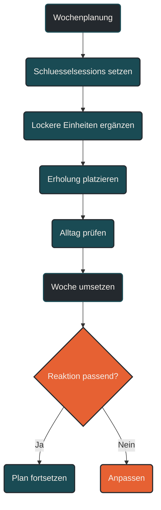

# Wochenplanung

Wochenplanung beschreibt die konkrete Organisation einer Trainingswoche. Sie legt fest, wann lockere Einheiten, Qualitätseinheiten, lange Läufe, Krafttraining, Ruhetage und Erholung stattfinden. Eine gute Wochenplanung verteilt Belastung so, dass Trainingsreize wirken können, ohne dauerhaft Restermüdung, Überlastung oder Qualitätsverlust zu erzeugen. [[1]](#quelle-1) [[2]](#quelle-2) [[3]](#quelle-3)

## Was Wochenplanung bedeutet

Wochenplanung ist die praktische Ebene der Trainingsplanung. Sie übersetzt langfristige Ziele in konkrete Tage, Einheiten und Erholungsphasen.

Während Jahresplanung und Periodisierung den großen Rahmen festlegen, entscheidet die Wochenplanung, wie Training im Alltag tatsächlich umgesetzt wird. Sie beantwortet Fragen wie:

Wann findet die harte Einheit statt?

Wann ist ein lockerer Lauf sinnvoll?

Wo passt der lange Lauf hinein?

Wann braucht der Körper Erholung?

Wie lassen sich Training, Beruf, Familie, Schlaf und Stress miteinander vereinbaren?

Eine gute Trainingswoche ist deshalb nicht nur sportlich sinnvoll, sondern auch realistisch.

## Warum Wochenplanung wichtig ist

Ausdauertraining wirkt nicht durch einzelne isolierte Einheiten. Entscheidend ist, wie Einheiten innerhalb einer Woche zusammenwirken. [[1]](#quelle-1)

Eine harte Intervalleinheit kann sinnvoll sein. Wenn sie aber direkt nach einem langen Lauf, schlechtem Schlaf und hoher Alltagsbelastung geplant wird, kann sie schlecht verarbeitet werden. Ein lockerer Dauerlauf kann sinnvoll sein. Wenn er aber zu schnell gelaufen wird, stört er möglicherweise die nächste Schlüsselsession.

Wochenplanung sorgt dafür, dass Belastung, Erholung und Trainingsziel zusammenpassen.

## Grundprinzip einer Trainingswoche

Eine Trainingswoche sollte nicht aus möglichst vielen harten Einheiten bestehen. Sie braucht eine klare Struktur.

Typische Bestandteile sind:

* lockere Ausdauereinheiten
* eine oder wenige Qualitätseinheiten
* ein längerer Lauf oder längere Ausdauereinheit
* Erholungstage oder sehr leichte Tage
* optional Krafttraining, Technik oder Mobilität
* ausreichend Abstand zwischen intensiven Reizen

Der wichtigste Gedanke lautet: Nicht jeder Tag muss einen starken Trainingsreiz setzen. Manche Tage dienen der Verarbeitung.

## Belastung und Erholung verteilen

Eine gute Wochenplanung verteilt Belastung so, dass der Körper Reize verarbeiten kann.

Harte Einheiten, lange Läufe, intensive Bergreize, Tempodauerläufe oder schweres Krafttraining sollten nicht beliebig aneinandergereiht werden. Sie erzeugen Ermüdung und brauchen Abstand. [[2]](#quelle-2) [[5]](#quelle-5)

Lockere Tage, Ruhetage oder sehr leichte Einheiten sind keine Lücken im Plan. Sie ermöglichen, dass die harten Reize überhaupt wirken.

Eine Woche mit weniger Training kann wirksamer sein als eine vollgepackte Woche, wenn die Qualität und Verarbeitung besser sind.

## Schlüsselsessions in der Wochenplanung

Schlüsselsessions sind die wichtigsten Einheiten einer Trainingswoche. Sie verfolgen ein klares Ziel, zum Beispiel Schwellenentwicklung, VO2max, Marathonpace, langer Lauf oder spezifische Wettkampfvorbereitung.

Eine Wochenplanung sollte zuerst diese Schlüsselsessions platzieren. Danach werden lockere Einheiten, Krafttraining und Erholung darum herum organisiert.

Beispiele für Schlüsselsessions sind:

* Intervalltraining
* Tempodauerlauf
* langer Lauf
* Berglauf
* Marathonpace-Abschnitte
* Technik- oder Kraftschwerpunkt
* wettkampfspezifische Einheit

Nicht jede Woche braucht viele Schlüsselsessions. Für viele Athleten reichen ein bis zwei wichtige Reize pro Woche.

## Lockere Einheiten

Lockere Einheiten bilden die Grundlage vieler Trainingswochen. Sie verbessern aerobe Basis, Belastungsverträglichkeit und Wiederholbarkeit, ohne zu viel zusätzliche Ermüdung zu erzeugen.

Wichtig ist, dass lockere Einheiten wirklich locker bleiben. [[4]](#quelle-4) Wenn sie regelmäßig zu schnell gelaufen werden, verschieben sie die gesamte Wochenbelastung nach oben.

Dann entsteht häufig das Problem, dass harte Einheiten nicht mehr hochwertig ausgeführt werden können und Erholungstage nicht ausreichend wirken.

## Qualitätseinheiten

Qualitätseinheiten sind gezielte Einheiten mit höherem Reizziel. Dazu gehören Intervalle, Schwellenläufe, Tempoblöcke, Bergintervalle oder wettkampfspezifische Abschnitte.

Sie sollten so geplant werden, dass der Athlet frisch genug ist, um sie sauber auszuführen. Eine Qualitätseinheit, die dauerhaft unter starker Restermüdung absolviert wird, verliert an Wirkung und erhöht das Risiko für Überlastung.

Qualität braucht Abstand. Deshalb ist der Tag vor und nach einer intensiven Einheit oft entscheidend.

## Der lange Lauf

Der lange Lauf ist in vielen Ausdauerplänen eine zentrale Einheit. Er entwickelt aerobe Basis, muskuläre Ermüdungsresistenz, Energieversorgung, mentale Stabilität und Belastungsverträglichkeit.

In der Wochenplanung sollte der lange Lauf nicht isoliert betrachtet werden. Er ist oft eine Schlüsselsession und braucht deshalb passende Vorbereitung und Erholung.

Wenn der lange Lauf sehr lang, hügelig, schnell oder mit Endbeschleunigung geplant ist, steigt seine Belastung deutlich. Dann sollte die Woche entsprechend entlastet werden.

## Ruhetage

Ruhetage sind ein aktiver Bestandteil der Wochenplanung. Sie helfen, Ermüdung abzubauen, Gewebe zu reparieren, Energiespeicher aufzufüllen und das Nervensystem zu entlasten.

Ein Ruhetag bedeutet nicht, dass Training verpasst wird. Er kann die Voraussetzung dafür sein, dass die nächsten Einheiten besser wirken.

Besonders bei Einsteigern, älteren Athleten, hoher Alltagsbelastung, steigenden Umfängen oder beginnenden Beschwerden sind Ruhetage wichtig.

## Krafttraining in der Trainingswoche

Krafttraining kann im Ausdauertraining sinnvoll sein, wenn es passend platziert wird. [[7]](#quelle-7) Es kann Rumpfstabilität, Belastbarkeit, Laufökonomie, Sehnenbelastbarkeit und Verletzungsprävention unterstützen.

In der Wochenplanung sollte Krafttraining aber nicht zufällig ergänzt werden. Schweres Krafttraining kann muskuläre Ermüdung erzeugen und die Qualität von Lauf- oder Radeinheiten beeinflussen.

Praktisch sinnvoll ist häufig, Krafttraining nicht direkt vor der wichtigsten Laufeinheit zu platzieren. Je nach Ziel kann es an einem Belastungstag ergänzt werden, damit leichte Tage wirklich leicht bleiben.

## Wochenplanung und Trainingshäufigkeit

Die Trainingshäufigkeit bestimmt, wie viele Einheiten pro Woche stattfinden. Mehr Einheiten sind nicht automatisch besser.

Wichtig ist, ob der Athlet sie gut verarbeiten kann. Drei gut geplante Einheiten können sinnvoller sein als sechs schlecht verteilte Einheiten.

Mit steigender Trainingshäufigkeit wird die Verteilung wichtiger. Je mehr Einheiten geplant sind, desto klarer müssen Intensität, Erholung und Schwerpunkte getrennt werden.

## Wochenplanung und Trainingsumfang

Der Trainingsumfang beschreibt die gesamte Trainingsmenge einer Woche. Er kann über Kilometer, Stunden, Höhenmeter oder Anzahl der Einheiten erfasst werden.

Eine Wochenplanung sollte den Umfang nicht nur sammeln, sondern sinnvoll verteilen. Ein zu großer Anteil auf wenigen Tagen kann mechanisch belastend sein. Zu viele mittellange, mittelharte Einheiten können dauerhaft ermüden.

Der Umfang sollte zum Ziel, Trainingsstand und Alltag passen.

## Wochenplanung und Intensitätsverteilung

Eine gute Woche hat eine klare Intensitätsverteilung. Nicht jede Einheit sollte im mittleren Bereich landen.

Typisch sinnvoll ist eine Struktur aus vielen lockeren Anteilen und wenigen gezielten intensiven oder moderaten Reizen. Ob die Verteilung eher polarisiert oder pyramidal ist, hängt von Ziel, Trainingsphase und Athlet ab.

Entscheidend ist, dass die Intensitäten bewusst gewählt werden. Zufällig mittelhartes Training ist häufig ein Zeichen schlechter Wochenplanung.

## Wochenplanung für Einsteiger

Einsteiger profitieren von einfachen und stabilen Wochenstrukturen. Ziel ist zunächst Regelmäßigkeit, lockere Belastbarkeit und Erholung.

Eine Einsteigerwoche kann zum Beispiel aus zwei bis vier Ausdauereinheiten bestehen, ergänzt durch Mobilität oder leichtes Krafttraining. Intensive Einheiten sollten vorsichtig eingesetzt werden.

Wichtiger als Komplexität ist Wiederholbarkeit. Der Körper muss lernen, regelmäßige Belastung zu tolerieren.

## Wochenplanung für Fortgeschrittene

Fortgeschrittene Athleten können mehr Umfang und mehr Struktur verarbeiten. Gleichzeitig steigt das Risiko, zu viele Ziele in eine Woche zu packen.

Eine fortgeschrittene Woche enthält oft ein bis zwei Qualitätseinheiten, einen langen Lauf, mehrere lockere Einheiten und ergänzendes Krafttraining.

Entscheidend ist, dass nicht jede Einheit wichtig sein darf. Wenn zu viele Einheiten Schlüsselsessions werden, fehlt echte Erholung.

## Wochenplanung im Marathontraining

Im Marathontraining spielt die Wochenplanung eine besondere Rolle, weil lange Läufe, Umfang, Marathonpace, Regeneration und Alltag zusammenpassen müssen.

Eine typische Marathonwoche kann enthalten:

* mehrere lockere Läufe
* einen langen Lauf
* eine spezifische Qualitätseinheit
* eventuell Marathonpace-Abschnitte
* Kraft- oder Stabilisationstraining
* klare Erholungstage

Der lange Lauf ist oft die zentrale Einheit. Deshalb sollte die restliche Woche nicht so hart sein, dass der lange Lauf nur noch unter starker Restermüdung absolviert wird.

## Wochenplanung bei hoher Alltagsbelastung

Training muss zum Leben passen. Beruf, Familie, Schlaf, Stress, Reisen und mentale Belastung beeinflussen die Erholungsfähigkeit. [[8]](#quelle-8)

Bei hoher Alltagsbelastung sollte die Wochenplanung einfacher und flexibler sein. Harte Einheiten können verschoben, Umfang reduziert oder lockere Alternativen genutzt werden.

Ein Plan, der nur unter perfekten Bedingungen funktioniert, ist in der Praxis oft kein guter Plan.

## Flexible Wochenplanung

Eine gute Wochenplanung ist strukturiert, aber nicht starr. Sie gibt eine Richtung vor, lässt aber Anpassungen zu.

Wenn Schlaf schlecht war, Beschwerden auftreten oder der Alltag unerwartet belastet, kann eine harte Einheit verschoben werden. Wenn sich der Körper sehr gut erholt anfühlt, kann eine geplante Einheit normal umgesetzt werden.

Flexibilität bedeutet nicht Beliebigkeit. Sie bedeutet, dass der Plan auf die tatsächliche Reaktion des Körpers reagieren darf.

## Häufige Fehler in der Wochenplanung

Ein häufiger Fehler ist, zu viele harte Einheiten in eine Woche zu legen. [[5]](#quelle-5) [[6]](#quelle-6) Dadurch sinkt die Qualität, und Restermüdung steigt.

Ein zweiter Fehler ist, lockere Einheiten zu schnell zu laufen. Dadurch wird die gesamte Woche belastender als geplant.

Ein dritter Fehler ist, Ruhetage zu streichen, weil sie sich unproduktiv anfühlen.

Ein vierter Fehler ist, Krafttraining ungünstig vor Schlüsselsessions zu platzieren.

Ein fünfter Fehler ist, Alltagsstress nicht als Belastung zu berücksichtigen.

Ein sechster Fehler ist, jede Woche gleich zu planen, obwohl Trainingsphase, Ziel und Erholung unterschiedliche Anforderungen stellen.

## Praktische Einordnung

Wochenplanung ist die Schnittstelle zwischen Trainingsziel und Alltag. Sie entscheidet, ob gute Trainingsideen tatsächlich wirksam umgesetzt werden können.

Der wichtigste Merksatz lautet: Eine gute Trainingswoche ist nicht die Woche mit maximal vielen Einheiten, sondern die Woche mit sinnvoll verteilten Reizen, ausreichender Erholung und hoher Wiederholbarkeit.

----

----

## Häufige Fragen zur Wochenplanung

### Was bedeutet Wochenplanung im Training?

Wochenplanung bedeutet, Trainingseinheiten, Erholung, Intensität, Umfang und Alltag innerhalb einer Woche sinnvoll zu organisieren. Sie legt fest, wann wichtige Reize und wann Erholung stattfinden.

### Warum ist Wochenplanung wichtig?

Wochenplanung sorgt dafür, dass Trainingsreize verarbeitet werden können. Sie verhindert, dass harte Einheiten, lange Läufe und Alltag so ungünstig zusammenfallen, dass dauerhaft Restermüdung entsteht.

### Wie viele harte Einheiten pro Woche sind sinnvoll?

Das hängt von Trainingsstand, Ziel, Umfang und Erholung ab. Für viele Ausdauerathleten reichen ein bis zwei harte oder besonders wichtige Einheiten pro Woche.

### Was ist eine Schlüsselsession?

Eine Schlüsselsession ist eine besonders wichtige Einheit mit klarem Trainingsziel, zum Beispiel Intervalltraining, Tempodauerlauf, langer Lauf oder wettkampfspezifische Einheit.

### Sollte der lange Lauf als harte Einheit zählen?

Ja, häufig schon. Auch wenn der lange Lauf locker ist, kann er durch Dauer und mechanische Belastung eine große Gesamtbelastung erzeugen.

### Warum sollten lockere Einheiten wirklich locker sein?

Lockere Einheiten sollen aerobe Reize setzen, ohne zu viel zusätzliche Ermüdung zu erzeugen. Werden sie zu schnell gelaufen, stören sie oft die Qualität der wichtigen Einheiten.

### Sind Ruhetage verlorene Trainingstage?

Nein. Ruhetage ermöglichen Anpassung, Reparatur und Erholung. Sie sind ein aktiver Bestandteil guter Trainingsplanung.

### Wann sollte Krafttraining in die Woche passen?

Krafttraining sollte so platziert werden, dass es wichtige Ausdauereinheiten nicht unnötig beeinträchtigt. Schweres Krafttraining direkt vor einer Schlüsselsession ist oft ungünstig.

### Was ist der häufigste Fehler in der Wochenplanung?

Der häufigste Fehler ist, zu viele Einheiten im mittleren oder harten Bereich zu planen. Dadurch steigt die Ermüdung, während die Qualität der wichtigsten Einheiten sinkt.

### Wie plane ich Training bei wenig Zeit?

Bei wenig Zeit sollten zuerst die wichtigsten Einheiten geplant werden. Danach werden lockere Ergänzungen und Erholung realistisch darum herum gebaut.

### Sollte jede Trainingswoche gleich aussehen?

Nicht unbedingt. Eine gewisse Routine hilft, aber Trainingsphase, Ziel, Erholung und Alltag können unterschiedliche Wochenstrukturen erfordern.

### Was mache ich, wenn ich eine Einheit verpasse?

Eine verpasste Einheit sollte nicht automatisch nachgeholt werden. Häufig ist es besser, den Plan anzupassen, statt mehrere Belastungen zu eng zusammenzuschieben.

### Wie erkenne ich, ob meine Wochenplanung funktioniert?

Eine Wochenplanung funktioniert, wenn wichtige Einheiten mit guter Qualität möglich sind, lockere Einheiten wirklich locker bleiben, Erholung ausreichend ist und sich Belastbarkeit langfristig verbessert.

### Wie flexibel sollte eine Trainingswoche sein?

Eine Trainingswoche sollte eine klare Struktur haben, aber auf Schlaf, Stress, Beschwerden und Erholung reagieren können. Gute Planung ist strukturiert, aber nicht starr.

----

## Quellen

### Quelle 1
Lorenz, D. S., Reiman, M. P., & Walker, J. C. (2010). Periodization: Current Review and Suggested Implementation for Athletic Rehabilitation. Sports Health, 2(6), 509–518. [PubMed](https://pubmed.ncbi.nlm.nih.gov/23015982/)

### Quelle 2
Bourdon, P. C., Cardinale, M., Murray, A. et al. (2017). Monitoring Athlete Training Loads: Consensus Statement. International Journal of Sports Physiology and Performance, 12(Suppl 2), S2-161–S2-170. [Human Kinetics](https://journals.humankinetics.com/view/journals/ijspp/12/s2/article-pS2-161.xml)

### Quelle 3
Impellizzeri, F. M., Marcora, S. M., & Coutts, A. J. (2019). Internal and External Training Load: 15 Years On. International Journal of Sports Physiology and Performance, 14(2), 270–273. [PubMed](https://pubmed.ncbi.nlm.nih.gov/30614348/)

### Quelle 4
Seiler, S. (2010). What is Best Practice for Training Intensity and Duration Distribution in Endurance Athletes? International Journal of Sports Physiology and Performance, 5(3), 276–291. [Human Kinetics](https://journals.humankinetics.com/abstract/journals/ijspp/5/3/article-p276.xml)

### Quelle 5
Soligard, T., Schwellnus, M., Alonso, J.-M. et al. (2016). How much is too much? Part 1: IOC consensus statement on load in sport and risk of injury. British Journal of Sports Medicine, 50(17), 1030–1041. [BJSM](https://bjsm.bmj.com/content/50/17/1030)

### Quelle 6
Meeusen, R., Duclos, M., Foster, C. et al. (2013). Prevention, diagnosis, and treatment of the overtraining syndrome: Joint consensus statement of the European College of Sport Science and the American College of Sports Medicine. Medicine & Science in Sports & Exercise, 45(1), 186–205. [PubMed](https://pubmed.ncbi.nlm.nih.gov/23247672/)

### Quelle 7
Blagrove, R. C., Howatson, G., & Hayes, P. R. (2018). Effects of Strength Training on the Physiological Determinants of Middle- and Long-Distance Running Performance: A Systematic Review. Sports Medicine, 48, 1117–1149. [PubMed](https://pubmed.ncbi.nlm.nih.gov/29249083/)

### Quelle 8
Fullagar, H. H. K., Skorski, S., Duffield, R. et al. (2015). Sleep and Athletic Performance: The Effects of Sleep Loss on Exercise Performance, and Physiological and Cognitive Responses to Exercise. Sports Medicine, 45, 161–186. [PubMed](https://pubmed.ncbi.nlm.nih.gov/25315456/)

----

*Hinweis: Dieser Artikel dient der allgemeinen Information und ersetzt keine medizinische oder therapeutische Beratung. Mehr dazu im [**Gesundheits- und Quellenhinweis**](/ausdauersport/disclaimer/).*

