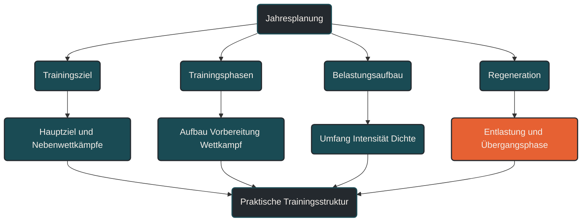

# Jahresplanung

Jahresplanung beschreibt die grobe Struktur eines Trainingsjahres. [[1]](#quelle-1) Im Ausdauertraining ist das wichtig, weil Belastung, Erholung, Wettkampfvorbereitung und Leistungsentwicklung nichtung, Erholung, Wett zufällig entstehen sollten. Entscheidend ist, dass ein Trainingsjahr nicht aus einzelnen Wochen besteht, sondern aus sinnvoll verbundenen Trainingsphasen.

## Was Jahresplanung bedeutet

Jahresplanung ist die langfristige Einordnung von Training über mehrere Monate hinweg. [[1]](#quelle-1) Sie legt nicht jede einzelne Einheit im Detail fest, sondern beschreibt den Rahmen: Wann wird Grundlage aufgebaut, wann steigt die spezifische Belastung, wann stehen Wettkämpfe an und wann braucht der Körper bewusst Entlastung.

Im Ausdauersport hilft Jahresplanung dabei, Training nicht nur von Woche zu Woche zu betrachten. Sie verbindet Trainingsziele, Alltag, Regeneration, Wettkampftermine und langfristige Anpassung zu einer übergeordneten Struktur.

Eine gute Jahresplanung bleibt dabei flexibel. Sie ist kein starrer Kalender, sondern ein Orientierungssystem. Krankheit, Stress, Verletzungen, Urlaub oder berufliche Belastung können Anpassungen notwendig machen.

## Warum Jahresplanung wichtig ist

Viele Trainingsprobleme entstehen nicht durch eine einzelne schlechte Einheit, sondern durch eine schlecht aufgebaute Gesamtstruktur. [[2]](#quelle-2) [[5]](#quelle-5) Wenn harte Phasen zu früh kommen, Erholung fehlt oder Wettkämpfe ohne gezielte Vorbereitung geplant werden, steigt das Risiko für Überlastung, Stagnation und unnötige Ermüdung.

Jahresplanung hilft, Belastung über längere Zeiträume zu verteilen. Dadurch wird sichtbar, wann Trainingsumfang aufgebaut werden kann, wann Intensität sinnvoll ist und wann Entlastung eingeplant werden sollte.

Besonders wichtig ist das im Ausdauersport, weil viele Anpassungen Zeit brauchen. Herz-Kreislauf-System, Muskulatur, Sehnen, Knochen, Energiestoffwechsel und Ermüdungsresistenz entwickeln sich nicht gleich schnell. Eine Jahresplanung berücksichtigt deshalb nicht nur Leistung, sondern auch Belastbarkeit.

## Wie Jahresplanung im Training wirkt

Jahresplanung wirkt vor allem über die sinnvolle Abfolge von Trainingsphasen. [[1]](#quelle-1) Ein typisches Trainingsjahr kann aus einer allgemeinen Aufbauphase, einer spezifischeren Vorbereitungsphase, einer Wettkampfphase und einer Übergangs- oder Regenerationsphase bestehen.

In der allgemeinen Aufbauphase stehen häufig Grundlagenausdauer, technische Stabilität, Kraftgrundlagen und regelmäßiges Training im Vordergrund. Die Belastung ist oft weniger wettkampfspezifisch, schafft aber die Basis für spätere intensivere Reize.

In der spezifischen Vorbereitungsphase wird das Training stärker auf das Ziel ausgerichtet. Für Läufer können das längere Läufe, Tempodauerläufe, Intervalle, Renntempoabschnitte oder gezielte Belastungsverteilungen sein.

In der Wettkampfphase geht es darum, Leistung abrufbar zu machen. Umfang, Intensität und Erholung müssen so abgestimmt werden, dass der Körper nicht nur trainiert, sondern auch leistungsfähig wird.

Nach belastenden Zielphasen ist eine Übergangsphase sinnvoll. Sie reduziert Trainingsdruck, ermöglicht körperliche und mentale Erholung und schafft Abstand, bevor ein neuer Aufbau beginnt.

## Zentrale Einflussfaktoren

### Trainingsziel

Das Trainingsziel bestimmt die Richtung der Jahresplanung. Ein 5-km-Ziel stellt andere Anforderungen als ein Halbmarathon, Marathon oder Ultramarathon. Auch Gesundheitsziele, Wiedereinstieg oder langfristige Belastbarkeit können sinnvolle Hauptziele sein.

Wichtig ist, nicht zu viele Hauptziele gleichzeitig zu setzen. Wer jedes Rennen als Höhepunkt behandelt, riskiert eine dauerhafte Mischung aus Aufbau, Belastung und unzureichender Erholung.

### Wettkampftermine

Wettkampftermine geben der Jahresplanung Ankerpunkte. [[6]](#quelle-6) Von einem Zielwettkampf aus kann rückwärts geplant werden: Wann beginnt die spezifische Vorbereitung, wann wird die Belastung reduziert und wann braucht es Erholung?

Nicht jeder Wettkampf muss ein Hauptziel sein. Manche Rennen können als Trainingswettkampf dienen, andere als Test oder als sozialer Lauf ohne maximale Belastung.

### Belastungsaufbau

Ein Trainingsjahr sollte Belastung schrittweise entwickeln. [[2]](#quelle-2) [[3]](#quelle-3) Dabei geht es nicht nur um mehr Kilometer oder mehr Stunden, sondern auch um Intensität, Dichte, lange Läufe, Höhenmeter, Krafttraining und Gesamtstress.

Ein häufiger Fehler ist, Umfang und Intensität gleichzeitig zu stark zu erhöhen. Jahresplanung hilft, solche Ballungen früh zu erkennen.

### Regeneration

Regeneration ist kein Restposten der Jahresplanung. [[7]](#quelle-7) [[8]](#quelle-8) Entlastungswochen, Ruhetage, Schlaf, Alltag und mentale Erholung gehören zur Struktur dazu.

Gerade bei ambitioniertem Ausdauertraining entscheidet nicht nur die Anzahl der Trainingsreize über Fortschritt, sondern auch die Fähigkeit, diese Reize zu verarbeiten.

### Alltag und Verfügbarkeit

Eine Jahresplanung muss zum Leben passen. Beruf, Familie, Urlaub, Schichtarbeit, Stressphasen und andere Verpflichtungen beeinflussen, wann Training realistisch ist.

Ein Plan, der auf dem Papier perfekt aussieht, aber dauerhaft nicht umsetzbar ist, erzeugt eher Druck als Fortschritt. Besser ist eine robuste Struktur, die mit realen Rahmenbedingungen funktioniert.

## Bedeutung für Läufer

Für Läufer ist Jahresplanung besonders wichtig, weil Lauftraining mechanisch belastend ist. [[5]](#quelle-5) [[9]](#quelle-9) Umfang, Intensität und Wettkampfvorbereitung wirken nicht nur auf das Herz-Kreislauf-System, sondern auch auf Sehnen, Knochen, Gelenke und Muskulatur.

Eine sinnvolle Jahresplanung kann helfen, Phasen mit hohem Laufumfang, intensiven Einheiten und langen Läufen besser zu verteilen. Dadurch wird das Training nachvollziehbarer und Überlastung wahrscheinlicher erkennbar.

Für Freizeitläufer bedeutet Jahresplanung nicht, das ganze Jahr minutengenau zu planen. Oft reicht eine klare Einteilung: Welche Monate dienen dem Aufbau, welche dem spezifischen Training, welche dem Wettkampf und welche der Erholung?

## Häufige Fehler

Ein häufiger Fehler ist, zu viele Höhepunkte in ein Jahr zu packen. Wenn jeder Wettkampf wichtig ist, fehlt oft eine klare Priorisierung. Das Training wird dann dauerhaft angespannt, aber nicht gezielt.

Ein weiterer Fehler ist eine zu schnelle Steigerung nach Pausen. Nach Krankheit, Verletzung oder Trainingsunterbrechung sollte die Jahresplanung angepasst werden, statt den alten Plan einfach fortzusetzen.

Auch fehlende Entlastung ist typisch. Viele Sportler planen Trainingsblöcke, aber keine echte Regeneration. Dadurch kann die Leistung trotz hoher Motivation stagnieren.

Problematisch ist außerdem eine reine Kilometerplanung. Jahresplanung sollte nicht nur Umfang berücksichtigen, sondern auch Intensität, Erholung, Krafttraining, Beweglichkeit, Alltag und mentale Belastung.

## Praktische Einordnung

Jahresplanung ist ein Orientierungsrahmen für langfristiges Training. Sie hilft, Trainingsziele, Wettkämpfe, Belastungsaufbau und Regeneration in eine sinnvolle Reihenfolge zu bringen.

Für die Praxis reicht oft eine einfache Struktur: wenige Hauptziele festlegen, Trainingsphasen grob einteilen, Erholungsphasen bewusst einplanen und den Plan regelmäßig an die Realität anpassen.

Der wichtigste Merksatz lautet: Jahresplanung ist kein starrer Kalender, sondern ein Belastungsrahmen, der Training, Erholung und Zielentwicklung über längere Zeit sinnvoll verbindet.

----

----

## Häufige Fragen zu Jahresplanung

### Was ist Jahresplanung einfach erklärt?

Jahresplanung ist die grobe Struktur eines Trainingsjahres. Sie legt fest, wann Aufbau, spezifisches Training, Wettkämpfe und Erholung im Vordergrund stehen.

### Warum ist Jahresplanung im Ausdauertraining wichtig?

Sie hilft, Belastung und Erholung langfristig sinnvoll zu verteilen. Dadurch wird Training planbarer und das Risiko für Überlastung oder planloses Hin-und-her-Trainieren geringer.

### Muss ein Trainingsjahr komplett durchgeplant sein?

Nein. Eine Jahresplanung muss nicht jede Einheit festlegen. Wichtiger ist ein flexibler Rahmen, der Ziele, Trainingsphasen, Alltag und Regeneration berücksichtigt.

### Wie viele Hauptziele sollte ein Trainingsjahr haben?

Für viele Läufer sind ein bis zwei klare Hauptziele pro Jahr sinnvoller als sehr viele gleich wichtige Wettkämpfe. Nebenwettkämpfe können als Training, Test oder Erfahrung genutzt werden.

### Was ist ein häufiger Fehler bei der Jahresplanung?

Ein häufiger Fehler ist, Umfang, Intensität und Wettkämpfe zu stark zu verdichten. Dadurch fehlt Erholung, und die Leistungsentwicklung kann trotz viel Training stagnieren.

### Für wen ist Jahresplanung besonders relevant?

Jahresplanung ist besonders relevant für Läufer mit Wettkampfzielen, steigenden Umfängen, wiederkehrender Ermüdung oder dem Wunsch nach langfristiger Leistungsentwicklung.

----

## Quellen

### Quelle 1
Lorenz, D. S., Reiman, M. P., & Walker, J. C. (2010). Periodization: Current Review and Suggested Implementation for Athletic Rehabilitation. Sports Health, 2(6), 509–518. [PubMed](https://pubmed.ncbi.nlm.nih.gov/23015982/)

### Quelle 2
Bourdon, P. C., Cardinale, M., Murray, A. et al. (2017). Monitoring Athlete Training Loads: Consensus Statement. International Journal of Sports Physiology and Performance, 12(Suppl 2), S2-161–S2-170. [Human Kinetics](https://journals.humankinetics.com/view/journals/ijspp/12/s2/article-pS2-161.xml)

### Quelle 3
Impellizzeri, F. M., Marcora, S. M., & Coutts, A. J. (2019). Internal and External Training Load: 15 Years On. International Journal of Sports Physiology and Performance, 14(2), 270–273. [PubMed](https://pubmed.ncbi.nlm.nih.gov/30614348/)

### Quelle 4
Seiler, S. (2010). What is Best Practice for Training Intensity and Duration Distribution in Endurance Athletes? International Journal of Sports Physiology and Performance, 5(3), 276–291. [Human Kinetics](https://journals.humankinetics.com/abstract/journals/ijspp/5/3/article-p276.xml)

### Quelle 5
Soligard, T., Schwellnus, M., Alonso, J.-M. et al. (2016). How much is too much? Part 1: IOC consensus statement on load in sport and risk of injury. British Journal of Sports Medicine, 50(17), 1030–1041. [BJSM](https://bjsm.bmj.com/content/50/17/1030)

### Quelle 6
Mujika, I., & Padilla, S. (2003). Scientific Bases for Precompetition Tapering Strategies. Medicine & Science in Sports & Exercise, 35(7), 1182–1187. [UPV/EHU](https://ekoizpen-zientifikoa.ehu.eus/documentos/6145ad5065b6b477913b5c8a)

### Quelle 7
Meeusen, R., Duclos, M., Foster, C. et al. (2013). Prevention, diagnosis, and treatment of the overtraining syndrome: Joint consensus statement of the European College of Sport Science and the American College of Sports Medicine. Medicine & Science in Sports & Exercise, 45(1), 186–205. [PubMed](https://pubmed.ncbi.nlm.nih.gov/23247672/)

### Quelle 8
Fullagar, H. H. K., Skorski, S., Duffield, R. et al. (2015). Sleep and Athletic Performance: The Effects of Sleep Loss on Exercise Performance, and Physiological and Cognitive Responses to Exercise. Sports Medicine, 45, 161–186. [PubMed](https://pubmed.ncbi.nlm.nih.gov/25315456/)

### Quelle 9
The Training Intensity Distribution of Marathon Runners Across Performance Levels. Sports Medicine. [Springer](https://link.springer.com/article/10.1007/s40279-024-02137-7)

----

*Hinweis: Dieser Artikel dient der allgemeinen Information und ersetzt keine medizinische oder therapeutische Beratung. Mehr dazu im [**Gesundheits- und Quellenhinweis**](/ausdauersport/disclaimer/).*

