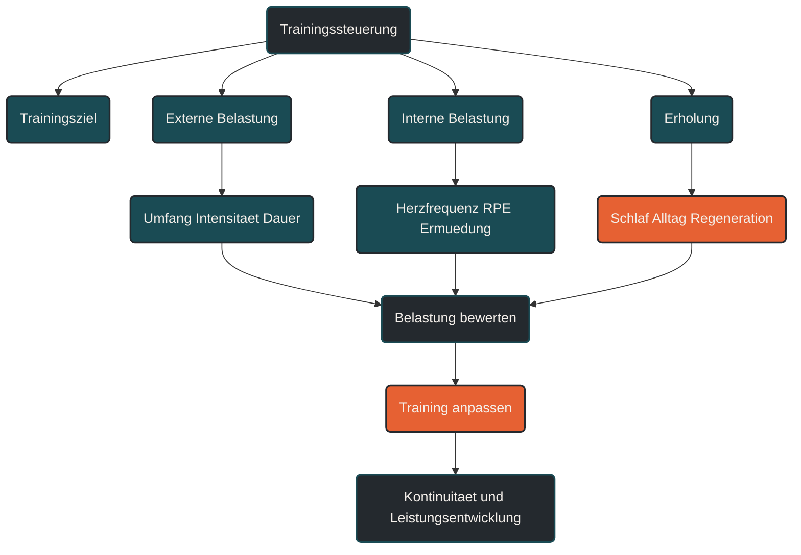

# Trainingssteuerung

Trainingssteuerung beschreibt die laufende Anpassung des Trainings an Ziel, Leistungsstand, Belastung und Erholung. [[1]](#quelle-1) [[2]](#quelle-2) Im Ausdauertraining ist das wichtig, weil ein Plan nur dann sinnvoll bleibt, wenn er auf die tatsächliche Reaktion des Körpers angepasst wird. Entscheidend ist, Training nicht nur zu absolvieren, sondern regelmäßig einzuordnen und bei Bedarf zu verändern.

## Was Trainingssteuerung bedeutet

Trainingssteuerung ist der Prozess, mit dem Training geplant, beobachtet, bewertet und angepasst wird. [[2]](#quelle-2) [[3]](#quelle-3) Sie verbindet Trainingsziele mit der Frage, ob die gewählte Belastung aktuell wirklich passend ist.

Dabei geht es nicht nur um Zahlen wie Herzfrequenz, Pace, Watt oder Kilometer. [[1]](#quelle-1) [[4]](#quelle-4) Auch subjektives Belastungsempfinden, Müdigkeit, Schlaf, Muskelgefühl, Motivation, Schmerzen, Alltagstress und Erholungszustand gehören zur Trainingssteuerung.

Ein Trainingsplan gibt die Richtung vor. Trainingssteuerung entscheidet, ob diese Richtung im Alltag noch sinnvoll ist.

## Warum Trainingssteuerung wichtig ist

Ausdauertraining wirkt nicht automatisch, nur weil es regelmäßig durchgeführt wird. [[2]](#quelle-2) [[8]](#quelle-8) Entscheidend ist, ob Belastung und Erholung zusammenpassen. Ein zu schwacher Reiz führt oft zu wenig Anpassung. Ein zu starker oder zu dichter Reiz kann Ermüdung, Überlastung oder Stagnation begünstigen.

Trainingssteuerung hilft, solche Entwicklungen früh zu erkennen. Sie macht sichtbar, ob das Training zum aktuellen Zustand passt oder ob Umfang, Intensität, Häufigkeit oder Erholung angepasst werden sollten.

Besonders wichtig ist Trainingssteuerung, weil Leistungsentwicklung nicht linear verläuft. Gute Phasen, müde Wochen, Krankheit, Stress, Hitze, Schlafmangel oder muskuläre Beschwerden können die Belastbarkeit deutlich verändern.

## Wie Trainingssteuerung im Training wirkt

Trainingssteuerung wirkt über Beobachtung und Anpassung. Eine Einheit wird nicht isoliert bewertet, sondern im Zusammenhang mit den letzten Tagen und Wochen betrachtet.

Wenn sich ein lockerer Dauerlauf plötzlich ungewöhnlich schwer anfühlt, kann das ein Hinweis auf unzureichende Erholung, Stress, beginnende Krankheit oder zu hohe Belastungsdichte sein. Wenn umgekehrt mehrere Wochen stabil trainiert werden, kann eine vorsichtige Steigerung sinnvoll sein.

Trainingssteuerung bedeutet deshalb nicht, ständig alles zu ändern. Gute Steuerung erkennt, wann Kontinuität wichtig ist und wann Anpassung notwendig wird.

## Zentrale Einflussfaktoren

### Trainingsziel

Das Trainingsziel bestimmt, woran das Training ausgerichtet wird. Wer für einen 5-km-Lauf trainiert, braucht andere Schwerpunkte als jemand, der einen Marathon vorbereitet oder vor allem gesund und regelmäßig laufen möchte.

Trainingssteuerung prüft, ob die aktuellen Einheiten tatsächlich zum Ziel passen. Nicht jede harte Einheit ist zielführend, und nicht jede lockere Einheit ist zu wenig.

### Externe Belastung

Externe Belastung beschreibt das, was im Training objektiv vorgegeben oder gemessen wird. [[1]](#quelle-1) Dazu gehören Dauer, Distanz, Tempo, Watt, Höhenmeter, Wiederholungen, Pausenlänge und Trainingshäufigkeit.

Diese Werte zeigen, was gemacht wurde. Sie sagen aber noch nicht vollständig, wie stark die Belastung für den Körper war.

### Interne Belastung

Interne Belastung beschreibt die Reaktion des Körpers auf das Training. [[1]](#quelle-1) [[4]](#quelle-4) Dazu gehören Herzfrequenz, Atmung, subjektives Belastungsempfinden, muskuläre Ermüdung, Schlafqualität und Erholungsgefühl.

Die gleiche Laufeinheit kann an einem Tag locker wirken und an einem anderen Tag deutlich anstrengender sein. Genau diese Differenz ist für die Trainingssteuerung wichtig.

### Erholung

Erholung entscheidet, ob ein Trainingsreiz verarbeitet werden kann. [[3]](#quelle-3) [[9]](#quelle-9) Schlaf, Ernährung, Alltagsstress, Ruhetage, lockere Einheiten und mentale Entlastung beeinflussen, wie belastbar ein Sportler ist.

Trainingssteuerung sollte deshalb nicht nur fragen: Was kann ich heute trainieren? Sondern auch: Was kann ich heute sinnvoll verarbeiten?

### Feedback im Verlauf

Ein einzelner schlechter Tag ist nicht automatisch ein Problem. Wichtiger sind Muster über mehrere Tage oder Wochen. Wenn Pace, Herzfrequenz, Schlaf, Motivation und Muskelgefühl gleichzeitig schlechter werden, kann das ein Hinweis auf zu hohe Gesamtbelastung sein.

Trainingssteuerung lebt von solchen Verlaufssignalen. Sie hilft, nicht erst dann zu reagieren, wenn Beschwerden oder deutlicher Leistungsabfall auftreten.

## Bedeutung für Läufer

Für Läufer ist Trainingssteuerung besonders wichtig, weil Lauftraining eine hohe mechanische Belastung erzeugt. [[7]](#quelle-7) Sehnen, Knochen, Gelenke und Muskulatur reagieren nicht immer im gleichen Tempo wie das Herz-Kreislauf-System.

Ein Läufer kann sich konditionell bereit fühlen, obwohl Strukturen wie Achillessehne, Schienbein, Knie oder Plantarfaszie noch mehr Zeit brauchen. Trainingssteuerung hilft, solche Unterschiede zu berücksichtigen.

Praktisch bedeutet das: Nicht nur die geplante Einheit zählt, sondern auch die aktuelle Belastbarkeit. Ein Intervalltraining kann an einem guten Tag sinnvoll sein, an einem müden Tag aber durch einen lockeren Dauerlauf oder einen Ruhetag ersetzt werden.

## Häufige Fehler

Ein häufiger Fehler ist, Trainingssteuerung nur über Pace zu machen. Tempo ist wichtig, aber es erklärt nicht allein, wie stark eine Einheit wirkt. Hitze, Höhenmeter, Wind, Schlafmangel oder Stress können dieselbe Pace deutlich belastender machen.

Ein weiterer Fehler ist, Warnsignale zu ignorieren. [[8]](#quelle-8) Wiederkehrende Schmerzen, ungewöhnlich hohe Müdigkeit, schlechter Schlaf oder dauerhaft sinkende Motivation sollten nicht einfach als fehlende Disziplin abgetan werden.

Problematisch ist auch, jede kleine Schwankung sofort zu überbewerten. Trainingssteuerung braucht Gelassenheit. Nicht jeder müde Tag verlangt eine komplette Planänderung.

Auch eine zu starke Datenfixierung kann schwierig werden. Messwerte können helfen, ersetzen aber nicht das Körpergefühl und die praktische Einordnung.

## Praktische Einordnung

Trainingssteuerung ist die Verbindung zwischen Plan und Realität. Sie hilft, Training an Ziel, Alltag, Leistungsstand und Erholung anzupassen.

Für die Praxis reicht oft eine einfache Routine: Einheiten dokumentieren, Belastung subjektiv bewerten, auffällige Muster erkennen und den Plan bei Bedarf anpassen. So wird Training nicht beliebig, sondern kontrollierter und langfristig besser steuerbar.

Der wichtigste Merksatz lautet: Trainingssteuerung bedeutet nicht, den Plan ständig zu verändern, sondern die richtige Belastung zum richtigen Zeitpunkt zu wählen.

----

----

## Häufige Fragen zu Trainingssteuerung

### Was ist Trainingssteuerung einfach erklärt?

Trainingssteuerung bedeutet, Training anhand von Ziel, Belastung, Erholung und aktueller Reaktion des Körpers anzupassen. Sie verbindet den Trainingsplan mit der Realität des Alltags.

### Warum ist Trainingssteuerung im Ausdauertraining wichtig?

Sie hilft, Trainingsreize passend zu dosieren. Dadurch lassen sich Überlastung, unnötige Ermüdung und planloses Training eher vermeiden.

### Welche Werte helfen bei der Trainingssteuerung?

Hilfreich sind zum Beispiel Herzfrequenz, Pace, Watt, Trainingsdauer, Umfang, subjektives Belastungsempfinden, Schlaf, Muskelgefühl und Erholungszustand. Kein einzelner Wert reicht allein aus.

### Was ist der Unterschied zwischen Trainingsplanung und Trainingssteuerung?

Trainingsplanung legt den Rahmen fest. Trainingssteuerung passt diesen Rahmen laufend an die tatsächliche Belastbarkeit und Entwicklung an.

### Was ist ein häufiger Fehler bei der Trainingssteuerung?

Ein häufiger Fehler ist, nur nach Pace oder Kilometerumfang zu steuern. Wichtig ist auch, wie stark eine Einheit tatsächlich wirkt und wie gut sie verarbeitet wird.

### Für wen ist Trainingssteuerung besonders relevant?

Trainingssteuerung ist besonders relevant für Läufer mit Wettkampfzielen, steigenden Umfängen, wiederkehrender Müdigkeit, Verletzungshistorie oder langfristigem Leistungsaufbau.

----

## Quellen

### Quelle 1
Impellizzeri, F. M., Marcora, S. M., & Coutts, A. J. (2019). Internal and External Training Load: 15 Years On. International Journal of Sports Physiology and Performance, 14(2), 270–273. [PubMed](https://pubmed.ncbi.nlm.nih.gov/30614348/)

### Quelle 2
Bourdon, P. C., Cardinale, M., Murray, A. et al. (2017). Monitoring Athlete Training Loads: Consensus Statement. International Journal of Sports Physiology and Performance, 12(Suppl 2), S2-161–S2-170. [Human Kinetics](https://journals.humankinetics.com/view/journals/ijspp/12/s2/article-pS2-161.xml)

### Quelle 3
Halson, S. L. (2014). Monitoring Training Load to Understand Fatigue in Athletes. Sports Medicine, 44(Suppl 2), S139–S147. [PMC](https://pmc.ncbi.nlm.nih.gov/articles/PMC4213373/)

### Quelle 4
Foster, C., Florhaug, J. A., Franklin, J. et al. (2001). A New Approach to Monitoring Exercise Training. Journal of Strength and Conditioning Research, 15(1), 109–115. [BISp-SURF](https://www.bisp-surf.de/Record/PU199912501542)

### Quelle 5
Buchheit, M. (2014). Monitoring training status with HR measures: do all roads lead to Rome? Frontiers in Physiology, 5, 73. [PMC](https://pmc.ncbi.nlm.nih.gov/articles/PMC3936188/)

### Quelle 6
Mann, T., Lamberts, R. P., & Lambert, M. I. (2013). Methods of Prescribing Relative Exercise Intensity: Physiological and Practical Considerations. Sports Medicine, 43, 613–625. [Springer](https://link.springer.com/article/10.1007/s40279-013-0045-x)

### Quelle 7
Soligard, T., Schwellnus, M., Alonso, J.-M. et al. (2016). How much is too much? Part 1: IOC consensus statement on load in sport and risk of injury. British Journal of Sports Medicine, 50(17), 1030–1041. [BJSM](https://bjsm.bmj.com/content/50/17/1030)

### Quelle 8
Meeusen, R., Duclos, M., Foster, C. et al. (2013). Prevention, diagnosis, and treatment of the overtraining syndrome: Joint consensus statement of the European College of Sport Science and the American College of Sports Medicine. Medicine & Science in Sports & Exercise, 45(1), 186–205. [PubMed](https://pubmed.ncbi.nlm.nih.gov/23247672/)

### Quelle 9
Fullagar, H. H. K., Skorski, S., Duffield, R. et al. (2015). Sleep and Athletic Performance: The Effects of Sleep Loss on Exercise Performance, and Physiological and Cognitive Responses to Exercise. Sports Medicine, 45, 161–186. [PubMed](https://pubmed.ncbi.nlm.nih.gov/25315456/)

----

*Hinweis: Dieser Artikel dient der allgemeinen Information und ersetzt keine medizinische oder therapeutische Beratung. Mehr dazu im [**Gesundheits- und Quellenhinweis**](/ausdauersport/disclaimer/).*

