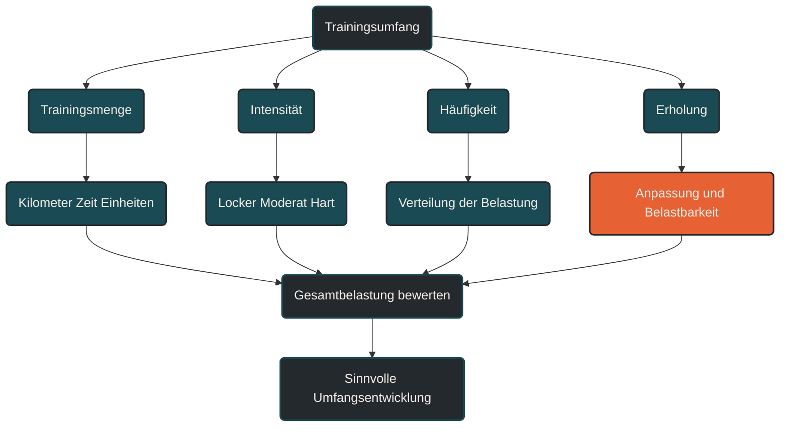

# Trainingsumfang

Trainingsumfang beschreibt die Menge an Training innerhalb eines bestimmten Zeitraums. [[1]](#quelle-1) Im Ausdauertraining ist das wichtig, weil Umfang ein zentraler Reiz für Grundlagenausdauer, Belastbarkeit und langfristige Leistungsentwicklung ist. Entscheidend ist, dass Trainingsumfang nicht isoliert betrachtet wird, sondern immer zusammen mit Intensität, Häufigkeit und Erholung.

## Was Trainingsumfang bedeutet

Trainingsumfang beschreibt, wie viel trainiert wird. Im Lauftraining wird er häufig über Wochenkilometer angegeben. Im Ausdauertraining allgemein können aber auch Trainingszeit, Anzahl der Einheiten, Höhenmeter, lange Läufe, Radstunden oder Schwimmumfang relevant sein.

Umfang ist damit nicht nur eine Zahl. Er beschreibt die wiederholte Belastung, der der Körper über Tage, Wochen und Monate ausgesetzt ist.

Ein hoher Trainingsumfang kann die Ausdauerleistungsfähigkeit verbessern, ist aber nur dann sinnvoll, wenn der Körper ihn verarbeiten kann. [[2]](#quelle-2) [[3]](#quelle-3) Umfang ohne passende Erholung wird schnell zur Belastungsquelle.

## Warum Trainingsumfang wichtig ist

Viele Anpassungen im Ausdauersport entstehen durch regelmäßige, wiederholte Belastung. [[1]](#quelle-1) [[2]](#quelle-2) Dazu gehören Verbesserungen der aeroben Kapazität, eine stabilere muskuläre Ermüdungsresistenz, ökonomischere Bewegungsabläufe und eine bessere Belastungsverträglichkeit.

Trainingsumfang schafft dafür die Grundlage. Besonders lockere und moderate Umfänge können helfen, das Herz-Kreislauf-System, den Energiestoffwechsel und die strukturelle Belastbarkeit langfristig zu entwickeln.

Gleichzeitig ist Umfang einer der häufigsten Gründe für Überlastungsprobleme. [[5]](#quelle-5) Wenn die Menge des Trainings schneller steigt als die Anpassungsfähigkeit von Sehnen, Knochen, Gelenken und Muskulatur, kann das Risiko für Beschwerden steigen.

## Wie Trainingsumfang im Training wirkt

Trainingsumfang wirkt vor allem über Wiederholung und Kontinuität. [[2]](#quelle-2) [[6]](#quelle-6) Eine einzelne lange Einheit macht noch keine Ausdauerbasis. Entscheidend ist, dass der Körper über längere Zeit regelmäßig passende Reize erhält.

Bei niedrigeren Intensitäten kann mehr Umfang häufig besser vertragen werden als bei hohen Intensitäten. Deshalb besteht ein großer Teil vieler Ausdauertrainings aus lockeren Einheiten. Sie ermöglichen Trainingsreize, ohne den Körper jedes Mal maximal zu belasten.

Je höher die Intensität einer Einheit ist, desto vorsichtiger muss der Umfang betrachtet werden. Viele harte Kilometer sind nicht dasselbe wie viele lockere Kilometer. Deshalb sollte Trainingsumfang nie getrennt von der Belastungsverteilung bewertet werden.

## Zentrale Einflussfaktoren

### Trainingsziel

Das Trainingsziel beeinflusst, wie viel Umfang sinnvoll ist. Ein 5-km-Läufer braucht eine andere Umfangsstruktur als ein Marathonläufer. Auch Gesundheitsziele, Wiedereinstieg oder langfristige Belastbarkeit können mit deutlich niedrigeren Umfängen sinnvoll verfolgt werden.

Mehr Umfang ist nicht automatisch besser. Entscheidend ist, ob der Umfang zum Ziel, zur Erfahrung und zur aktuellen Belastbarkeit passt.

### Trainingsalter

Trainingsalter beschreibt, wie lange jemand bereits regelmäßig trainiert. Wer seit Jahren stabil läuft, verträgt oft mehr Umfang als jemand, der gerade erst wieder einsteigt.

Der Körper passt sich an regelmäßige Belastung an, aber diese Anpassung braucht Zeit. Besonders passive Strukturen wie Sehnen, Knochen und Bindegewebe entwickeln sich meist langsamer als die Ausdauer.

### Intensität

Umfang und Intensität beeinflussen sich gegenseitig. [[2]](#quelle-2) [[4]](#quelle-4) Ein hoher Umfang ist leichter zu verarbeiten, wenn der Großteil der Einheiten locker bleibt. Werden viele Kilometer zusätzlich intensiv gelaufen, steigt die Gesamtbelastung deutlich.

Ein häufiger Fehler besteht darin, Umfang zu erhöhen und gleichzeitig mehr Tempoeinheiten einzubauen. Dadurch entsteht schnell eine Belastungsdichte, die nicht mehr gut verarbeitet wird.

### Trainingshäufigkeit

Trainingshäufigkeit bestimmt, auf wie viele Einheiten der Umfang verteilt wird. Der gleiche Wochenumfang kann sehr unterschiedlich wirken, je nachdem ob er auf drei oder sechs Einheiten verteilt ist.

Mehr Einheiten können helfen, Umfang gleichmäßiger zu verteilen. Gleichzeitig brauchen zusätzliche Trainingstage ebenfalls Erholung und müssen in den Alltag passen.

### Erholung

Trainingsumfang wird erst durch Erholung wirksam. [[3]](#quelle-3) [[7]](#quelle-7) Ohne ausreichende Regeneration bleibt der Reiz nicht produktiv, sondern sammelt sich als Ermüdung an.

Schlaf, Ernährung, Ruhetage, lockere Einheiten und Alltagsstress beeinflussen, wie viel Umfang sinnvoll ist. Der gleiche Wochenumfang kann in einer ruhigen Woche gut funktionieren und in einer stressigen Woche zu viel sein.

## Bedeutung für Läufer

Für Läufer ist Trainingsumfang besonders relevant, weil Laufen eine hohe mechanische Belastung erzeugt. [[5]](#quelle-5) Jeder Schritt wirkt auf Muskulatur, Sehnen, Knochen und Gelenke. Deshalb ist nicht nur die Ausdauer entscheidend, sondern auch die strukturelle Belastbarkeit.

Wochenkilometer können eine hilfreiche Orientierung sein, erklären aber nicht alles. Untergrund, Höhenmeter, Tempo, Schuhwerk, Lauftechnik, Körpergewicht, Schlaf und vorherige Belastung beeinflussen, wie stark der Umfang tatsächlich wirkt.

Praktisch bedeutet das: Umfang sollte schrittweise aufgebaut und regelmäßig überprüft werden. Ein stabiler, gut verarbeiteter Umfang ist wertvoller als kurzfristig hohe Kilometerzahlen, die zu Müdigkeit oder Beschwerden führen.

## Häufige Fehler

Ein häufiger Fehler ist, Trainingsumfang zu schnell zu steigern. Besonders nach Pausen, Krankheit oder Verletzungen wird oft versucht, schnell wieder zum alten Niveau zurückzukehren.

Ein weiterer Fehler ist, Umfang nur über Wochenkilometer zu bewerten. Zwei Wochen mit gleicher Kilometerzahl können völlig unterschiedlich belastend sein, wenn sich Intensität, Höhenmeter, Schlaf oder Alltagstress unterscheiden.

Problematisch ist auch das Kopieren fremder Trainingsumfänge. Was für einen erfahrenen Läufer funktioniert, kann für einen anderen zu viel sein.

Auch die Fixierung auf runde Zahlen kann ungünstig sein. Wer unbedingt eine bestimmte Kilometerzahl erreichen will, läuft manchmal zusätzliche Kilometer, obwohl der Körper eigentlich Erholung braucht.

## Praktische Einordnung

Trainingsumfang ist ein wichtiger Baustein der Ausdauerentwicklung, aber kein Selbstzweck. Er sollte zum Ziel, zur Belastbarkeit, zur Trainingshäufigkeit und zur Erholung passen.

Für die Praxis ist entscheidend, Umfang langsam zu entwickeln, lockere Einheiten wirklich locker zu halten und Warnsignale ernst zu nehmen. Ein gut verträglicher Umfang über viele Monate ist meist wertvoller als ein kurzfristig hoher Umfang über wenige Wochen.

Der wichtigste Merksatz lautet: Trainingsumfang ist nur dann produktiv, wenn der Körper ihn verarbeiten und in Anpassung umsetzen kann.

----

----

## Häufige Fragen zu Trainingsumfang

### Was ist Trainingsumfang einfach erklärt?

Trainingsumfang beschreibt, wie viel trainiert wird. Im Lauftraining meint das häufig Wochenkilometer, im Ausdauertraining allgemein auch Trainingszeit, Anzahl der Einheiten oder Belastungsdauer.

### Warum ist Trainingsumfang im Ausdauertraining wichtig?

Trainingsumfang schafft die Grundlage für viele langfristige Ausdaueranpassungen. Er hilft, Belastbarkeit, aerobe Leistungsfähigkeit und Ermüdungsresistenz aufzubauen.

### Ist mehr Trainingsumfang immer besser?

Nein. Mehr Umfang ist nur sinnvoll, wenn er zum Ziel, zur Erfahrung und zur Erholung passt. Zu viel Umfang kann Überlastung und Stagnation begünstigen.

### Wie sollte Trainingsumfang gesteigert werden?

Trainingsumfang sollte schrittweise und kontrolliert gesteigert werden. Wichtig ist, nicht gleichzeitig Umfang, Intensität und Trainingshäufigkeit stark zu erhöhen.

### Was ist ein häufiger Fehler beim Trainingsumfang?

Ein häufiger Fehler ist, sich nur an Wochenkilometern zu orientieren. Entscheidend ist die Gesamtbelastung aus Umfang, Intensität, Erholung, Alltag und individueller Belastbarkeit.

### Für wen ist Trainingsumfang besonders relevant?

Trainingsumfang ist besonders relevant für Läufer mit Wettkampfzielen, längeren Distanzen, steigendem Trainingspensum oder dem Wunsch nach langfristiger Ausdauerentwicklung.

----

## Quellen

### Quelle 1
American College of Sports Medicine. (2011). Quantity and Quality of Exercise for Developing and Maintaining Cardiorespiratory, Musculoskeletal, and Neuromotor Fitness in Apparently Healthy Adults. Medicine & Science in Sports & Exercise, 43(7), 1334–1359. [Unbound Medicine](https://www.unboundmedicine.com/medline/citation/21694556/American_College_of_Sports_Medicine_position_stand__Quantity_and_quality_of_exercise_for_developing_and_maintaining_cardiorespiratory_musculoskeletal_and_neuromotor_fitness_in_apparently_healthy_adults%3A_guidance_for_prescribing_exercise_)

### Quelle 2
Seiler, S. (2010). What is Best Practice for Training Intensity and Duration Distribution in Endurance Athletes? International Journal of Sports Physiology and Performance, 5(3), 276–291. [Human Kinetics](https://journals.humankinetics.com/abstract/journals/ijspp/5/3/article-p276.xml)

### Quelle 3
Bourdon, P. C., Cardinale, M., Murray, A. et al. (2017). Monitoring Athlete Training Loads: Consensus Statement. International Journal of Sports Physiology and Performance, 12(Suppl 2), S2-161–S2-170. [Human Kinetics](https://journals.humankinetics.com/view/journals/ijspp/12/s2/article-pS2-161.xml)

### Quelle 4
Impellizzeri, F. M., Marcora, S. M., & Coutts, A. J. (2019). Internal and External Training Load: 15 Years On. International Journal of Sports Physiology and Performance, 14(2), 270–273. [PubMed](https://pubmed.ncbi.nlm.nih.gov/30614348/)

### Quelle 5
Soligard, T., Schwellnus, M., Alonso, J.-M. et al. (2016). How much is too much? Part 1: IOC consensus statement on load in sport and risk of injury. British Journal of Sports Medicine, 50(17), 1030–1041. [BJSM](https://bjsm.bmj.com/content/50/17/1030)

### Quelle 6
The Training Intensity Distribution of Marathon Runners Across Performance Levels. Sports Medicine. [Springer](https://link.springer.com/article/10.1007/s40279-024-02137-7)

### Quelle 7
Meeusen, R., Duclos, M., Foster, C. et al. (2013). Prevention, diagnosis, and treatment of the overtraining syndrome: Joint consensus statement of the European College of Sport Science and the American College of Sports Medicine. Medicine & Science in Sports & Exercise, 45(1), 186–205. [PubMed](https://pubmed.ncbi.nlm.nih.gov/23247672/)

----

*Hinweis: Dieser Artikel dient der allgemeinen Information und ersetzt keine medizinische oder therapeutische Beratung. Mehr dazu im [**Gesundheits- und Quellenhinweis**](/ausdauersport/disclaimer/).*

