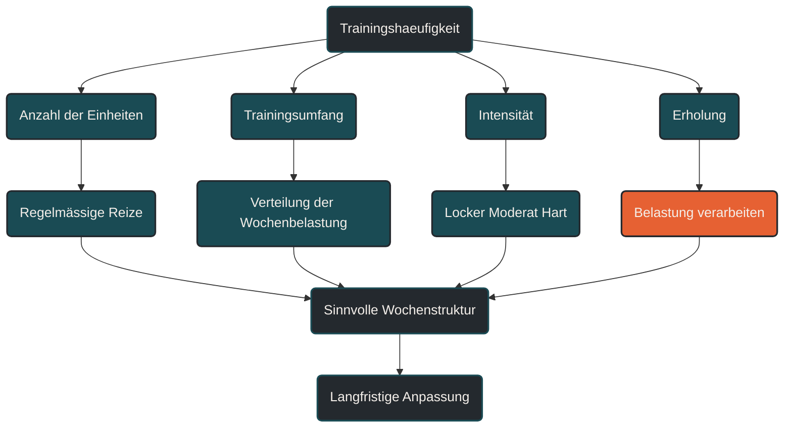

# Trainingshäufigkeit

Trainingshäufigkeit beschreibt, wie oft innerhalb eines bestimmten Zeitraums trainiert wird. [[1]](#quelle-1) Im Ausdauertraining ist das wichtig, weil nicht nur die Menge des Trainings zählt, sondern auch die Verteilung der Reize über die Woche. Entscheidend ist, dass Trainingshäufigkeit zu Ziel, Umfang, Intensität, Erholung und Alltag passt.

## Was Trainingshäufigkeit bedeutet

Trainingshäufigkeit meint die Anzahl der Trainingseinheiten pro Woche oder Trainingsblock. Im Lauftraining kann das zum Beispiel bedeuten, ob jemand zwei-, drei-, vier- oder sechsmal pro Woche läuft.

Die Häufigkeit sagt aber noch nicht automatisch, wie belastend das Training ist. Drei harte Einheiten können deutlich anstrengender sein als fünf lockere Einheiten. Deshalb muss Trainingshäufigkeit immer zusammen mit Umfang, Intensität und Erholung betrachtet werden.

Eine passende Trainingshäufigkeit hilft, Trainingsreize regelmäßig zu setzen, ohne den Körper dauerhaft zu überfordern. [[2]](#quelle-2) [[3]](#quelle-3)

## Warum Trainingshäufigkeit wichtig ist

Ausdaueranpassungen entstehen durch wiederholte Reize. [[1]](#quelle-1) [[2]](#quelle-2) Wer sehr selten trainiert, setzt oft zu wenige Signale für stabile Anpassung. Wer sehr häufig trainiert, kann zwar mehr Reize setzen, braucht aber auch mehr Regeneration und eine bessere Belastungssteuerung.

Trainingshäufigkeit beeinflusst außerdem, wie gut Trainingsumfang verteilt werden kann. [[4]](#quelle-4) Der gleiche Wochenumfang wirkt anders, wenn er auf zwei oder auf fünf Einheiten verteilt wird.

Mehr Einheiten können die einzelne Belastung reduzieren, weil der Umfang auf kleinere Portionen aufgeteilt wird. Gleichzeitig steigt aber die Gesamtzahl der Belastungstage. Deshalb ist die passende Häufigkeit immer individuell.

## Wie Trainingshäufigkeit im Training wirkt

Trainingshäufigkeit wirkt über Regelmäßigkeit und Verteilung. Regelmäßige Einheiten helfen dem Körper, Belastung als wiederkehrenden Reiz zu erkennen und sich daran anzupassen.

Bei niedriger Trainingshäufigkeit sind die einzelnen Einheiten oft stärker voneinander getrennt. Das kann für Einsteiger, Wiedereinsteiger oder stark belastete Menschen sinnvoll sein, weil mehr Erholung zwischen den Einheiten bleibt.

Bei höherer Trainingshäufigkeit lassen sich unterschiedliche Trainingsinhalte besser verteilen. Lockere Dauerläufe, lange Läufe, Technik, Krafttraining, Intervalle und Regeneration können klarer voneinander getrennt werden.

Wichtig ist dabei: Mehr Trainingstage bedeuten nicht automatisch besseres Training. Die zusätzliche Einheit muss einen Zweck haben und in die Gesamtbelastung passen.

## Zentrale Einflussfaktoren

### Trainingsziel

Das Trainingsziel beeinflusst, wie häufig Training sinnvoll ist. Wer allgemein fitter werden möchte, braucht oft keine sehr hohe Trainingshäufigkeit. Wer gezielt auf längere Wettkämpfe oder Leistungsentwicklung trainiert, profitiert häufig von regelmäßigeren Einheiten.

Bei kürzeren Distanzen kann Qualität eine größere Rolle spielen. Bei längeren Distanzen wird die regelmäßige Verteilung von Umfang oft wichtiger.

### Trainingsumfang

Trainingshäufigkeit und Trainingsumfang hängen eng zusammen. Ein höherer Wochenumfang lässt sich meist besser auf mehrere Einheiten verteilen. Dadurch wird die einzelne Einheit oft verträglicher.

Wenn wenig Zeit vorhanden ist, kann ein niedrigerer Umfang auf wenige Einheiten verteilt werden. Wird der Umfang aber größer, werden zu wenige Trainingstage schnell problematisch, weil einzelne Einheiten sehr lang oder sehr belastend werden.

### Intensität

Je intensiver eine Einheit ist, desto mehr Erholung wird meist benötigt. [[3]](#quelle-3) [[6]](#quelle-6) Eine hohe Trainingshäufigkeit funktioniert deshalb nur dann gut, wenn nicht jede Einheit hart ist.

Viele Ausdauerpläne nutzen eine Mischung aus lockeren, moderaten und intensiven Reizen. Die Trainingshäufigkeit hilft, diese Reize sinnvoll über die Woche zu verteilen.

### Erholung

Erholung entscheidet, ob die Trainingshäufigkeit produktiv ist. Wenn zwischen den Einheiten zu wenig Regeneration bleibt, sammelt sich Ermüdung an.

Schlaf, Ernährung, Alltagstress, Beruf, Familie und mentale Belastung beeinflussen, wie viele Einheiten sinnvoll verarbeitet werden können. [[7]](#quelle-7) Eine Trainingshäufigkeit, die in einer ruhigen Lebensphase funktioniert, kann in einer stressigen Phase zu viel sein.

### Trainingsalter

Erfahrene Sportler vertragen häufig eine höhere Trainingshäufigkeit, weil ihr Körper an regelmäßige Belastung angepasst ist. Einsteiger und Wiedereinsteiger brauchen meist mehr Zeit, um Belastbarkeit aufzubauen.

Besonders im Lauftraining sollten Sehnen, Knochen und Gelenke langsam an häufigere Belastungen gewöhnt werden. Das Herz-Kreislauf-System passt sich oft schneller an als passive Strukturen.

## Bedeutung für Läufer

Für Läufer ist Trainingshäufigkeit besonders wichtig, weil Laufen bei jeder Einheit mechanische Stoßbelastung erzeugt. [[5]](#quelle-5) [[8]](#quelle-8) Deshalb ist nicht nur entscheidend, wie oft trainiert wird, sondern auch, wie die Einheiten gestaltet sind.

Zwei bis drei Laufeinheiten pro Woche können für viele Freizeitläufer eine sinnvolle Basis sein. Wer häufiger läuft, sollte lockere Einheiten bewusst locker halten und harte Belastungen klar begrenzen.

Bei steigender Trainingshäufigkeit kann es sinnvoll sein, nicht jede zusätzliche Einheit als starke Belastung zu verstehen. Eine kurze, lockere Einheit kann helfen, Regelmäßigkeit aufzubauen, ohne den Körper stark zu ermüden.

## Häufige Fehler

Ein häufiger Fehler ist, Trainingshäufigkeit zu schnell zu erhöhen. Wer von zwei auf fünf Laufeinheiten pro Woche springt, steigert nicht nur den Umfang, sondern auch die mechanische Belastungsfrequenz.

Ein weiterer Fehler ist, jede Einheit gleich wichtig oder gleich hart zu machen. Hohe Trainingshäufigkeit funktioniert nur, wenn die Belastung unterschiedlich dosiert wird.

Problematisch ist auch, zusätzliche Einheiten ohne klaren Zweck einzubauen. Mehr Trainingstage bringen wenig, wenn sie nur Müdigkeit erhöhen und keine sinnvolle Anpassung unterstützen.

Auch der Vergleich mit anderen Läufern kann irreführend sein. Die passende Trainingshäufigkeit hängt von Ziel, Erfahrung, Alltag, Regeneration und Verletzungshistorie ab.

## Praktische Einordnung

Trainingshäufigkeit ist ein wichtiger Baustein der Trainingsplanung. Sie bestimmt, wie regelmäßig Reize gesetzt und wie Umfang, Intensität und Erholung über die Woche verteilt werden.

Für die Praxis ist entscheidend, die Häufigkeit schrittweise zu entwickeln. Eine zusätzliche Einheit sollte zunächst eher locker und kurz sein, bevor Umfang oder Intensität weiter erhöht werden.

Der wichtigste Merksatz lautet: Trainingshäufigkeit ist nur dann sinnvoll, wenn jede zusätzliche Einheit verarbeitet werden kann und einen klaren Platz im Gesamttraining hat.

----

----

## Häufige Fragen zu Trainingshäufigkeit

### Was ist Trainingshäufigkeit einfach erklärt?

Trainingshäufigkeit beschreibt, wie oft innerhalb einer Woche oder eines Trainingsblocks trainiert wird. Im Lauftraining meint das meist die Anzahl der Laufeinheiten pro Woche.

### Warum ist Trainingshäufigkeit im Ausdauertraining wichtig?

Sie bestimmt, wie regelmäßig Trainingsreize gesetzt und wie Belastungen über die Woche verteilt werden. Dadurch beeinflusst sie Anpassung, Erholung und Belastbarkeit.

### Ist häufiger trainieren automatisch besser?

Nein. Mehr Einheiten sind nur sinnvoll, wenn sie zum Ziel passen und ausreichend verarbeitet werden können. Zu hohe Trainingshäufigkeit kann Müdigkeit und Überlastung begünstigen.

### Wie erhöht man Trainingshäufigkeit sinnvoll?

Trainingshäufigkeit sollte schrittweise erhöht werden. Eine zusätzliche Einheit sollte zunächst eher kurz und locker sein, bevor Umfang oder Intensität weiter gesteigert werden.

### Was ist ein häufiger Fehler bei Trainingshäufigkeit?

Ein häufiger Fehler ist, zusätzliche Trainingstage sofort mit harten oder langen Einheiten zu füllen. Dadurch steigt die Gesamtbelastung oft schneller als die Belastbarkeit.

### Für wen ist Trainingshäufigkeit besonders relevant?

Trainingshäufigkeit ist besonders relevant für Läufer mit steigenden Umfängen, Wettkampfzielen, Wiedereinstieg nach Pause oder dem Wunsch nach langfristiger Leistungsentwicklung.

----

## Quellen

### Quelle 1
American College of Sports Medicine. (2011). Quantity and Quality of Exercise for Developing and Maintaining Cardiorespiratory, Musculoskeletal, and Neuromotor Fitness in Apparently Healthy Adults. Medicine & Science in Sports & Exercise, 43(7), 1334–1359. [Unbound Medicine](https://www.unboundmedicine.com/medline/citation/21694556/American_College_of_Sports_Medicine_position_stand__Quantity_and_quality_of_exercise_for_developing_and_maintaining_cardiorespiratory_musculoskeletal_and_neuromotor_fitness_in_apparently_healthy_adults%3A_guidance_for_prescribing_exercise_)

### Quelle 2
Seiler, S. (2010). What is Best Practice for Training Intensity and Duration Distribution in Endurance Athletes? International Journal of Sports Physiology and Performance, 5(3), 276–291. [Human Kinetics](https://journals.humankinetics.com/abstract/journals/ijspp/5/3/article-p276.xml)

### Quelle 3
Bourdon, P. C., Cardinale, M., Murray, A. et al. (2017). Monitoring Athlete Training Loads: Consensus Statement. International Journal of Sports Physiology and Performance, 12(Suppl 2), S2-161–S2-170. [Human Kinetics](https://journals.humankinetics.com/view/journals/ijspp/12/s2/article-pS2-161.xml)

### Quelle 4
Impellizzeri, F. M., Marcora, S. M., & Coutts, A. J. (2019). Internal and External Training Load: 15 Years On. International Journal of Sports Physiology and Performance, 14(2), 270–273. [PubMed](https://pubmed.ncbi.nlm.nih.gov/30614348/)

### Quelle 5
Soligard, T., Schwellnus, M., Alonso, J.-M. et al. (2016). How much is too much? Part 1: IOC consensus statement on load in sport and risk of injury. British Journal of Sports Medicine, 50(17), 1030–1041. [BJSM](https://bjsm.bmj.com/content/50/17/1030)

### Quelle 6
Meeusen, R., Duclos, M., Foster, C. et al. (2013). Prevention, diagnosis, and treatment of the overtraining syndrome: Joint consensus statement of the European College of Sport Science and the American College of Sports Medicine. Medicine & Science in Sports & Exercise, 45(1), 186–205. [PubMed](https://pubmed.ncbi.nlm.nih.gov/23247672/)

### Quelle 7
Fullagar, H. H. K., Skorski, S., Duffield, R. et al. (2015). Sleep and Athletic Performance: The Effects of Sleep Loss on Exercise Performance, and Physiological and Cognitive Responses to Exercise. Sports Medicine, 45, 161–186. [PubMed](https://pubmed.ncbi.nlm.nih.gov/25315456/)

### Quelle 8
The Training Intensity Distribution of Marathon Runners Across Performance Levels. Sports Medicine. [Springer](https://link.springer.com/article/10.1007/s40279-024-02137-7)

----

*Hinweis: Dieser Artikel dient der allgemeinen Information und ersetzt keine medizinische oder therapeutische Beratung. Mehr dazu im [**Gesundheits- und Quellenhinweis**](/ausdauersport/disclaimer/).*

