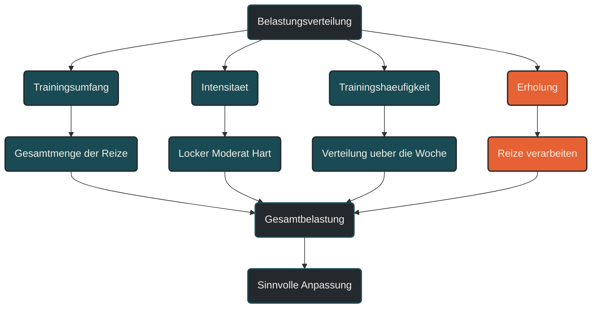

# Belastungsverteilung

Belastungsverteilung beschreibt, wie Trainingsumfang, Intensität und Erholung über eine Woche, einen Trainingsblock oder ein Trainingsjahr verteilt werden. Im Ausdauertraining ist das wichtig, weil nicht nur die Gesamtbelastung zählt, sondern auch, wann und wie stark einzelne Reize gesetzt werden. Entscheidend ist, harte, moderate und lockere Einheiten so zu kombinieren, dass Anpassung möglich bleibt.

## Was Belastungsverteilung bedeutet

Belastungsverteilung meint die Struktur der Trainingsbelastung über einen bestimmten Zeitraum. Dabei geht es nicht nur darum, wie viel trainiert wird, sondern wie sich lockere, moderate und intensive Einheiten zueinander verhalten.

Zwei Läufer können denselben Wochenumfang haben, aber völlig unterschiedlich belastet sein. Eine Woche mit vielen lockeren Einheiten wirkt anders als eine Woche mit mehreren intensiven Einheiten, langen Läufen und wenig Erholung.

Belastungsverteilung verbindet deshalb Trainingsumfang, Trainingsintensität, Trainingshäufigkeit und Regeneration zu einem Gesamtbild.

## Warum Belastungsverteilung wichtig ist

Ausdauertraining funktioniert nicht durch möglichst viele harte Reize. Anpassung entsteht, wenn Belastung und Erholung sinnvoll aufeinander folgen. Eine ungünstige Verteilung kann dazu führen, dass Training zwar viel Energie kostet, aber wenig Fortschritt bringt.

Besonders problematisch ist eine dauerhaft mittlere Belastung. Wenn viele Einheiten weder wirklich locker noch gezielt intensiv sind, entsteht oft eine hohe Ermüdung ohne klare Trainingswirkung.

Eine sinnvolle Belastungsverteilung hilft, lockere Einheiten locker zu halten, intensive Einheiten gezielt einzusetzen und Erholung als festen Teil des Trainings zu verstehen.

## Wie Belastungsverteilung im Training wirkt

Belastungsverteilung wirkt über die Abfolge von Reiz und Verarbeitung. Intensive Einheiten setzen starke Signale, brauchen aber auch mehr Erholung. Lockere Einheiten können Umfang, Grundlagenausdauer und Bewegungskontinuität unterstützen, ohne den Körper jedes Mal stark zu belasten.

Wenn harte Einheiten zu dicht aufeinander folgen, kann sich Ermüdung aufbauen. Wenn lockere Einheiten zu schnell gelaufen werden, verlieren sie ihren regenerativen oder grundlagenorientierten Charakter.

Gute Belastungsverteilung bedeutet deshalb nicht, immer gleichmäßig zu trainieren. Sie bedeutet, unterschiedliche Belastungen bewusst zu platzieren.

## Zentrale Einflussfaktoren

### Intensitätsverteilung

Die Intensitätsverteilung beschreibt, wie viel Training locker, moderat oder intensiv absolviert wird. Für viele Ausdauersportler ist ein hoher Anteil lockerer Einheiten sinnvoll, weil dadurch Umfang aufgebaut werden kann, ohne jede Einheit stark zu belasten.

Intensive Einheiten bleiben wichtig, sollten aber gezielt eingesetzt werden. Sie brauchen einen klaren Zweck und ausreichend Abstand zu anderen belastenden Reizen.

### Trainingsumfang

Je höher der Trainingsumfang ist, desto wichtiger wird die Verteilung. Ein hoher Umfang kann gut funktionieren, wenn er überwiegend locker aufgebaut ist. Derselbe Umfang kann problematisch werden, wenn viele Anteile moderat oder hart sind.

Belastungsverteilung entscheidet also, ob Umfang tragfähig wird oder sich als Ermüdung ansammelt.

### Erholungstage

Erholungstage und sehr lockere Einheiten sind Teil der Belastungsverteilung. Sie sorgen dafür, dass der Körper Trainingsreize verarbeiten kann.

Ein Ruhetag ist kein Zeichen von fehlender Disziplin. Er kann notwendig sein, damit die nächste Belastung wieder sinnvoll gesetzt werden kann.

### Harte Einheiten

Harte Einheiten wie Intervalle, Tempodauerläufe, Bergläufe oder lange Läufe mit Endbeschleunigung sollten bewusst geplant werden. Sie erzeugen nicht nur eine kardiovaskuläre Belastung, sondern auch muskuläre, neuronale und strukturelle Ermüdung.

Wer zu viele harte Einheiten kombiniert, erhöht die Gesamtbelastung oft stärker, als es auf dem Trainingsplan sichtbar wird.

### Alltag und Gesamtstress

Belastungsverteilung endet nicht beim Sport. Beruf, Familie, Schlafmangel, Hitze, Krankheit, Reisen oder mentaler Stress beeinflussen, wie gut Training verarbeitet wird.

Eine Trainingswoche mit guter Belastungsverteilung kann in einer stressigen Lebensphase trotzdem zu viel sein. Deshalb sollte die Verteilung regelmäßig an die Realität angepasst werden.

## Bedeutung für Läufer

Für Läufer ist Belastungsverteilung besonders wichtig, weil Lauftraining mechanisch belastend ist. Intensive Einheiten, lange Läufe und hohe Umfänge wirken auf Sehnen, Knochen, Gelenke und Muskulatur.

Eine sinnvolle Woche enthält deshalb nicht nur Trainingsreize, sondern auch Abstand zwischen belastenden Einheiten. Nach Intervallen oder langen Läufen kann ein lockerer Lauf, ein Ruhetag oder alternatives Training sinnvoller sein als die nächste starke Laufeinheit.

Praktisch bedeutet das: Nicht jede Einheit braucht einen Leistungsnachweis. Viele Läufer profitieren davon, lockere Tage wirklich locker zu gestalten und harte Tage klar zu begrenzen.

## Häufige Fehler

Ein häufiger Fehler ist, jede Einheit im mittleren Bereich zu laufen. Das fühlt sich oft produktiv an, kann aber langfristig zu hoher Ermüdung führen, ohne dass klare Reize entstehen.

Ein weiterer Fehler ist, harte Einheiten zu dicht zu planen. Intervalle, lange Läufe, Wettkämpfe und Krafttraining können sich gegenseitig verstärken und sollten nicht zufällig kombiniert werden.

Problematisch ist auch, Erholung erst dann einzuplanen, wenn Müdigkeit schon deutlich spürbar ist. Belastungsverteilung sollte Erholung vorbeugend berücksichtigen.

Auch das Kopieren fremder Trainingswochen kann irreführend sein. Eine Belastungsverteilung, die für einen erfahrenen Läufer funktioniert, kann für einen anderen zu viel oder zu wenig sein.

## Praktische Einordnung

Belastungsverteilung ist die praktische Ordnung der Trainingsreize. Sie entscheidet, wie Umfang, Intensität, Häufigkeit und Erholung zusammenwirken.

Für die Praxis ist wichtig, harte Einheiten bewusst zu platzieren, lockere Einheiten nicht zu schnell zu laufen und Erholung als festen Bestandteil der Woche zu behandeln.

Der wichtigste Merksatz lautet: Nicht die härteste Trainingswoche bringt Fortschritt, sondern die Belastungsverteilung, die regelmäßig gute Reize setzt und ausreichend Verarbeitung ermöglicht.

----

----

## Häufige Fragen zu Belastungsverteilung

### Was ist Belastungsverteilung einfach erklärt?

Belastungsverteilung beschreibt, wie lockere, moderate, intensive und erholende Trainingsanteile über eine Woche, einen Block oder ein Trainingsjahr verteilt werden.

### Warum ist Belastungsverteilung im Ausdauertraining wichtig?

Sie hilft, Trainingsreize sinnvoll zu setzen und Ermüdung zu kontrollieren. Dadurch können Belastung und Erholung besser zusammenwirken.

### Ist eine harte Trainingswoche automatisch besser?

Nein. Eine harte Woche kann kurzfristig fordern, ist aber nicht automatisch wirksamer. Entscheidend ist, ob der Körper die Belastung verarbeiten kann.

### Was ist ein häufiger Fehler bei der Belastungsverteilung?

Ein häufiger Fehler ist, zu viele Einheiten im mittleren Bereich zu absolvieren. Dadurch entsteht oft viel Ermüdung, ohne dass lockere oder intensive Reize klar getrennt sind.

### Wie verteilt man harte Einheiten sinnvoll?

Harte Einheiten sollten bewusst geplant und mit ausreichend Abstand zu anderen belastenden Reizen kombiniert werden. Dazwischen braucht es lockere Einheiten oder Erholung.

### Für wen ist Belastungsverteilung besonders relevant?

Belastungsverteilung ist besonders relevant für Läufer mit mehreren Einheiten pro Woche, steigenden Umfängen, Wettkampfzielen oder wiederkehrender Müdigkeit.

----

*Hinweis: Dieser Artikel dient der allgemeinen Information und ersetzt keine medizinische oder therapeutische Beratung. Mehr dazu im [**Gesundheits- und Quellenhinweis**](/ausdauersport/disclaimer/).*

