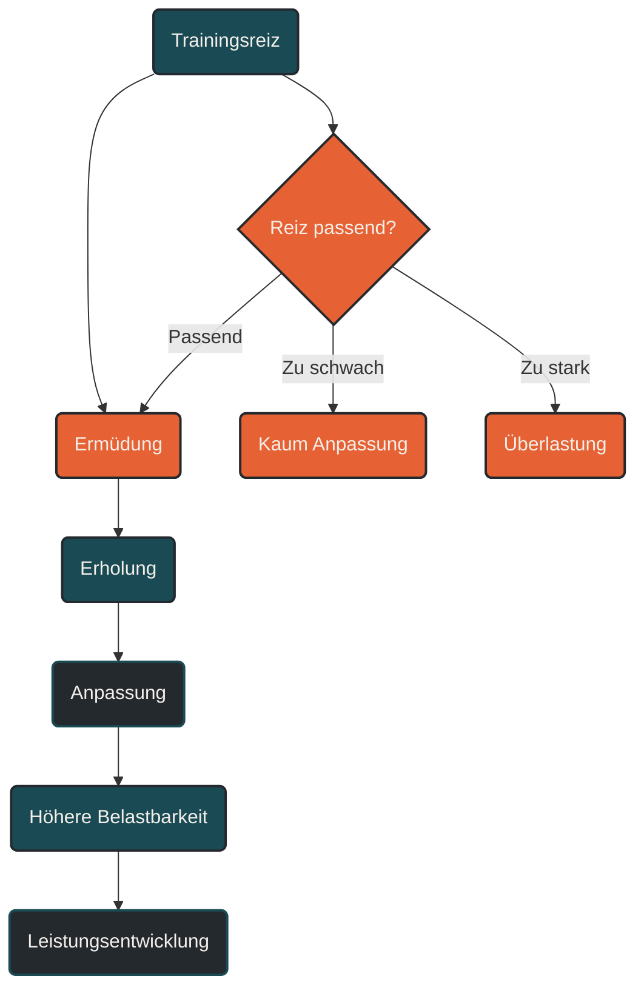

# Trainingsadaptation

Trainingsadaptation beschreibt die körperliche Anpassung an wiederholte Trainingsreize. Im Ausdauertraining bedeutet das zum Beispiel eine bessere Sauerstoffaufnahme, effizientere Energiegewinnung, höhere Belastbarkeit, stabilere Bewegungsökonomie und schnellere Erholung. Anpassung entsteht nicht durch Belastung allein, sondern durch das Zusammenspiel aus Reiz, Erholung und Wiederholung.

## Was Trainingsadaptation bedeutet

Trainingsadaptation ist der Prozess, durch den der Körper auf Training reagiert und sich langfristig verändert. Jede Trainingseinheit setzt einen Reiz. Dieser Reiz stört kurzfristig das innere Gleichgewicht des Körpers. In der anschließenden Erholung versucht der Organismus, diese Belastung zu verarbeiten und sich auf ähnliche Anforderungen besser vorzubereiten.

Im Ausdauertraining betrifft diese Anpassung viele Systeme gleichzeitig: Herz-Kreislauf-System, Atmung, Muskulatur, Energiestoffwechsel, Nervensystem, Sehnen, Knochen, Faszien und mentale Belastbarkeit.

Trainingsadaptation ist deshalb kein einzelner Effekt, sondern eine Summe vieler kleiner Veränderungen.

## Warum Trainingsadaptation wichtig ist

Ohne Anpassung wäre Training nur Ermüdung. Erst durch Trainingsadaptation wird aus Belastung langfristige Leistungsentwicklung.

Ein lockerer Dauerlauf kann zum Beispiel die aerobe Basis verbessern. Ein langer Lauf kann Ermüdungsresistenz aufbauen. Ein Intervalltraining kann starke Reize für Sauerstoffaufnahme und Tempohärte setzen. Krafttraining kann muskuläre Stabilität und Belastbarkeit unterstützen.

Entscheidend ist, dass diese Reize zum aktuellen Leistungsstand passen. Zu schwache Reize lösen kaum Anpassung aus. Zu starke Reize können überfordern. Passende Reize führen zu Fortschritt, wenn genügend Erholung folgt.

## Anpassung entsteht nach dem Training

Viele Athleten denken, sie werden während des Trainings besser. Genau genommen setzt Training aber zunächst Stress. Die eigentliche Anpassung entsteht danach.

Während der Belastung werden Energiespeicher geleert, Muskelfasern beansprucht, Stoffwechselprozesse aktiviert, das Nervensystem gefordert und Gewebe mechanisch belastet. In der Erholungsphase werden diese Prozesse verarbeitet.

Der Körper füllt Energiespeicher auf, repariert Gewebe, verbessert Stoffwechselwege, reguliert Enzyme, stärkt Strukturen und optimiert Bewegungsabläufe.

Training liefert den Anlass. Erholung ermöglicht die Anpassung.

## Zentrale Anpassungen im Ausdauertraining

### Herz-Kreislauf-System

Regelmäßiges Ausdauertraining kann das Herz-Kreislauf-System leistungsfähiger machen. Das Herz kann ökonomischer arbeiten, Blut besser transportieren und die Muskulatur zuverlässiger mit Sauerstoff versorgen.

Wichtige Anpassungen betreffen unter anderem Herzfrequenzregulation, Schlagvolumen, Blutvolumen und Kapillarisierung.

### Atmung und Sauerstoffaufnahme

Ausdauertraining verbessert die Fähigkeit, Sauerstoff aufzunehmen, zu transportieren und in der Muskulatur zu verwerten. Die VO2max ist dabei ein wichtiger, aber nicht allein entscheidender Leistungsfaktor.

Auch Atemökonomie, ventilatorische Kontrolle und die Fähigkeit, bei höheren Intensitäten stabil zu bleiben, spielen eine Rolle.

### Energiestoffwechsel

Der Energiestoffwechsel passt sich stark an wiederholtes Training an. Der Körper lernt, Energie effizienter bereitzustellen, Fette und Kohlenhydrate besser zu nutzen und Stoffwechselprodukte besser zu verarbeiten.

Besonders wichtig sind mitochondriale Anpassungen, Fettstoffwechsel, Glykogenspeicherung, Laktatdynamik und Enzymaktivität.

### Muskulatur

Die Muskulatur verändert sich durch Training in Struktur und Funktion. Ausdauertraining verbessert unter anderem die Ermüdungsresistenz, Kapillardichte, mitochondriale Ausstattung und lokale Stoffwechselkapazität.

Intensivere Reize können zusätzlich neuromuskuläre Aktivierung, Tempohärte und Rekrutierung bestimmter Muskelfasern beeinflussen.

### Sehnen, Knochen und Bindegewebe

Nicht nur Herz und Muskeln passen sich an. Auch Sehnen, Knochen, Faszien, Knorpel und Bindegewebe reagieren auf Belastung.

Diese Strukturen passen sich jedoch oft langsamer an als das Herz-Kreislauf-System. Deshalb kann sich ein Athlet konditionell bereit fühlen, obwohl die mechanische Belastbarkeit noch nicht ausreichend entwickelt ist.

Das ist im Lauftraining besonders wichtig, weil zu schnelle Umfangssteigerung Überlastungsprobleme begünstigen kann.

### Nervensystem und Bewegungsökonomie

Auch das Nervensystem lernt. Bewegungen werden koordinierter, ökonomischer und stabiler. Im Laufen kann das bedeuten, dass weniger Energie für dieselbe Geschwindigkeit benötigt wird.

Diese Anpassung betrifft Muskelkoordination, Schrittfrequenz, Abdruckverhalten, Rumpfstabilität, Technik und die Fähigkeit, unter Ermüdung sauber zu laufen.

## Kurzfristige und langfristige Anpassung

Trainingsadaptation findet auf verschiedenen Zeitebenen statt.

### Akute Reaktion

Die akute Reaktion entsteht während und direkt nach einer Einheit. Herzfrequenz, Atmung, Körpertemperatur, Stoffwechsel, Hormonantwort und Ermüdung verändern sich sofort.

Diese Reaktion ist noch keine dauerhafte Leistungssteigerung, sondern die unmittelbare Antwort auf Belastung.

### Kurzfristige Anpassung

Kurzfristige Anpassung entsteht über Tage und Wochen. Dazu gehören bessere Wiederholbarkeit bestimmter Einheiten, verbesserte Erholung, erste Fortschritte bei Pace oder Herzfrequenz und stabilere Belastungsverträglichkeit.

### Langfristige Anpassung

Langfristige Anpassung entsteht über Monate und Jahre. Dazu gehören robuste aerobe Basis, hohe Ermüdungsresistenz, stabile Sehnen- und Gewebebelastbarkeit, bessere Wettkampfleistung und eine höhere Toleranz gegenüber Trainingsumfang.

Gerade im Ausdauersport ist langfristige Anpassung entscheidend. Viele wichtige Veränderungen brauchen Zeit und wiederholte Reize.

## Reiz, Erholung und Wiederholung

Trainingsadaptation entsteht durch drei Elemente.

### Reiz

Der Reiz muss stark genug sein, um Anpassung auszulösen. Er kann über Umfang, Intensität, Dauer, Häufigkeit, Höhenmeter, Untergrund, Technik oder Kraftanteil entstehen.

### Erholung

Erholung sorgt dafür, dass der Körper den Reiz verarbeiten kann. Ohne Erholung bleibt Training vor allem Stress.

### Wiederholung

Ein einzelner Reiz reicht selten aus. Anpassung braucht wiederholte, ähnliche und sinnvoll gesteigerte Belastungen. Deshalb sind Regelmäßigkeit und Struktur wichtiger als einzelne besonders harte Einheiten.

## Spezifität der Anpassung

Der Körper passt sich spezifisch an das an, was trainiert wird. Wer lange locker läuft, verbessert andere Fähigkeiten als jemand, der kurze intensive Intervalle trainiert. Wer auf flacher Straße trainiert, entwickelt andere Anforderungen als jemand, der regelmäßig Trails, Höhenmeter oder Bergabbelastung nutzt.

Spezifität bedeutet nicht, dass jedes Training exakt wie der Wettkampf aussehen muss. Es bedeutet, dass die wichtigsten Anforderungen des Ziels im Trainingsprozess zunehmend berücksichtigt werden.

## Warum Anpassung nicht linear verläuft

Leistungsentwicklung verläuft selten gleichmäßig. Am Anfang können Fortschritte schnell sichtbar werden. Später wird Entwicklung langsamer, weil der Körper bereits an viele Reize angepasst ist.

Auch Alltag, Schlaf, Ernährung, Stress, Krankheit, Verletzungen, Trainingsalter und mentale Belastung beeinflussen die Anpassung. Deshalb kann eine Woche trotz gutem Training schwer wirken und eine andere Woche unerwartet leicht.

Trainingsadaptation ist kein gerader Aufstieg, sondern ein langfristiger Prozess mit Fortschritten, Plateaus, Rückschritten und erneuten Entwicklungsschritten.

## Positive und negative Anpassung

Nicht jede Anpassung ist automatisch positiv. Der Körper passt sich auch an ungünstige Belastungsmuster an.

Wenn Training dauerhaft zu monoton, zu hart, zu umfangreich oder zu wenig erholsam ist, kann der Körper mit chronischer Ermüdung, Schonmustern, sinkender Motivation, schlechterer Schlafqualität oder Überlastungsbeschwerden reagieren.

Positive Trainingsadaptation entsteht, wenn Belastung, Erholung und Progression zusammenpassen.

## Trainingsadaptation im Lauftraining

Im Lauftraining ist Trainingsadaptation besonders komplex, weil konditionelle und mechanische Anpassung zusammenkommen müssen.

Das Herz-Kreislauf-System kann sich oft relativ schnell verbessern. Die passiven Strukturen brauchen meist länger. Deshalb ist es möglich, dass ein Läufer mehr laufen könnte, als Sehnen, Knochen oder Gelenke aktuell gut tolerieren.

Sinnvolle Anpassung im Lauftraining bedeutet daher:

* Umfang schrittweise steigern
* lockere Einheiten wirklich locker halten
* harte Reize gezielt platzieren
* Deloads einplanen
* Beschwerden ernst nehmen
* Technik und Kraft ergänzen
* langfristig denken

## Trainingsadaptation und Monitoring

Monitoring hilft, Anpassung sichtbar zu machen. Dabei geht es nicht nur um Bestzeiten oder schnelle Einheiten, sondern um die Entwicklung über Zeit.

Wichtige Hinweise können sein:

* gleiche Pace bei niedrigerer Herzfrequenz
* gleiche Herzfrequenz bei höherer Pace
* bessere Erholung nach langen Läufen
* stabilere Leistung in Intervallen
* weniger Muskelkater bei ähnlicher Belastung
* bessere Schlaf- und Erholungsqualität
* geringere subjektive Belastung bei gleichem Training
* weniger Beschwerden bei höherer Belastbarkeit

Diese Zeichen zeigen oft besser als einzelne Spitzenwerte, ob Training langfristig wirkt.

## Häufige Fehler bei Trainingsadaptation

Ein häufiger Fehler ist, Anpassung erzwingen zu wollen. Mehr Training führt nicht automatisch zu mehr Fortschritt, wenn Erholung und Belastbarkeit nicht mitwachsen.

Ein zweiter Fehler ist, ständig neue Reize zu setzen. Der Körper braucht Wiederholung, um sich gezielt anzupassen. Wer jede Woche komplett anders trainiert, erschwert stabile Entwicklung.

Ein dritter Fehler ist, nur konditionelle Werte zu beachten. Gute Pace oder niedrige Herzfrequenz bedeuten nicht automatisch, dass Sehnen, Knochen und Gelenke bereit für mehr Belastung sind.

Ein vierter Fehler ist, Fortschritt nur an Bestzeiten zu messen. Leistungsentwicklung zeigt sich auch in besserer Wiederholbarkeit, geringerer Ermüdung, stabilerer Technik und höherer Belastungsverträglichkeit.

## Praktische Einordnung

Trainingsadaptation ist der biologische Kern jeder Leistungsentwicklung. Sie entsteht, wenn Trainingsreize passend dosiert, ausreichend erholt, wiederholt und langfristig gesteigert werden.

Der wichtigste Merksatz lautet: Nicht das Training allein macht besser, sondern die Anpassung an richtig gesetztes Training.

----

----

## Häufige Fragen zur Trainingsadaptation

### Was ist Trainingsadaptation einfach erklärt?

Trainingsadaptation ist die körperliche Anpassung an wiederholte Trainingsreize. Der Körper wird belastbarer, effizienter und leistungsfähiger, wenn Reiz, Erholung und Wiederholung sinnvoll zusammenpassen.

### Wann entsteht Trainingsadaptation?

Trainingsadaptation entsteht nicht während der Belastung selbst, sondern vor allem in der Erholungsphase danach. Das Training setzt den Reiz, die Erholung ermöglicht die Anpassung.

### Welche Anpassungen entstehen durch Ausdauertraining?

Ausdauertraining kann Herz-Kreislauf-System, Sauerstoffaufnahme, Energiestoffwechsel, Muskulatur, Sehnen, Knochen, Nervensystem, Bewegungsökonomie und Erholungsfähigkeit beeinflussen.

### Warum reicht ein einzelner Trainingsreiz nicht aus?

Ein einzelner Reiz kann eine kurzfristige Reaktion auslösen. Dauerhafte Anpassung entsteht erst durch wiederholte, passende und langfristig gesteigerte Reize.

### Warum ist Erholung für Trainingsadaptation so wichtig?

Ohne Erholung kann der Körper Trainingsreize nicht ausreichend verarbeiten. Dann entsteht vor allem Ermüdung statt Leistungsentwicklung.

### Warum passen sich Sehnen und Knochen langsamer an?

Passive Strukturen wie Sehnen, Knochen, Faszien und Knorpel reagieren oft langsamer als Herz-Kreislauf-System und Muskulatur. Deshalb sollte die mechanische Belastung im Lauftraining schrittweise gesteigert werden.

### Was bedeutet spezifische Anpassung?

Spezifische Anpassung bedeutet, dass sich der Körper vor allem an die Anforderungen anpasst, die regelmäßig trainiert werden. Dauer, Intensität, Bewegungsmuster, Untergrund und Zielbelastung beeinflussen die Anpassung.

### Warum verläuft Leistungsentwicklung nicht linear?

Leistungsentwicklung wird von Training, Erholung, Alltag, Schlaf, Ernährung, Stress, Trainingsalter und Gesundheit beeinflusst. Deshalb gibt es Fortschritte, Plateaus und manchmal auch Rückschritte.

### Was ist der Unterschied zwischen Ermüdung und Anpassung?

Ermüdung ist die kurzfristige Folge von Belastung. Anpassung ist die langfristige Verbesserung, die entsteht, wenn der Körper die Belastung verarbeitet und sich darauf vorbereitet.

### Kann zu viel Training Anpassung verhindern?

Ja. Wenn Belastung dauerhaft höher ist als die Erholungsfähigkeit, kann sich Restermüdung aufbauen. Dann sinkt die Trainingsqualität, und das Risiko für Stagnation oder Überlastung steigt.

### Woran erkenne ich erfolgreiche Trainingsadaptation?

Hinweise sind bessere Leistung bei gleicher Anstrengung, niedrigere Herzfrequenz bei gleicher Pace, bessere Erholung, stabilere Technik, weniger Beschwerden und höhere Belastungsverträglichkeit.

### Ist Muskelkater ein Zeichen für gute Anpassung?

Nicht unbedingt. Muskelkater zeigt vor allem ungewohnte oder hohe muskuläre Belastung. Anpassung kann auch ohne starken Muskelkater entstehen.

### Warum sind lockere Einheiten wichtig für Anpassung?

Lockere Einheiten ermöglichen häufig wiederholbare aerobe Reize mit vergleichsweise geringer Ermüdung. Sie bilden eine wichtige Grundlage für langfristige Ausdaueranpassungen.

### Warum sollte Training nicht ständig verändert werden?

Der Körper braucht wiederholte Reize, um sich gezielt anzupassen. Zu viel Abwechslung kann die Anpassung erschweren, wenn kein klarer Trainingsschwerpunkt erkennbar ist.

----

*Hinweis: Dieser Artikel dient der allgemeinen Information und ersetzt keine medizinische oder therapeutische Beratung. Mehr dazu im [**Gesundheits- und Quellenhinweis**](/ausdauersport/disclaimer/).*

