```mermaid
graph TD
    A(Plateau) --> B(Ursache pruefen)
    B --> C(Unterforderung)
    B --> D(Ueberforderung)
    B --> E(Falscher Reiz)

    C --> F(Progression oder Variation)
    D --> G(Deload und Erholung)
    E --> H(Spezifitaet und Schwerpunkt)

    F --> I(Neue Anpassung)
    G --> I
    H --> I

    classDef default fill:#F4EFEA,stroke:#1A4B54,stroke-width:2px,color:#24292E;
    classDef primary fill:#1A4B54,stroke:#24292E,stroke-width:2px,color:#F4EFEA;
    classDef highlight fill:#E66133,stroke:#24292E,stroke-width:2px,color:#F4EFEA;
    classDef dark fill:#24292E,stroke:#1A4B54,stroke-width:2px,color:#F4EFEA;

    class A dark;
    class B primary;
    class C highlight;
    class D highlight;
    class E highlight;
    class F primary;
    class G primary;
    class H primary;
    class I dark;
```

# Plateaus

Ein Plateau beschreibt eine Phase, in der sich die Leistung trotz regelmäßigem Training kaum weiterentwickelt. Im Ausdauertraining kann das durch monotone Reize, zu wenig Erholung, zu schnelle Belastungssteigerung, fehlende Spezifität, zu viel mittlere Intensität, Alltagsstress oder unpassende Trainingssteuerung entstehen. Ein Plateau ist nicht automatisch ein Scheitern, sondern ein Hinweis, dass Reiz, Erholung oder Trainingsstruktur überprüft werden sollten. [[1]](#quelle-1) [[3]](#quelle-3) [[5]](#quelle-5)

## Was ein Plateau ist

Ein Plateau ist eine Phase der Leistungsstagnation. Die Trainingsleistung verbessert sich nicht mehr sichtbar, obwohl weiterhin trainiert wird. Pace, Herzfrequenz, subjektives Belastungsempfinden, Wettkampfzeiten oder Belastbarkeit bleiben über Wochen ähnlich oder verschlechtern sich sogar leicht.

Im Ausdauertraining sind Plateaus normal. Leistungsentwicklung verläuft nicht linear. Nach schnellen Fortschritten am Anfang wird Entwicklung später langsamer, weil der Körper bereits an viele Trainingsreize angepasst ist. [[4]](#quelle-4) [[5]](#quelle-5)

Ein Plateau bedeutet deshalb nicht automatisch, dass das Training wirkungslos ist. Es kann auch eine Phase sein, in der der Körper Anpassungen stabilisiert. Problematisch wird es, wenn Stagnation lange anhält, Beschwerden zunehmen oder die Ermüdung dauerhaft hoch bleibt.

## Warum Plateaus entstehen

Plateaus entstehen, wenn der aktuelle Trainingsreiz nicht mehr zur gewünschten Anpassung führt oder wenn der Körper die Reize nicht mehr ausreichend verarbeiten kann.

Es gibt zwei grundlegende Möglichkeiten:

Der Reiz ist zu gering oder zu monoton.

Oder der Reiz ist zu hoch und die Erholung reicht nicht aus. [[3]](#quelle-3) [[6]](#quelle-6)

Beides kann ähnlich aussehen: Die Leistung entwickelt sich nicht weiter. Deshalb ist es wichtig, nicht sofort mehr oder härter zu trainieren, sondern die Ursache genauer zu prüfen.

## Monotone Trainingsreize

Ein häufiger Grund für Plateaus ist monotones Training. Wenn über lange Zeit immer ähnliche Einheiten absolviert werden, passt sich der Körper daran an. Der Reiz wird vertraut und löst weniger neue Anpassung aus. [[3]](#quelle-3) [[12]](#quelle-12)

Typische Beispiele sind:

* immer dieselbe Strecke
* immer ähnliche Pace
* immer gleiche Wochenumfänge
* kaum Variation der Intensität
* keine geplanten Entlastungsphasen
* keine klaren Trainingsschwerpunkte

Monotonie bedeutet nicht, dass Wiederholung schlecht ist. Wiederholung ist wichtig für Anpassung. Problematisch wird es, wenn Training über längere Zeit keinen neuen Entwicklungsimpuls mehr setzt.

## Zu wenig Erholung

Ein Plateau kann auch entstehen, wenn zu viel Ermüdung angesammelt wurde. Dann ist der Körper nicht unterfordert, sondern überlastet. [[5]](#quelle-5) [[6]](#quelle-6) [[7]](#quelle-7)

In diesem Fall ist mehr Training meist keine Lösung. Der Athlet trainiert vielleicht regelmäßig und hart, aber die Anpassung bleibt aus, weil die Erholungsphasen zu kurz oder zu schwach sind.

Typische Hinweise sind:

* schwere Beine über mehrere Tage
* sinkende Motivation
* schlechter Schlaf
* höhere Herzfrequenz bei lockerer Belastung
* auffällig niedrige HRV
* ungewöhnlich hohe subjektive Anstrengung
* schlechtere Qualität in Intervallen
* häufige kleine Beschwerden
* erhöhte Infektanfälligkeit

Ein solches Plateau ist eigentlich ein Ermüdungsproblem.

## Zu viel mittlere Intensität

Viele Ausdauerathleten geraten in ein Plateau, weil zu viele Einheiten im mittleren Intensitätsbereich landen. Diese Belastung fühlt sich produktiv an, erzeugt aber viel Ermüdung. [[1]](#quelle-1) [[2]](#quelle-2)

Das Problem: Lockere Einheiten sind nicht mehr locker genug, harte Einheiten sind nicht mehr qualitativ genug, und die Gesamtbelastung bleibt dauerhaft hoch.

Diese sogenannte Grauzone kann dazu führen, dass Training zwar anstrengend wirkt, aber wenig klare Anpassungsreize setzt. Die Folge ist oft Stagnation trotz hohem Einsatz.

## Fehlende Progression

Ein Plateau kann entstehen, wenn Trainingsreize über längere Zeit nicht mehr gesteigert oder verändert werden. Der Körper hat sich an die aktuelle Belastung angepasst und bekommt keinen ausreichenden Anlass für weitere Entwicklung. [[4]](#quelle-4) [[12]](#quelle-12)

Progression kann über verschiedene Wege erfolgen:

* mehr Umfang
* längere Dauer einzelner Einheiten
* höhere Intensität
* mehr Wiederholungen
* kürzere Pausen
* höhere Reizdichte
* mehr Höhenmeter
* mehr spezifische Belastung
* bessere Wiederholbarkeit bei gleicher Belastung

Progression bedeutet aber nicht, alles gleichzeitig zu erhöhen. Eine sinnvolle Steigerung ist gezielt, kontrolliert und durch Entlastung abgesichert.

## Zu schnelle Progression

Auch das Gegenteil kann ein Plateau auslösen: zu schnelle Steigerung. Wenn Umfang, Intensität oder Trainingshäufigkeit schneller steigen, als der Körper sie verarbeiten kann, entsteht keine stabile Anpassung. [[5]](#quelle-5) [[8]](#quelle-8)

Im Lauftraining ist das besonders relevant, weil Herz-Kreislauf-System und Muskulatur oft schneller reagieren als Sehnen, Knochen, Faszien und Gelenke. Ein Athlet kann sich konditionell leistungsfähig fühlen, aber mechanisch noch nicht ausreichend belastbar sein.

Dann entstehen häufig Beschwerden, unsaubere Bewegungsmuster oder chronische Restermüdung. Die Leistung stagniert, obwohl der Trainingsumfang steigt.

## Fehlende Spezifität

Ein Plateau kann auch entstehen, wenn das Training nicht gut genug zum Ziel passt. Der Körper passt sich spezifisch an das an, was regelmäßig trainiert wird. [[11]](#quelle-11) [[12]](#quelle-12)

Wer für einen Marathon trainiert, aber kaum lange Läufe, Ermüdungsresistenz, Verpflegung und Marathonpace übt, entwickelt möglicherweise nicht die passende Zielbelastung.

Wer für 5 Kilometer trainiert, aber keine schnellen Reize, keine VO2max-nahen Belastungen und kein Renntempo trainiert, verbessert vielleicht die Grundlage, aber nicht ausreichend die spezifische Leistungsfähigkeit.

Spezifität bedeutet nicht, dass jedes Training wie der Wettkampf aussehen muss. Aber je näher das Ziel rückt, desto stärker sollten die entscheidenden Anforderungen vorbereitet werden.

## Fehlender Trainingsschwerpunkt

Manche Plateaus entstehen, weil zu viele Ziele gleichzeitig verfolgt werden. Dann enthält der Trainingsplan etwas von allem, aber nichts wird systematisch entwickelt.

Ein Beispiel:

Ein Athlet möchte gleichzeitig Umfang steigern, schneller werden, Schwelle verbessern, Krafttraining ausbauen, lange Läufe verlängern und Wettkämpfe vorbereiten. Dadurch entsteht viel Belastung, aber kein klarer Entwicklungsschwerpunkt.

Mesozyklen helfen, solche Plateaus zu vermeiden. Sie setzen für mehrere Wochen einen Schwerpunkt, der gezielt aufgebaut, verarbeitet und überprüft wird. [[12]](#quelle-12)

## Alltag und externe Belastung

Nicht jedes Plateau entsteht durch Training selbst. Auch Alltag kann Leistungsentwicklung bremsen.

Schlafmangel, beruflicher Stress, familiäre Belastung, Energiemangel, Krankheit, Reisen, Hitze, mentale Anspannung oder unregelmäßige Ernährung beeinflussen, wie Training verarbeitet wird.

Der Körper unterscheidet nicht sauber zwischen Trainingsstress und Alltagsstress. Beides belastet das System. Deshalb kann ein Trainingsplan auf dem Papier gut aussehen und trotzdem nicht wirken, wenn die gesamte Belastung zu hoch ist. [[5]](#quelle-5) [[6]](#quelle-6) [[7]](#quelle-7)

## Ernährung und Energieverfügbarkeit

Leistungsentwicklung braucht Energie. Wenn die Energiezufuhr dauerhaft zu niedrig ist, kann der Körper Trainingsreize schlechter verarbeiten.

Zu geringe Energieverfügbarkeit kann Erholung, Hormonregulation, Immunsystem, Schlaf, Muskelreparatur und Belastbarkeit beeinträchtigen. Auch zu wenig Kohlenhydrate rund um intensive Einheiten können dazu führen, dass Qualitätseinheiten nicht sauber umgesetzt werden. [[9]](#quelle-9) [[10]](#quelle-10)

Ein Plateau kann deshalb auch ein Ernährungs- oder Regenerationsproblem sein.

## Plateau oder normale Stabilisierung?

Nicht jede Phase ohne neue Bestleistung ist ein echtes Problem. Manchmal stabilisiert der Körper gerade eine höhere Belastbarkeit. Das ist besonders nach einer Umfangssteigerung oder nach intensiven Trainingsblöcken normal.

Ein stabiles Plateau kann sogar positiv sein, wenn:

* höhere Umfänge besser vertragen werden
* lockere Einheiten leichter fallen
* Erholung schneller gelingt
* Beschwerden weniger werden
* Technik stabiler bleibt
* gleiche Leistung mit weniger Anstrengung möglich ist

Leistungsentwicklung zeigt sich nicht nur in Bestzeiten. Auch bessere Wiederholbarkeit und Belastbarkeit sind Fortschritt.

## Wie man ein Plateau analysiert

Ein Plateau sollte nicht impulsiv beantwortet werden. Sinnvoll ist eine systematische Analyse.

Wichtige Fragen sind:

* Ist die Trainingsbelastung zu monoton?
* Gibt es ausreichend Entlastungsphasen?
* Sind lockere Einheiten wirklich locker?
* Gibt es zu viel mittlere Intensität?
* Ist die Progression passend?
* Ist das Training spezifisch genug für das Ziel?
* Gibt es genügend Schlaf und Energiezufuhr?
* Hat sich der Alltag verändert?
* Gibt es Schmerzen oder Warnsignale?
* Stimmen subjektives Empfinden und Leistungsdaten überein?

Erst danach sollte entschieden werden, ob mehr Reiz, weniger Reiz, andere Reize oder mehr Erholung nötig sind.

## Strategien gegen Plateaus

### Entlastung einplanen

Wenn Restermüdung hoch ist, kann ein Deload sinnvoll sein. Umfang, Intensität oder Reizdichte werden reduziert, damit der Körper die bisherigen Reize verarbeiten kann.

### Reize variieren

Wenn Training zu monoton ist, können neue Reize helfen. Das bedeutet nicht chaotische Abwechslung, sondern gezielte Variation innerhalb eines klaren Plans.

Beispiele sind Tempoblöcke, längere Läufe, kurze Intervalle, Bergläufe, Technikarbeit, Krafttraining oder veränderte Streckenprofile.

### Intensitätsverteilung prüfen

Wenn zu viele Einheiten mittelhart sind, sollte die Verteilung korrigiert werden. Lockere Tage müssen wirklich locker sein, damit harte Einheiten wieder Qualität bekommen.

### Schwerpunkt setzen

Ein Mesozyklus mit klarem Fokus kann helfen, Entwicklung wieder anzustoßen. Der Schwerpunkt kann aerobe Basis, Schwelle, VO2max, Umfang, Kraft, Technik oder Wettkampfspezifik sein.

### Spezifität erhöhen

Je näher ein Wettkampf kommt, desto stärker sollte das Training zur Zielbelastung passen. Marathontraining, 5-km-Training, Trailrunning und Triathlon brauchen unterschiedliche Reize.

### Monitoring nutzen

Monitoring hilft, zu erkennen, ob ein Plateau durch Unterforderung, Überforderung oder externe Belastung entsteht. Herzfrequenz, Pace, RPE, HRV, Schlaf, Stimmung und Beschwerden sollten zusammen betrachtet werden. [[4]](#quelle-4) [[5]](#quelle-5) [[6]](#quelle-6)

## Häufige Fehler bei Plateaus

Ein häufiger Fehler ist, bei Stagnation sofort härter zu trainieren. Wenn das Plateau durch Ermüdung entsteht, verschlimmert mehr Belastung das Problem.

Ein zweiter Fehler ist, zu schnell alles zu verändern. Dann wird unklar, welche Anpassung überhaupt wirkt.

Ein dritter Fehler ist, nur auf einzelne Leistungswerte zu schauen. Ein schlechter Testlauf bedeutet nicht automatisch ein echtes Plateau.

Ein vierter Fehler ist, Erholung zu unterschätzen. Manchmal entsteht der nächste Fortschritt nicht durch mehr Training, sondern durch bessere Verarbeitung des bisherigen Trainings.

## Praktische Einordnung

Plateaus gehören zur Leistungsentwicklung. Sie zeigen, dass Training überprüft und angepasst werden muss. Entscheidend ist, die Ursache zu verstehen, statt reflexartig mehr Umfang oder mehr Intensität einzubauen.

Der wichtigste Merksatz lautet: Ein Plateau ist kein Stillstand ohne Information, sondern ein Signal, dass Trainingsreiz, Erholung, Spezifität oder Gesamtbelastung neu eingeordnet werden sollten.

----

----

## Häufige Fragen zu Plateaus

### Was ist ein Plateau im Training?

Ein Plateau ist eine Phase, in der sich die Leistung trotz regelmäßigem Training kaum verbessert. Pace, Herzfrequenz, Belastbarkeit oder Wettkampfleistung bleiben über längere Zeit ähnlich.

### Sind Plateaus im Ausdauertraining normal?

Ja. Leistungsentwicklung verläuft nicht linear. Plateaus können normale Stabilisierungsphasen sein, sie können aber auch auf monotone Reize, zu wenig Erholung oder unpassende Trainingssteuerung hinweisen.

### Warum entsteht ein Plateau?

Ein Plateau kann durch monotones Training, fehlende Progression, zu viel Restermüdung, zu viel mittlere Intensität, fehlende Spezifität, Alltagsstress, Schlafmangel oder unzureichende Energiezufuhr entstehen.

### Sollte ich bei einem Plateau mehr trainieren?

Nicht automatisch. Wenn das Plateau durch Ermüdung entsteht, kann mehr Training die Stagnation verschlimmern. Zuerst sollte geprüft werden, ob mehr Reiz oder mehr Erholung nötig ist.

### Kann zu viel Training ein Plateau verursachen?

Ja. Zu viel Umfang, zu viele harte Einheiten oder zu wenig Entlastung können dazu führen, dass der Körper Trainingsreize nicht mehr ausreichend verarbeitet.

### Kann zu wenig Training ein Plateau verursachen?

Ja. Wenn der Trainingsreiz zu schwach oder zu gleichförmig ist, bekommt der Körper keinen ausreichenden Anlass für weitere Anpassung.

### Was hat die Grauzone mit Plateaus zu tun?

Zu viel mittlere Intensität kann viel Ermüdung erzeugen, ohne klare Reizqualität zu liefern. Dadurch werden lockere Einheiten zu hart und harte Einheiten zu schlecht, was Plateaus begünstigen kann.

### Wie erkenne ich, ob ein Plateau durch Ermüdung entsteht?

Hinweise sind schwere Beine, schlechter Schlaf, sinkende Motivation, erhöhte Anstrengung bei lockerer Belastung, schlechtere Intervallqualität, auffällig niedrige HRV oder wiederkehrende Beschwerden.

### Wie erkenne ich, ob ein Plateau durch zu wenig Reiz entsteht?

Hinweise sind stabile Erholung, wenig Ermüdung, aber keine Entwicklung über längere Zeit. Dann können gezielte Progression, Variation oder ein neuer Trainingsschwerpunkt sinnvoll sein.

### Wie lange dauert ein Plateau?

Das ist unterschiedlich. Manche Plateaus dauern wenige Wochen, andere länger. Entscheidend ist, ob die Ursache erkannt und die Trainingsstruktur passend angepasst wird.

### Ist ein Plateau immer schlecht?

Nein. Manchmal stabilisiert der Körper gerade eine neue Belastbarkeit. Wenn höhere Umfänge besser vertragen werden oder gleiche Leistung leichter fällt, kann trotzdem Fortschritt stattfinden.

### Welche Rolle spielt Erholung bei Plateaus?

Erholung ist zentral. Ohne ausreichende Verarbeitung werden Trainingsreize nicht zu Anpassung, sondern zu Restermüdung. Ein Deload kann helfen, wenn Ermüdung die Ursache ist.

### Welche Rolle spielt Spezifität bei Plateaus?

Wenn das Training nicht zum Ziel passt, kann die Leistung stagnieren. Marathon, 5 Kilometer, Trailrunning oder Triathlon benötigen unterschiedliche spezifische Reize.

### Was ist der häufigste Fehler bei einem Plateau?

Der häufigste Fehler ist, sofort mehr oder härter zu trainieren. Sinnvoller ist zuerst eine Analyse, ob das Problem durch Unterforderung, Überforderung oder falsche Reize entsteht.

----

## Quellen

### Quelle 1

Seiler, S. (2010): What is Best Practice for Training Intensity and Duration Distribution in Endurance Athletes? International Journal of Sports Physiology and Performance, 5(3), 276–291.  
Quelle: [Human Kinetics](https://journals.humankinetics.com/abstract/journals/ijspp/5/3/article-p276.xml)

### Quelle 2

Stöggl, T. L. & Sperlich, B. (2014): Polarized training has greater impact on key endurance variables than threshold, high intensity, or high volume training. Frontiers in Physiology, 5, 33.  
Quelle: [PubMed](https://pubmed.ncbi.nlm.nih.gov/24550842/)

### Quelle 3

Foster, C. (1998): Monitoring training in athletes with reference to overtraining syndrome. Medicine & Science in Sports & Exercise, 30(7), 1164–1168.  
Quelle: [Read by QxMD](https://read.qxmd.com/read/9662690/monitoring-training-in-athletes-with-reference-to-overtraining-syndrome)

### Quelle 4

Impellizzeri, F. M., Marcora, S. M. & Coutts, A. J. (2019): Internal and External Training Load: 15 Years On. International Journal of Sports Physiology and Performance, 14(2), 270–273.  
Quelle: [PubMed](https://pubmed.ncbi.nlm.nih.gov/30614348/)

### Quelle 5

Bourdon, P. C., Cardinale, M., Murray, A. et al. (2017): Monitoring Athlete Training Loads: Consensus Statement. International Journal of Sports Physiology and Performance, 12(s2), S2-161–S2-170.  
Quelle: [Human Kinetics](https://journals.humankinetics.com/view/journals/ijspp/12/s2/article-pS2-161.xml)

### Quelle 6

Meeusen, R., Duclos, M., Foster, C. et al. (2013): Prevention, Diagnosis, and Treatment of the Overtraining Syndrome: Joint Consensus Statement of the ECSS and ACSM. Medicine & Science in Sports & Exercise, 45(1), 186–205.  
Quelle: [PubMed](https://pubmed.ncbi.nlm.nih.gov/23247672/)

### Quelle 7

Kellmann, M., Bertollo, M., Bosquet, L. et al. (2018): Recovery and Performance in Sport: Consensus Statement. International Journal of Sports Physiology and Performance, 13(2), 240–245.  
Quelle: [Human Kinetics](https://journals.humankinetics.com/view/journals/ijspp/13/2/article-p240.xml)

### Quelle 8

Soligard, T., Schwellnus, M., Alonso, J. M. et al. (2016): How much is too much? (Part 1) International Olympic Committee consensus statement on load in sport and risk of injury. British Journal of Sports Medicine, 50(17), 1030–1041.  
Quelle: [BMJ/BJSM](https://bjsm.bmj.com/content/50/17/1030)

### Quelle 9

Mountjoy, M., Sundgot-Borgen, J., Burke, L. et al. (2018): IOC consensus statement on relative energy deficiency in sport (RED-S): 2018 update. British Journal of Sports Medicine, 52(11), 687–697.  
Quelle: [BMJ/BJSM](https://bjsm.bmj.com/content/52/11/687)

### Quelle 10

Thomas, D. T., Erdman, K. A. & Burke, L. M. (2016): Position of the Academy of Nutrition and Dietetics, Dietitians of Canada, and the American College of Sports Medicine: Nutrition and Athletic Performance. Journal of the Academy of Nutrition and Dietetics, 116(3), 501–528.  
Quelle: [Journal of the Academy of Nutrition and Dietetics](https://www.jandonline.org/article/S2212-2672(15)01802-X/fulltext)

### Quelle 11

Faude, O., Kindermann, W. & Meyer, T. (2009): Lactate Threshold Concepts. Sports Medicine, 39(6), 469–490.  
Quelle: [Springer](https://link.springer.com/article/10.2165/00007256-200939060-00003)

### Quelle 12

Lorenz, D. S., Reiman, M. P. & Walker, J. C. (2010): Periodization: Current Review and Suggested Implementation for Athletic Rehabilitation. Sports Health, 2(6), 509–518.  
Quelle: [PMC](https://pmc.ncbi.nlm.nih.gov/articles/PMC3438871/)

----

*Hinweis: Dieser Artikel dient der allgemeinen Information und ersetzt keine medizinische oder therapeutische Beratung. Mehr dazu im [**Gesundheits- und Quellenhinweis**](/ausdauersport/disclaimer/).*
