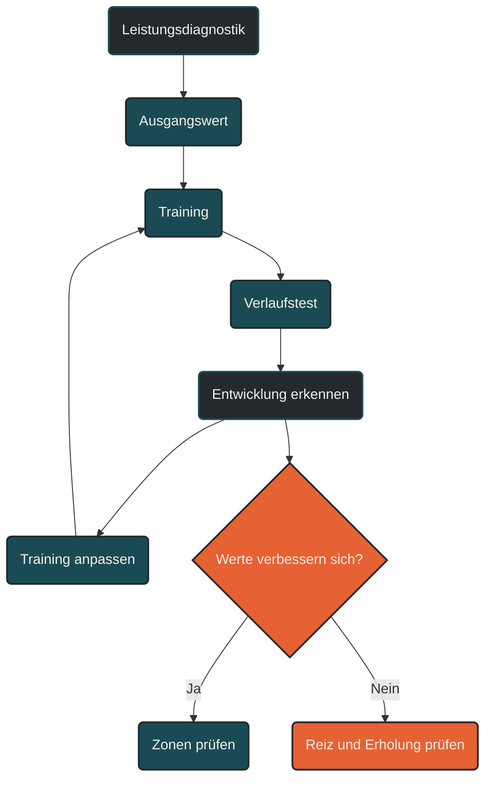

# Leistungsdiagnostik im Verlauf

Leistungsdiagnostik im Verlauf beschreibt die wiederholte Überprüfung der Ausdauerleistung über Wochen, Monate oder Trainingsphasen hinweg. Sie zeigt, ob Training wirkt, wie sich Schwellen, Herzfrequenz, Pace, Watt, VO2max, Laktat oder Belastungsempfinden verändern und ob der Trainingsplan angepasst werden sollte.

## Was Leistungsdiagnostik im Verlauf bedeutet

Leistungsdiagnostik wird oft als einzelner Test verstanden. Für die Trainingssteuerung ist aber vor allem der Verlauf entscheidend. Ein einzelner Test zeigt den aktuellen Zustand. Mehrere Tests über die Zeit zeigen Entwicklung.

Im Ausdauertraining geht es dabei nicht nur um die Frage, ob jemand schneller geworden ist. Wichtiger ist, wie sich die Leistung bei bestimmten Belastungen verändert. Eine gleiche Pace bei niedrigerer Herzfrequenz, eine höhere Schwellenleistung oder eine bessere Erholung nach intensiven Abschnitten können wichtige Hinweise auf Trainingsadaptation sein.

Leistungsdiagnostik im Verlauf macht sichtbar, ob Training tatsächlich in die gewünschte Richtung wirkt.

## Warum Verlauf wichtiger ist als Einzelwerte

Ein einzelner Leistungswert kann hilfreich sein, aber er ist immer nur eine Momentaufnahme. Tagesform, Schlaf, Stress, Ernährung, Temperatur, Motivation, Vorermüdung und Testbedingungen beeinflussen das Ergebnis.

Der Verlauf ist robuster. Wenn sich mehrere Messwerte über längere Zeit in eine ähnliche Richtung entwickeln, entsteht ein klareres Bild.

Beispiel:

Eine einmalig hohe Herzfrequenz in einem Lauf kann viele Ursachen haben. Wenn die Herzfrequenz aber über mehrere Wochen bei gleicher Pace steigt und sich lockere Einheiten schwerer anfühlen, kann das auf Ermüdung, Stress oder unpassende Belastungssteuerung hinweisen.

## Ziele der Leistungsdiagnostik

Leistungsdiagnostik im Verlauf kann mehrere Aufgaben erfüllen.

### Trainingszonen bestimmen

Diagnostik hilft, Trainingszonen individueller festzulegen. Statt pauschaler Prozentwerte können Schwellen, Herzfrequenzbereiche, Pacebereiche oder Wattbereiche genutzt werden.

### Fortschritt sichtbar machen

Sie zeigt, ob sich Leistung, Belastbarkeit, Effizienz oder Erholungsfähigkeit verbessern. Fortschritt zeigt sich nicht nur in Bestzeiten, sondern auch in besserer Kontrolle bei gleicher Belastung.

### Trainingsplanung anpassen

Wenn sich Werte verändern, sollten Trainingsbereiche angepasst werden. Wer besser wird, braucht manchmal neue Zielbereiche. Wer überlastet ist, braucht möglicherweise Entlastung statt weitere Steigerung.

### Plateaus erkennen

Leistungsdiagnostik kann helfen, Plateaus früher zu erkennen. Wenn sich über längere Zeit keine relevanten Werte verbessern, sollte geprüft werden, ob Reize, Erholung oder Spezifität passen.

### Überlastung vermeiden

Auffällige Veränderungen können Warnsignale sein. Wenn Leistung sinkt, Herzfrequenzreaktionen ungewöhnlich sind oder subjektive Belastung steigt, kann das auf zu hohe Gesamtbelastung hinweisen.

## Welche Werte im Verlauf wichtig sind

### Pace

Pace zeigt, wie schnell gelaufen wird. Im Verlauf ist besonders interessant, ob gleiche Intensitäten schneller oder gleiche Geschwindigkeiten leichter werden.

Pace allein reicht aber nicht aus, weil Gelände, Wind, Temperatur, Untergrund und Tagesform die Belastung verändern können.

### Herzfrequenz

Die Herzfrequenz zeigt, wie stark das Herz-Kreislauf-System auf eine Belastung reagiert. Sinkt die Herzfrequenz bei gleicher Pace und ähnlichen Bedingungen, kann das auf bessere aerobe Effizienz hinweisen.

Steigt die Herzfrequenz bei gleicher Belastung über längere Zeit, können Hitze, Müdigkeit, Stress, Infekt, Flüssigkeitsmangel oder Überlastung eine Rolle spielen.

### Watt

Watt beschreibt die mechanische Leistung. Im Radsport ist dieser Wert besonders etabliert, beim Laufen wird er ebenfalls zunehmend genutzt.

Watt kann hilfreich sein, weil Leistung direkter auf Belastungswechsel reagiert als Herzfrequenz. Trotzdem muss sie immer sportartspezifisch und im Zusammenhang mit Körpergefühl, Gelände und Technik interpretiert werden.

### Laktat

Laktatmessungen können helfen, Stoffwechselbereiche und Schwellen einzuordnen. Besonders interessant ist, bei welcher Pace oder Leistung bestimmte Laktatwerte auftreten und wie sich diese über die Zeit verändern.

Wenn bei höherer Pace weniger Laktat entsteht oder eine Schwelle bei höherer Leistung liegt, kann das auf verbesserte Ausdauerleistung hinweisen.

### VO2max

Die VO2max beschreibt die maximale Sauerstoffaufnahme. Sie ist ein wichtiger Leistungsfaktor, aber nicht allein entscheidend.

Im Verlauf kann sie zeigen, ob das aerobe Potenzial steigt. Für die praktische Leistung sind jedoch auch Schwellen, Laufökonomie, Ermüdungsresistenz, Pacing und spezifische Belastbarkeit wichtig.

### Schwellen

Schwellen sind besonders wertvoll für die Trainingssteuerung. Sie beschreiben Übergangsbereiche im Stoffwechsel oder in der Atmung.

Wenn sich die aerobe oder anaerobe Schwelle verbessert, kann ein Athlet höhere Intensitäten länger kontrolliert aufrechterhalten. Deshalb sind Schwellenveränderungen oft aussagekräftiger als einzelne Maximalwerte.

### Subjektives Belastungsempfinden

Das subjektive Belastungsempfinden zeigt, wie hart sich eine Belastung anfühlt. Es ist besonders wichtig, weil objektive Messwerte nicht immer die gesamte innere Belastung abbilden.

Wenn sich gleiche Einheiten leichter anfühlen, kann das ein Zeichen für Anpassung sein. Wenn lockere Einheiten plötzlich schwer wirken, sollte die Belastung überprüft werden.

## Labordiagnostik und Felddiagnostik

Leistungsdiagnostik kann im Labor oder im Feld stattfinden.

### Labordiagnostik

Labordiagnostik wird unter kontrollierten Bedingungen durchgeführt. Beispiele sind Spiroergometrie, Laktatstufentest oder Laufbanddiagnostik.

Der Vorteil liegt in der Standardisierung. Bedingungen, Belastungsstufen und Messwerte können sehr genau kontrolliert werden. Dadurch lassen sich Schwellen, Sauerstoffaufnahme und Stoffwechselreaktionen detailliert einordnen.

Der Nachteil ist, dass Labortests nicht immer exakt die reale Trainings- oder Wettkampfsituation abbilden.

### Felddiagnostik

Felddiagnostik findet in der gewohnten Trainingsumgebung statt. Beispiele sind Testläufe, Zeitfahren, standardisierte Dauerläufe, Intervalltests oder wiederholte Belastungen auf derselben Strecke.

Der Vorteil liegt in der Praxisnähe. Der Athlet testet dort, wo er tatsächlich trainiert. Der Nachteil ist, dass Bedingungen wie Wetter, Untergrund, Wind oder Tagesform stärker schwanken.

Für die Trainingspraxis sind beide Formen sinnvoll. Labordiagnostik liefert genaue Grundlagen, Felddiagnostik zeigt die praktische Umsetzung.

## Standardisierte Tests im Verlauf

Damit Leistungsdiagnostik vergleichbar ist, müssen Tests möglichst ähnlich durchgeführt werden.

Wichtig sind:

* gleiche Strecke oder gleiches Testprotokoll
* ähnliche Tageszeit
* ähnliche Vorbelastung
* vergleichbare Ernährung
* ähnliche Wetterbedingungen
* gleiche Messgeräte, wenn möglich
* gleiche Auswertungskriterien
* dokumentiertes subjektives Belastungsempfinden

Je besser die Bedingungen vergleichbar sind, desto aussagekräftiger ist der Verlauf.

## Leistungsdiagnostik im Trainingsprozess

Leistungsdiagnostik sollte nicht zufällig stattfinden, sondern in die Periodisierung eingebunden werden.

### Vor dem Trainingsblock

Eine Diagnostik zu Beginn kann den Ausgangszustand bestimmen. Sie hilft, Trainingsbereiche festzulegen und den Schwerpunkt des nächsten Blocks zu planen.

### Während des Trainingsblocks

Kleine Verlaufskontrollen können zeigen, ob die Belastung passt. Dafür müssen nicht immer große Tests durchgeführt werden. Auch standardisierte Dauerläufe oder wiederholte Teilstrecken können Hinweise geben.

### Nach dem Trainingsblock

Am Ende eines Mesozyklus kann Diagnostik zeigen, ob der Schwerpunkt gewirkt hat. Danach können Trainingszonen, Umfang, Intensität oder Erholungsphasen angepasst werden.

### Vor einem Wettkampf

Kurz vor einem Wettkampf sollte Diagnostik vorsichtig eingesetzt werden. Große Tests können zusätzliche Ermüdung erzeugen. In dieser Phase sind kurze Aktivierungen oder kontrollierte Standortbestimmungen oft sinnvoller.

## Beispiele für Verlaufszeichen

Leistungsentwicklung kann sich auf verschiedene Arten zeigen.

### Gleiche Pace bei niedrigerer Herzfrequenz

Das kann auf verbesserte aerobe Effizienz hinweisen, wenn die Bedingungen vergleichbar sind.

### Höhere Pace bei gleicher Herzfrequenz

Das zeigt, dass bei ähnlicher innerer Belastung mehr äußere Leistung möglich ist.

### Höhere Schwellenleistung

Wenn die Schwelle bei höherer Pace oder höherer Wattzahl liegt, kann der Athlet intensivere Belastungen länger kontrollieren.

### Schnellere Erholung

Wenn die Herzfrequenz nach Belastung schneller sinkt oder sich harte Einheiten schneller verarbeiten lassen, kann das auf bessere Erholungsfähigkeit hinweisen.

### Geringeres Belastungsempfinden

Wenn bekannte Einheiten leichter wirken, kann das ein Zeichen für Anpassung sein.

### Stabilere Leistung unter Ermüdung

Wenn Intervalle gleichmäßiger gelaufen werden oder lange Läufe weniger stark einbrechen, kann das auf bessere Ermüdungsresistenz hinweisen.

## Leistungsdiagnostik und Trainingszonen

Trainingszonen sollten nicht dauerhaft unverändert bleiben. Wenn sich die Leistung verändert, können alte Zonen ungenau werden.

Ein Beispiel:

Ein Athlet verbessert seine Schwellenpace deutlich, trainiert aber weiterhin nach alten Pacebereichen. Dann können ursprünglich moderate Einheiten plötzlich zu leicht werden. Umgekehrt können zu ambitionierte Zonen bei Überlastung zu viel Druck erzeugen.

Deshalb sollten Trainingszonen regelmäßig überprüft, aber nicht ständig impulsiv geändert werden. Sinnvoll ist eine Anpassung nach klaren Verlaufshinweisen oder nach standardisierten Tests.

## Leistungsdiagnostik und Monitoring

Leistungsdiagnostik und Monitoring ergänzen sich.

Leistungsdiagnostik liefert gezielte Standortbestimmungen. Monitoring begleitet den Alltag des Trainingsprozesses.

Diagnostik beantwortet eher die Frage:

Wo steht die Leistungsfähigkeit aktuell?

Monitoring beantwortet eher die Frage:

Wie reagiert der Körper täglich oder wöchentlich auf Training und Alltag?

Zusammen ergeben beide ein besseres Bild als einzelne Tests oder einzelne Tageswerte.

## Häufige Fehler bei Leistungsdiagnostik

Ein häufiger Fehler ist, einzelne Werte zu überbewerten. Ein schlechter Test bedeutet nicht automatisch, dass das Training nicht wirkt. Ein sehr guter Test bedeutet nicht automatisch, dass alles optimal ist.

Ein zweiter Fehler ist, Tests unter unterschiedlichen Bedingungen direkt zu vergleichen. Hitze, Wind, Schlafmangel, Vorermüdung oder andere Strecken können Ergebnisse stark verändern.

Ein dritter Fehler ist, nur Maximalwerte zu beachten. Für Ausdauerleistung sind Schwellen, Effizienz, Erholungsfähigkeit und Stabilität oft wichtiger als ein einzelner Spitzenwert.

Ein vierter Fehler ist, zu häufig zu testen. Ständige Tests können Training unterbrechen, Druck erzeugen und selbst zur Belastung werden.

Ein fünfter Fehler ist, Diagnostik nicht in Entscheidungen zu übersetzen. Messwerte sind nur nützlich, wenn sie helfen, Training sinnvoll anzupassen.

## Praktische Einordnung

Leistungsdiagnostik im Verlauf macht Trainingsentwicklung sichtbar. Sie hilft, Fortschritt von Tagesform zu unterscheiden, Trainingszonen zu überprüfen, Plateaus einzuordnen und Belastung besser zu steuern.

Der wichtigste Merksatz lautet: Nicht der einzelne Test entscheidet, sondern die Entwicklung der Werte über Zeit.

----

----

## Häufige Fragen zur Leistungsdiagnostik im Verlauf

### Was bedeutet Leistungsdiagnostik im Verlauf?

Leistungsdiagnostik im Verlauf bedeutet, Leistungswerte nicht nur einmalig zu messen, sondern wiederholt über Wochen oder Monate zu vergleichen. Dadurch wird sichtbar, ob Training wirkt und ob Trainingsbereiche angepasst werden sollten.

### Warum ist der Verlauf wichtiger als ein einzelner Test?

Ein einzelner Test ist nur eine Momentaufnahme. Der Verlauf zeigt, ob sich Leistung, Schwellen, Herzfrequenz, Pace, Watt oder Belastungsempfinden über längere Zeit stabil verändern.

### Welche Werte sind für den Verlauf wichtig?

Wichtige Werte sind Pace, Herzfrequenz, Watt, Laktat, VO2max, Schwellen, subjektives Belastungsempfinden, Erholung und Stabilität der Leistung unter Ermüdung.

### Wie oft sollte Leistungsdiagnostik durchgeführt werden?

Das hängt vom Trainingsziel ab. Größere Tests sind oft alle paar Monate sinnvoll. Kleinere Verlaufskontrollen können häufiger stattfinden, wenn sie standardisiert und nicht zu belastend sind.

### Was ist der Unterschied zwischen Labordiagnostik und Felddiagnostik?

Labordiagnostik findet unter kontrollierten Bedingungen statt, zum Beispiel mit Spiroergometrie oder Laktatstufentest. Felddiagnostik findet in der Praxis statt, zum Beispiel auf einer bekannten Strecke oder im Training.

### Warum müssen Tests standardisiert sein?

Nur vergleichbare Tests liefern aussagekräftige Verläufe. Strecke, Tageszeit, Vorbelastung, Wetter, Ernährung, Messgeräte und Testprotokoll sollten möglichst ähnlich sein.

### Was zeigt eine niedrigere Herzfrequenz bei gleicher Pace?

Wenn die Bedingungen vergleichbar sind, kann eine niedrigere Herzfrequenz bei gleicher Pace auf verbesserte aerobe Effizienz hinweisen.

### Was zeigt eine höhere Pace bei gleicher Herzfrequenz?

Eine höhere Pace bei gleicher Herzfrequenz kann bedeuten, dass bei ähnlicher innerer Belastung mehr äußere Leistung möglich ist.

### Warum sind Schwellenwerte wichtig?

Schwellen helfen, Trainingsintensitäten individuell einzuordnen. Wenn sich Schwellen verbessern, kann ein Athlet höhere Intensitäten länger kontrolliert halten.

### Reicht VO2max zur Beurteilung der Leistung aus?

Nein. VO2max ist wichtig, aber nicht allein entscheidend. Auch Schwellenleistung, Bewegungsökonomie, Ermüdungsresistenz, Pacing und spezifische Belastbarkeit beeinflussen die Ausdauerleistung.

### Kann Leistungsdiagnostik Plateaus erkennen?

Ja. Wenn sich relevante Werte über längere Zeit nicht verbessern oder sogar verschlechtern, kann das auf ein Plateau, zu wenig Reiz, zu viel Ermüdung oder unpassende Trainingssteuerung hinweisen.

### Sollte man kurz vor einem Wettkampf testen?

Große Tests kurz vor einem Wettkampf können zusätzliche Ermüdung erzeugen. In der unmittelbaren Wettkampfphase sind kurze, kontrollierte Standortbestimmungen meist sinnvoller.

### Was ist der häufigste Fehler bei Leistungsdiagnostik?

Der häufigste Fehler ist, einzelne Werte zu überbewerten. Entscheidend ist der Verlauf über Zeit und die Einordnung zusammen mit Training, Erholung und subjektivem Empfinden.

### Wie hängen Leistungsdiagnostik und Monitoring zusammen?

Leistungsdiagnostik liefert gezielte Standortbestimmungen. Monitoring begleitet die tägliche oder wöchentliche Reaktion auf Training, Erholung und Alltag. Zusammen ergeben sie ein besseres Bild.

----

*Hinweis: Dieser Artikel dient der allgemeinen Information und ersetzt keine medizinische oder therapeutische Beratung. Mehr dazu im [**Gesundheits- und Quellenhinweis**](/ausdauersport/disclaimer/).*

