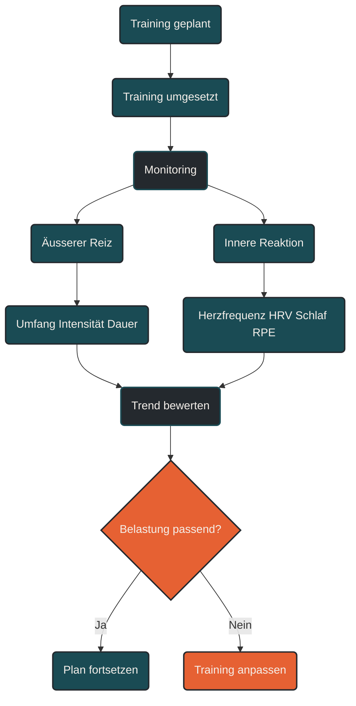

# Monitoring

Monitoring beschreibt die regelmäßige Beobachtung von Training, Erholung und Körperreaktionen. Im Ausdauertraining hilft Monitoring zu erkennen, ob Belastung passend dosiert ist, ob Anpassung entsteht oder ob sich Restermüdung, Überlastung oder Stagnation entwickeln. Entscheidend ist nicht ein einzelner Wert, sondern der Verlauf mehrerer Signale über Zeit.

## Was Monitoring bedeutet

Monitoring bedeutet, Trainingsdaten und Körpersignale systematisch zu beobachten. Es geht darum, besser zu verstehen, wie der Körper auf Training, Alltag, Schlaf, Stress und Erholung reagiert.

Im Ausdauertraining wird häufig viel gemessen: Pace, Herzfrequenz, Watt, Trainingsumfang, Schlaf, HRV, Ruhepuls, subjektives Belastungsempfinden, Stimmung, Muskelgefühl oder Beschwerden.

Monitoring macht diese Daten nutzbar. Es soll nicht kontrollieren um der Kontrolle willen, sondern helfen, Training sinnvoll anzupassen.

Der zentrale Gedanke lautet: Training wirkt nicht nur durch den geplanten Reiz, sondern durch die tatsächliche Reaktion des Körpers.

## Warum Monitoring wichtig ist

Ein Trainingsplan beschreibt, was geplant ist. Monitoring zeigt, wie der Körper darauf reagiert.

Zwei Athleten können dieselbe Einheit absolvieren, aber unterschiedlich belastet werden. Auch dieselbe Person kann dieselbe Einheit an verschiedenen Tagen unterschiedlich verarbeiten. Schlaf, Stress, Hitze, Ernährung, Vorermüdung, Krankheit oder mentale Belastung verändern die innere Belastung.

Monitoring hilft, solche Unterschiede sichtbar zu machen. Dadurch kann Training besser gesteuert werden, bevor sich Probleme verstärken.

## Äußere und innere Belastung

Monitoring unterscheidet zwischen äußerer und innerer Belastung.

### Äußere Belastung

Die äußere Belastung beschreibt, was objektiv geplant oder gemessen wird. Dazu gehören Kilometer, Trainingsdauer, Pace, Watt, Höhenmeter, Intervalle, Wiederholungen, Pausenlängen oder Kraftübungen.

Diese Werte zeigen, was getan wurde.

### Innere Belastung

Die innere Belastung beschreibt, wie stark diese Einheit tatsächlich im Körper angekommen ist. Dazu gehören Herzfrequenz, Atemarbeit, subjektives Belastungsempfinden, muskuläre Ermüdung, Nervensystembelastung, Schlafreaktion und Erholungsgefühl.

Diese Werte zeigen, wie der Körper reagiert hat.

Monitoring wird besonders wertvoll, wenn äußere und innere Belastung gemeinsam betrachtet werden.

## Wichtige Monitoring-Werte

### Trainingsumfang

Der Trainingsumfang beschreibt die gesamte Trainingsmenge. Im Lauftraining sind das oft Wochenkilometer, Trainingsstunden oder Höhenmeter.

Eine plötzliche Umfangssteigerung kann die Belastung deutlich erhöhen, besonders für Sehnen, Knochen, Gelenke und Faszien.

### Trainingsintensität

Die Intensität zeigt, wie hart eine Belastung war. Sie kann über Pace, Watt, Herzfrequenz, Laktat, Atemverhalten oder subjektives Belastungsempfinden eingeordnet werden.

Für Monitoring ist wichtig, ob lockere Einheiten wirklich locker bleiben und ob harte Einheiten mit ausreichender Qualität absolviert werden können.

### Herzfrequenz

Die Herzfrequenz zeigt die Reaktion des Herz-Kreislauf-Systems auf Belastung. Sie kann Hinweise auf Ermüdung, Hitze, Stress, Flüssigkeitsmangel oder beginnende Erkrankung geben.

Eine ungewöhnlich hohe Herzfrequenz bei lockerer Pace kann ein Warnsignal sein. Eine niedrigere Herzfrequenz bei gleicher Pace und ähnlichen Bedingungen kann auf bessere aerobe Effizienz hinweisen.

### Ruhepuls

Der Ruhepuls kann Hinweise auf Erholung, Stress oder Infekte geben. Ein dauerhaft erhöhter Ruhepuls kann anzeigen, dass der Körper stärker belastet ist als üblich.

Ein einzelner Ausreißer sollte nicht überbewertet werden. Aussagekräftiger ist der Trend über mehrere Tage.

### HRV

HRV steht für Herzfrequenzvariabilität. Sie beschreibt Schwankungen zwischen einzelnen Herzschlägen und wird häufig als Hinweis auf die Regulation des autonomen Nervensystems genutzt.

Eine dauerhaft niedrigere HRV kann auf Stress, hohe Ermüdung oder unzureichende Erholung hinweisen. Eine stabile oder steigende HRV kann ein Zeichen guter Erholung sein.

HRV sollte nie isoliert bewertet werden. Sie ist ein ergänzendes Signal, kein alleiniger Trainingsentscheider.

### Subjektives Belastungsempfinden

Das subjektive Belastungsempfinden beschreibt, wie anstrengend sich eine Einheit angefühlt hat. Es ist besonders wichtig, weil es viele Belastungsfaktoren zusammenfasst, die Messgeräte nicht vollständig erfassen.

Wenn eine lockere Einheit plötzlich schwer wirkt, kann das ein frühes Warnsignal sein.

### Schlaf

Schlaf ist ein zentraler Erholungsfaktor. Schlechter Schlaf kann Trainingsqualität, Hormonregulation, Immunsystem, Stimmung, Koordination und Regeneration beeinflussen.

Monitoring sollte Schlaf nicht nur als Zahl betrachten, sondern auch als Gefühl: Wie erholt fühlt sich der Körper am Morgen an?

### Muskelgefühl

Schwere Beine, ungewöhnlicher Muskelkater, Spannung, Steifigkeit oder fehlende Spritzigkeit können Hinweise auf Restermüdung sein.

Im Lauftraining ist das besonders wichtig, weil muskuläre und mechanische Belastung nicht immer durch Herzfrequenzdaten sichtbar wird.

### Beschwerden

Beschwerden sind ein wichtiges Monitoring-Signal. Wiederkehrende Schmerzen, punktuelle Knochenschmerzen, Sehnenreaktionen oder Gelenkbeschwerden sollten nicht als normale Trainingshärte ignoriert werden.

Monitoring hilft, solche Signale früh zu erkennen, bevor daraus größere Probleme entstehen.

### Stimmung und Motivation

Mentale Signale gehören ebenfalls zum Monitoring. Sinkende Motivation, Reizbarkeit, ungewöhnliche Lustlosigkeit oder mentale Erschöpfung können auf zu hohe Gesamtbelastung hinweisen.

Ausdauertraining belastet nicht nur Muskeln und Herz-Kreislauf-System, sondern auch das Nervensystem.

## Monitoring im Trainingsalltag

Monitoring muss nicht kompliziert sein. Oft reichen wenige, konsequent beobachtete Werte.

Ein einfaches tägliches Monitoring kann enthalten:

* Schlafqualität
* Ruhepuls oder HRV
* Muskelgefühl
* subjektive Erholung
* Motivation
* Beschwerden
* geplantes Training
* tatsächliche Belastung

Nach dem Training können ergänzt werden:

* Dauer
* Umfang
* Intensität
* Herzfrequenz
* Pace oder Watt
* subjektives Belastungsempfinden
* besondere Auffälligkeiten

Wichtig ist, dass Monitoring praktikabel bleibt. Zu viele Daten können überfordern und führen nicht automatisch zu besseren Entscheidungen.

## Monitoring und Trainingssteuerung

Monitoring wird erst dann wertvoll, wenn daraus Entscheidungen entstehen.

### Training wie geplant durchführen

Wenn Erholung, Motivation, Schlaf und Körpergefühl stabil sind, kann die geplante Einheit meist normal durchgeführt werden.

### Training anpassen

Wenn mehrere Warnsignale auftreten, kann die Einheit angepasst werden. Das kann bedeuten: weniger Umfang, weniger Intensität, längere Pausen oder eine lockere Alternative.

### Training verschieben

Wenn Müdigkeit, schlechter Schlaf, erhöhte Herzfrequenz, niedrige HRV und schwere Beine zusammenkommen, kann es sinnvoll sein, eine harte Einheit zu verschieben.

### Entlastung einplanen

Wenn Warnsignale über mehrere Tage bestehen, kann ein Deload sinnvoll sein. Monitoring hilft, Entlastung nicht erst dann einzusetzen, wenn bereits Überlastung entstanden ist.

## Einzelwert oder Trend?

Ein häufiger Fehler ist, einzelne Werte zu stark zu interpretieren. Ein schlechter HRV-Wert, eine hohe Herzfrequenz oder ein schwerer Lauf bedeuten nicht automatisch ein Problem.

Aussagekräftiger ist der Trend:

* mehrere Tage schlechter Schlaf
* mehrere Einheiten mit ungewöhnlich hoher Anstrengung
* zunehmende Beschwerden
* sinkende Motivation
* steigender Ruhepuls
* dauerhaft niedrige HRV
* schlechtere Trainingsqualität

Wenn mehrere Signale in dieselbe Richtung zeigen, sollte das Training überprüft werden.

## Monitoring und Leistungsentwicklung

Monitoring zeigt nicht nur Warnsignale. Es kann auch Fortschritt sichtbar machen.

Positive Hinweise sind:

* gleiche Pace bei niedrigerer Herzfrequenz
* gleiche Leistung mit geringerem Belastungsempfinden
* schnellere Erholung nach intensiven Einheiten
* stabilere Long Runs
* weniger Muskelkater nach ähnlicher Belastung
* bessere Schlafreaktion auf Training
* höhere Belastbarkeit bei gleichem Beschwerderisiko
* bessere Qualität in Schlüsselsessions

Solche Entwicklungen zeigen, dass Trainingsadaptation stattfindet, auch wenn noch keine neue Bestzeit gelaufen wurde.

## Monitoring und Plateaus

Bei Plateaus hilft Monitoring, Ursachen besser einzuordnen.

Wenn die Leistung stagniert und gleichzeitig Schlaf, Motivation, HRV, Ruhepuls und Körpergefühl schlechter werden, spricht vieles für zu viel Gesamtbelastung oder unzureichende Erholung.

Wenn die Leistung stagniert, aber Erholung stabil ist und die Einheiten sich leicht anfühlen, kann der Reiz zu gering oder zu monoton sein.

Monitoring hilft also zu unterscheiden, ob mehr Reiz, andere Reize oder mehr Erholung nötig sind.

## Monitoring im Lauftraining

Im Lauftraining ist Monitoring besonders wichtig, weil mechanische Belastung eine große Rolle spielt. Herz-Kreislauf-System und Muskulatur können sich schneller entwickeln als Sehnen, Knochen und Gelenke.

Deshalb sollte Monitoring nicht nur auf Pace und Herzfrequenz schauen. Auch Beschwerden, Muskelsteifigkeit, Sehnenreaktionen, Laufgefühl und Erholung nach langen Läufen sind entscheidend.

Ein Läufer kann konditionell bereit für mehr Umfang sein, aber mechanisch noch nicht ausreichend belastbar.

## Monitoring und Technologie

Sportuhren, Apps, Brustgurte, Wattmesser und Schlaftracker können hilfreich sein. Sie liefern Daten, die Trends sichtbar machen.

Trotzdem ersetzen sie nicht die eigene Wahrnehmung. Messgeräte können ungenau sein, Daten falsch interpretieren oder wichtige Faktoren nicht erfassen.

Gutes Monitoring verbindet Technik mit Körpergefühl.

## Häufige Fehler beim Monitoring

Ein häufiger Fehler ist, zu viele Werte zu sammeln, aber keine Entscheidungen daraus abzuleiten. Daten allein verbessern kein Training.

Ein zweiter Fehler ist, einzelne Tageswerte zu überbewerten. Trends sind wichtiger als Ausreißer.

Ein dritter Fehler ist, nur Leistungsdaten zu beachten. Pace und Watt zeigen nicht automatisch, ob der Körper die Belastung gut verarbeitet.

Ein vierter Fehler ist, Körpergefühl zu ignorieren, weil die Uhr etwas anderes sagt. Subjektive Signale sind kein Störfaktor, sondern ein wichtiger Teil der Trainingssteuerung.

Ein fünfter Fehler ist, Monitoring als Kontrolle statt als Orientierung zu nutzen. Ziel ist nicht, perfekt zu funktionieren, sondern Training besser zu verstehen.

## Praktische Einordnung

Monitoring ist ein Werkzeug, um Training, Erholung und Anpassung im Alltag besser zu steuern. Es ersetzt keinen Trainingsplan, macht ihn aber flexibler und realistischer.

Der wichtigste Merksatz lautet: Monitoring zeigt nicht nur, was trainiert wurde, sondern wie der Körper das Training verarbeitet.

----

----

## Häufige Fragen zum Monitoring

### Was ist Monitoring im Training?

Monitoring ist die regelmäßige Beobachtung von Trainingsbelastung, Erholung und Körperreaktionen. Es hilft zu erkennen, ob Training passend dosiert ist oder angepasst werden sollte.

### Warum ist Monitoring im Ausdauertraining wichtig?

Ausdauertraining wirkt nicht bei jeder Person und nicht an jedem Tag gleich. Monitoring zeigt, wie der Körper tatsächlich auf Belastung, Schlaf, Stress, Ernährung und Erholung reagiert.

### Was ist der Unterschied zwischen äußerer und innerer Belastung?

Die äußere Belastung beschreibt, was gemacht wurde, zum Beispiel Kilometer, Pace, Watt oder Dauer. Die innere Belastung beschreibt, wie stark das Training im Körper angekommen ist, zum Beispiel über Herzfrequenz, RPE, Müdigkeit oder Erholungsgefühl.

### Welche Werte sollte ich regelmäßig beobachten?

Sinnvoll sind Trainingsumfang, Intensität, Herzfrequenz, Ruhepuls, HRV, Schlafqualität, subjektives Belastungsempfinden, Muskelgefühl, Motivation und Beschwerden.

### Muss ich HRV messen?

Nein. HRV kann hilfreich sein, ist aber nicht zwingend notwendig. Auch Schlaf, Ruhepuls, Körpergefühl, Motivation und subjektive Belastung liefern wichtige Hinweise.

### Was bedeutet eine niedrige HRV?

Eine niedrigere HRV kann auf Stress, Ermüdung oder unzureichende Erholung hinweisen. Sie sollte aber nie isoliert bewertet werden, sondern zusammen mit Schlaf, Ruhepuls, Körpergefühl und Trainingsbelastung.

### Was bedeutet ein erhöhter Ruhepuls?

Ein erhöhter Ruhepuls kann auf Stress, Ermüdung, Flüssigkeitsmangel oder einen beginnenden Infekt hinweisen. Ein einzelner Wert ist weniger wichtig als ein auffälliger Trend über mehrere Tage.

### Wie erkenne ich durch Monitoring Überlastung?

Warnsignale sind anhaltend schwere Beine, schlechter Schlaf, sinkende Motivation, erhöhte Herzfrequenz bei lockerer Belastung, niedrige HRV, schlechtere Trainingsqualität und wiederkehrende Beschwerden.

### Wie hilft Monitoring bei Plateaus?

Monitoring kann zeigen, ob ein Plateau eher durch zu wenig Reiz, zu monotones Training, zu viel Ermüdung oder externe Belastung entsteht. Dadurch lässt sich gezielter entscheiden, ob mehr Reiz oder mehr Erholung nötig ist.

### Wie oft sollte ich Monitoring machen?

Ein kurzes tägliches Monitoring kann sinnvoll sein, wenn es praktikabel bleibt. Wichtig ist, nicht jeden Einzelwert zu überbewerten, sondern Trends über mehrere Tage oder Wochen zu erkennen.

### Reicht eine Sportuhr für Monitoring aus?

Eine Sportuhr kann helfen, ersetzt aber nicht die eigene Wahrnehmung. Gutes Monitoring verbindet technische Daten mit Körpergefühl, Schlaf, Stimmung, Beschwerden und Trainingskontext.

### Was ist RPE?

RPE steht für Rate of Perceived Exertion und beschreibt das subjektive Belastungsempfinden. Es zeigt, wie anstrengend sich eine Einheit angefühlt hat.

### Wann sollte ich Training wegen Monitoring anpassen?

Training sollte angepasst werden, wenn mehrere Warnsignale gleichzeitig auftreten oder sich über mehrere Tage verstärken. Dazu gehören schlechter Schlaf, hohe Müdigkeit, schwere Beine, auffällige Herzfrequenzwerte oder Beschwerden.

### Was ist der häufigste Fehler beim Monitoring?

Der häufigste Fehler ist, einzelne Werte zu überbewerten oder viele Daten zu sammeln, ohne daraus Entscheidungen abzuleiten. Monitoring soll Orientierung geben, nicht zusätzlichen Druck erzeugen.

----

*Hinweis: Dieser Artikel dient der allgemeinen Information und ersetzt keine medizinische oder therapeutische Beratung. Mehr dazu im [**Gesundheits- und Quellenhinweis**](/ausdauersport/disclaimer/).*

