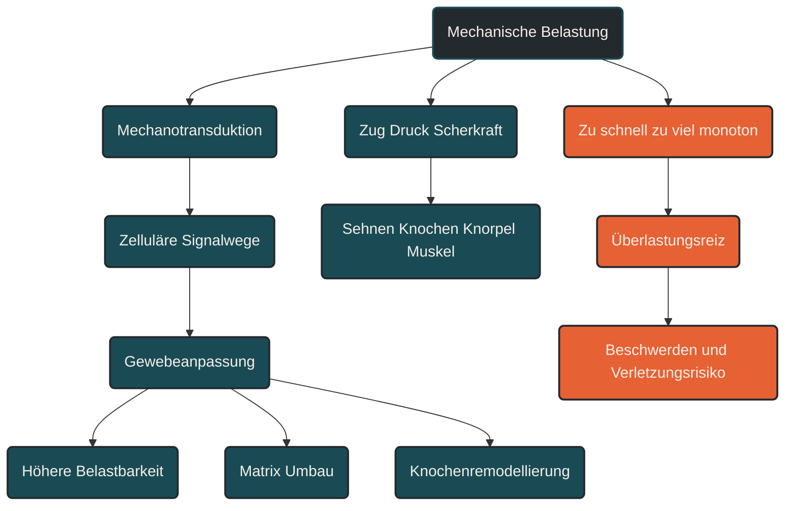

# Mechanotransduktion

Mechanotransduktion beschreibt, wie Zellen mechanische Reize in biologische Signale übersetzen. Im Ausdauersport ist das wichtig, weil Sehnen, Knochen, Knorpel, Muskeln und Bindegewebe nicht nur auf Stoffwechselreize reagieren, sondern auch auf Zug, Druck, Scherkräfte und wiederholte Belastung. Entscheidend ist die passende Dosierung: Mechanische Reize können Anpassung fördern, bei zu hoher oder zu monotoner Belastung aber auch Überlastung begünstigen.

## Was Mechanotransduktion bedeutet

Mechanotransduktion ist ein Grundprinzip biologischer Anpassung. Gewebe nehmen mechanische Belastung wahr und wandeln sie in zelluläre Signale um. Diese Signale beeinflussen, ob Strukturen aufgebaut, erhalten, repariert oder abgebaut werden.

Im Ausdauersport betrifft das vor allem Gewebe, die regelmäßig mechanisch belastet werden. Dazu gehören Sehnen, Faszien, Knochen, Knorpel, Muskulatur und Blutgefäße. Beim Laufen entstehen zum Beispiel wiederholte Zug- und Druckkräfte. Diese Kräfte sind nicht automatisch schlecht. Sie sind ein wichtiger Auslöser dafür, dass der Körper belastbarer wird.

Problematisch wird es, wenn die Belastung zu schnell gesteigert wird, zu einseitig bleibt oder die Erholung nicht ausreicht. Dann kann aus einem sinnvollen Anpassungsreiz ein Überlastungsreiz werden.

## Warum Mechanotransduktion wichtig ist

Ausdauertraining wird oft zuerst über Herz, Lunge, Sauerstoffaufnahme und Energiestoffwechsel erklärt. Für die langfristige Belastbarkeit ist aber ebenso wichtig, wie gut das Stütz- und Bewegungsgewebe auf Training reagiert.

Mechanotransduktion erklärt, warum regelmäßige Belastung Knochen, Sehnen und Bindegewebe stärken kann. Sie erklärt aber auch, warum dieselbe Belastung bei schlechter Dosierung Beschwerden auslösen kann. Der Körper passt sich nicht nur an die Höhe der Belastung an, sondern auch an deren Richtung, Häufigkeit, Geschwindigkeit und Wiederholung.

Für Läufer ist das besonders relevant, weil jeder Schritt ein mechanischer Reiz ist. Viele kleine Reize können langfristig stabilisierend wirken. Wenn Umfang, Intensität oder Untergrund jedoch zu abrupt verändert werden, kann die Summe der Reize größer sein als die aktuelle Anpassungsfähigkeit des Gewebes.

## Wie Mechanotransduktion im Gewebe wirkt

Mechanische Belastung wirkt auf Zellen über mehrere Wege. Zug, Druck und Scherkräfte verändern die Spannung im Gewebe. Zellen registrieren diese Veränderungen über ihre Zellmembran, das Zytoskelett und Verbindungen zur extrazellulären Matrix.

Aus diesen mechanischen Informationen entstehen biologische Antworten. Dazu gehören die Bildung von Kollagen, Veränderungen der Gewebesteifigkeit, Anpassungen im Knochenumbau, Veränderungen im Knorpelstoffwechsel und Signalwege der Muskelanpassung.

Wichtig ist: Diese Prozesse laufen nicht sofort vollständig ab. Das Herz-Kreislauf-System kann sich oft schneller an Training gewöhnen als Sehnen, Knochen oder Knorpel. Deshalb können sich Ausdauer und Motivation schneller verbessern als die mechanische Belastbarkeit des Bewegungsapparats.

## Zentrale Einflussfaktoren

### Belastungshoehe

Die Höhe der mechanischen Belastung beeinflusst, wie stark ein Gewebe stimuliert wird. Zu geringe Reize reichen oft nicht aus, um Anpassung auszulösen. Zu hohe Reize können die aktuelle Belastbarkeit überschreiten.

Im Lauftraining entsteht diese Belastung unter anderem durch Tempo, Körpergewicht, Lauftechnik, Untergrund, Schuhe, Ermüdung und Trainingsumfang.

### Belastungshaeufigkeit

Gewebe reagieren nicht nur auf einzelne starke Reize, sondern auch auf wiederholte Belastung. Viele moderate Reize können sinnvoll sein, wenn sie mit ausreichender Erholung kombiniert werden.

Wird dieselbe Struktur jedoch zu häufig belastet, ohne dass Reparaturprozesse abgeschlossen sind, steigt das Risiko für Überlastungsprobleme.

### Belastungsrichtung

Mechanische Reize wirken richtungsabhängig. Eine Sehne reagiert anders auf Zug als Knorpel auf Druck oder Knochen auf Biegung. Deshalb ist nicht nur entscheidend, wie viel Belastung entsteht, sondern auch, wie sie auf das Gewebe verteilt wird.

Einseitige Bewegungsmuster können bestimmte Strukturen dauerhaft stärker beanspruchen als andere.

### Erholung und Anpassungszeit

Mechanotransduktion braucht Zeit. Der mechanische Reiz ist nur der Auslöser. Die eigentliche Anpassung entsteht in den Stunden, Tagen und Wochen danach.

Wer Belastung steigert, ohne Erholung mitzudenken, unterbricht diese Anpassungsprozesse. Besonders Sehnen und Knochen benötigen häufig längere Zeiträume, um strukturell belastbarer zu werden.

## Bedeutung für Läufer

Für Läufer bedeutet Mechanotransduktion: Belastung ist notwendig, aber sie muss dosiert werden. Laufen stärkt nicht nur das Herz-Kreislauf-System, sondern setzt auch mechanische Reize auf Knochen, Sehnen, Knorpel und Muskulatur.

Ein sinnvoller Trainingsaufbau nutzt diese Reize schrittweise. Umfang, Intensität, Höhenmeter, Untergrund oder Schuhe sollten nicht gleichzeitig stark verändert werden. Jede Veränderung verändert auch das mechanische Reizmuster.

Mechanotransduktion hilft deshalb zu verstehen, warum progressive Belastungssteigerung, Ruhetage, Variation und Krafttraining so wichtig sind. Sie machen das Gewebe nicht unverwundbar, können aber die Anpassungsfähigkeit verbessern.

## Häufige Fehler

Ein häufiger Fehler ist die Annahme, dass bessere Ausdauer automatisch mehr mechanische Belastbarkeit bedeutet. Das stimmt nicht immer. Man kann sich kardiovaskulär fit fühlen und trotzdem Sehnen, Knochen oder Gelenke überfordern.

Ein weiterer Fehler ist eine zu schnelle Steigerung des Laufumfangs. Besonders nach Pausen, Krankheit, Verletzung oder Schuhwechseln sollte die Belastung vorsichtig aufgebaut werden.

Auch monotones Training kann problematisch sein. Immer dieselbe Strecke, dasselbe Tempo und derselbe Untergrund setzen immer ähnliche Reize. Variation kann helfen, Belastungen besser zu verteilen.

## Praktische Einordnung

Mechanotransduktion zeigt, warum Training nicht nur aus Energieverbrauch und Herzfrequenz besteht. Jeder Trainingsreiz wirkt auch mechanisch auf das Gewebe. Gute Trainingsplanung berücksichtigt deshalb nicht nur Intensität und Umfang, sondern auch Untergrund, Technik, Kraft, Erholung und langfristige Belastungssteigerung.

Der wichtigste Merksatz lautet: Mechanische Belastung ist der Auslöser für Anpassung, aber erst die richtige Dosierung macht daraus belastbares Gewebe.

----

----

## Häufige Fragen zu Mechanotransduktion

### Was ist Mechanotransduktion einfach erklärt?

Mechanotransduktion bedeutet, dass Zellen mechanische Belastung wahrnehmen und daraus biologische Signale erzeugen. Dadurch können sich Gewebe wie Sehnen, Knochen, Knorpel und Muskeln an Training anpassen.

### Warum ist Mechanotransduktion im Ausdauertraining wichtig?

Sie erklärt, warum regelmäßige Belastung Gewebe belastbarer machen kann. Gleichzeitig zeigt sie, warum zu schnelle oder zu einseitige Belastungssteigerungen Überlastungen begünstigen können.

### Wie wirkt sich Mechanotransduktion praktisch aus?

Beim Laufen entstehen bei jedem Schritt mechanische Reize. Diese Reize können Anpassung fördern, wenn Umfang, Intensität und Erholung sinnvoll dosiert sind.

### Was ist ein häufiger Fehler bei Mechanotransduktion?

Ein häufiger Fehler ist, nur die Ausdauerleistung zu betrachten und die langsamere Anpassung von Sehnen, Knochen und Knorpel zu unterschätzen.

### Für wen ist Mechanotransduktion besonders relevant?

Besonders relevant ist sie für Läufer, Wiedereinsteiger, ältere Ausdauersportler und Personen, die Trainingsumfang, Tempo, Untergrund oder Schuhe verändern.

### Woran erkennt man Probleme bei mechanischer Belastung?

Warnzeichen können wiederkehrende Schmerzen, zunehmende Beschwerden während oder nach Belastung, lokale Druckempfindlichkeit oder eine schlechtere Belastungsverträglichkeit sein. Solche Beschwerden sollten bei Bedarf medizinisch oder therapeutisch abgeklärt werden.

----

*Hinweis: Dieser Artikel dient der allgemeinen Information und ersetzt keine medizinische oder therapeutische Beratung. Mehr dazu im [**Gesundheits- und Quellenhinweis**](/ausdauersport/disclaimer/).*

