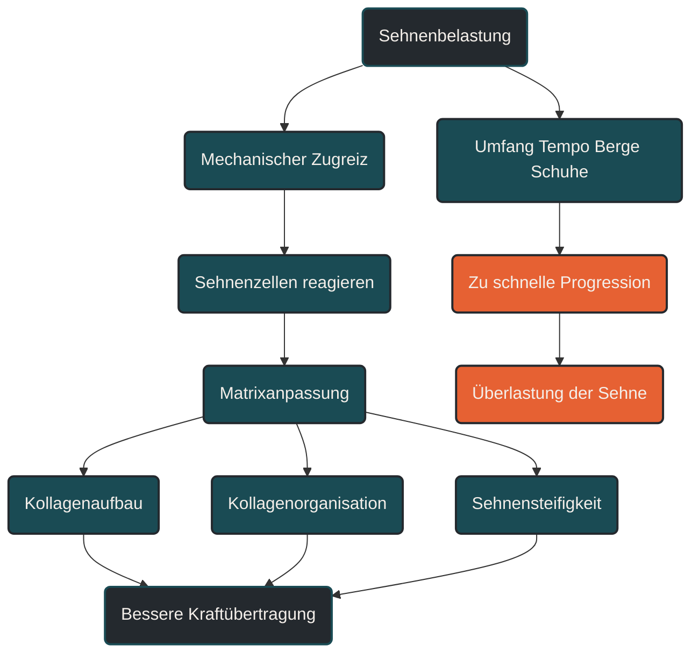

# Sehnenmorphologie und Matrixanpassung

Sehnenmorphologie und Matrixanpassung beschreiben, wie sich Sehnenstruktur, Kollagenfasern und extrazelluläre Matrix an mechanische Belastung anpassen. Im Ausdauersport ist das wichtig, weil Sehnen Kraft übertragen, elastische Energie speichern und wiederholte Belastungen tolerieren müssen. Entscheidend ist: Sehnen passen sich langsamer an als Muskeln und Herz-Kreislauf-System.

## Was Sehnenmorphologie bedeutet

Sehnenmorphologie beschreibt den strukturellen Aufbau einer Sehne. Dazu gehören Sehnendicke, Querschnitt, Kollagenfaser-Anordnung, Wassergehalt, Steifigkeit und die Qualität der extrazellulären Matrix.

Sehnen bestehen vor allem aus Kollagen. Diese Kollagenfasern sind so organisiert, dass sie Zugkräfte aufnehmen und vom Muskel auf den Knochen übertragen können. Beim Laufen betrifft das besonders die Achillessehne, Patellarsehne, Plantarfaszie und weitere bindegewebige Strukturen rund um Hüfte, Knie und Fuß.

Eine Sehne ist nicht nur ein passives Verbindungskabel. Sie ist ein lebendiges Gewebe, das auf Belastung reagiert, sich umbaut und langfristig belastbarer werden kann.

## Was Matrixanpassung bedeutet

Matrixanpassung beschreibt Veränderungen in der extrazellulären Matrix. Diese Matrix bildet das Grundgerüst der Sehne. In ihr liegen Kollagenfasern, Proteoglykane, Wasser und weitere Strukturproteine.

Wenn eine Sehne mechanisch belastet wird, nehmen Sehnenzellen diese Zugkräfte wahr. Daraus entstehen biologische Signale, die den Umbau der Matrix beeinflussen können. Dazu gehören Kollagenaufbau, Kollagenabbau, Faserorganisation und Veränderungen der Gewebesteifigkeit.

Diese Prozesse laufen langsam ab. Genau deshalb können Läufer kardiovaskulär schon deutlich fitter sein, während Sehnen, Knochen und Bindegewebe noch mehr Zeit für Anpassung benötigen.

## Warum Sehnenanpassung wichtig ist

Sehnen sind für Laufökonomie und Belastbarkeit zentral. Sie übertragen Muskelkraft, speichern elastische Energie und geben diese beim Abdruck wieder frei. Besonders die Achillessehne funktioniert beim Laufen wie ein elastisches Speichersystem.

Gut angepasste Sehnen können Kräfte effizient übertragen. Dadurch muss weniger Energie rein muskulär erzeugt werden. Das kann die Bewegung ökonomischer machen und die Belastung besser verteilen.

Problematisch wird es, wenn die Trainingsbelastung schneller steigt als die Anpassungsfähigkeit der Sehne. Dann kann aus einem sinnvollen Reiz ein Überlastungsreiz werden.

## Wie Sehnen auf Training reagieren

Sehnen reagieren vor allem auf mechanische Zugbelastung. Entscheidend ist nicht nur die Höhe der Belastung, sondern auch deren Häufigkeit, Geschwindigkeit, Richtung und Erholungszeit.

Langsame Kraftreize, Sprungbelastungen, Bergläufe, Tempotraining und lange Läufe setzen unterschiedliche Reize. Auch Schuhwechsel, Carbonplatten, minimalistische Schuhe oder veränderte Lauftechnik können die Sehnenbelastung deutlich verschieben.

Im Ausdauertraining entsteht die Herausforderung durch die hohe Wiederholungszahl. Eine einzelne Belastung ist oft unproblematisch. Die Summe aus vielen Schritten, Ermüdung, Tempo und zu wenig Erholung kann jedoch kritisch werden.

## Zentrale Einflussfaktoren

### Kollagenorganisation

Kollagenfasern bestimmen die Zugfestigkeit einer Sehne. Bei sinnvoll dosierter Belastung können sich Fasern besser ausrichten und an die wiederkehrenden Zugrichtungen anpassen.

Bei Überlastung kann die Struktur gestört werden. Dann ist nicht nur die Menge an Kollagen wichtig, sondern auch dessen Qualität, Vernetzung und räumliche Organisation.

### Sehnensteifigkeit

Sehnensteifigkeit beschreibt, wie stark eine Sehne einer Dehnung widersteht. Eine gewisse Steifigkeit ist für eine effiziente Kraftübertragung wichtig.

Zu wenig Steifigkeit kann die Energieübertragung verschlechtern. Zu viel oder ungünstig verteilte Steifigkeit kann die Belastung auf andere Strukturen verschieben. Entscheidend ist deshalb nicht maximale Steifigkeit, sondern eine zur Belastung passende Anpassung.

### Belastungsprogression

Sehnen brauchen wiederholte Reize, aber sie brauchen auch Zeit. Eine zu schnelle Steigerung von Laufumfang, Intensität, Höhenmetern oder schnellen Einheiten kann die Sehne überfordern.

Besonders kritisch ist es, mehrere Dinge gleichzeitig zu verändern. Mehr Kilometer, neue Schuhe, mehr Tempo und mehr Bergläufe verändern zusammen das mechanische Reizmuster sehr deutlich.

### Erholung

Matrixanpassung entsteht nicht nur während des Trainingsreizes. Der eigentliche Umbau passiert in der Zeit danach.

Erholung ist deshalb ein aktiver Teil der Sehnenanpassung. Wenn die nächste Belastung zu früh kommt oder die Gesamtbelastung dauerhaft zu hoch bleibt, können Reparatur- und Umbauprozesse nicht ausreichend abgeschlossen werden.

## Bedeutung für Läufer

Für Läufer sind Sehnen besonders wichtig, weil sie bei jedem Schritt belastet werden. Achillessehne, Patellarsehne und Plantarfaszie müssen Zugkräfte, elastische Speicherarbeit und hohe Wiederholungszahlen tolerieren.

Das bedeutet praktisch: Lauftraining sollte nicht nur nach Herzfrequenz, Pace und Kilometern geplant werden. Auch mechanische Faktoren zählen. Dazu gehören Untergrund, Schuhe, Höhenmeter, Lauftechnik, Ermüdung, Krafttraining und Erholung.

Krafttraining kann helfen, Sehnen gezielter zu belasten. Es ersetzt aber keine sinnvolle Laufsteuerung. Entscheidend ist die Kombination aus regelmäßigem Reiz, langsamer Progression und ausreichender Anpassungszeit.

## Häufige Fehler

Ein häufiger Fehler ist die Annahme, dass Sehnen sich genauso schnell anpassen wie Muskeln. Muskeln können relativ schnell stärker werden. Sehnen brauchen meist länger.

Ein weiterer Fehler ist, Sehnenschmerzen zu ignorieren, solange das Training noch möglich ist. Sehnenbeschwerden beginnen oft schleichend. Anfangs treten sie nur zu Beginn der Belastung, nach dem Training oder am nächsten Morgen auf.

Auch zu viele Veränderungen auf einmal sind problematisch. Neue Schuhe, mehr Tempo, mehr Umfang und mehr Höhenmeter sollten nicht gleichzeitig eingeführt werden.

## Praktische Einordnung

Sehnenmorphologie und Matrixanpassung zeigen, warum langfristiger Trainingsaufbau so wichtig ist. Sehnen brauchen Belastung, aber sie brauchen eine Belastung, die zur aktuellen Gewebetoleranz passt.

Für die Praxis bedeutet das: Trainingssteigerungen sollten schrittweise erfolgen, intensive Reize dosiert eingesetzt werden und wiederkehrende Beschwerden ernst genommen werden. Bei anhaltenden oder zunehmenden Schmerzen sollte eine medizinische oder therapeutische Abklärung erfolgen.

Der wichtigste Merksatz lautet: Sehnen werden durch passende Belastung belastbarer, aber sie passen sich langsamer an als die Ausdauer.

----

----

## Häufige Fragen zu Sehnenmorphologie und Matrixanpassung

### Was bedeutet Sehnenmorphologie einfach erklärt?

Sehnenmorphologie beschreibt den Aufbau und die Struktur einer Sehne. Dazu gehören Kollagenfasern, Sehnendicke, Querschnitt, Wassergehalt, Steifigkeit und die Organisation der extrazellulären Matrix.

### Was ist Matrixanpassung?

Matrixanpassung bedeutet, dass sich das bindegewebige Grundgerüst der Sehne an Belastung anpasst. Dazu gehören Veränderungen im Kollagenaufbau, in der Faserordnung und in der mechanischen Belastbarkeit.

### Warum ist das für Läufer wichtig?

Läufer belasten ihre Sehnen bei jedem Schritt. Besonders Achillessehne, Patellarsehne und Plantarfaszie müssen wiederholte Zugbelastungen und elastische Speicherarbeit tolerieren.

### Passen sich Sehnen schnell an Training an?

Sehnen passen sich meist langsamer an als Muskeln und das Herz-Kreislauf-System. Deshalb kann sich ein Läufer fit fühlen, obwohl die Sehnenbelastbarkeit noch nicht ausreichend mitgewachsen ist.

### Was ist ein häufiger Fehler bei Sehnenbelastung?

Ein häufiger Fehler ist eine zu schnelle Steigerung von Umfang, Tempo, Bergläufen oder intensiven Einheiten. Auch neue Schuhe oder veränderte Lauftechnik können die Sehnenbelastung abrupt verändern.

### Wann sollte man Sehnenbeschwerden abklären lassen?

Wiederkehrende, zunehmende oder belastungsabhängige Sehnenschmerzen sollten medizinisch oder therapeutisch abgeklärt werden. Das gilt besonders, wenn Beschwerden über mehrere Tage bestehen oder das Laufbild verändern.

----

*Hinweis: Dieser Artikel dient der allgemeinen Information und ersetzt keine medizinische oder therapeutische Beratung. Mehr dazu im [**Gesundheits- und Quellenhinweis**](/ausdauersport/disclaimer/).*

