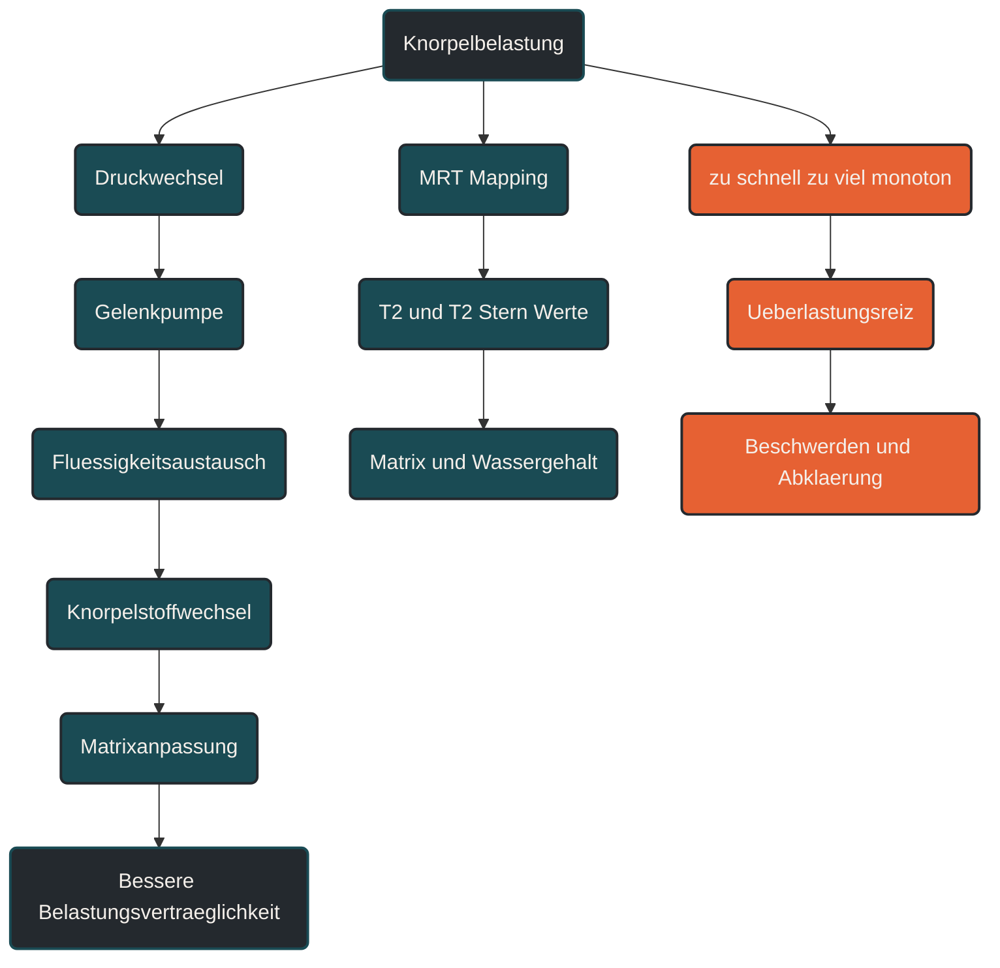

# Knorpelregeneration und MRT Mapping

Knorpelregeneration und MRT-Mapping beschreiben, wie Gelenkknorpel auf mechanische Belastung reagiert und wie strukturelle Veränderungen bildgebend eingeordnet werden können. Im Ausdauersport ist das wichtig, weil Knorpel Druckbelastung braucht, aber nur langsam regeneriert. Entscheidend ist die Dosis: Regelmäßige, gut verträgliche Belastung kann den Knorpelstoffwechsel unterstützen, während abrupte oder monotone Überlastung Beschwerden begünstigen kann. [[1]](#quelle-1) [[2]](#quelle-2) [[3]](#quelle-3) [[4]](#quelle-4)

## Was Knorpelregeneration bedeutet

Gelenkknorpel ist ein spezialisiertes Gewebe, das Gelenkflächen überzieht und Belastung verteilt. Er ermöglicht reibungsarme Bewegung und wirkt als Druckverteiler zwischen den Gelenkpartnern. [[1]](#quelle-1) [[2]](#quelle-2)

Knorpel ist nur gering durchblutet. Deshalb laufen Stoffwechsel, Reparatur und Anpassung langsamer ab als in Muskulatur. Trotzdem ist Knorpel kein totes Material. Er reagiert auf mechanische Reize, Flüssigkeitsverschiebungen und biochemische Signalprozesse. [[1]](#quelle-1) [[2]](#quelle-2) [[4]](#quelle-4) [[5]](#quelle-5)

Regeneration bedeutet in diesem Zusammenhang nicht, dass geschädigter Knorpel durch Training einfach vollständig neu aufgebaut wird. Gemeint ist vorsichtiger: Knorpel kann auf passende Belastung mit Stoffwechselaktivität, Flüssigkeitsaustausch und struktureller Anpassung reagieren. [[1]](#quelle-1) [[2]](#quelle-2) [[3]](#quelle-3)

## Was MRT-Mapping bedeutet

MRT-Mapping ist eine bildgebende Methode, mit der Knorpel nicht nur grob sichtbar gemacht, sondern genauer charakterisiert werden kann. Besonders T2- und T2*-Mapping werden genutzt, um Hinweise auf Wassergehalt, Kollagenorganisation und Matrixzustand zu erhalten. [[1]](#quelle-1) [[2]](#quelle-2) [[3]](#quelle-3) [[4]](#quelle-4)

Das ist wichtig, weil normale MRT-Bilder oft vor allem zeigen, ob größere strukturelle Schäden vorhanden sind. Mapping-Verfahren können sensibler auf funktionelle oder frühe Veränderungen der Knorpelmatrix hinweisen. [[1]](#quelle-1) [[2]](#quelle-2)

Für die Trainingspraxis bedeutet das aber nicht, dass jeder Läufer MRT-Mapping braucht. Es ist vor allem ein diagnostisches und wissenschaftliches Werkzeug. Beschwerden, Schwellung oder Bewegungseinschränkungen sollten medizinisch abgeklärt werden. [[3]](#quelle-3) [[4]](#quelle-4) [[7]](#quelle-7) [[5]](#quelle-5)

## Warum Knorpel auf Belastung angewiesen ist

Knorpel wird wesentlich über Druckwechsel und Gelenkbewegung versorgt. Bei Belastung wird Flüssigkeit aus der Matrix verschoben. Bei Entlastung kann wieder Flüssigkeit aufgenommen werden. Diese wechselnde Kompression wirkt wie eine Art Gelenkpumpe. [[1]](#quelle-1) [[2]](#quelle-2) [[3]](#quelle-3)

Moderate, rhythmische Belastung kann deshalb sinnvoll sein. Sie unterstützt den Flüssigkeitsaustausch und kann den Knorpelstoffwechsel anregen. Vollständige Schonung ist nicht automatisch besser, wenn keine akute Verletzung oder medizinische Gegenanzeige besteht. [[1]](#quelle-1) [[2]](#quelle-2) [[3]](#quelle-3)

Problematisch wird es, wenn Belastung zu hoch, zu plötzlich oder zu einseitig ist. Dann kann die mechanische Beanspruchung größer sein als die aktuelle Belastbarkeit von Knorpel, Knochen, Menisken, Sehnen und Muskulatur. [[1]](#quelle-1) [[2]](#quelle-2)

## Wie Knorpel im Ausdauertraining reagiert

Beim Laufen entstehen wiederholte Kompressionskräfte im Knie, Sprunggelenk und Hüftgelenk. Diese Kräfte sind nicht grundsätzlich schädlich. Entscheidend ist, wie gut Gewebe, Muskulatur und Bewegungsmuster die Belastung aufnehmen und verteilen. [[1]](#quelle-1) [[3]](#quelle-3) [[4]](#quelle-4) [[5]](#quelle-5)

Nach sehr langen oder intensiven Belastungen können kurzfristige Veränderungen der Knorpelmatrix messbar sein. Dazu gehören Flüssigkeitsverschiebungen, veränderte Signalwerte im MRT-Mapping oder vorübergehende Veränderungen der Knorpeldicke. [[1]](#quelle-1) [[2]](#quelle-2) [[3]](#quelle-3) [[4]](#quelle-4)

Solche akuten Veränderungen bedeuten nicht automatisch Schaden. Sie können eine normale mechanische Reaktion sein. Entscheidend ist, ob sich das Gewebe erholt, ob Beschwerden auftreten und ob Belastung langfristig verträglich bleibt. [[1]](#quelle-1) [[2]](#quelle-2) [[6]](#quelle-6)

## Zentrale Einflussfaktoren

### Belastungsdosis

Die Belastungsdosis beschreibt, wie stark, wie lange und wie häufig ein Gelenk belastet wird. Für Knorpel ist nicht nur ein einzelner Lauf relevant, sondern die Summe aus Wochenumfang, Tempo, Höhenmetern, Untergrund und Erholung. [[1]](#quelle-1) [[2]](#quelle-2) [[3]](#quelle-3) [[4]](#quelle-4)

Eine sinnvolle Dosis kann den Knorpelstoffwechsel unterstützen. Eine zu schnelle Steigerung kann die Gelenkstrukturen überfordern. [[1]](#quelle-1) [[2]](#quelle-2)

### Gelenkpumpe

Die Gelenkpumpe beschreibt den Wechsel aus Kompression und Entlastung. Bei rhythmischer Bewegung wird Flüssigkeit aus dem Knorpel verschoben und wieder aufgenommen. [[1]](#quelle-1) [[2]](#quelle-2) [[3]](#quelle-3)

Dieser Wechsel ist wichtig, weil Knorpel Nährstoffe nicht über eine starke eigene Durchblutung erhält. Bewegung und Druckwechsel sind deshalb zentrale Reize für den Stoffwechsel des Gelenks. [[1]](#quelle-1) [[2]](#quelle-2) [[3]](#quelle-3)

### Knorpelmatrix

Die Knorpelmatrix besteht unter anderem aus Kollagen, Proteoglykanen und Wasser. Sie bestimmt, wie gut Knorpel Druck aufnehmen, verteilen und wieder elastisch reagieren kann. [[1]](#quelle-1) [[2]](#quelle-2)

MRT-Mapping kann Hinweise darauf geben, ob sich Wassergehalt oder Matrixorganisation verändern. Solche Werte müssen aber immer fachlich eingeordnet werden und ersetzen keine klinische Untersuchung. [[3]](#quelle-3) [[4]](#quelle-4) [[7]](#quelle-7)

### Entzündung und Überlastung

Gelenkbeschwerden entstehen selten nur durch einen einzelnen Faktor. Neben mechanischer Belastung spielen Entzündungsprozesse, Körpergewicht, Trainingshistorie, muskuläre Kontrolle, Verletzungsvorgeschichte und Erholung eine Rolle. [[1]](#quelle-1) [[2]](#quelle-2) [[6]](#quelle-6)

Wenn Gelenke wiederholt anschwellen, blockieren oder belastungsabhängig schmerzen, sollte das nicht als normaler Trainingsreiz abgetan werden.

## Bedeutung für Läufer

Für Läufer ist Knorpelregeneration besonders relevant, weil Knie, Sprunggelenke und Hüften sehr viele Wiederholungen verarbeiten müssen. Jeder Schritt erzeugt eine kurze Kompression, die bei guter Dosierung tolerierbar und funktionell sinnvoll sein kann. [[1]](#quelle-1) [[2]](#quelle-2) [[3]](#quelle-3) [[4]](#quelle-4)

Praktisch bedeutet das: Nicht jeder Laufkilometer ist automatisch schlecht für den Knorpel. Entscheidend ist die langfristige Belastungsverträglichkeit. Ein ruhiger Aufbau, stabile Muskulatur, passende Erholung und abwechslungsreiche Belastung sind wichtiger als einzelne perfekte Regeln. [[1]](#quelle-1) [[2]](#quelle-2)

Besonders vorsichtig sollte man bei abrupten Veränderungen sein. Mehr Umfang, mehr Tempo, mehr Bergabpassagen oder ein Wechsel auf harten Untergrund können die Gelenkbelastung deutlich verändern. [[3]](#quelle-3) [[4]](#quelle-4) [[6]](#quelle-6)

## Häufige Fehler

Ein häufiger Fehler ist die Annahme, Knorpel sei entweder gesund oder kaputt. Tatsächlich ist Knorpel ein dynamisches Gewebe, dessen Zustand von Belastung, Stoffwechsel, Alter, Verletzungen und Erholung beeinflusst wird. [[1]](#quelle-1) [[2]](#quelle-2)

Ein zweiter Fehler ist vollständige Schonung ohne klare medizinische Begründung. Bewegung kann für Gelenke wichtig sein. Die Frage ist nicht nur ob Bewegung stattfindet, sondern welche Belastung aktuell verträglich ist.

Ein dritter Fehler ist, MRT-Befunde isoliert zu bewerten. Bildgebung muss immer mit Beschwerden, Funktion, Trainingshistorie und klinischer Untersuchung zusammen betrachtet werden. [[1]](#quelle-1) [[2]](#quelle-2) [[6]](#quelle-6) [[3]](#quelle-3)

## Praktische Einordnung

Knorpelregeneration und MRT-Mapping zeigen, warum Gelenkgesundheit nicht nur eine Frage von Verschleiß ist. Knorpel reagiert auf mechanische Reize, aber langsam und empfindlich gegenüber schlechter Dosierung. [[1]](#quelle-1) [[2]](#quelle-2) [[3]](#quelle-3) [[4]](#quelle-4)

Für die Praxis bedeutet das: Laufbelastung sollte schrittweise gesteigert werden, Gelenkbeschwerden sollten ernst genommen werden und Bildgebung sollte fachlich eingeordnet werden. Training kann Gelenke unterstützen, ersetzt aber keine medizinische Diagnose oder Therapie. [[4]](#quelle-4) [[5]](#quelle-5) [[6]](#quelle-6) [[1]](#quelle-1)

Der wichtigste Merksatz lautet: Knorpel braucht Bewegung, aber keine unkontrollierte Überlastung. [[1]](#quelle-1) [[2]](#quelle-2) [[6]](#quelle-6)

----

----

## Häufige Fragen zu Knorpelregeneration und MRT-Mapping

### Was bedeutet Knorpelregeneration einfach erklärt?

Knorpelregeneration beschreibt die Fähigkeit von Gelenkknorpel, auf Belastung, Entlastung und Stoffwechselreize zu reagieren. Im Sport meint das meist keine vollständige Neubildung von geschädigtem Knorpel, sondern Anpassung, Flüssigkeitsaustausch und Erhalt der Matrixfunktion. [[1]](#quelle-1) [[2]](#quelle-2) [[3]](#quelle-3)

### Was ist MRT-Mapping?

MRT-Mapping ist eine spezielle Form der Magnetresonanztomographie. Sie kann Hinweise auf Eigenschaften der Knorpelmatrix geben, zum Beispiel Wassergehalt, Kollagenorganisation oder frühe strukturelle Veränderungen. [[1]](#quelle-1) [[2]](#quelle-2) [[3]](#quelle-3) [[4]](#quelle-4)

### Warum ist Knorpel im Ausdauersport wichtig?

Knorpel verteilt Druck im Gelenk und ermöglicht reibungsarme Bewegung. Beim Laufen wird er bei jedem Schritt belastet und braucht deshalb eine sinnvolle Balance aus Belastung und Erholung. [[1]](#quelle-1) [[2]](#quelle-2) [[4]](#quelle-4) [[5]](#quelle-5)

### Ist Laufen schlecht für den Knorpel?

Laufen ist nicht automatisch schlecht für den Knorpel. Entscheidend sind Belastungsdosis, Trainingsaufbau, Gelenkstatus, Muskulatur, Technik, Körpergewicht, Erholung und individuelle Vorgeschichte. [[1]](#quelle-1) [[2]](#quelle-2) [[4]](#quelle-4) [[5]](#quelle-5)

### Was ist ein häufiger Fehler bei Knorpelbelastung?

Ein häufiger Fehler ist eine zu schnelle Steigerung von Umfang, Tempo oder Bergabbelastung. Auch MRT-Befunde sollten nicht isoliert bewertet werden, sondern immer zusammen mit Beschwerden und Funktion. [[3]](#quelle-3) [[4]](#quelle-4) [[6]](#quelle-6) [[1]](#quelle-1)

### Wann sollte man Gelenkbeschwerden abklären lassen?

Wiederkehrende Schmerzen, Schwellungen, Blockierungen, Instabilität oder zunehmende Beschwerden unter Belastung sollten medizinisch abgeklärt werden. [[1]](#quelle-1) [[2]](#quelle-2) [[6]](#quelle-6)

----

## Quellen

### Quelle 1

[1] Sophia Fox, A. J., Bedi, A. & Rodeo, S. A. (2009): [The Basic Science of Articular Cartilage: Structure, Composition, and Function](https://europepmc.org/articles/PMC3445147). Sports Health.

### Quelle 2

[2] Liu, Y., Shah, K. M. & Luo, J. (2021): [Strategies for Articular Cartilage Repair and Regeneration](https://pmc.ncbi.nlm.nih.gov/articles/PMC8719005/). Frontiers in Bioengineering and Biotechnology.

### Quelle 3

[3] Mosher, T. J., Liu, Y. & Torok, C. M. (2009): [Functional Cartilage MRI T2 Mapping: Evaluating the Effect of Age and Training on Knee Cartilage Response to Running](https://pmc.ncbi.nlm.nih.gov/articles/PMC2826588/). Osteoarthritis and Cartilage.

### Quelle 4

[4] Hesper, T. et al. (2021): [Longitudinal study of the morphological and T2* changes of knee cartilages of marathon runners using prototype software for automatic cartilage segmentation](https://pmc.ncbi.nlm.nih.gov/articles/PMC8011266/). European Journal of Radiology.

### Quelle 5

[5] Schütz, U. H. W. et al. (2020): [A mobile MRI field study of the biochemical cartilage reaction of the knee joint during a 4486 km transcontinental multistage ultra-marathon](https://www.nature.com/articles/s41598-020-64994-2). Scientific Reports.

### Quelle 6

[6] Burfield, M., Sayers, M. & Buhmann, R. (2023): [The association between running volume and knee osteoarthritis prevalence: A systematic review and meta-analysis](https://www.sciencedirect.com/science/article/abs/pii/S1466853X23000238). Physical Therapy in Sport.

### Quelle 7

[7] Link, T. M., Joseph, G. B. & Li, X. (2023): [MRI-based T1rho and T2 cartilage compositional imaging in osteoarthritis](https://link.springer.com/article/10.1007/s00256-023-04310-x). Skeletal Radiology.

----

*Hinweis: Dieser Artikel dient der allgemeinen Information und ersetzt keine medizinische oder therapeutische Beratung. Mehr dazu im [**Gesundheits- und Quellenhinweis**](/ausdauersport/disclaimer/).*

