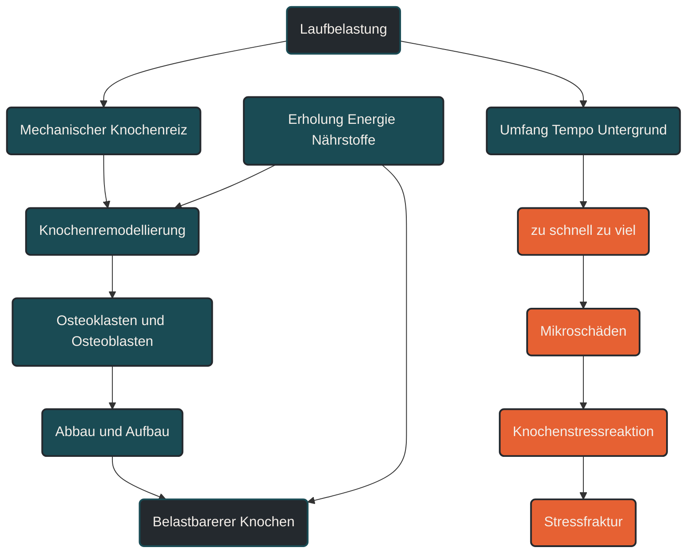

# Knochenremodellierung und Stressfrakturen

Knochenremodellierung beschreibt, wie Knochengewebe fortlaufend abgebaut, erneuert und an mechanische Belastung angepasst wird. Im Ausdauersport ist das wichtig, weil Knochen regelmäßige Belastung brauchen, aber bei zu schneller oder zu einseitiger Belastungssteigerung überfordert werden können. Stressfrakturen entstehen meist nicht plötzlich, sondern als Folge wiederholter Mikrobelastungen, wenn Belastung und Regeneration nicht mehr zusammenpassen. [[4]](#quelle-4) [[5]](#quelle-5) [[1]](#quelle-1) [[2]](#quelle-2)

## Was Knochenremodellierung bedeutet

Knochen ist kein starres Material. Er ist lebendiges Gewebe, das sich ständig umbaut. Alte oder geschädigte Knochenanteile werden abgebaut, neue Knochenmatrix wird aufgebaut und mineralisiert.

Dieser Umbau wird durch mechanische Belastung, Hormone, Ernährung, Energieverfügbarkeit, Alter, Trainingshistorie und Erholung beeinflusst. Für Läufer ist besonders wichtig: Knochen reagiert auf Belastung, aber nicht sofort. Die Anpassung dauert länger als die Verbesserung von Ausdauer, Pace oder muskulärer Leistungsfähigkeit. [[4]](#quelle-4) [[5]](#quelle-5) [[1]](#quelle-1) [[2]](#quelle-2)

Knochenremodellierung ist deshalb ein Schutzmechanismus und ein Anpassungsprozess zugleich. Sie hilft dem Körper, Knochen langfristig belastbarer zu machen, kann aber bei schlechter Dosierung aus dem Gleichgewicht geraten. [[4]](#quelle-4) [[5]](#quelle-5)

## Was Stressfrakturen sind

Stressfrakturen sind Überlastungsverletzungen des Knochens. Sie entstehen durch wiederholte mechanische Belastung, die für sich allein oft nicht dramatisch ist, in der Summe aber die aktuelle Reparaturfähigkeit des Knochens übersteigt. [[1]](#quelle-1) [[2]](#quelle-2) [[5]](#quelle-5) [[4]](#quelle-4)

Vor einer echten Stressfraktur gibt es häufig eine Vorstufe. Man spricht oft von Knochenstressreaktion oder Bone Stress Injury. Dabei ist der Knochen bereits gereizt oder strukturell belastet, ohne dass zwingend eine klare Frakturlinie sichtbar sein muss. [[1]](#quelle-1) [[2]](#quelle-2) [[5]](#quelle-5)

Typische Regionen im Laufkontext sind Schienbein, Mittelfuß, Oberschenkelhals, Wadenbein, Becken und Fußwurzel. Anhaltende, zunehmende oder punktuelle Knochenschmerzen sollten medizinisch abgeklärt werden. [[1]](#quelle-1) [[2]](#quelle-2)

## Warum Knochen Belastung braucht

Knochen passt sich an mechanische Reize an. Belastung erzeugt Verformungen im Knochengewebe. Diese Verformungen werden von Knochenzellen wahrgenommen und können Umbauprozesse auslösen. [[4]](#quelle-4) [[5]](#quelle-5)

Regelmäßige Belastung kann deshalb zur Knochengesundheit beitragen. Besonders wichtig sind wechselnde, ausreichend starke, aber verträgliche Reize. Dauerhafte Schonung ist für Knochen nicht automatisch günstig, solange keine akute Verletzung oder medizinische Gegenanzeige besteht. [[4]](#quelle-4) [[5]](#quelle-5) [[1]](#quelle-1) [[2]](#quelle-2)

Gleichzeitig gilt: Mehr Belastung ist nicht automatisch besser. Knochen braucht Reize, aber auch Zeit für Reparatur und Anpassung. [[4]](#quelle-4) [[5]](#quelle-5)

## Wie Stressfrakturen entstehen

Stressfrakturen entstehen häufig durch ein Missverhältnis zwischen Belastung und Belastbarkeit. Wenn Laufumfang, Tempo, Höhenmeter, Untergrund oder Trainingshäufigkeit zu schnell gesteigert werden, steigt die mechanische Last auf den Knochen. [[1]](#quelle-1) [[2]](#quelle-2) [[5]](#quelle-5) [[4]](#quelle-4)

Bei jeder Laufeinheit entstehen kleine Mikrobelastungen. Normalerweise kann der Körper diese reparieren. Wenn die nächste Belastung zu früh kommt oder die Gesamtbelastung dauerhaft zu hoch ist, können sich Mikrodefekte ansammeln. [[1]](#quelle-1) [[2]](#quelle-2) [[5]](#quelle-5) [[4]](#quelle-4)

Dann verschiebt sich das Gleichgewicht: Der Knochen wird nicht belastbarer, sondern zunehmend empfindlicher. Aus einer Reaktion kann eine Stressfraktur werden. [[1]](#quelle-1) [[2]](#quelle-2) [[5]](#quelle-5)

## Zentrale Einflussfaktoren

### Trainingsbelastung

Die wichtigste sportpraktische Größe ist die Veränderung der Belastung. Mehr Kilometer, mehr Tempo, mehr Bergabpassagen, härterer Untergrund oder mehr Einheiten pro Woche erhöhen die mechanische Beanspruchung. [[4]](#quelle-4) [[5]](#quelle-5) [[1]](#quelle-1) [[2]](#quelle-2)

Besonders kritisch sind abrupte Sprünge. Der Körper kann sich an viel Belastung anpassen, aber meist nicht an viele neue Belastungen gleichzeitig. [[4]](#quelle-4) [[5]](#quelle-5) [[1]](#quelle-1) [[2]](#quelle-2)

### Erholung

Knochenumbau braucht Zeit. Die Reparaturprozesse laufen nicht während der Belastung vollständig ab, sondern in der Erholungsphase danach. [[4]](#quelle-4) [[5]](#quelle-5) [[1]](#quelle-1) [[2]](#quelle-2)

Wenn intensive oder lange Einheiten zu dicht aufeinander folgen, kann die Knochenremodellierung nicht ausreichend Schritt halten. Das Risiko steigt besonders, wenn zusätzlich Schlafmangel, Stress oder unzureichende Ernährung hinzukommen. [[4]](#quelle-4) [[5]](#quelle-5) [[1]](#quelle-1) [[2]](#quelle-2)

### Energieverfügbarkeit

Knochenstoffwechsel hängt eng mit Energieverfügbarkeit zusammen. Wenn dauerhaft zu wenig Energie aufgenommen wird, kann der Körper Reparatur, Hormonregulation und Knochenaufbau schlechter unterstützen. [[3]](#quelle-3) [[7]](#quelle-7)

Das ist im Ausdauersport besonders relevant, weil hohe Trainingsumfänge den Energiebedarf stark erhöhen. Eine niedrige Energieverfügbarkeit kann auch dann entstehen, wenn die Ernährung grundsätzlich gesund wirkt, aber nicht zum Trainingsumfang passt. [[1]](#quelle-1) [[2]](#quelle-2) [[5]](#quelle-5) [[3]](#quelle-3)

### Vitamin D, Calcium und Protein

Knochen benötigt ausreichend Baustoffe und regulierende Faktoren. Calcium, Vitamin D und Protein spielen dabei eine wichtige Rolle. Entscheidend ist aber nicht ein einzelner Nährstoff, sondern die gesamte Versorgungslage. [[6]](#quelle-6)

Supplemente ersetzen keine ausgewogene Ernährung und keine passende Trainingssteuerung. Bei Verdacht auf Mangel oder wiederkehrenden Knochenproblemen sollte das medizinisch abgeklärt werden. [[1]](#quelle-1) [[2]](#quelle-2)

### Biomechanik und Untergrund

Lauftechnik, Schuhwerk, Untergrund, muskuläre Kontrolle und individuelle Anatomie beeinflussen, wie Kräfte auf Knochen verteilt werden. [[1]](#quelle-1) [[2]](#quelle-2) [[5]](#quelle-5)

Ein harter Untergrund ist nicht automatisch gefährlich und ein weicher Untergrund nicht automatisch sicher. Entscheidend ist, welche Belastung der Körper gewohnt ist und wie schnell Veränderungen eingeführt werden. [[4]](#quelle-4) [[5]](#quelle-5) [[1]](#quelle-1) [[2]](#quelle-2)

## Bedeutung für Läufer

Für Läufer ist Knochenremodellierung zentral, weil jeder Schritt eine mechanische Belastung erzeugt. Diese Belastung kann Knochen stärken, wenn sie passend dosiert ist. Sie kann aber auch zum Problem werden, wenn Umfang, Intensität oder Häufigkeit schneller steigen als die knöcherne Anpassungsfähigkeit. [[4]](#quelle-4) [[5]](#quelle-5) [[1]](#quelle-1) [[2]](#quelle-2)

Praktisch bedeutet das: Lauftraining sollte nicht nur nach Herzfrequenz, Pace und Motivation gesteuert werden. Auch die mechanische Belastung zählt. Besonders nach Trainingspausen, Krankheit, Verletzungen oder deutlichen Änderungen im Trainingsplan sollte der Aufbau vorsichtig erfolgen. [[4]](#quelle-4) [[5]](#quelle-5)

Warnzeichen sind punktuelle Knochenschmerzen, Schmerzen, die mit Belastung zunehmen, Beschwerden beim Hüpfen oder Auftreten, Schmerzen in Ruhe oder nächtliche Schmerzen. Solche Symptome sollten nicht als normaler Muskelkater eingeordnet werden. [[4]](#quelle-4) [[5]](#quelle-5) [[1]](#quelle-1) [[2]](#quelle-2)

## Häufige Fehler

Ein häufiger Fehler ist, Knochenbelastung nur über den Wochenumfang zu bewerten. Auch Tempo, Bergabanteile, Untergrund, Schuhe, Ermüdung und Trainingsdichte verändern die Belastung. [[4]](#quelle-4) [[5]](#quelle-5) [[1]](#quelle-1) [[2]](#quelle-2)

Ein weiterer Fehler ist, beginnende Knochenschmerzen zu überlaufen. Während Muskel- oder Sehnenbeschwerden manchmal unspezifisch beginnen, sind punktuelle, zunehmende Knochenschmerzen ein Warnsignal. [[1]](#quelle-1) [[2]](#quelle-2)

Auch Gewichtsreduktion bei gleichzeitig hohem Trainingsumfang kann problematisch sein. Wenn Energiezufuhr und Belastung nicht zusammenpassen, kann die Knochenregeneration leiden. [[4]](#quelle-4) [[5]](#quelle-5) [[1]](#quelle-1) [[2]](#quelle-2)

## Praktische Einordnung

Knochenremodellierung und Stressfrakturen zeigen, warum langfristiger Trainingsaufbau so wichtig ist. Knochen braucht Belastung, aber er braucht auch ausreichende Erholung, Energie und Zeit. [[4]](#quelle-4) [[5]](#quelle-5) [[1]](#quelle-1) [[2]](#quelle-2)

Für die Praxis bedeutet das: Trainingssteigerungen sollten schrittweise erfolgen, intensive Reize sollten dosiert eingesetzt werden und ungewohnte Belastungen nicht gleichzeitig eingeführt werden. Bei Verdacht auf Stressfraktur sollte das Training nicht einfach fortgesetzt, sondern medizinisch abgeklärt werden. [[1]](#quelle-1) [[2]](#quelle-2) [[5]](#quelle-5) [[4]](#quelle-4)

Der wichtigste Merksatz lautet: Knochen wird durch passende Belastung stärker, aber durch zu schnelle Belastungssteigerung verletzlicher. [[4]](#quelle-4) [[5]](#quelle-5)

----

----

## Häufige Fragen zu Knochenremodellierung und Stressfrakturen

### Was bedeutet Knochenremodellierung einfach erklärt?

Knochenremodellierung bedeutet, dass Knochengewebe fortlaufend erneuert wird. Alte oder belastete Strukturen werden abgebaut, neue Knochenmatrix wird aufgebaut und mineralisiert. [[4]](#quelle-4) [[5]](#quelle-5) [[1]](#quelle-1) [[2]](#quelle-2)

### Was ist eine Stressfraktur?

Eine Stressfraktur ist eine Überlastungsverletzung des Knochens. Sie entsteht meist durch wiederholte Mikrobelastungen, wenn die Reparaturfähigkeit des Knochens nicht mehr ausreicht. [[1]](#quelle-1) [[2]](#quelle-2) [[5]](#quelle-5) [[4]](#quelle-4)

### Was ist der Unterschied zwischen Knochenstressreaktion und Stressfraktur?

Eine Knochenstressreaktion ist eine frühe Reizung oder Überlastungsreaktion des Knochens. Eine Stressfraktur ist eine weiter fortgeschrittene Form, bei der eine strukturelle Schädigung oder Frakturlinie vorliegen kann. [[1]](#quelle-1) [[2]](#quelle-2) [[5]](#quelle-5)

### Warum sind Läufer besonders betroffen?

Beim Laufen wirken bei jedem Schritt wiederholte Kräfte auf Schienbein, Fuß, Hüfte und Becken. Wenn Umfang, Tempo oder Belastungsdichte zu schnell steigen, kann die knöcherne Anpassung überfordert werden. [[4]](#quelle-4) [[5]](#quelle-5) [[1]](#quelle-1) [[2]](#quelle-2)

### Was ist ein häufiger Fehler bei Stressfrakturen?

Ein häufiger Fehler ist, punktuelle Knochenschmerzen weiter zu überlaufen. Besonders Schmerzen, die unter Belastung zunehmen oder auch in Ruhe auftreten, sollten ernst genommen werden. [[4]](#quelle-4) [[5]](#quelle-5) [[1]](#quelle-1) [[2]](#quelle-2)

### Wann sollte man Beschwerden abklären lassen?

Punktuelle, zunehmende oder belastungsabhängige Knochenschmerzen sollten medizinisch abgeklärt werden. Das gilt besonders bei Schmerzen beim Auftreten, Hüpfen, in Ruhe oder nachts. [[4]](#quelle-4) [[5]](#quelle-5) [[1]](#quelle-1) [[2]](#quelle-2)

----

## Quellen

### Quelle 1

[1] Song, S. H. & Koo, J. H. (2020): [Bone Stress Injuries in Runners: a Review for Raising Interest in Stress Fractures in Korea](https://pmc.ncbi.nlm.nih.gov/articles/PMC7049623/). Annals of Rehabilitation Medicine.

### Quelle 2

[2] International Delphi Consensus Group (2025): [International Delphi consensus on bone stress injuries in athletes](https://bjsm.bmj.com/content/59/2/78). British Journal of Sports Medicine.

### Quelle 3

[3] Mountjoy, M. et al. (2023): [2023 International Olympic Committee's consensus statement on Relative Energy Deficiency in Sport (REDs)](https://bjsm.bmj.com/content/57/17/1073). British Journal of Sports Medicine.

### Quelle 4

[4] Robling, A. G. & Turner, C. H. (2009): [Mechanical Signaling for Bone Modeling and Remodeling](https://pubmed.ncbi.nlm.nih.gov/19555953/). Critical Reviews in Eukaryotic Gene Expression.

### Quelle 5

[5] Burr, D. B. (1997): [Bone, exercise, and stress fractures](https://pubmed.ncbi.nlm.nih.gov/9219319/). Exercise and Sport Sciences Reviews.

### Quelle 6

[6] Knechtle, B., Jastrzębski, Z., Hill, L. & Nikolaidis, P. T. (2021): [Vitamin D and Stress Fractures in Sport](https://www.mdpi.com/1648-9144/57/3/223). Medicina.

### Quelle 7

[7] Nattiv, A. et al. (2013): [American College of Sports Medicine position stand. The female athlete triad](https://pubmed.ncbi.nlm.nih.gov/23470355/). Medicine & Science in Sports & Exercise.

----

*Hinweis: Dieser Artikel dient der allgemeinen Information und ersetzt keine medizinische oder therapeutische Beratung. Mehr dazu im [**Gesundheits- und Quellenhinweis**](/ausdauersport/disclaimer/).*

