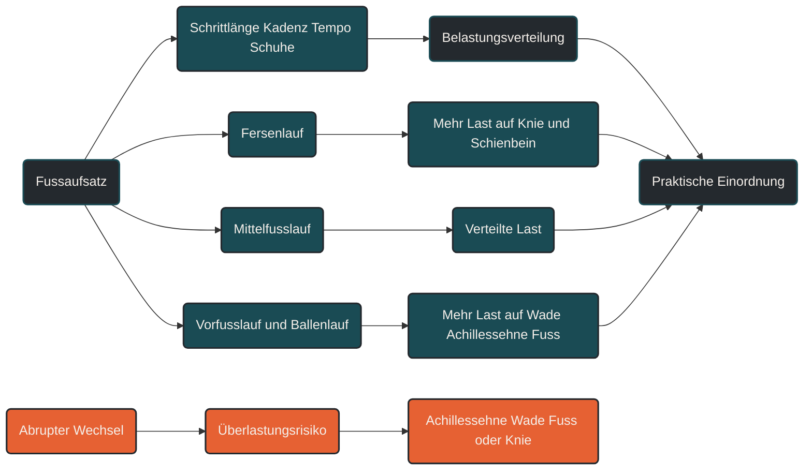

# Vorfußlauf, Ballenlauf und Fersenlauf

Vorfußlauf, Ballenlauf und Fersenlauf beschreiben, welcher Teil des Fußes beim Laufen zuerst den Boden berührt. Im Ausdauersport ist das wichtig, weil der Fußaufsatz beeinflusst, wie Kräfte auf Fuß, Sprunggelenk, Achillessehne, Knie und Hüfte verteilt werden. Entscheidend ist: Es gibt keinen grundsätzlich besten Laufstil. Ein Wechsel des Fußaufsatzes kann Belastungen verlagern und sollte nicht abrupt erfolgen.

## Was Vorfußlauf, Ballenlauf und Fersenlauf bedeuten

Beim Fersenlauf setzt zuerst die Ferse auf. Der Fuß befindet sich beim ersten Bodenkontakt meist eher in Dorsalextension, also mit angehobener Fußspitze. Dieses Muster ist bei vielen Freizeitläufern verbreitet.

Beim Vorfußlauf setzt zuerst der vordere Fußbereich auf. Das Sprunggelenk ist dabei eher plantarflexiert, also leicht nach unten gerichtet. Die Wadenmuskulatur und die Achillessehne übernehmen dabei mehr Arbeit.

Ballenlauf wird im Alltag oft ähnlich wie Vorfußlauf verwendet. Gemeint ist meist ein Aufsatz über den Fußballen. Streng genommen kann Ballenlauf aber auch eine übertriebene Form sein, wenn der Läufer dauerhaft sehr weit vorne auf dem Fuß landet und die Ferse kaum oder gar nicht kontrolliert absinken lässt.

Zwischen diesen Formen liegt der Mittelfußlauf. Dabei berührt der Fuß eher flächig oder mit einer Zwischenposition den Boden. In der Praxis sind die Übergänge fließend.

## Warum der Fußaufsatz wichtig ist

Der Fußaufsatz beeinflusst, wo Belastung entsteht. Fersenlauf belastet tendenziell stärker Knie, Schienbein und patellofemorale Strukturen. Vorfuß- und Ballenlauf verlagern mehr Belastung auf Sprunggelenk, Wadenmuskulatur, Achillessehne und Fußgewölbe.

Das bedeutet nicht, dass Fersenlauf schlecht und Vorfußlauf gut ist. Es bedeutet nur, dass die Kräfte anders verteilt werden.

Ein Läufer mit Kniebeschwerden kann unter bestimmten Umständen von einer vorsichtigen Veränderung des Laufmusters profitieren. Gleichzeitig kann ein zu schneller Wechsel Richtung Vorfußlauf Achillessehne, Wade oder Fuß überfordern.

## Wie Fersenlauf wirkt

Beim Fersenlauf landet der Fuß häufig etwas weiter vor dem Körperschwerpunkt. Das kann den Bremsimpuls erhöhen, besonders wenn die Schrittlänge sehr groß ist.

Viele Fersenläufer laufen jedoch problemlos und ökonomisch. Der Körper kann sich über Jahre an ein bestimmtes Bewegungsmuster anpassen. Deshalb ist der Fersenlauf nicht automatisch ein Fehler.

Problematisch wird Fersenlauf vor allem dann, wenn er mit Overstriding, niedriger Schrittfrequenz, hoher vertikaler Belastung oder Beschwerden kombiniert ist. Dann kann eine Veränderung von Kadenz, Schrittlänge oder Lauftechnik sinnvoller sein als ein radikaler Wechsel auf den Vorfuß.

## Wie Vorfußlauf und Ballenlauf wirken

Beim Vorfußlauf landet der Fuß weiter vorne auf dem Fuß. Die Achillessehne und die Wadenmuskulatur werden stärker in die elastische Speicherarbeit eingebunden. Das kann bei kurzen, schnellen Belastungen oder Sprints sinnvoll sein.

Für längere Dauerläufe ist Vorfußlauf aber nicht automatisch effizienter. Wer jahrelang Fersenläufer war und plötzlich dauerhaft auf Vorfuß oder Ballen läuft, verändert das Belastungsmuster stark. Die Wadenmuskulatur kann schneller ermüden, und die Achillessehne bekommt deutlich mehr Zugbelastung.

Ein kontrollierter Vorfuß- oder Mittelfußaufsatz kann bei bestimmten Problemen hilfreich sein. Ein erzwungener Ballenlauf ohne Anpassungszeit kann dagegen neue Beschwerden auslösen.

## Zentrale Einflussfaktoren

### Schrittlänge

Eine sehr lange Schrittlänge führt häufig dazu, dass der Fuß weit vor dem Körper landet. Dadurch steigen Bremskräfte und Aufprallbelastung.

Oft ist es sinnvoller, die Schrittlänge etwas zu verkürzen, als bewusst einen völlig anderen Fußaufsatz zu erzwingen.

### Schrittfrequenz

Eine leicht höhere Schrittfrequenz kann helfen, den Fuß näher unter dem Körperschwerpunkt aufzusetzen. Dadurch kann sich die Belastung günstiger verteilen.

Das bedeutet nicht, dass jeder Läufer eine bestimmte Idealzahl erreichen muss. Entscheidend ist eine kontrollierte, natürliche Anpassung.

### Geschwindigkeit

Der Fußaufsatz verändert sich oft mit dem Tempo. Bei schnellen Läufen, Sprints oder Bergaufläufen landen viele Läufer automatisch weiter vorne auf dem Fuß. Bei lockeren Dauerläufen ist ein Fersen- oder Mittelfußaufsatz häufig normal.

Deshalb sollte man den Fußaufsatz immer im Kontext der Geschwindigkeit beurteilen.

### Schuhe und Sprengung

Schuhe beeinflussen, wie der Fuß aufsetzt. Eine hohe Sprengung und starke Dämpfung können Fersenlauf begünstigen. Minimalistische Schuhe oder Spikes verschieben den Aufsatz oft weiter nach vorne.

Ein Schuhwechsel ist deshalb auch eine Änderung der mechanischen Belastung und sollte schrittweise erfolgen.

### Gewohnheit und Gewebeanpassung

Der Körper passt sich an das gewohnte Laufmuster an. Muskeln, Sehnen, Knochen und Koordination sind auf die wiederkehrenden Belastungen abgestimmt.

Ein Laufstilwechsel verändert diese Belastungen. Deshalb braucht nicht nur die Technik Zeit, sondern auch das Gewebe.

## Bedeutung für Läufer

Für Läufer ist der Fußaufsatz ein wichtiges Thema, aber kein isolierter Qualitätsmarker. Gute Lauftechnik entsteht nicht dadurch, dass jeder Läufer auf dem Vorfuß landet. Entscheidend ist, ob der Laufstil zur Person, Geschwindigkeit, Belastbarkeit und Beschwerdesituation passt.

Bei schmerzfreien Läufern gibt es meist keinen Grund, den Fußaufsatz radikal zu verändern. Sinnvoller ist oft, an Schrittlänge, Kadenz, Körperhaltung, Kraft, Stabilität und Belastungssteuerung zu arbeiten.

Bei Beschwerden kann der Fußaufsatz ein Stellhebel sein. Dann sollte aber nicht einfach pauschal auf Vorfußlauf umgestellt werden. Entscheidend ist, welche Struktur entlastet und welche dadurch stärker belastet wird.

## Häufige Fehler

Ein häufiger Fehler ist die Annahme, Vorfußlauf sei automatisch natürlicher, schneller oder gesünder. Das ist zu einfach gedacht.

Ein weiterer Fehler ist ein abrupter Wechsel. Wer von Fersenlauf direkt auf Ballenlauf umstellt und gleichzeitig Umfang oder Tempo beibehält, belastet Wade, Achillessehne und Fußgewölbe plötzlich deutlich stärker.

Auch das bewusste Laufen auf den Zehenspitzen ist problematisch. Vorfußlauf bedeutet nicht, steif auf dem Ballen zu bleiben. Der Fuß sollte weiterhin kontrolliert arbeiten und die Belastung elastisch aufnehmen.

## Praktische Einordnung

Vorfußlauf, Ballenlauf und Fersenlauf beschreiben unterschiedliche Fußaufsatzmuster. Sie sind nicht gut oder schlecht, sondern verteilen Belastung unterschiedlich.

Für die Praxis bedeutet das: Der Fußaufsatz sollte nicht isoliert bewertet werden. Wichtiger sind Beschwerdefreiheit, Belastungsverträglichkeit, kontrollierte Schrittfrequenz, passende Schrittlänge und ein langsamer Aufbau bei Veränderungen.

Der wichtigste Merksatz lautet: Der beste Fußaufsatz ist nicht der, der theoretisch modern klingt, sondern der, den dein Körper aktuell belastbar und ökonomisch umsetzen kann.

----

----

## Häufige Fragen zu Vorfußlauf, Ballenlauf und Fersenlauf

### Was ist der Unterschied zwischen Vorfußlauf und Fersenlauf?

Beim Vorfußlauf berührt zuerst der vordere Fußbereich den Boden. Beim Fersenlauf setzt zuerst die Ferse auf. Dadurch werden Kräfte unterschiedlich auf Fuß, Wade, Achillessehne, Knie und Hüfte verteilt.

### Ist Ballenlauf dasselbe wie Vorfußlauf?

Ballenlauf wird häufig ähnlich wie Vorfußlauf verwendet. In der Praxis kann Ballenlauf aber auch eine übertriebene Form meinen, bei der sehr weit vorne auf dem Fuß gelandet wird und die Ferse kaum kontrolliert absinkt.

### Ist Vorfußlauf besser als Fersenlauf?

Nein, nicht grundsätzlich. Vorfußlauf kann bestimmte Strukturen entlasten, belastet aber Wade, Achillessehne und Fuß stärker. Fersenlauf ist nicht automatisch falsch, wenn er beschwerdefrei und kontrolliert funktioniert.

### Sollte jeder Läufer auf Vorfußlauf umstellen?

Nein. Bei schmerzfreien Läufern gibt es meist keinen Grund für eine radikale Umstellung. Ein Wechsel sollte nur langsam und mit Blick auf Beschwerden, Belastbarkeit und Trainingsziel erfolgen.

### Was ist ein häufiger Fehler beim Umstellen des Laufstils?

Ein häufiger Fehler ist ein abrupter Wechsel von Fersenlauf zu Ballen- oder Vorfußlauf. Dadurch können Achillessehne, Wadenmuskulatur und Fußgewölbe plötzlich überlastet werden.

### Was ist oft sinnvoller als den Fußaufsatz zu erzwingen?

Häufig ist es sinnvoller, Schrittlänge, Schrittfrequenz, Kraft, Stabilität und Belastungssteuerung zu verbessern. Dadurch kann sich der Fußaufsatz oft natürlicher verändern.

----

*Hinweis: Dieser Artikel dient der allgemeinen Information und ersetzt keine medizinische oder therapeutische Beratung. Mehr dazu im [**Gesundheits- und Quellenhinweis**](/ausdauersport/disclaimer/).*

