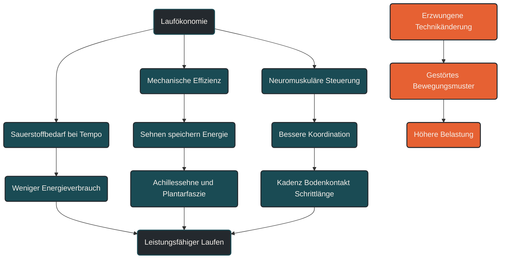

# Laufökonomie

Laufökonomie beschreibt, wie viel Energie oder Sauerstoff ein Läufer benötigt, um eine bestimmte Geschwindigkeit aufrechtzuerhalten. Im Ausdauersport ist das wichtig, weil zwei Läufer mit ähnlicher VO2max trotzdem unterschiedlich schnell oder lange laufen können. Entscheidend ist nicht nur der Motor, sondern wie effizient Kraft, Technik, Sehnenelastizität und neuromuskuläre Steuerung in Vortrieb umgesetzt werden.

## Was Laufökonomie bedeutet

Laufökonomie ist die Effizienz des Laufens bei einer submaximalen Geschwindigkeit. Ein ökonomischer Läufer verbraucht bei gleichem Tempo weniger Sauerstoff und Energie als ein weniger ökonomischer Läufer.

Das bedeutet: Laufökonomie ist nicht dasselbe wie VO2max. Die VO2max beschreibt das maximale Sauerstoffaufnahmevermögen. Die Laufökonomie beschreibt, wie sparsam der Körper bei einer bestimmten Geschwindigkeit arbeitet.

Für Langstreckenläufer ist das besonders relevant. Wer bei gleichem Tempo weniger Energie verbraucht, kann Reserven länger halten, Glykogen schonen und Ermüdung hinauszögern.

## Warum Laufökonomie wichtig ist

Ausdauerleistung entsteht nicht nur durch ein starkes Herz-Kreislauf-System. Sie entsteht auch dadurch, dass der Körper Bewegung effizient organisiert.

Laufökonomie verbindet physiologische, biomechanische und neuromuskuläre Faktoren. Dazu gehören Muskel-Sehnen-Interaktion, Fußaufsatz, Bodenkontaktzeit, Schrittfrequenz, Körperhaltung, Rumpfstabilität, Kraftübertragung und Ermüdungsresistenz.

Ein Läufer kann eine hohe VO2max haben und trotzdem relativ unökonomisch laufen. Umgekehrt kann ein Läufer mit etwas niedrigerer VO2max durch sehr gute Laufökonomie auf langen Distanzen konkurrenzfähig sein.

## Wie Laufökonomie entsteht

Laufen funktioniert nicht nur durch aktive Muskelarbeit. Ein Teil der Energie wird bei jedem Schritt elastisch gespeichert und wieder freigesetzt. Besonders Sehnen und Faszien wirken dabei wie federnde Strukturen.

Beim Bodenkontakt werden Achillessehne, Plantarfaszie und andere elastische Strukturen gedehnt. In der Abdruckphase kann ein Teil dieser Energie zurückgegeben werden. Je besser dieses Zusammenspiel funktioniert, desto weniger Energie muss rein muskulär erzeugt werden.

Gleichzeitig steuert das Nervensystem, wann Muskeln aktiviert werden, wie stark sie vorspannen und wie stabil Gelenke geführt werden. Gute Laufökonomie ist deshalb nicht nur eine Frage der Technik, sondern auch eine Frage der automatisierten Koordination.

## Zentrale Einflussfaktoren

### Sauerstoffverbrauch bei gleichem Tempo

Der klassische Messwert der Laufökonomie ist der Sauerstoffverbrauch bei einer definierten Geschwindigkeit. Je niedriger der Sauerstoffbedarf bei gleichem Tempo, desto ökonomischer ist der Laufstil.

Solche Messungen erfolgen meist in der Leistungsdiagnostik auf dem Laufband. Für die Alltagspraxis reicht oft die Beobachtung, ob sich ein bestimmtes Tempo bei gleicher Herzfrequenz oder gleichem Belastungsempfinden über Wochen leichter anfühlt.

### Sehnenelastizität

Sehnen können elastische Energie speichern und wieder abgeben. Besonders die Achillessehne spielt beim Laufen eine große Rolle.

Eine gut angepasste Muskel-Sehnen-Einheit kann die Kraftübertragung effizienter machen. Dafür braucht sie regelmäßige, sinnvoll dosierte Belastung. Zu schnelle Steigerungen können dagegen Sehnen und Wadenmuskulatur überfordern.

### Schrittfrequenz und Schrittlänge

Schrittfrequenz und Schrittlänge beeinflussen, wie Kräfte entstehen und wie viel Bremsarbeit bei jedem Schritt geleistet wird.

Eine leicht höhere Schrittfrequenz kann bei manchen Läufern helfen, den Fuß näher unter dem Körperschwerpunkt aufzusetzen. Das kann Bremskräfte reduzieren. Es gibt aber keine eine perfekte Kadenz für alle Läufer.

### Bodenkontaktzeit

Die Bodenkontaktzeit beschreibt, wie lange der Fuß während eines Schrittes am Boden bleibt. Sehr lange Bodenkontaktzeiten können auf geringe Steifigkeit, Ermüdung oder mangelnde Reaktivität hinweisen.

Kurze Bodenkontaktzeiten sind aber nicht automatisch besser. Entscheidend ist, ob der Läufer stabil, kontrolliert und ökonomisch läuft.

### Fußaufsatz

Fersenlauf, Mittelfußlauf und Vorfußlauf verteilen Belastungen unterschiedlich. Der Fußaufsatz allein entscheidet aber nicht über gute oder schlechte Laufökonomie.

Ein erzwungener Wechsel des Fußaufsatzes kann die Laufökonomie zunächst sogar verschlechtern, weil gewohnte Bewegungsmuster gestört werden. Sinnvoller ist meistens eine vorsichtige Anpassung über Schrittlänge, Kadenz, Kraft und Belastungssteuerung.

### Kraft und neuromuskuläre Kontrolle

Krafttraining, Lauf-ABC und plyometrische Reize können die Laufökonomie unterstützen, wenn sie passend dosiert werden. Sie verbessern nicht nur Muskelkraft, sondern auch Koordination, Steifigkeitsregulation und reaktive Kraftfähigkeit.

Wichtig ist die Einbettung ins Gesamttraining. Zu viel Zusatztraining oder zu intensive Sprungreize können die mechanische Gesamtbelastung erhöhen.

## Bedeutung für Läufer

Für Läufer bedeutet Laufökonomie: Schneller werden entsteht nicht nur durch mehr Ausdauer. Es geht auch darum, mit vorhandener Energie besser umzugehen.

In der Praxis verbessert sich Laufökonomie oft durch langfristiges, regelmäßiges Laufen, kontrollierte Umfangssteigerung, gezielte Temporeize, Krafttraining, Technikübungen und ausreichende Erholung. Viele Anpassungen passieren unbewusst, weil das Nervensystem Bewegungen mit der Zeit effizienter organisiert.

Besonders wichtig ist Geduld. Laufökonomie lässt sich nicht durch eine einzelne Technikregel erzwingen. Wer plötzlich seinen Laufstil, Fußaufsatz oder die Kadenz stark verändert, kann Belastungen ungünstig verschieben.

## Häufige Fehler

Ein häufiger Fehler ist die Annahme, Laufökonomie sei nur Lauftechnik. Tatsächlich ist sie ein Zusammenspiel aus Stoffwechsel, Sehnenfunktion, Kraft, Koordination, Ermüdung und Bewegungsausführung.

Ein zweiter Fehler ist die pauschale Umstellung auf Vorfußlauf. Das kann die Belastung auf Wade, Achillessehne und Fuß deutlich erhöhen und ist nicht automatisch ökonomischer.

Ein dritter Fehler ist, Laufökonomie nur an der Optik zu beurteilen. Ein Laufstil kann ungewohnt aussehen und trotzdem für den jeweiligen Läufer effizient sein.

## Praktische Einordnung

Laufökonomie ist ein zentraler Leistungsfaktor im Ausdauersport. Sie erklärt, warum nicht nur VO2max, Schwellenleistung und Trainingsumfang zählen, sondern auch die Frage, wie effizient der Körper Bewegung erzeugt.

Für die Praxis bedeutet das: Laufökonomie verbessert man am besten langfristig. Regelmäßiges Laufen, sinnvolle Intensitätsverteilung, Krafttraining, Technikreize und Erholung wirken zusammen. Radikale Technikänderungen sollten vorsichtig eingesetzt werden.

Der wichtigste Merksatz lautet: Laufökonomie bedeutet, bei gleichem Tempo weniger Energie zu verbrauchen, ohne den Körper durch erzwungene Technikänderungen unnötig zu belasten.

----

----

## Häufige Fragen zu Laufökonomie

### Was ist Laufökonomie einfach erklärt?

Laufökonomie beschreibt, wie viel Sauerstoff oder Energie ein Läufer benötigt, um eine bestimmte Geschwindigkeit zu laufen. Je weniger Energie bei gleichem Tempo benötigt wird, desto ökonomischer ist der Lauf.

### Ist Laufökonomie dasselbe wie VO2max?

Nein. Die VO2max beschreibt die maximale Sauerstoffaufnahme. Die Laufökonomie beschreibt, wie effizient dieser Sauerstoff bei submaximalem Tempo in Vortrieb umgesetzt wird.

### Warum ist Laufökonomie für Langstreckenläufer wichtig?

Auf langen Strecken entscheidet nicht nur die maximale Leistungsfähigkeit, sondern auch der Energieverbrauch. Eine gute Laufökonomie kann helfen, Ermüdung hinauszuzögern und ein Tempo länger stabil zu halten.

### Kann man Laufökonomie trainieren?

Ja, aber meist langfristig. Regelmäßiges Lauftraining, Krafttraining, Technikübungen, plyometrische Reize, passende Intensitätsverteilung und Erholung können die Laufökonomie unterstützen.

### Ist Vorfußlauf automatisch ökonomischer?

Nein. Ein anderer Fußaufsatz ist nicht automatisch besser. Ein erzwungener Wechsel kann die Laufökonomie zunächst verschlechtern und Belastung auf Wade, Achillessehne und Fuß verlagern.

### Woran erkennt man eine bessere Laufökonomie?

Hinweise können ein niedrigerer Puls bei gleichem Tempo, ein geringeres Belastungsempfinden, stabilere Technik bei Ermüdung oder bessere Leistungsdiagnostik-Werte bei submaximaler Geschwindigkeit sein.

----

*Hinweis: Dieser Artikel dient der allgemeinen Information und ersetzt keine medizinische oder therapeutische Beratung. Mehr dazu im [**Gesundheits- und Quellenhinweis**](/ausdauersport/disclaimer/).*

