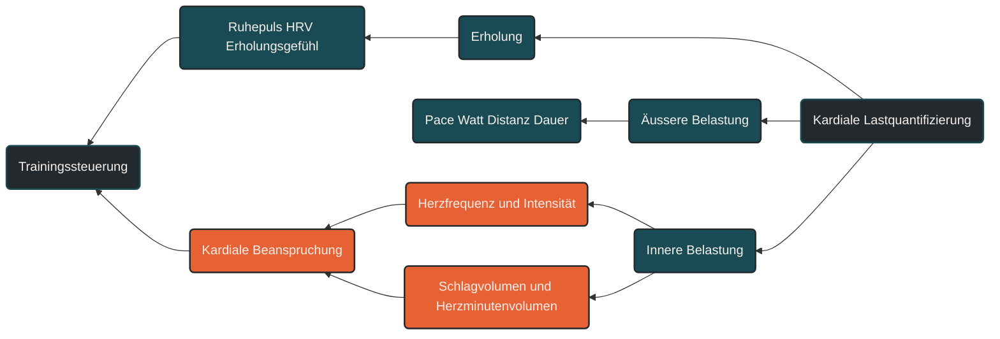

# Kardiale Lastquantifizierung

Kardiale Lastquantifizierung beschreibt, wie die Belastung des Herz-Kreislauf-Systems während des Trainings eingeordnet wird. Im Ausdauertraining ist das wichtig, weil nicht nur Tempo oder Kilometer zählen, sondern auch Herzfrequenz, Dauer, Intensität, Erholung und individuelle Reaktion. Entscheidend ist, zwischen äußerer Trainingsleistung und innerer kardialer Beanspruchung zu unterscheiden.

## Was kardiale Lastquantifizierung bedeutet

Kardiale Lastquantifizierung versucht zu erfassen, wie stark ein Training das Herz tatsächlich beansprucht. Dabei geht es nicht nur darum, wie schnell jemand läuft oder wie viele Kilometer absolviert wurden. Entscheidend ist, wie das Herz auf diese Belastung reagiert.

Eine lockere Einheit kann äußerlich einfach aussehen, aber bei Hitze, Müdigkeit, Dehydrierung oder Infektbeginn eine deutlich höhere Herzfrequenz auslösen. Umgekehrt kann eine trainierte Person bei gleichem Tempo eine geringere kardiale Belastung zeigen, weil Schlagvolumen, Blutverteilung und aerobe Effizienz besser angepasst sind.

Kardiale Last ist deshalb keine einzelne Zahl. Sie entsteht aus dem Zusammenspiel von Herzfrequenz, Trainingsdauer, Intensität, Erholungszustand und langfristiger Anpassung.

## Warum kardiale Lastquantifizierung wichtig ist

Im Ausdauertraining wird Belastung häufig über Pace, Watt, Distanz oder Trainingszeit beschrieben. Diese Werte zeigen die äußere Belastung. Sie sagen aber nur begrenzt, wie stark das Herz-Kreislauf-System intern arbeiten musste.

Die Herzfrequenz ist dafür ein wichtiger Marker, weil sie zeigt, wie häufig das Herz pro Minute schlagen muss, um den Körper mit Sauerstoff und Nährstoffen zu versorgen. Zusammen mit der Trainingsdauer entsteht daraus ein besseres Bild der kardiovaskulären Beanspruchung.

Gerade im Ausdauertraining ist das wichtig, weil viele Anpassungen nicht durch einzelne harte Reize entstehen, sondern durch wiederholte, ausreichend lange und gut verträgliche Belastungen. Niedrige und moderate Intensitäten können dabei eine große Rolle spielen, weil sie über längere Zeit ein erhöhtes Herzminutenvolumen und einen stabilen venösen Rückstrom erzeugen.

## Wie kardiale Last im Training entsteht

Während des Laufens steigt der Sauerstoffbedarf der arbeitenden Muskulatur. Das Herz reagiert darauf, indem es häufiger schlägt und pro Schlag mehr Blut auswirft. Aus Herzfrequenz und Schlagvolumen ergibt sich das Herzminutenvolumen.

Bei niedriger bis moderater Intensität kann das Herz diese Belastung meist ökonomisch bewältigen. Die Füllung der Herzkammern bleibt ausreichend, der venöse Rückstrom ist stabil und das Schlagvolumen kann gut genutzt werden.

Bei sehr hoher Intensität steigt die Herzfrequenz stark an. Die Diastole, also die Füllungsphase des Herzens, wird kürzer. Das Herz muss mehr Arbeit pro Zeit leisten. Solche Reize können leistungsphysiologisch sinnvoll sein, erzeugen aber eine andere Form der Belastung als lange, ruhige Ausdauereinheiten.

Kardiale Lastquantifizierung hilft deshalb zu verstehen, ob eine Einheit vor allem eine lange volumetrische Belastung, eine intensive Druck- und Frequenzbelastung oder eine gemischte Beanspruchung darstellt.

## Zentrale Einflussfaktoren

### Herzfrequenz

Die Herzfrequenz ist der am einfachsten zugängliche Marker für kardiale Beanspruchung. Sie steigt mit Intensität, Temperatur, Stress, Müdigkeit und Flüssigkeitsverlust. Deshalb sollte sie nie isoliert betrachtet werden.

Wichtig ist nicht nur der absolute Wert, sondern auch der Verlauf. Eine ungewöhnlich hohe Herzfrequenz bei lockerem Tempo kann auf Ermüdung, Hitze, mangelnde Erholung oder eine beginnende Belastungsintoleranz hinweisen.

### Trainingsdauer

Die Dauer einer Einheit bestimmt, wie lange das Herz-Kreislauf-System erhöht arbeiten muss. Eine lange lockere Einheit kann dadurch eine große kumulative kardiale Last erzeugen, obwohl die Intensität niedrig bleibt.

Das ist für Ausdaueranpassungen wichtig, weil wiederholte, gut dosierte Volumenbelastungen eine Grundlage für ökonomischere Herz-Kreislauf-Arbeit bilden können.

### Intensität

Hohe Intensitäten erhöhen die kardiale Beanspruchung pro Minute deutlich. Herzfrequenz, Blutdruckreaktion, Atemarbeit und sympathische Aktivierung steigen an.

Das macht intensive Einheiten nicht grundsätzlich schlecht. Sie sollten aber nicht nur nach Pace oder Intervalllänge bewertet werden, sondern auch nach ihrer inneren Belastung und nach der benötigten Erholung.

### Herzfrequenzzonen

Herzfrequenzzonen helfen, Belastungen grob zu ordnen. Niedrige Zonen stehen eher für extensive, länger durchhaltbare Belastungen. Hohe Zonen stehen eher für intensive Reize mit höherer akuter Beanspruchung.

Die Einteilung ist nur sinnvoll, wenn die individuellen Schwellen und die maximale Herzfrequenz realistisch eingeschätzt werden. Standardformeln können für einzelne Personen deutlich danebenliegen.

### Herzfrequenzdrift

Herzfrequenzdrift beschreibt den Anstieg der Herzfrequenz bei gleichbleibender äußerer Belastung. Sie kann bei langen Einheiten auftreten, besonders bei Hitze, Flüssigkeitsverlust, unzureichender Kohlenhydratzufuhr oder wachsender Ermüdung.

Für Läufer ist die Drift ein wichtiger Hinweis: Wenn das Tempo gleich bleibt, die Herzfrequenz aber deutlich steigt, nimmt die innere Belastung zu.

### Erholung und autonome Regulation

Die kardiale Last endet nicht mit dem Training. Auch die Erholung danach zeigt, wie stark der Organismus beansprucht wurde. Eine langsamere Herzfrequenzrückkehr, ungewöhnlich niedrige HRV oder ein erhöhter Ruhepuls können Hinweise auf unvollständige Erholung sein.

Solche Marker ersetzen keine Diagnostik, können aber helfen, Belastung und Erholung im Alltag besser einzuordnen.

## Bedeutung für Läufer

Für Läufer ist kardiale Lastquantifizierung besonders hilfreich, weil Lauftraining oft über Pace und Kilometer gesteuert wird. Diese Werte sind praktisch, aber sie erfassen nicht die ganze Belastung.

Ein Dauerlauf bei kühlem Wetter auf flacher Strecke kann kardial deutlich anders wirken als derselbe Lauf bei Hitze, Schlafmangel oder auf welligem Profil. Auch ein lockeres Tempo kann dann intern anstrengender werden.

Kardiale Lastquantifizierung hilft, solche Unterschiede sichtbar zu machen. Sie erklärt, warum manche Einheiten trotz ähnlicher Pace mehr Erholung benötigen und warum ein Trainingstag nicht nur nach Distanz bewertet werden sollte.

Für den langfristigen Aufbau ist vor allem wichtig, dass intensive Reize und umfangreiche Belastungen nicht unkontrolliert aufeinandertreffen. Ein gut gesteuertes Ausdauertraining nutzt sowohl ruhige als auch intensive Einheiten, aber ordnet sie nach ihrer tatsächlichen Beanspruchung ein.

## Häufige Fehler

Ein häufiger Fehler besteht darin, Herzfrequenzdaten als absolut objektive Wahrheit zu betrachten. Herzfrequenz ist hilfreich, aber sie wird von vielen Faktoren beeinflusst. Sensorfehler, Temperatur, Koffein, Stress, Schlaf und Flüssigkeitshaushalt können die Werte verändern.

Ein zweiter Fehler ist, jede hohe Herzfrequenz automatisch als gutes Training zu interpretieren. Eine hohe Herzfrequenz zeigt zunächst nur eine hohe innere Beanspruchung. Ob dieser Reiz sinnvoll war, hängt vom Ziel der Einheit, vom Trainingszustand und von der Erholung ab.

Ein dritter Fehler ist, niedrige Intensitäten zu unterschätzen. Ruhige Einheiten wirken nicht spektakulär, können aber über Dauer und Wiederholung eine wichtige Grundlage für kardiale Ökonomie und Ausdauerleistungsfähigkeit bilden.

## Praktische Einordnung

Kardiale Lastquantifizierung ist kein Ersatz für medizinische Diagnostik und keine Garantie für optimale Trainingssteuerung. Sie ist ein Werkzeug, um Training differenzierter zu verstehen.

Sinnvoll ist eine Kombination aus Herzfrequenz, Dauer, subjektivem Belastungsempfinden, Erholungsgefühl und äußerer Leistung. Erst zusammen zeigen diese Werte, ob eine Einheit tatsächlich locker, moderat oder stark belastend war.

Der wichtigste Merksatz lautet: Kardiale Last entsteht nicht nur durch Intensität, sondern durch das Zusammenspiel aus Herzfrequenz, Dauer, Erholung und individueller Reaktion.

----

----

## Häufige Fragen zu Kardiale Lastquantifizierung

### Was ist Kardiale Lastquantifizierung einfach erklärt?

Kardiale Lastquantifizierung beschreibt, wie stark ein Training das Herz-Kreislauf-System beansprucht. Dafür werden nicht nur Tempo oder Kilometer betrachtet, sondern auch Herzfrequenz, Dauer, Intensität, Erholung und individuelle Reaktion.

### Warum reicht Pace allein nicht aus?

Pace zeigt nur die äußere Leistung. Die innere Belastung kann bei gleicher Pace stark unterschiedlich sein, zum Beispiel durch Hitze, Müdigkeit, Stress, Höhenmeter oder Flüssigkeitsverlust.

### Ist eine hohe Herzfrequenz immer ein gutes Zeichen?

Nein. Eine hohe Herzfrequenz zeigt zunächst nur eine hohe Beanspruchung. Ob der Reiz sinnvoll ist, hängt vom Trainingsziel, vom aktuellen Zustand und von der Erholung ab.

### Welche Rolle spielt die Trainingsdauer?

Die Trainingsdauer bestimmt, wie lange das Herz-Kreislauf-System erhöht arbeiten muss. Lange ruhige Einheiten können eine relevante kumulative kardiale Last erzeugen, auch wenn sie sich nicht sehr intensiv anfühlen.

### Was bedeutet Herzfrequenzdrift?

Herzfrequenzdrift bedeutet, dass die Herzfrequenz bei gleichbleibender Belastung allmählich ansteigt. Das kann auf Ermüdung, Hitze, Flüssigkeitsverlust oder steigende innere Beanspruchung hinweisen.

### Ersetzt kardiale Lastquantifizierung eine sportmedizinische Untersuchung?

Nein. Sie hilft bei der Einordnung von Training, ersetzt aber keine medizinische Abklärung, besonders bei Beschwerden, auffälligen Symptomen oder bekannten Herz-Kreislauf-Erkrankungen.

----

*Hinweis: Dieser Artikel dient der allgemeinen Information und ersetzt keine medizinische oder therapeutische Beratung. Mehr dazu im [**Gesundheits- und Quellenhinweis**](/ausdauersport/disclaimer/).*

