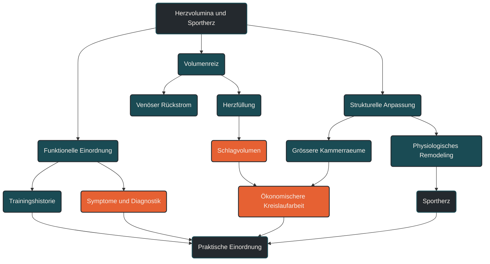

# Herzvolumina und Sportherz

Herzvolumina beschreiben, wie viel Blut die Herzkammern aufnehmen und auswerfen können. Im Ausdauertraining ist das wichtig, weil ein trainiertes Herz bei gleicher Belastung oft ökonomischer arbeitet. Das Sportherz beschreibt dabei eine meist physiologische Anpassung an regelmäßiges Ausdauertraining, muss aber immer von krankhaften Veränderungen unterschieden werden. [[1]](#quelle-1) [[2]](#quelle-2) [[3]](#quelle-3) [[6]](#quelle-6)

## Was Herzvolumina und Sportherz bedeuten

Herzvolumina beschreiben die Füllungs- und Auswurfgrößen des Herzens. Besonders wichtig sind das enddiastolische Volumen, also die Blutmenge in der Herzkammer am Ende der Füllungsphase, und das endsystolische Volumen, also die Restmenge nach der Auswurfphase. [[1]](#quelle-1) [[2]](#quelle-2) [[3]](#quelle-3) [[4]](#quelle-4)

Aus der Differenz dieser beiden Werte ergibt sich das Schlagvolumen. Es beschreibt, wie viel Blut das Herz pro Schlag auswirft. Zusammen mit der Herzfrequenz ergibt sich daraus das Herzminutenvolumen, also die Blutmenge, die pro Minute durch den Kreislauf gepumpt wird. [[1]](#quelle-1) [[4]](#quelle-4) [[7]](#quelle-7)

Das Sportherz ist eine Anpassung des Herzens an langfristiges Training. Bei Ausdauersportlern kann das Herz größere Kammerinnenräume, ein höheres Schlagvolumen und eine niedrigere Ruheherzfrequenz entwickeln. Diese Anpassung wird häufig als physiologisches kardiales Remodeling beschrieben. [[1]](#quelle-1) [[2]](#quelle-2) [[3]](#quelle-3) [[4]](#quelle-4)

Wichtig ist: Ein Sportherz ist nicht einfach ein „größeres Herz“, sondern eine funktionelle Anpassung an wiederholte Belastung. Es muss immer im Zusammenhang mit Trainingshistorie, Körpergröße, Geschlecht, Alter, Symptomen und medizinischer Diagnostik bewertet werden. [[1]](#quelle-1) [[2]](#quelle-2) [[3]](#quelle-3) [[6]](#quelle-6)

## Warum Herzvolumina im Ausdauertraining wichtig sind

Ausdauerleistung hängt nicht nur davon ab, wie viel Sauerstoff die Muskulatur verwerten kann. Sie hängt auch davon ab, wie effektiv das Herz Blut transportiert. Das Herz ist dabei die zentrale Pumpe zwischen Lunge, Blutkreislauf und arbeitender Muskulatur. [[1]](#quelle-1)

Wenn das Schlagvolumen steigt, kann bei gleicher Herzfrequenz mehr Blut pro Minute transportiert werden. Dadurch kann der Körper Sauerstoff und Nährstoffe effizienter bereitstellen. Bei gut trainierten Ausdauersportlern ist deshalb häufig zu beobachten, dass sie bei niedriger bis moderater Belastung mit vergleichsweise niedriger Herzfrequenz laufen können. [[1]](#quelle-1) [[4]](#quelle-4) [[7]](#quelle-7) [[2]](#quelle-2)

Diese Anpassung entsteht nicht durch eine einzelne harte Einheit. Sie entwickelt sich über lange Zeit durch wiederholte Ausdauerbelastungen, ausreichende Regeneration und eine passende Belastungssteuerung. Besonders relevante Reize sind längere Einheiten, bei denen venöser Rückstrom, Füllung der Herzkammern und Herzminutenvolumen über längere Zeit erhöht sind. [[1]](#quelle-1) [[2]](#quelle-2) [[3]](#quelle-3) [[4]](#quelle-4)

## Wie sich das Sportherz anpasst

Beim Ausdauertraining wird das Herz regelmäßig mit einem erhöhten Blutvolumen konfrontiert. Der venöse Rückstrom steigt, die Herzkammern füllen sich stärker und das Herz muss über längere Zeit mehr Blut auswerfen. Dadurch entsteht ein wiederholter Volumenreiz. [[1]](#quelle-1) [[2]](#quelle-2) [[3]](#quelle-3) [[4]](#quelle-4)

Langfristig kann sich die linke Herzkammer an diese Belastung anpassen. Häufig wird dabei eine exzentrische Anpassung beschrieben: Der Innenraum der Herzkammer kann größer werden, während die Wanddicke in einem physiologischen Verhältnis zur Kammergröße bleibt. [[1]](#quelle-1) [[2]](#quelle-2) [[3]](#quelle-3) [[6]](#quelle-6)

Auch die rechte Herzkammer und die Vorhöfe können bei Ausdauerathleten angepasst sein. Das ist wichtig, weil Ausdauerbelastung nicht nur die linke Herzhälfte betrifft. Der gesamte Kreislauf muss mit höherem Blutfluss, erhöhter Atemarbeit und größerer Rückstrommenge umgehen. [[1]](#quelle-1) [[2]](#quelle-2) [[3]](#quelle-3) [[6]](#quelle-6)

Diese Anpassungen sind normalerweise funktionell: Die Pumpleistung bleibt erhalten, die Füllung ist effizient und die Ruheherzfrequenz kann sinken. Gleichzeitig kann die Unterscheidung zwischen sportlicher Anpassung und krankhafter Veränderung anspruchsvoll sein. Deshalb gehören auffällige Befunde immer in eine sportmedizinische oder kardiologische Einordnung. [[1]](#quelle-1) [[4]](#quelle-4) [[7]](#quelle-7)

## Zentrale Einflussfaktoren

### Trainingsumfang

Der Trainingsumfang beeinflusst, wie stark das Herz regelmäßig belastet wird. Wer über Jahre viele Ausdauereinheiten absolviert, setzt andere Reize als jemand, der gelegentlich trainiert. [[1]](#quelle-1) [[2]](#quelle-2) [[6]](#quelle-6)

Entscheidend ist aber nicht nur die Zahl der Kilometer. Auch Dauer, Häufigkeit, Intensitätsverteilung und Erholungsphasen beeinflussen, welche kardialen Anpassungen entstehen. [[1]](#quelle-1) [[2]](#quelle-2) [[6]](#quelle-6)

### Intensität

Niedrige bis moderate Intensitäten erzeugen häufig lange Volumenbelastungen. Das Herz arbeitet über längere Zeit mit erhöhtem Rückstrom und gesteigertem Herzminutenvolumen. [[1]](#quelle-1) [[4]](#quelle-4) [[7]](#quelle-7) [[2]](#quelle-2)

Hohe Intensitäten setzen zusätzlich stärkere Druck-, Frequenz- und Sympathikusreize. Sie können leistungsphysiologisch sinnvoll sein, erzeugen aber eine andere Form der Beanspruchung als ruhige Grundlageneinheiten. [[1]](#quelle-1) [[2]](#quelle-2) [[6]](#quelle-6)

### Schlagvolumen

Das Schlagvolumen ist eine zentrale Größe für die Ausdauerleistung. Wenn das Herz pro Schlag mehr Blut auswerfen kann, muss es bei gleicher Leistung weniger häufig schlagen. [[1]](#quelle-1) [[4]](#quelle-4) [[7]](#quelle-7)

Ein höheres Schlagvolumen kann erklären, warum trainierte Läufer bei lockerem Tempo oft niedrigere Herzfrequenzen zeigen. Das bedeutet aber nicht automatisch, dass jede niedrige Herzfrequenz ein Zeichen guter Fitness ist. Auch Veranlagung, Medikamente, Schlaf, Temperatur und Messfehler spielen eine Rolle. [[1]](#quelle-1) [[4]](#quelle-4) [[7]](#quelle-7)

### Herzfrequenz

Die Herzfrequenz zeigt, wie häufig das Herz pro Minute schlägt. In Verbindung mit dem Schlagvolumen bestimmt sie das Herzminutenvolumen. [[1]](#quelle-1) [[4]](#quelle-4) [[7]](#quelle-7)

Ausdauertraining kann die Ruheherzfrequenz senken, weil das Herz ökonomischer arbeitet und der parasympathische Einfluss zunimmt. Eine sehr niedrige Herzfrequenz ist bei trainierten Personen nicht automatisch problematisch, sollte bei Symptomen wie Schwindel, Ohnmacht, Brustdruck oder ungewöhnlicher Leistungsschwäche aber medizinisch abgeklärt werden. [[1]](#quelle-1) [[4]](#quelle-4) [[7]](#quelle-7) [[2]](#quelle-2)

### Körpergröße, Geschlecht und Alter

Herzgrößen und Herzvolumina hängen nicht nur vom Training ab. Körpergröße, Körperoberfläche, Geschlecht und Alter beeinflussen die Messwerte ebenfalls. Deshalb werden sportkardiologische Befunde häufig indexiert, also auf Körpergröße oder Körperoberfläche bezogen. [[1]](#quelle-1) [[2]](#quelle-2) [[3]](#quelle-3) [[6]](#quelle-6)

Das ist wichtig, weil ein absolut größerer Herzinnenraum bei einer großen Person anders einzuordnen ist als bei einer kleinen Person. Ohne Kontext sind Einzelwerte nur begrenzt aussagekräftig. [[1]](#quelle-1)

### Diagnostische Einordnung

Herzvolumina werden meist über Echokardiographie oder kardiales MRT beurteilt. Dabei werden nicht nur Größen gemessen, sondern auch Funktion, Wandbewegung, Klappen, Rhythmus und mögliche Hinweise auf krankhafte Veränderungen betrachtet. [[1]](#quelle-1) [[2]](#quelle-2) [[3]](#quelle-3)

Gerade bei Ausdauersportlern ist diese Einordnung wichtig, weil physiologische Anpassungen teilweise ähnlich aussehen können wie frühe krankhafte Veränderungen. Die Diagnose entsteht deshalb nie nur aus einem einzelnen Messwert, sondern aus dem Gesamtbild. [[1]](#quelle-1)

## Bedeutung für Läufer

Für Läufer ist das Thema wichtig, weil Lauftraining das Herz-Kreislauf-System regelmäßig fordert. Lange Dauerläufe, Tempodauerläufe, Intervalle und Wettkämpfe erzeugen unterschiedliche kardiale Reize. [[1]](#quelle-1) [[2]](#quelle-2) [[6]](#quelle-6)

Ein gut angepasstes Herz kann bei lockeren Läufen ökonomisch arbeiten. Das zeigt sich häufig in stabiler Herzfrequenz, guter Erholungsfähigkeit und der Fähigkeit, längere Belastungen ohne übermäßigen Drift zu bewältigen. [[1]](#quelle-1) [[4]](#quelle-4) [[7]](#quelle-7) [[2]](#quelle-2)

Gleichzeitig bedeutet ein Sportherz nicht, dass mehr Training automatisch besser ist. Sehr hohe Umfänge, zu wenig Regeneration, Infekte, unklare Beschwerden oder stark belastende Wettkampfphasen sollten ernst genommen werden. Kardiale Anpassung ist sinnvoll, wenn Belastung und Erholung langfristig zusammenpassen. [[1]](#quelle-1) [[2]](#quelle-2) [[3]](#quelle-3) [[6]](#quelle-6)

Für die Trainingspraxis heißt das: Herzfrequenz, Erholungsgefühl, Belastungsverlauf und subjektive Wahrnehmung sollten gemeinsam betrachtet werden. Einzelne Werte erklären selten das ganze Bild. [[1]](#quelle-1) [[4]](#quelle-4) [[7]](#quelle-7) [[2]](#quelle-2)

## Häufige Fehler

Ein häufiger Fehler ist, das Sportherz pauschal als Risiko oder pauschal als Qualitätsmerkmal zu betrachten. Beides ist zu einfach. Sportliche Herzanpassung kann physiologisch und leistungsfördernd sein, muss aber im richtigen Kontext bewertet werden. [[1]](#quelle-1) [[2]](#quelle-2) [[3]](#quelle-3)

Ein zweiter Fehler ist, große Herzvolumina automatisch mit besserer Leistung gleichzusetzen. Ausdauerleistung hängt auch von Sauerstoffaufnahme, Kapillarisierung, Mitochondrien, Laufökonomie, Schwellenleistung, Ermüdungsresistenz und Trainingssteuerung ab. [[1]](#quelle-1) [[2]](#quelle-2) [[3]](#quelle-3) [[6]](#quelle-6)

Ein dritter Fehler ist, Warnzeichen zu ignorieren. Brustschmerz, Druckgefühl, ungeklärte Luftnot, Herzstolpern mit Beschwerden, Schwindel oder Ohnmacht unter Belastung gehören nicht in die normale Trainingsinterpretation. Solche Zeichen sollten medizinisch abgeklärt werden. [[1]](#quelle-1) [[2]](#quelle-2) [[6]](#quelle-6) [[3]](#quelle-3)

Ein vierter Fehler ist, Messwerte ohne Verlauf zu bewerten. Ein einmaliger Befund ist weniger aussagekräftig als ein sauber dokumentierter Verlauf mit Trainingshistorie, Symptomen, Leistungsentwicklung und ärztlicher Einordnung. [[1]](#quelle-1) [[2]](#quelle-2) [[6]](#quelle-6) [[3]](#quelle-3)

## Praktische Einordnung

Herzvolumina und Sportherz helfen zu verstehen, warum langfristiges Ausdauertraining das Herz-Kreislauf-System ökonomischer machen kann. Sie erklären aber nicht allein, ob jemand gesund, leistungsfähig oder optimal trainiert ist. [[1]](#quelle-1) [[2]](#quelle-2) [[3]](#quelle-3) [[6]](#quelle-6)

Sinnvoll ist eine ruhige Einordnung: Regelmäßiges Ausdauertraining kann zu größeren Herzkammern, höherem Schlagvolumen und niedrigerer Ruheherzfrequenz beitragen. Diese Anpassungen sind häufig physiologisch, solange Funktion, Symptome und Gesamtbild unauffällig sind. [[1]](#quelle-1) [[2]](#quelle-2) [[3]](#quelle-3) [[4]](#quelle-4)

Der wichtigste Merksatz lautet: Das Sportherz ist eine Anpassung an wiederholte Belastung, aber seine Bewertung gehört immer in den Zusammenhang von Training, Funktion, Symptomen und medizinischer Einordnung. [[1]](#quelle-1) [[2]](#quelle-2) [[3]](#quelle-3) [[6]](#quelle-6)

----

----

## Häufige Fragen zu Herzvolumina und Sportherz

### Was sind Herzvolumina einfach erklärt?

Herzvolumina beschreiben, wie viel Blut die Herzkammern aufnehmen und auswerfen können. Besonders wichtig sind das Füllungsvolumen vor dem Herzschlag, das Restvolumen nach dem Herzschlag und das daraus entstehende Schlagvolumen. [[1]](#quelle-1) [[2]](#quelle-2) [[3]](#quelle-3) [[4]](#quelle-4)

### Was bedeutet Sportherz?

Sportherz beschreibt eine meist physiologische Anpassung des Herzens an regelmäßiges Training. Bei Ausdauersportlern können größere Herzkammern, ein höheres Schlagvolumen und eine niedrigere Ruheherzfrequenz auftreten. [[1]](#quelle-1) [[2]](#quelle-2) [[3]](#quelle-3) [[4]](#quelle-4)

### Ist ein Sportherz gefährlich?

Ein Sportherz ist häufig eine normale Anpassung an Training. Es muss aber von krankhaften Veränderungen unterschieden werden. Deshalb sind Symptome, Familiengeschichte, Trainingshistorie und kardiologische Diagnostik wichtig. [[1]](#quelle-1) [[2]](#quelle-2) [[3]](#quelle-3) [[6]](#quelle-6)

### Warum haben Ausdauersportler oft eine niedrigere Ruheherzfrequenz?

Ein trainiertes Herz kann pro Schlag häufig mehr Blut auswerfen. Dadurch muss es in Ruhe oft weniger häufig schlagen, um den Körper ausreichend zu versorgen. [[1]](#quelle-1)

### Sind größere Herzvolumina automatisch besser?

Nein. Größere Herzvolumina können eine sinnvolle Anpassung sein, erklären aber nicht allein die Leistungsfähigkeit. Auch Laufökonomie, Stoffwechsel, Schwellenleistung, Regeneration und Trainingssteuerung sind wichtig. [[1]](#quelle-1) [[2]](#quelle-2) [[3]](#quelle-3) [[6]](#quelle-6)

### Wann sollte man Herzbeschwerden abklären lassen?

Brustschmerz, ungeklärte Luftnot, Ohnmacht, Schwindel unter Belastung, auffälliges Herzstolpern oder plötzlicher Leistungsabfall sollten medizinisch abgeklärt werden. Training sollte solche Warnzeichen nicht einfach überdecken. [[1]](#quelle-1) [[2]](#quelle-2) [[6]](#quelle-6) [[3]](#quelle-3)

----

## Quellen

### Quelle 1

[1] Flanagan, H., Cooper, R., George, K. P., Augustine, D. X., Malhotra, A., Paton, M. F., Robinson, S. & Oxborough, D. (2023): [The athlete’s heart: insights from echocardiography](https://link.springer.com/article/10.1186/s44156-023-00027-8). Echo Research & Practice.

### Quelle 2

[2] Pelliccia, A., Sharma, S., Gati, S., Bäck, M., Börjesson, M., Caselli, S., Collet, J.-P., Corrado, D., Drezner, J. A. et al. (2020): [2020 ESC Guidelines on Sports Cardiology and Exercise in Patients with Cardiovascular Disease](https://www.escardio.org/guidelines/clinical-practice-guidelines/all-esc-practice-guidelines/sports-cardiology-and-exercise/). European Society of Cardiology.

### Quelle 3

[3] Kim, J. H., Baggish, A. L., Levine, B. D., Ackerman, M. J., Day, S. M., Dineen, E. H., Guseh, J. S. II, La Gerche, A., Lampert, R. et al. (2025): [Clinical Considerations for Competitive Sports Participation for Athletes With Cardiovascular Abnormalities](https://www.sciencedirect.com/science/article/pii/S073510972410722X). Journal of the American College of Cardiology.

### Quelle 4

[4] Rowland, T. (2009): [Endurance Athletes’ Stroke Volume Response to Progressive Exercise: A Critical Review](https://link.springer.com/article/10.2165/00007256-200939080-00005). Sports Medicine.

### Quelle 5

[5] Janik, M., Blachut, D., Czogalik, Ł., Tomasik, A. R., Wojciechowska, C. & Kukulski, T. (2025): [Adaptive Changes in Endurance Athletes: A Review of Molecular, Echocardiographic and Electrocardiographic Findings](https://www.mdpi.com/1422-0067/26/17/8329). International Journal of Molecular Sciences.

### Quelle 6

[6] Bourdon, P. C., Cardinale, M., Murray, A. et al. (2017): [Monitoring Athlete Training Loads: Consensus Statement](https://journals.humankinetics.com/view/journals/ijspp/12/s2/article-pS2-161.xml). International Journal of Sports Physiology and Performance.

### Quelle 7

[7] Achten, J. & Jeukendrup, A. E. (2003): [Heart Rate Monitoring: Applications and Limitations](https://link.springer.com/article/10.2165/00007256-200333070-00004). Sports Medicine.

----

*Hinweis: Dieser Artikel dient der allgemeinen Information und ersetzt keine medizinische oder therapeutische Beratung. Mehr dazu im [**Gesundheits- und Quellenhinweis**](/ausdauersport/disclaimer/).*
