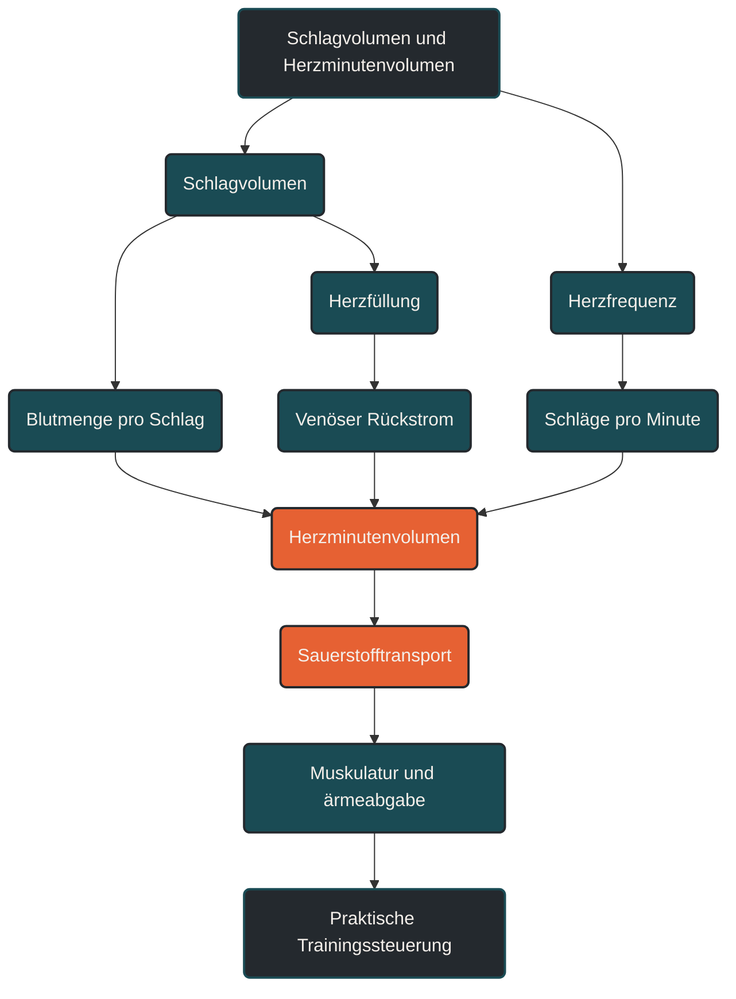

# Schlagvolumen und Herzminutenvolumen

Das Schlagvolumen beschreibt, wie viel Blut das Herz mit einem einzelnen Herzschlag auswirft. Das Herzminutenvolumen beschreibt, wie viel Blut pro Minute durch den Kreislauf gepumpt wird. Im Ausdauertraining ist das wichtig, weil nicht nur die Herzfrequenz entscheidet, sondern auch, wie effektiv jeder Herzschlag Blut, Sauerstoff und Nährstoffe transportiert.

## Was Schlagvolumen und Herzminutenvolumen bedeuten

Das Schlagvolumen ist die Blutmenge, die eine Herzkammer mit einem Schlag auswirft. Meist ist damit die linke Herzkammer gemeint, weil sie das sauerstoffreiche Blut in den Körperkreislauf pumpt.

Das Herzminutenvolumen ergibt sich aus Schlagvolumen und Herzfrequenz:

Herzminutenvolumen = Schlagvolumen × Herzfrequenz

Wenn das Herz pro Schlag mehr Blut auswerfen kann, muss es für die gleiche Kreislaufleistung nicht zwingend so häufig schlagen. Genau deshalb kann ein gut trainiertes Herz bei niedriger bis moderater Belastung oft ökonomischer arbeiten.

Dabei ist wichtig: Eine niedrige Herzfrequenz allein erklärt nicht automatisch Fitness. Entscheidend ist das Zusammenspiel aus Schlagvolumen, Herzfrequenz, Blutvolumen, Gefäßfunktion, Sauerstoffaufnahme und muskulärer Verwertung.

## Warum Schlagvolumen und Herzminutenvolumen wichtig sind

Beim Ausdauertraining steigt der Sauerstoffbedarf der arbeitenden Muskulatur. Der Körper reagiert darauf, indem Atmung, Blutfluss und Herzarbeit zunehmen.

Das Herzminutenvolumen ist dabei eine zentrale Transportgröße. Es bestimmt, wie viel Blut pro Minute durch den Körper bewegt wird. Je höher die Belastung, desto mehr Blut muss zu den arbeitenden Muskeln, zur Haut für die Wärmeabgabe und zu den Organen verteilt werden.

Das Schlagvolumen spielt dabei eine Schlüsselrolle. Ein höheres Schlagvolumen kann helfen, bei gleicher Herzfrequenz mehr Blut zu transportieren. Bei Ausdauerathleten ist das einer der Gründe, warum sie lockere Belastungen häufig mit niedrigerer Herzfrequenz absolvieren können als untrainierte Personen.

Für die Trainingspraxis bedeutet das: Herzfrequenz ist sichtbar und leicht messbar, aber sie ist nur ein Teil der Kreislaufleistung. Zwei Personen können mit gleicher Herzfrequenz laufen, aber trotzdem ein unterschiedliches Herzminutenvolumen und eine unterschiedliche innere Belastung haben.

## Wie das Schlagvolumen im Training beeinflusst wird

Das Schlagvolumen hängt davon ab, wie gut sich das Herz füllt, wie kräftig es auswirft und gegen welchen Widerstand es arbeiten muss.

Bei niedriger bis moderater Belastung steigt das Schlagvolumen meist deutlich an. Der venöse Rückstrom nimmt zu, die Herzkammern füllen sich stärker und das Herz kann mehr Blut pro Schlag auswerfen.

Bei sehr hoher Belastung steigt vor allem die Herzfrequenz weiter an. Die Füllungszeit des Herzens wird kürzer. Dadurch kann das Schlagvolumen je nach Trainingszustand, Belastungsform und individueller Physiologie ein Plateau erreichen.

Ausdauertraining kann langfristig dazu beitragen, dass das Herz pro Schlag effizienter arbeitet. Das hängt mit besserer Füllung, größerem Blutvolumen, ökonomischerer Herzarbeit und strukturellen Anpassungen des Herz-Kreislauf-Systems zusammen.

## Wie das Herzminutenvolumen im Training steigt

Das Herzminutenvolumen steigt während Belastung, weil Herzfrequenz und Schlagvolumen zunehmen. Zu Beginn einer Belastung reagieren beide Größen deutlich. Bei steigender Intensität wird die weitere Erhöhung des Herzminutenvolumens zunehmend stärker über die Herzfrequenz getragen.

Bei lockeren Dauerläufen ist das Herzminutenvolumen erhöht, aber meist stabil und gut kontrollierbar. Bei Intervallen oder Wettkämpfen steigt es deutlich stärker an, weil die Muskulatur mehr Sauerstoff benötigt und Stoffwechselprodukte schneller abtransportiert werden müssen.

Das Herzminutenvolumen erklärt deshalb, warum Ausdauertraining nicht nur eine muskuläre Belastung ist. Es ist immer auch eine Kreislaufbelastung. Der Körper muss nicht nur Energie bereitstellen, sondern diese Energieversorgung auch über Blutfluss und Sauerstofftransport absichern.

## Zentrale Einflussfaktoren

### Herzfrequenz

Die Herzfrequenz bestimmt, wie oft das Herz pro Minute schlägt. Sie ist leicht messbar und deshalb im Training sehr verbreitet.

Sie zeigt aber nicht allein, wie viel Blut tatsächlich transportiert wird. Wenn das Schlagvolumen höher ist, kann bei gleicher Herzfrequenz ein größeres Herzminutenvolumen entstehen.

### Füllung des Herzens

Damit das Herz viel Blut auswerfen kann, muss es sich vorher ausreichend füllen. Diese Füllung hängt unter anderem vom venösen Rückstrom, vom Blutvolumen, von der Körperposition und von der Belastungsform ab.

Beim Laufen unterstützen Muskelpumpe und Atmung den Rückstrom des Blutes zum Herzen. Gleichzeitig kann Hitze, Flüssigkeitsverlust oder starke Ermüdung die Kreislaufbelastung erhöhen.

### Trainingszustand

Ein gut trainierter Ausdauerathlet kann bei gleicher Belastung häufig ein höheres Schlagvolumen und eine niedrigere Herzfrequenz zeigen. Das bedeutet nicht, dass das Herz weniger arbeitet, sondern dass es effizienter arbeiten kann.

Bei untrainierten Personen wird eine steigende Belastung oft stärker über die Herzfrequenz kompensiert, weil das Schlagvolumen weniger ausgeprägt angepasst ist.

### Intensität

Mit zunehmender Intensität steigt der Bedarf an Sauerstofftransport. Bei niedriger und moderater Intensität können Schlagvolumen und Herzfrequenz gemeinsam ansteigen.

Bei sehr hoher Intensität wird die weitere Steigerung der Kreislaufleistung zunehmend über die Herzfrequenz getragen. Das macht intensive Einheiten kardial deutlich anspruchsvoller.

### Flüssigkeitshaushalt und Hitze

Flüssigkeitsverlust und Hitze können das Herz-Kreislauf-System zusätzlich belasten. Wenn weniger Blutplasma verfügbar ist oder mehr Blut zur Haut umverteilt werden muss, kann die Herzfrequenz steigen, obwohl Tempo oder Leistung gleich bleiben.

Das ist ein Grund, warum sich ein lockerer Lauf bei Hitze deutlich anstrengender anfühlen kann als derselbe Lauf bei kühlen Bedingungen.

## Bedeutung für Läufer

Für Läufer hilft das Thema, Herzfrequenzdaten besser einzuordnen. Eine steigende Herzfrequenz bedeutet nicht automatisch, dass das Training falsch ist. Sie kann zeigen, dass der Körper mehr Kreislaufleistung bereitstellen muss.

Bei gut aufgebautem Ausdauertraining kann sich die Kreislaufarbeit ökonomisieren. Das zeigt sich oft darin, dass lockere Läufe bei gleicher Pace mit niedrigerer Herzfrequenz möglich werden oder dass die Herzfrequenz bei längeren Belastungen stabiler bleibt.

Besonders relevant ist das bei langen Läufen. Dort kann die Herzfrequenz trotz gleicher Pace langsam ansteigen. Das kann mit Ermüdung, Hitze, Flüssigkeitsverlust oder zunehmender innerer Belastung zusammenhängen.

Für die Praxis ist deshalb nicht nur der einzelne Herzfrequenzwert wichtig, sondern der Verlauf: Wie schnell steigt die Herzfrequenz? Bleibt sie stabil? Wie fühlt sich die Belastung an? Wie schnell erholt sich der Körper danach?

## Häufige Fehler

Ein häufiger Fehler ist, Herzfrequenz und Herzminutenvolumen gleichzusetzen. Die Herzfrequenz zeigt nur die Schlagzahl. Das Herzminutenvolumen hängt zusätzlich vom Schlagvolumen ab.

Ein zweiter Fehler ist, eine niedrige Herzfrequenz immer als Zeichen guter Fitness zu bewerten. Sie kann ein Hinweis auf gute Ausdaueranpassung sein, aber auch durch Veranlagung, Medikamente, Müdigkeit oder andere Faktoren beeinflusst werden.

Ein dritter Fehler ist, nur nach Pace zu trainieren. Bei gleicher Pace kann die innere Kreislaufbelastung sehr unterschiedlich sein, zum Beispiel durch Hitze, Schlafmangel, Stress, Höhenmeter oder unvollständige Erholung.

Ein vierter Fehler ist, Warnzeichen zu ignorieren. Brustdruck, ungeklärte Luftnot, Schwindel, Ohnmacht oder auffälliges Herzstolpern unter Belastung sollten nicht als normales Trainingsthema abgetan werden.

## Praktische Einordnung

Schlagvolumen und Herzminutenvolumen erklären, warum Ausdauertraining mehr ist als eine bestimmte Pace oder Distanz. Sie zeigen, wie das Herz den erhöhten Sauerstoffbedarf des Körpers abdeckt.

Für Läufer ist die Kombination aus Herzfrequenz, Belastungsgefühl, Pace, Dauer und Erholung besonders hilfreich. So lässt sich besser erkennen, ob eine Einheit wirklich locker war oder ob die innere Belastung höher lag als geplant.

Der wichtigste Merksatz lautet: Die Herzfrequenz zeigt, wie oft das Herz schlägt; das Schlagvolumen zeigt, wie viel pro Schlag bewegt wird; das Herzminutenvolumen zeigt, wie viel Blut pro Minute tatsächlich transportiert wird.

----

## Häufige Fragen zu Schlagvolumen und Herzminutenvolumen

### Was ist das Schlagvolumen einfach erklärt?

Das Schlagvolumen ist die Blutmenge, die das Herz mit einem einzelnen Herzschlag auswirft. Es zeigt, wie viel Blut pro Schlag in den Kreislauf gelangt.

### Was ist das Herzminutenvolumen?

Das Herzminutenvolumen beschreibt, wie viel Blut das Herz pro Minute durch den Körper pumpt. Es ergibt sich aus Schlagvolumen mal Herzfrequenz.

### Warum ist das für Ausdauertraining wichtig?

Ausdauertraining erhöht den Sauerstoffbedarf der Muskulatur. Schlagvolumen und Herzminutenvolumen erklären, wie das Herz diesen Bedarf über Blutfluss und Sauerstofftransport abdeckt.

### Ist eine niedrige Herzfrequenz immer besser?

Nein. Eine niedrige Herzfrequenz kann auf gute Ausdaueranpassung hinweisen, ist aber nicht automatisch ein Qualitätsmerkmal. Sie muss immer im Zusammenhang mit Leistung, Wohlbefinden, Erholung und möglichen Symptomen betrachtet werden.

### Warum steigt die Herzfrequenz bei gleicher Pace manchmal an?

Das kann durch Herzfrequenzdrift, Hitze, Flüssigkeitsverlust, Ermüdung, Stress oder unvollständige Erholung entstehen. Die äußere Belastung bleibt gleich, aber die innere Kreislaufbelastung steigt.

### Was ist der wichtigste Unterschied zwischen Herzfrequenz und Herzminutenvolumen?

Die Herzfrequenz beschreibt nur, wie oft das Herz schlägt. Das Herzminutenvolumen beschreibt, wie viel Blut pro Minute tatsächlich transportiert wird.

----

*Hinweis: Dieser Artikel dient der allgemeinen Information und ersetzt keine medizinische oder therapeutische Beratung. Mehr dazu im [**Gesundheits- und Quellenhinweis**](/ausdauersport/disclaimer/).*

