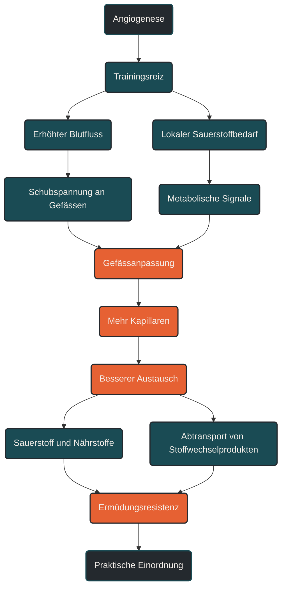

# Angiogenese

Angiogenese beschreibt die Bildung neuer Blutgefäße aus bereits vorhandenen Gefäßen. Im Ausdauertraining ist das wichtig, weil eine bessere Kapillarisierung die Versorgung der Muskulatur mit Sauerstoff und Nährstoffen unterstützen kann. Entscheidend ist, dass Angiogenese nicht isoliert betrachtet wird, sondern zusammen mit Trainingsreiz, Stoffwechsel, Durchblutung und muskulärer Anpassung. [[1]](#quelle-1) [[2]](#quelle-2) [[3]](#quelle-3) [[4]](#quelle-4)

## Was Angiogenese bedeutet

Angiogenese ist ein biologischer Anpassungsprozess, bei dem neue kleine Blutgefäße entstehen. Im Ausdauertraining geht es dabei vor allem um Kapillaren, also sehr feine Gefäße, die Sauerstoff, Nährstoffe und Stoffwechselprodukte zwischen Blut und Muskelzellen austauschen. [[1]](#quelle-1) [[2]](#quelle-2) [[3]](#quelle-3) [[4]](#quelle-4)

Wenn ein Muskel regelmäßig arbeitet, steigt sein Bedarf an Sauerstoff und Energie. Gleichzeitig entstehen lokale Signale, die dem Gewebe zeigen: Hier wird mehr Austauschkapazität benötigt. Als Reaktion kann sich das Gefäßnetz langfristig anpassen. [[1]](#quelle-1) [[2]](#quelle-2) [[3]](#quelle-3) [[4]](#quelle-4)

Für die Ausdauerleistung ist das relevant, weil die Muskulatur nicht nur Sauerstoff aufnehmen muss. Der Sauerstoff muss auch über Blutgefäße an die arbeitenden Zellen herangebracht werden. Eine bessere Kapillarisierung kann diesen Weg verkürzen und den Austausch zwischen Blut und Muskel erleichtern. [[1]](#quelle-1) [[2]](#quelle-2) [[3]](#quelle-3) [[4]](#quelle-4)

## Warum Angiogenese im Ausdauertraining wichtig ist

Ausdauertraining verbessert nicht nur Herz, Lunge und Stoffwechsel. Es verändert auch die Infrastruktur im Muskel. Angiogenese ist ein Teil dieser Infrastruktur. [[1]](#quelle-1) [[2]](#quelle-2) [[3]](#quelle-3) [[4]](#quelle-4)

Je dichter das Kapillarnetz in der Muskulatur ist, desto besser kann Blut in die arbeitenden Bereiche verteilt werden. Dadurch können Sauerstoff und Nährstoffe effizienter bereitgestellt und Stoffwechselprodukte besser abtransportiert werden. [[1]](#quelle-1) [[2]](#quelle-2) [[3]](#quelle-3) [[4]](#quelle-4)

Das bedeutet nicht, dass mehr Gefäße allein automatisch schneller machen. Ausdauerleistung entsteht aus vielen Faktoren: Herzminutenvolumen, Sauerstoffaufnahme, mitochondriale Kapazität, Laufökonomie, Schwellenleistung, Ermüdungsresistenz und Trainingssteuerung. Angiogenese ist ein Baustein in diesem System. [[1]](#quelle-1) [[2]](#quelle-2) [[3]](#quelle-3) [[4]](#quelle-4)

Besonders wichtig ist sie für längere Belastungen, bei denen die Muskulatur über längere Zeit aerob arbeiten muss. Dort entscheidet nicht nur die maximale Leistung, sondern auch die Fähigkeit, eine stabile Versorgung aufrechtzuerhalten. [[1]](#quelle-1) [[2]](#quelle-2)

## Wie Angiogenese durch Training angeregt wird

Während einer Ausdauerbelastung steigt der Blutfluss in der arbeitenden Muskulatur. Die Gefäßwände werden stärker durchströmt und mechanisch belastet. Gleichzeitig sinkt lokal der Sauerstoffdruck, weil die Muskelzellen Sauerstoff verbrauchen. [[1]](#quelle-1) [[2]](#quelle-2) [[3]](#quelle-3) [[4]](#quelle-4)

Diese Kombination aus erhöhter Durchblutung, Schubspannung an den Gefäßwänden und lokalem Sauerstoffbedarf kann Signalwege aktivieren, die Gefäßanpassungen begünstigen. Der Körper reagiert nicht auf einen einzelnen isolierten Reiz, sondern auf wiederholte Belastung über Wochen und Monate. [[1]](#quelle-1) [[2]](#quelle-2) [[3]](#quelle-3) [[4]](#quelle-4)

Niedrige bis moderate Ausdauerbelastungen können dabei wichtig sein, weil sie lange genug aufrechterhalten werden können. Intensive Einheiten setzen ebenfalls starke metabolische Signale, sind aber stärker ermüdend und benötigen mehr Erholung. [[1]](#quelle-1) [[2]](#quelle-2) [[6]](#quelle-6)

Für die Praxis heißt das: Angiogenese entsteht eher durch wiederholte, sinnvoll dosierte Ausdauerreize als durch einzelne extreme Einheiten. [[1]](#quelle-1) [[2]](#quelle-2) [[3]](#quelle-3) [[4]](#quelle-4)

## Zentrale Einflussfaktoren

### Trainingsdauer

Die Dauer einer Einheit beeinflusst, wie lange die arbeitende Muskulatur einen erhöhten Sauerstoff- und Blutflussbedarf hat. Längere lockere Einheiten können dadurch einen wichtigen Reiz für periphere Ausdaueranpassungen setzen. [[1]](#quelle-1) [[2]](#quelle-2) [[5]](#quelle-5) [[6]](#quelle-6)

Das bedeutet nicht, dass jede Einheit lang sein muss. Entscheidend ist die regelmäßige Wiederholung über längere Zeit. [[1]](#quelle-1) [[2]](#quelle-2) [[6]](#quelle-6)

### Trainingsintensität

Niedrige und moderate Intensitäten ermöglichen lange Belastungszeiten und eine stabile aerobe Arbeit. Dadurch können sie günstige Bedingungen für kapillare Anpassungen schaffen. [[1]](#quelle-1) [[2]](#quelle-2) [[3]](#quelle-3) [[4]](#quelle-4)

Höhere Intensitäten erzeugen stärkere metabolische Signale, sind aber auch belastender. Sie sollten deshalb nicht isoliert als „besser“ betrachtet werden, sondern in eine sinnvolle Belastungsverteilung eingebettet sein. [[1]](#quelle-1) [[2]](#quelle-2) [[6]](#quelle-6)

### Muskelarbeit

Angiogenese findet vor allem dort statt, wo regelmäßig gearbeitet wird. Die Anpassung ist daher spezifisch. Lauftraining setzt andere lokale Reize als Radfahren, Schwimmen oder Krafttraining. [[1]](#quelle-1) [[2]](#quelle-2) [[3]](#quelle-3) [[4]](#quelle-4)

Das erklärt, warum Ausdaueranpassungen zwar allgemein die Fitness verbessern können, aber immer auch bewegungs- und muskelspezifische Anteile haben. [[1]](#quelle-1) [[2]](#quelle-2) [[6]](#quelle-6)

### Durchblutung

Eine gute Durchblutung ist Voraussetzung dafür, dass Sauerstoff und Nährstoffe transportiert werden können. Während Belastung wird Blut gezielt zu den arbeitenden Muskeln umverteilt. [[1]](#quelle-1) [[2]](#quelle-2) [[5]](#quelle-5)

Die Gefäße selbst sind dabei nicht nur passive Leitungen. Sie reagieren auf Strömung, Druck, Stoffwechselprodukte und wiederholte Belastung. [[1]](#quelle-1) [[2]](#quelle-2) [[3]](#quelle-3) [[4]](#quelle-4)

### Regeneration

Gefäßanpassungen entstehen nicht während der Belastung allein, sondern in der Anpassungsphase danach. Zu wenig Erholung kann die Qualität der Anpassung verschlechtern, auch wenn der Trainingsreiz selbst stark war. [[1]](#quelle-1) [[2]](#quelle-2) [[3]](#quelle-3) [[4]](#quelle-4)

Regeneration bedeutet dabei nicht nur Ruhetag. Auch Schlaf, Energieverfügbarkeit, Flüssigkeitshaushalt und Gesamtstress beeinflussen, wie gut der Körper auf Training reagieren kann. [[1]](#quelle-1) [[2]](#quelle-2) [[6]](#quelle-6)

## Bedeutung für Läufer

Für Läufer ist Angiogenese besonders relevant, weil Laufen eine hohe lokale Dauerarbeit in Bein- und Rumpfmuskulatur erzeugt. Je besser die arbeitenden Muskeln versorgt werden, desto stabiler kann die aerobe Leistung über längere Zeit aufrechterhalten werden. [[1]](#quelle-1) [[2]](#quelle-2) [[3]](#quelle-3) [[4]](#quelle-4)

Ein dichteres Kapillarnetz kann dazu beitragen, dass Sauerstoff besser an die Muskelzellen gelangt und Stoffwechselprodukte effizienter abtransportiert werden. Das kann die Grundlage für bessere Ermüdungsresistenz und stabilere Belastungen bilden. [[1]](#quelle-1) [[2]](#quelle-2) [[3]](#quelle-3) [[4]](#quelle-4)

Praktisch zeigt sich das nicht sofort in einer einzelnen Trainingseinheit. Es ist eher eine langfristige Anpassung. Wer regelmäßig locker bis moderat trainiert und intensive Reize sinnvoll ergänzt, schafft bessere Voraussetzungen für solche peripheren Anpassungen. [[1]](#quelle-1) [[2]](#quelle-2) [[6]](#quelle-6)

Für Läufer bedeutet das auch: Grundlagentraining ist nicht „leeres Kilometer sammeln“. Es kann die strukturelle und metabolische Basis verbessern, auf der spätere intensive Einheiten besser wirken. [[1]](#quelle-1) [[2]](#quelle-2) [[6]](#quelle-6)

## Häufige Fehler

Ein häufiger Fehler ist, Angiogenese nur mit möglichst hartem Training verbinden zu wollen. Intensive Reize können wichtig sein, aber kapillare Anpassungen brauchen Wiederholung, Zeit und Erholung. [[1]](#quelle-1) [[2]](#quelle-2) [[3]](#quelle-3) [[4]](#quelle-4)

Ein zweiter Fehler ist, nur das Herz-Kreislauf-System zentral zu betrachten. Ein starkes Herz nützt wenig, wenn die Muskulatur Sauerstoff und Nährstoffe nicht gut aufnehmen und verwerten kann. Ausdauerleistung entsteht aus zentralen und peripheren Anpassungen zusammen. [[1]](#quelle-1) [[2]](#quelle-2) [[6]](#quelle-6)

Ein dritter Fehler ist, kurzfristige Effekte mit langfristiger Anpassung zu verwechseln. Eine einzelne Einheit erhöht die Durchblutung sofort, aber neue Gefäßstrukturen entstehen nicht über Nacht. [[1]](#quelle-1) [[2]](#quelle-2) [[3]](#quelle-3) [[4]](#quelle-4)

Ein vierter Fehler ist, Regeneration zu unterschätzen. Anpassung braucht Belastung und Erholung. Wer ständig zu hart trainiert, setzt zwar viele Reize, kann aber die eigentliche Anpassung behindern. [[1]](#quelle-1) [[2]](#quelle-2) [[6]](#quelle-6)

## Praktische Einordnung

Angiogenese ist ein stiller, aber wichtiger Anpassungsprozess im Ausdauertraining. Sie erklärt, warum regelmäßige Belastung die Muskulatur langfristig besser versorgbar machen kann. [[1]](#quelle-1) [[2]](#quelle-2) [[3]](#quelle-3) [[4]](#quelle-4)

Für die Trainingspraxis ist vor allem wichtig, dass unterschiedliche Reize zusammenwirken. Lange lockere Einheiten, moderate Dauerbelastungen und gezielte intensive Abschnitte können jeweils unterschiedliche Signale setzen. [[1]](#quelle-1) [[2]](#quelle-2) [[6]](#quelle-6)

Der wichtigste Merksatz lautet: Angiogenese verbessert nicht allein die Ausdauerleistung, aber sie schafft ein besseres Versorgungsnetz für die arbeitende Muskulatur. [[1]](#quelle-1) [[2]](#quelle-2) [[3]](#quelle-3) [[4]](#quelle-4)

---

----

## Häufige Fragen zu Angiogenese

### Was ist Angiogenese einfach erklärt?

Angiogenese ist die Bildung neuer Blutgefäße aus bestehenden Gefäßen. Im Ausdauertraining geht es vor allem um kleine Kapillaren, die den Austausch zwischen Blut und Muskelzellen verbessern können. [[1]](#quelle-1) [[2]](#quelle-2) [[3]](#quelle-3) [[4]](#quelle-4)

### Warum ist Angiogenese im Ausdauertraining wichtig?

Sie kann die Versorgung der Muskulatur mit Sauerstoff und Nährstoffen unterstützen. Dadurch wird die Grundlage für längere aerobe Belastungen und bessere Ermüdungsresistenz verbessert. [[1]](#quelle-1) [[2]](#quelle-2)

### Entsteht Angiogenese durch lockeres oder hartes Training?

Beides kann unterschiedliche Signale setzen. Lange lockere und moderate Einheiten liefern wiederholte, gut verträgliche Ausdauerreize. Intensive Einheiten erzeugen stärkere metabolische Signale, benötigen aber mehr Erholung. [[1]](#quelle-1) [[2]](#quelle-2) [[6]](#quelle-6)

### Wie schnell entstehen neue Kapillaren?

Solche Anpassungen entstehen nicht sofort. Sie entwickeln sich langfristig durch regelmäßiges Training, passende Belastungssteuerung und ausreichende Regeneration. [[1]](#quelle-1) [[2]](#quelle-2) [[6]](#quelle-6)

### Ist Angiogenese dasselbe wie bessere VO2max?

Nein. Angiogenese kann die Sauerstoffversorgung der Muskulatur unterstützen, ist aber nur ein Teil der Ausdauerleistung. VO2max, Herzminutenvolumen, Mitochondrien, Laufökonomie und Schwellenleistung spielen ebenfalls eine Rolle. [[1]](#quelle-1) [[2]](#quelle-2) [[3]](#quelle-3) [[4]](#quelle-4)

### Was ist ein häufiger Fehler bei Angiogenese?

Ein häufiger Fehler ist, nur harte Einheiten als wirksam zu betrachten. Auch ruhige und moderate Dauerbelastungen können wichtige periphere Anpassungen unterstützen, wenn sie regelmäßig und sinnvoll dosiert eingesetzt werden. [[1]](#quelle-1) [[2]](#quelle-2) [[6]](#quelle-6)

----

## Quellen

### Quelle 1

[1] Ross, M., Kargl, C. K., Ferguson, R., Gavin, T. P. & Hellsten, Y. (2023): [Exercise-induced skeletal muscle angiogenesis: impact of age, sex, angiocrines and cellular mediators](https://link.springer.com/article/10.1007/s00421-022-05128-6). European Journal of Applied Physiology.

### Quelle 2

[2] Mølmen, K. S., Almquist, N. W. & Skattebo, Ø. (2025): [Effects of Exercise Training on Mitochondrial and Capillary Growth in Human Skeletal Muscle](https://link.springer.com/article/10.1007/s40279-024-02120-2). Sports Medicine.

### Quelle 3

[3] Jensen, L., Bangsbo, J. & Hellsten, Y. (2004): [Effect of high intensity training on capillarization and presence of angiogenic factors in human skeletal muscle](https://pmc.ncbi.nlm.nih.gov/articles/PMC1665084/). The Journal of Physiology.

### Quelle 4

[4] Gorski, T. & De Bock, K. (2019): [Metabolic regulation of exercise-induced angiogenesis](https://pmc.ncbi.nlm.nih.gov/articles/PMC7439921/). Vascular Biology.

### Quelle 5

[5] Green, D. J., Hopman, M. T. E., Padilla, J., Laughlin, M. H. & Thijssen, D. H. J. (2017): [Vascular Adaptation to Exercise in Humans: Role of Hemodynamic Stimuli](https://journals.physiology.org/doi/pdf/10.1152/physrev.00014.2016). Physiological Reviews.

### Quelle 6

[6] Seiler, S. (2010): [What is Best Practice for Training Intensity and Duration Distribution in Endurance Athletes?](https://journals.humankinetics.com/abstract/journals/ijspp/5/3/article-p276.xml). International Journal of Sports Physiology and Performance.

----

*Hinweis: Dieser Artikel dient der allgemeinen Information und ersetzt keine medizinische oder therapeutische Beratung. Mehr dazu im [**Gesundheits- und Quellenhinweis**](/ausdauersport/disclaimer/).*
