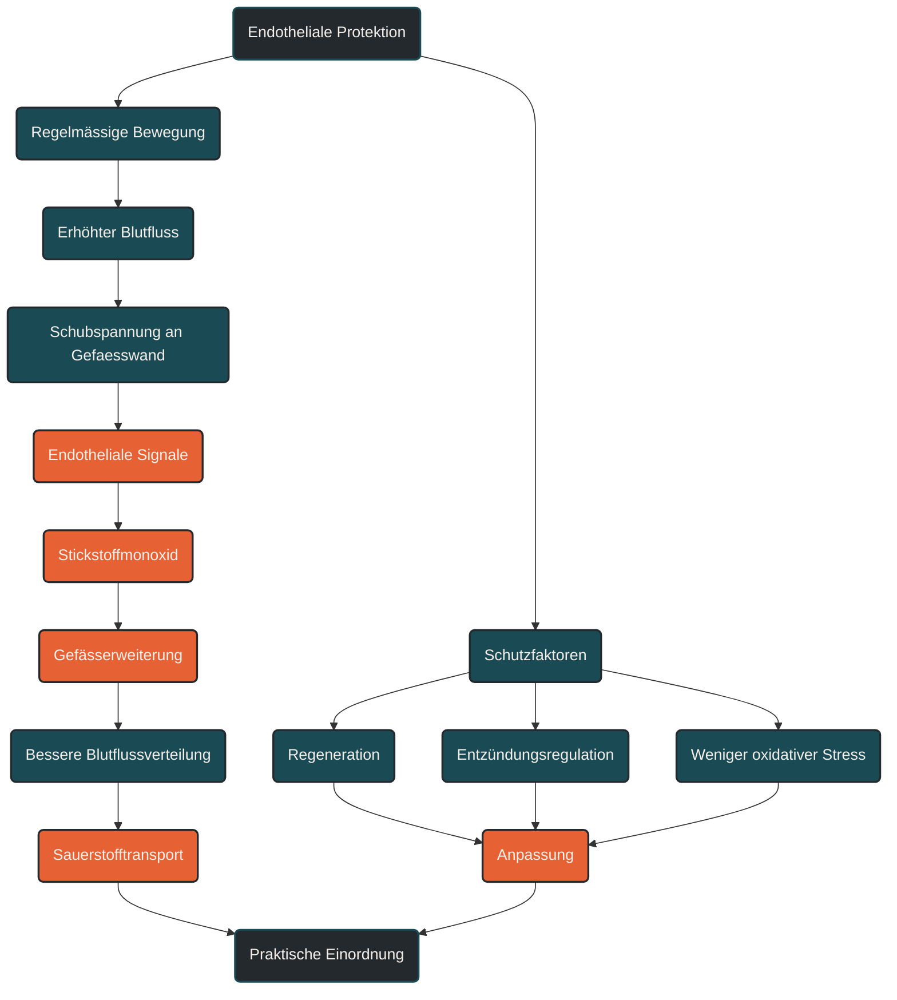

# Endotheliale Protektion

Endotheliale Protektion beschreibt den Schutz und die Funktionsfähigkeit der inneren Gefäßauskleidung. Im Ausdauertraining ist das wichtig, weil gesunde Gefäße Blutfluss, Gefäßweite, Sauerstofftransport und Blutdruckregulation unterstützen. Entscheidend ist, dass regelmäßige, gut dosierte Bewegung die Gefäßfunktion fördern kann, während chronische Überlastung, Entzündung, Stress, Rauchen oder Stoffwechselprobleme sie belasten können.

## Was endotheliale Protektion bedeutet

Das Endothel ist die dünne Zellschicht an der Innenseite der Blutgefäße. Es wirkt nicht wie eine passive Gefäßtapete, sondern wie ein aktives Regulationssystem. Es beeinflusst, ob Gefäße sich erweitern oder verengen, wie Blutfluss verteilt wird und wie stark Entzündungs- oder Gerinnungsprozesse aktiviert werden.

Endotheliale Protektion bedeutet, diese Gefäßinnenhaut funktionsfähig zu halten. Für Ausdauertraining ist das relevant, weil die arbeitende Muskulatur nur dann gut versorgt werden kann, wenn Blutfluss, Gefäßweite und Sauerstofftransport sinnvoll zusammenarbeiten.

Ein gesundes Endothel kann auf steigenden Blutfluss reagieren. Wenn während des Trainings mehr Blut durch die Gefäße strömt, entstehen mechanische Reize an der Gefäßwand. Diese Reize können gefäßerweiternde Signalwege unterstützen und langfristig zur besseren Gefäßfunktion beitragen.

## Warum endotheliale Protektion wichtig ist

Ausdauertraining betrifft nicht nur Herz, Lunge und Muskulatur. Es fordert auch die Gefäße. Während einer Belastung muss Blut dorthin geleitet werden, wo es gebraucht wird: zur arbeitenden Muskulatur, zur Haut für die Wärmeabgabe und zu Organen, die weiter versorgt werden müssen.

Die Gefäße müssen sich dabei dynamisch anpassen. Sie dürfen nicht starr reagieren, sondern müssen Blutfluss, Druck und Verteilung regulieren. Das Endothel ist an dieser Regulation zentral beteiligt.

Eine gute endotheliale Funktion kann helfen, den Blutfluss ökonomischer zu verteilen. Dadurch werden Sauerstoff und Nährstoffe besser bereitgestellt und Stoffwechselprodukte leichter abtransportiert.

Endotheliale Protektion ist deshalb ein Bindeglied zwischen Herz-Kreislauf-System, Muskulatur, Stoffwechsel, Entzündungsregulation und Regeneration.

## Wie Ausdauertraining auf das Endothel wirkt

Während einer Ausdauerbelastung steigt der Blutfluss in vielen Gefäßen deutlich an. Das strömende Blut erzeugt Schubspannung an der Gefäßinnenwand. Das Endothel registriert diese mechanische Belastung und reagiert mit biologischen Signalen.

Ein wichtiger Botenstoff ist Stickstoffmonoxid. Stickstoffmonoxid unterstützt die Erweiterung der Gefäße und hilft, den Blutfluss an den aktuellen Bedarf anzupassen.

Regelmäßiges Training kann diese Reaktionsfähigkeit verbessern. Das bedeutet: Die Gefäße reagieren nicht nur während einer einzelnen Einheit, sondern können sich langfristig funktionell anpassen.

Die Wirkung hängt aber stark von der Dosis ab. Gut dosiertes Ausdauertraining kann günstige Gefäßreize setzen. Dauerhafte Überlastung, zu wenig Erholung, Infekte, Schlafmangel oder hoher Alltagsstress können dagegen das Verhältnis von Belastung und Schutzmechanismen verschieben.

## Zentrale Einflussfaktoren

### Blutfluss

Blutfluss ist ein zentraler Reiz für das Endothel. Wenn mehr Blut durch die Gefäße strömt, entstehen mechanische Kräfte an der Gefäßinnenwand.

Diese Kräfte können günstige Anpassungen fördern, wenn sie regelmäßig und verträglich auftreten. Deshalb sind wiederholte Ausdauerbelastungen für die Gefäßfunktion besonders relevant.

### Schubspannung

Schubspannung beschreibt die Reibungskraft des strömenden Blutes an der Gefäßinnenwand. Das Endothel reagiert auf diese Kraft und kann dadurch gefäßerweiternde und schützende Signalwege aktivieren.

Für die Trainingspraxis bedeutet das: Nicht nur maximale Intensität zählt. Auch längere, kontrollierte Belastungen können durch anhaltend erhöhten Blutfluss wichtige Gefäßreize setzen.

### Stickstoffmonoxid

Stickstoffmonoxid ist ein wichtiger Botenstoff für die Gefäßerweiterung. Es hilft, die Gefäßweite an den Bedarf anzupassen und den Blutfluss besser zu regulieren.

Eine gute Stickstoffmonoxid-Verfügbarkeit ist deshalb ein zentraler Bestandteil endothelialer Funktion. Sie wird unter anderem durch Bewegung, oxidativen Stress, Entzündung, Schlaf, Ernährung und Stoffwechselgesundheit beeinflusst.

### Oxidativer Stress

Oxidativer Stress entsteht, wenn reaktive Sauerstoffverbindungen und körpereigene Schutzsysteme aus dem Gleichgewicht geraten. Training kann kurzfristig oxidativen Stress erhöhen, aber langfristig auch körpereigene Schutzsysteme stärken.

Problematisch wird es vor allem, wenn hohe Belastung dauerhaft mit zu wenig Regeneration, Krankheit, Schlafmangel oder hoher Gesamtbelastung kombiniert wird.

### Entzündungsregulation

Das Endothel steht in engem Zusammenhang mit Entzündungsprozessen. Es beeinflusst, wie Immunzellen an Gefäßwände binden und wie stark lokale Reaktionen aktiviert werden.

Regelmäßiges Ausdauertraining kann helfen, Entzündungsregulation und Gefäßfunktion günstiger zu beeinflussen. Akute Infekte oder chronische Überlastung sind dagegen ungünstige Rahmenbedingungen.

### Regeneration

Endotheliale Protektion entsteht nicht nur während des Trainings. Anpassung braucht Erholung. Schlaf, ausreichende Energiezufuhr, Flüssigkeitshaushalt und reduzierte Gesamtbelastung unterstützen die Fähigkeit des Körpers, Trainingsreize sinnvoll zu verarbeiten.

Wer dauerhaft zu hart trainiert, kann trotz vieler Trainingsstunden ungünstige Signale setzen.

## Bedeutung für Läufer

Für Läufer ist endotheliale Protektion wichtig, weil Laufen den Blutfluss in der arbeitenden Beinmuskulatur stark erhöht. Die Gefäße müssen sich an wechselnde Anforderungen anpassen: lockere Dauerläufe, Anstiege, Tempowechsel, Intervalle, Hitze und lange Belastungen stellen unterschiedliche Anforderungen.

Ein gut funktionierendes Endothel kann helfen, den Blutfluss besser zu verteilen und die Muskulatur effizienter zu versorgen. Das ist besonders bei längeren Läufen relevant, bei denen Sauerstoffversorgung, Wärmeabgabe und Ermüdungsresistenz zusammenwirken.

Praktisch bedeutet das: Regelmäßiges Ausdauertraining ist nicht nur ein Reiz für Herz und Muskulatur, sondern auch für die Gefäße. Ruhige und moderate Einheiten sind dabei nicht nebensächlich. Sie können lange, wiederholbare Gefäßreize setzen, ohne den Körper ständig maximal zu belasten.

Gleichzeitig sollten Läufer Warnsignale ernst nehmen. Ungewöhnliche Brustbeschwerden, Schwindel, Ohnmacht, unerklärliche Luftnot oder auffälliger Leistungseinbruch gehören nicht in die normale Trainingsinterpretation.

## Häufige Fehler

Ein häufiger Fehler ist, Gefäßgesundheit nur als medizinisches Randthema zu betrachten. Im Ausdauersport ist die Gefäßfunktion ein zentraler Teil der Leistungsfähigkeit, weil Sauerstofftransport und Blutfluss direkt von ihr abhängen.

Ein zweiter Fehler ist, nur intensive Einheiten als wirksamen Reiz zu sehen. Auch lockere und moderate Belastungen können durch wiederholten Blutfluss und längere Belastungsdauer wichtige Signale setzen.

Ein dritter Fehler ist, Training als Schutzfaktor zu überschätzen. Bewegung kann die Gefäßfunktion unterstützen, ersetzt aber keine medizinische Abklärung, keine ausgewogene Lebensführung und keine Behandlung bestehender Erkrankungen.

Ein vierter Fehler ist, Erholung zu unterschätzen. Endotheliale Protektion entsteht nicht durch immer mehr Belastung, sondern durch ein sinnvolles Verhältnis aus Reiz, Anpassung und Entlastung.

## Praktische Einordnung

Endotheliale Protektion erklärt, warum Ausdauertraining nicht nur die Muskulatur und das Herz betrifft, sondern auch die Gefäße. Ein funktionsfähiges Endothel unterstützt Blutfluss, Gefäßerweiterung, Sauerstofftransport und Belastungsverträglichkeit.

Für die Trainingspraxis ist vor allem die Regelmäßigkeit entscheidend. Wiederholte, gut verträgliche Belastungen, ergänzt durch gezielte intensivere Reize und ausreichende Erholung, schaffen bessere Voraussetzungen als dauerhaft hartes Training ohne Anpassungszeit.

Der wichtigste Merksatz lautet: Endotheliale Protektion entsteht durch regelmäßigen Blutflussreiz, funktionierende Gefäßregulation und ausreichend Erholung.

----

----

## Häufige Fragen zur endothelialen Protektion

### Was ist endotheliale Protektion einfach erklärt?

Endotheliale Protektion beschreibt den Schutz und die Funktionsfähigkeit der inneren Gefäßauskleidung. Diese Gefäßinnenhaut hilft dabei, Blutfluss, Gefäßweite, Blutdruckregulation und Entzündungsreaktionen zu steuern.

### Warum ist das Endothel im Ausdauertraining wichtig?

Beim Ausdauertraining müssen die Gefäße den Blutfluss an die arbeitende Muskulatur anpassen. Ein gut funktionierendes Endothel unterstützt die Gefäßerweiterung und erleichtert die Versorgung mit Sauerstoff und Nährstoffen.

### Wie kann Bewegung die Gefäßfunktion unterstützen?

Regelmäßige Bewegung erhöht den Blutfluss und erzeugt Schubspannung an der Gefäßwand. Diese mechanischen Reize können endotheliale Signalwege aktivieren, die langfristig eine bessere Gefäßfunktion unterstützen.

### Welche Rolle spielt Stickstoffmonoxid?

Stickstoffmonoxid ist ein wichtiger Botenstoff für die Gefäßerweiterung. Es hilft, die Gefäßweite an den aktuellen Bedarf anzupassen und den Blutfluss besser zu regulieren.

### Ist hartes Training besser für die Gefäße?

Nicht automatisch. Intensive Einheiten können starke Reize setzen, sind aber auch belastender. Für die Gefäßfunktion sind regelmäßige, gut dosierte Belastungen und ausreichende Regeneration besonders wichtig.

### Was kann die endotheliale Funktion belasten?

Zu wenig Erholung, chronischer Stress, Schlafmangel, Rauchen, ungünstige Stoffwechsellage, Infekte und dauerhafte Überlastung können die Gefäßfunktion belasten. Training sollte deshalb immer im Gesamtbild betrachtet werden.

----

*Hinweis: Dieser Artikel dient der allgemeinen Information und ersetzt keine medizinische oder therapeutische Beratung. Mehr dazu im [**Gesundheits- und Quellenhinweis**](/ausdauersport/disclaimer/).*

