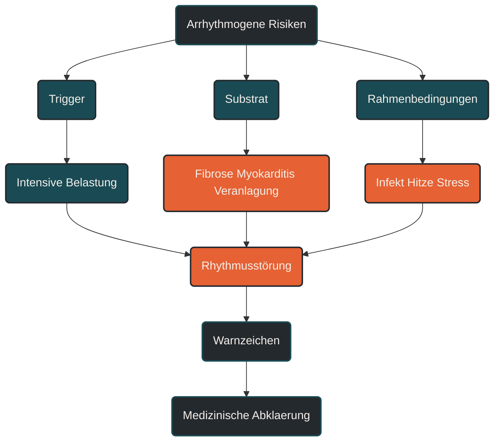

# Arrhythmogene Risiken

Arrhythmogene Risiken beschreiben Faktoren, die Herzrhythmusstörungen begünstigen können. Im Ausdauersport ist das wichtig, weil regelmäßiges Training meist herzschützend wirkt, sehr hohe Belastungen, strukturelle Auffälligkeiten, Infekte oder unerkannte Vorerkrankungen aber anders eingeordnet werden müssen. Entscheidend ist, zwischen normaler Trainingsanpassung, vorübergehender Belastungsreaktion und medizinisch relevanten Warnzeichen zu unterscheiden. [[1]](#quelle-1) [[2]](#quelle-2) [[3]](#quelle-3) [[6]](#quelle-6)

## Was arrhythmogene Risiken bedeuten

Arrhythmogen bedeutet, dass etwas die Entstehung von Herzrhythmusstörungen begünstigen kann. Herzrhythmusstörungen entstehen, wenn die elektrische Erregungsbildung oder Erregungsleitung des Herzens gestört ist. [[1]](#quelle-1) [[2]](#quelle-2) [[3]](#quelle-3)

Nicht jede Rhythmusabweichung ist gefährlich. Einzelne Extraschläge können auch bei gesunden Menschen auftreten und werden nicht immer bemerkt. Problematisch wird es, wenn Rhythmusstörungen häufig auftreten, unter Belastung entstehen, mit Symptomen verbunden sind oder auf eine strukturelle Herzerkrankung hinweisen. [[1]](#quelle-1) [[2]](#quelle-2) [[3]](#quelle-3)

Im Ausdauersport ist die Einordnung besonders wichtig, weil das Herz durch Training größer, ökonomischer und vagaler geprägt sein kann. Das kann normale Befunde verändern. Gleichzeitig können hohe Belastungen bestehende Schwachstellen sichtbarer machen. [[1]](#quelle-1) [[2]](#quelle-2)

Arrhythmogene Risiken sind deshalb kein Argument gegen Ausdauertraining. Sie sind ein Grund, Belastung, Warnzeichen und Vorsorge ernst zu nehmen. [[1]](#quelle-1) [[2]](#quelle-2) [[3]](#quelle-3)

## Warum arrhythmogene Risiken im Ausdauersport wichtig sind

Ausdauertraining wirkt für das Herz-Kreislauf-System in vielen Fällen günstig. Regelmäßige Bewegung kann Blutdruck, Gefäßfunktion, Stoffwechsel, Entzündungsregulation und kardiale Ökonomie unterstützen. [[1]](#quelle-1) [[2]](#quelle-2)

Trotzdem ist das Herz beim Sport nicht passiv geschützt. Bei intensiver oder langer Belastung steigen Herzfrequenz, Herzminutenvolumen, sympathische Aktivierung, Körpertemperatur und Flüssigkeitsverlust. Das elektrische System des Herzens arbeitet unter höherer Belastung. [[1]](#quelle-1) [[2]](#quelle-2)

Bei gesunden, gut angepassten Sportlern ist das meist unproblematisch. Bei bestimmten Voraussetzungen kann Belastung aber als Auslöser wirken. Dazu gehören strukturelle Veränderungen des Herzmuskels, Narbengewebe, Entzündungen, Elektrolytverschiebungen, genetische Rhythmusstörungen oder unerkannte Herzerkrankungen. [[1]](#quelle-1) [[2]](#quelle-2) [[3]](#quelle-3)

Wichtig ist deshalb die Differenzierung: Das Training selbst ist selten die alleinige Erklärung. Häufig entsteht Risiko durch das Zusammenspiel aus Belastung, individueller Veranlagung, strukturellem Substrat und aktuellen Rahmenbedingungen. [[1]](#quelle-1) [[2]](#quelle-2) [[5]](#quelle-5)

## Wie Rhythmusstörungen im Sport entstehen können

Das Herz arbeitet über elektrische Signale. Diese Signale sorgen dafür, dass Vorhöfe und Herzkammern koordiniert schlagen. Bei Belastung muss dieses System schneller und stabiler arbeiten. [[1]](#quelle-1) [[2]](#quelle-2)

Während intensiver Belastung steigt die Aktivierung des sympathischen Nervensystems. Adrenalin und Noradrenalin erhöhen Herzfrequenz, Kontraktionskraft und Erregbarkeit. Gleichzeitig können Flüssigkeitsverlust, Hitze, Schlafmangel, Stress oder Infekte die elektrische Stabilität beeinflussen. [[1]](#quelle-1) [[2]](#quelle-2) [[6]](#quelle-6) [[7]](#quelle-7)

Wenn zusätzlich ein arrhythmogenes Substrat vorhanden ist, kann das Risiko steigen. Ein solches Substrat kann zum Beispiel Narbengewebe, myokardiale Fibrose, eine entzündliche Veränderung oder eine angeborene elektrische Störung sein. [[1]](#quelle-1) [[2]](#quelle-2) [[3]](#quelle-3) [[5]](#quelle-5)

Für die Praxis bedeutet das: Belastung ist oft der Trigger, aber nicht immer die eigentliche Ursache. Deshalb reicht es nicht, nur die Trainingsintensität zu betrachten. Entscheidend ist das Gesamtbild aus Symptomen, Vorgeschichte, Trainingshistorie und medizinischer Abklärung. [[1]](#quelle-1) [[2]](#quelle-2)

## Zentrale Einflussfaktoren

### Vorhofflimmern

Vorhofflimmern ist eine Rhythmusstörung der Vorhöfe. Sie kann sich durch Herzrasen, unregelmäßigen Puls, Leistungseinbruch, Luftnot oder innere Unruhe bemerkbar machen. Manche Menschen bemerken sie kaum. [[1]](#quelle-1) [[2]](#quelle-2) [[3]](#quelle-3) [[4]](#quelle-4)

Bei langjährigem, hochvolumigem Ausdauertraining wird Vorhofflimmern besonders bei älteren Ausdauerathleten häufiger diskutiert. Eine mögliche Rolle spielen Vorhofvergrößerung, hoher Vagustonus, wiederholte Volumenbelastung, Entzündungsprozesse und individuelle Veranlagung. [[1]](#quelle-1) [[2]](#quelle-2) [[4]](#quelle-4) [[8]](#quelle-8)

Das bedeutet nicht, dass Ausdauertraining automatisch Vorhofflimmern verursacht. Es bedeutet nur, dass ungewöhnliche Rhythmuswahrnehmungen nicht dauerhaft ignoriert werden sollten. [[1]](#quelle-1) [[2]](#quelle-2) [[3]](#quelle-3) [[4]](#quelle-4)

### Ventrikuläre Arrhythmien

Ventrikuläre Arrhythmien entstehen in den Herzkammern. Sie sind besonders sorgfältig einzuordnen, weil sie harmlos sein können, aber auch auf strukturelle Herzerkrankungen hinweisen können. [[1]](#quelle-1) [[2]](#quelle-2) [[3]](#quelle-3) [[5]](#quelle-5)

Entscheidend ist, ob sie selten oder häufig auftreten, ob sie unter Belastung zunehmen, ob Symptome bestehen und ob bildgebende oder elektrokardiographische Befunde auffällig sind. [[1]](#quelle-1) [[2]](#quelle-2)

Bei Sportlern ist deshalb nicht die einzelne Extrasystole allein entscheidend, sondern der Kontext. [[1]](#quelle-1) [[2]](#quelle-2)

### Myokardiale Fibrose

Myokardiale Fibrose beschreibt bindegewebige Veränderungen im Herzmuskel. Solches Gewebe leitet elektrische Signale anders als normales Herzmuskelgewebe. Dadurch kann es unter bestimmten Bedingungen ein arrhythmogenes Substrat bilden. [[1]](#quelle-1) [[2]](#quelle-2) [[3]](#quelle-3) [[5]](#quelle-5)

Hohe Belastung kann dann als Trigger wirken, vor allem wenn sympathische Aktivierung, hohe Herzfrequenz und mechanische Belastung zusammenkommen. [[1]](#quelle-1) [[2]](#quelle-2)

Für Ausdauersportler ist das wichtig, weil strukturelle Auffälligkeiten nicht durch Trainingsgefühl allein erkannt werden. Sie werden in der Regel nur durch medizinische Diagnostik sichtbar. [[1]](#quelle-1) [[2]](#quelle-2)

### Myokarditis und Infekte

Myokarditis bedeutet Herzmuskelentzündung. Sie kann nach Infekten auftreten und ist im Sportkontext besonders wichtig, weil Training während oder kurz nach einer relevanten Infektion das Risiko erhöhen kann. [[1]](#quelle-1) [[2]](#quelle-2) [[6]](#quelle-6) [[7]](#quelle-7)

Ein Infekt ist deshalb kein normales Trainingshindernis wie müde Beine. Fieber, Brustschmerz, ungewöhnliche Luftnot, Herzstolpern, deutlicher Leistungseinbruch oder Krankheitsgefühl sollten ernst genommen werden. [[1]](#quelle-1) [[2]](#quelle-2) [[3]](#quelle-3) [[6]](#quelle-6)

Training mit Infekt ist kein Zeichen von Härte, sondern kann ein unnötiges Risiko darstellen. [[1]](#quelle-1) [[2]](#quelle-2) [[6]](#quelle-6) [[7]](#quelle-7)

### Elektrolyte und Flüssigkeitshaushalt

Natrium, Kalium, Magnesium und Flüssigkeitshaushalt beeinflussen die elektrische Stabilität des Herzens. Lange Belastungen, Hitze, starkes Schwitzen, Durchfall, Erbrechen oder unpassende Flüssigkeitsstrategien können das Gleichgewicht verschieben. [[1]](#quelle-1) [[2]](#quelle-2)

Das bedeutet nicht, dass jeder Läufer ständig Elektrolyte zuführen muss. Es bedeutet, dass lange und heiße Belastungen anders geplant werden sollten als kurze lockere Läufe bei kühlen Bedingungen. [[1]](#quelle-1) [[2]](#quelle-2)

### Autonomes Nervensystem

Das autonome Nervensystem steuert Herzfrequenz und Erregbarkeit mit. Im Ausdauersport kann der Parasympathikus in Ruhe stärker ausgeprägt sein, während intensive Belastung den Sympathikus stark aktiviert. [[1]](#quelle-1) [[2]](#quelle-2)

Diese Wechsel sind grundsätzlich normal. Problematisch kann es werden, wenn hohe Trainingslast, Schlafmangel, Stress, Infekte und unvollständige Erholung zusammenkommen. Dann kann die autonome Regulation instabiler werden. [[1]](#quelle-1) [[2]](#quelle-2) [[6]](#quelle-6) [[7]](#quelle-7)

## Bedeutung für Läufer

Für Läufer ist das Thema relevant, weil Lauftraining oft langfristig und wiederholt hohe Kreislaufreize setzt. Lange Läufe, Wettkämpfe, Intervalle, Hitze und Höhenmeter können das Herz-Kreislauf-System deutlich fordern. [[1]](#quelle-1) [[2]](#quelle-2)

Die meisten Läufer profitieren von regelmäßiger Bewegung. Trotzdem sollten sie Warnzeichen kennen. Dazu gehören Brustdruck, Brustschmerz, Ohnmacht, Schwindel unter Belastung, ungeklärte Luftnot, Herzrasen, anhaltendes Herzstolpern oder ein plötzlicher ungewohnter Leistungseinbruch. [[1]](#quelle-1) [[2]](#quelle-2) [[3]](#quelle-3)

Auch die Situation ist wichtig. Herzstolpern in Ruhe nach Stress kann anders einzuordnen sein als Rhythmusstörungen während eines Intervalls oder Wettkampfs. Beschwerden unter Belastung verdienen besondere Aufmerksamkeit. [[1]](#quelle-1) [[2]](#quelle-2) [[3]](#quelle-3)

Für die Trainingspraxis bedeutet das: Ausdauertraining sollte progressiv aufgebaut werden. Sehr hohe Umfänge, viele intensive Einheiten und Wettkämpfe sollten nicht dauerhaft ohne Erholung kombiniert werden. Nach Infekten sollte der Wiedereinstieg vorsichtig erfolgen. [[1]](#quelle-1) [[2]](#quelle-2) [[6]](#quelle-6) [[7]](#quelle-7)

## Häufige Fehler

Ein häufiger Fehler ist, jedes Herzstolpern sofort als gefährlich zu bewerten. Das kann unnötig verunsichern. Viele Rhythmuswahrnehmungen sind harmlos, müssen aber bei Häufung, Symptomen oder Belastungsbezug abgeklärt werden. [[1]](#quelle-1) [[2]](#quelle-2) [[3]](#quelle-3)

Ein zweiter Fehler ist das Gegenteil: Warnzeichen werden als normale Trainingshärte abgetan. Ohnmacht, Brustschmerz, ungeklärte Luftnot oder Herzrasen unter Belastung gehören nicht in die Kategorie „durchbeißen“. [[1]](#quelle-1) [[2]](#quelle-2) [[3]](#quelle-3)

Ein dritter Fehler ist, ein Sportherz automatisch als gesundes Herz zu interpretieren. Sportliche Anpassungen können physiologisch sein, ersetzen aber keine Abklärung bei auffälligen Symptomen oder Risikofaktoren. [[1]](#quelle-1) [[2]](#quelle-2)

Ein vierter Fehler ist Training trotz Infekt. Gerade bei Fieber, deutlichem Krankheitsgefühl oder kardialen Symptomen sollte keine intensive Belastung stattfinden. [[1]](#quelle-1) [[2]](#quelle-2) [[6]](#quelle-6) [[7]](#quelle-7)

Ein fünfter Fehler ist, nur auf die Uhr zu schauen. Wearables können Hinweise liefern, aber sie ersetzen keine Diagnostik. Ein unauffälliger Pulswert schließt nicht jede Rhythmusstörung aus, und ein auffälliger Sensorwert ist nicht automatisch eine Diagnose. [[1]](#quelle-1) [[2]](#quelle-2) [[3]](#quelle-3)

## Praktische Einordnung

Arrhythmogene Risiken sind kein Grund, Ausdauertraining pauschal zu meiden. Sie zeigen, dass das Herz-Kreislauf-System nicht nur leistungsphysiologisch, sondern auch medizinisch sinnvoll eingeordnet werden sollte. [[1]](#quelle-1) [[2]](#quelle-2) [[3]](#quelle-3)

Für gesunde Läufer ist regelmäßiges, gut dosiertes Training meist eine sinnvolle Grundlage. Kritisch wird es, wenn hohe Belastung mit Warnzeichen, Infekten, unklarer Vorgeschichte oder fehlender Erholung zusammentrifft. [[1]](#quelle-1) [[2]](#quelle-2) [[6]](#quelle-6) [[7]](#quelle-7)

Der wichtigste Merksatz lautet: Belastung kann Rhythmusstörungen auslösen, aber das eigentliche Risiko entsteht oft erst durch das Zusammenspiel aus Trigger, Substrat, Symptomen und individueller Vorgeschichte. [[1]](#quelle-1) [[2]](#quelle-2) [[3]](#quelle-3) [[5]](#quelle-5)

----

----

## Häufige Fragen zu arrhythmogenen Risiken

### Was sind arrhythmogene Risiken einfach erklärt?

Arrhythmogene Risiken sind Faktoren, die Herzrhythmusstörungen begünstigen können. Dazu gehören zum Beispiel strukturelle Veränderungen des Herzmuskels, Entzündungen, Elektrolytverschiebungen, genetische Faktoren oder Belastungssituationen mit hoher sympathischer Aktivierung. [[1]](#quelle-1) [[2]](#quelle-2) [[3]](#quelle-3)

### Ist Ausdauertraining schlecht für den Herzrhythmus?

Nein. Regelmäßiges Ausdauertraining wirkt in vielen Fällen herzschützend. Bei sehr hohen Umfängen, bestimmten Vorerkrankungen, Infekten oder strukturellen Auffälligkeiten muss das Risiko aber differenzierter eingeordnet werden. [[1]](#quelle-1) [[2]](#quelle-2) [[6]](#quelle-6) [[7]](#quelle-7)

### Was ist der Unterschied zwischen Trigger und Substrat?

Ein Trigger ist der Auslöser, zum Beispiel intensive Belastung, Hitze oder Stress. Ein Substrat ist die Grundlage, die eine Rhythmusstörung begünstigen kann, zum Beispiel Narbengewebe, Myokarditis oder myokardiale Fibrose. [[1]](#quelle-1) [[2]](#quelle-2) [[3]](#quelle-3) [[5]](#quelle-5)

### Welche Warnzeichen sollten Läufer ernst nehmen?

Brustschmerz, Brustdruck, Ohnmacht, Schwindel unter Belastung, ungeklärte Luftnot, anhaltendes Herzrasen, auffälliges Herzstolpern oder plötzlicher Leistungseinbruch sollten medizinisch abgeklärt werden. [[1]](#quelle-1) [[2]](#quelle-2) [[3]](#quelle-3)

### Warum ist Training mit Infekt problematisch?

Ein Infekt kann den Körper systemisch belasten. Wenn das Herz mitbetroffen ist oder eine Entzündung vorliegt, kann Training das Risiko erhöhen. Besonders bei Fieber, Brustbeschwerden, Herzstolpern oder deutlichem Krankheitsgefühl sollte nicht trainiert werden. [[1]](#quelle-1) [[2]](#quelle-2) [[3]](#quelle-3) [[6]](#quelle-6)

### Können Wearables Rhythmusstörungen sicher erkennen?

Wearables können Hinweise liefern, ersetzen aber keine medizinische Diagnostik. Auffällige Werte sollten im Zusammenhang mit Symptomen, Belastung und professioneller Untersuchung eingeordnet werden. [[1]](#quelle-1) [[2]](#quelle-2) [[3]](#quelle-3)

----

## Quellen

### Quelle 1

[1] Pelliccia, A., Sharma, S., Gati, S., Bäck, M., Börjesson, M., Caselli, S., Collet, J.-P., Corrado, D., Drezner, J. A. et al. (2020): [2020 ESC Guidelines on Sports Cardiology and Exercise in Patients with Cardiovascular Disease](https://www.escardio.org/guidelines/clinical-practice-guidelines/all-esc-practice-guidelines/sports-cardiology-and-exercise/). European Society of Cardiology.

### Quelle 2

[2] Kim, J. H., Baggish, A. L., Levine, B. D., Ackerman, M. J., Day, S. M., Dineen, E. H., Guseh, J. S. II, La Gerche, A., Lampert, R. et al. (2025): [Clinical Considerations for Competitive Sports Participation for Athletes With Cardiovascular Abnormalities](https://www.sciencedirect.com/science/article/pii/S073510972410722X). Journal of the American College of Cardiology.

### Quelle 3

[3] Drezner, J. A., Sharma, S., Baggish, A., Papadakis, M., Wilson, M. G., Prutkin, J. M., Gerche, A. L., Ackerman, M. J. et al. (2017): [International criteria for electrocardiographic interpretation in athletes](https://bjsm.bmj.com/content/51/9/704). British Journal of Sports Medicine.

### Quelle 4

[4] Pérez, M. V. & Link, M. S. (2015): [Endurance Sport Activity and Risk of Atrial Fibrillation](https://www.ncbi.nlm.nih.gov/pmc/articles/PMC4711509/). Journal of Atrial Fibrillation.

### Quelle 5

[5] Noseworthy, P. A., Weiner, R. B., Kim, J. H., Keel, P. K., Wang, F., Berkstresser, B., Lewis, G. D., Hutter, A. M. & Baggish, A. L. (2011): [Early repolarization pattern in competitive athletes: clinical correlates and the effects of exercise training](https://pubmed.ncbi.nlm.nih.gov/21480191/). Circulation.

### Quelle 6

[6] Schulz-Menger, J., Collini, V., Groeschel, J. W., Adler, Y., Brucato, A., Ferreira, V. et al. (2025): [2025 ESC Guidelines for the management of myocarditis and pericarditis](https://www.escardio.org/guidelines/clinical-practice-guidelines/all-esc-practice-guidelines/myocarditis-and-pericarditis/). European Society of Cardiology.

### Quelle 7

[7] Moulson, N., Petek, B. J., Ackerman, M. J., Drezner, J. A., Baggish, A. L. et al. (2022): [2022 ACC Expert Consensus Decision Pathway on Cardiovascular Sequelae of COVID-19 in Adults: Return-to-Play](https://www.acc.org/latest-in-cardiology/articles/2022/04/13/13/49/2022-acc-expert-consensus-decision-pathway-on-covid-19-return-to-play). American College of Cardiology.

### Quelle 8

[8] Alameh, I., Al Fout, G., Ezekowitz, M. D. & Kamareddine, M. (2025): [Navigating atrial fibrillation in an endurance athlete: Evaluation, management, and prevention](https://pmc.ncbi.nlm.nih.gov/articles/PMC12805273/). Heart Rhythm Case Reports.

----

*Hinweis: Dieser Artikel dient der allgemeinen Information und ersetzt keine medizinische oder therapeutische Beratung. Mehr dazu im [**Gesundheits- und Quellenhinweis**](/ausdauersport/disclaimer/).*
