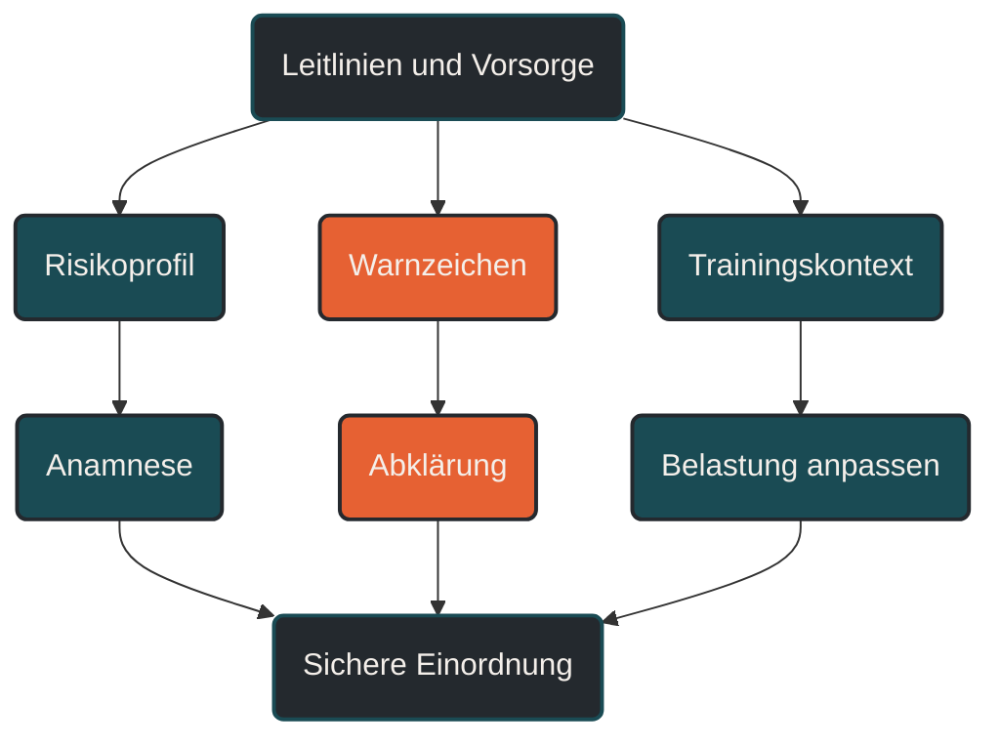

# Leitlinien und Vorsorge

Leitlinien und Vorsorge helfen, Ausdauertraining gesundheitlich besser einzuordnen. Sie ersetzen keine individuelle Diagnose, geben aber Orientierung, wann Training unproblematisch wirkt, wann eine Untersuchung sinnvoll ist und welche Warnzeichen ernst genommen werden sollten. Entscheidend ist, Vorsorge nicht als Bremse zu verstehen, sondern als Sicherheitsrahmen für langfristiges Training. [[1]](#quelle-1) [[2]](#quelle-2) [[3]](#quelle-3) [[4]](#quelle-4)

## Was Leitlinien und Vorsorge bedeuten

Leitlinien sind fachliche Orientierungshilfen. Sie fassen vorhandenes Wissen zusammen und helfen Ärztinnen, Ärzten, Therapeutinnen, Therapeuten und Sportmedizinern, Entscheidungen nachvollziehbar zu treffen. [[1]](#quelle-1) [[2]](#quelle-2) [[3]](#quelle-3) [[4]](#quelle-4)

Vorsorge bedeutet im Sportkontext, mögliche Risiken frühzeitig zu erkennen. Dabei geht es nicht darum, gesunde Menschen unnötig zu verunsichern. Es geht darum, Training, Vorgeschichte, Beschwerden und Risikofaktoren sinnvoll zusammenzubringen. [[1]](#quelle-1) [[2]](#quelle-2) [[3]](#quelle-3) [[4]](#quelle-4)

Im Ausdauersport betrifft das besonders das Herz-Kreislauf-System. Regelmäßiges Training ist für viele Menschen günstig, aber nicht jede Belastung ist in jeder Situation sinnvoll. Infekte, ungeklärte Beschwerden, bekannte Vorerkrankungen oder auffällige Symptome verändern die Einordnung. [[1]](#quelle-1) [[2]](#quelle-2) [[5]](#quelle-5) [[8]](#quelle-8)

Vorsorge ist deshalb keine Garantie, aber sie verbessert die Wahrscheinlichkeit, relevante Probleme früh zu erkennen. [[1]](#quelle-1) [[2]](#quelle-2) [[3]](#quelle-3) [[4]](#quelle-4)

## Warum Vorsorge im Ausdauersport wichtig ist

Ausdauertraining belastet das Herz-Kreislauf-System regelmäßig. Herzfrequenz, Schlagvolumen, Herzminutenvolumen, Blutdruck, Atmung und Gefäßfunktion passen sich an die Belastung an. [[1]](#quelle-1) [[2]](#quelle-2) [[7]](#quelle-7)

Bei gesunden Personen ist das meistens erwünscht und Teil der positiven Trainingswirkung. Bei bestimmten Voraussetzungen kann Belastung aber auch ein bestehendes Problem sichtbar machen. Dazu gehören unerkannte Herz-Kreislauf-Erkrankungen, Rhythmusstörungen, Entzündungen, strukturelle Auffälligkeiten oder eine ungünstige Kombination aus Training, Stress und fehlender Erholung. [[1]](#quelle-1) [[2]](#quelle-2) [[7]](#quelle-7)

Leitlinien und Vorsorge helfen, diese Situationen nicht nur nach Gefühl zu bewerten. Sie geben einen Rahmen, wann einfache Beobachtung reicht, wann eine ärztliche Abklärung sinnvoll ist und wann Training pausiert werden sollte. [[1]](#quelle-1) [[2]](#quelle-2) [[3]](#quelle-3) [[4]](#quelle-4)

Besonders wichtig ist das bei Wiedereinsteigern, älteren Ausdauerathleten, sehr hohen Trainingsumfängen, bekannten Risikofaktoren oder Beschwerden unter Belastung. [[1]](#quelle-1) [[2]](#quelle-2) [[7]](#quelle-7)

## Wie Vorsorge praktisch eingeordnet wird

Vorsorge beginnt nicht erst mit Technik. Der wichtigste erste Schritt ist eine gute Anamnese. Dabei geht es um Beschwerden, Vorerkrankungen, Medikamente, Familiengeschichte, Trainingshistorie, Infekte, frühere Ereignisse und aktuelle Belastbarkeit. [[1]](#quelle-1) [[2]](#quelle-2) [[3]](#quelle-3) [[4]](#quelle-4)

Danach kann je nach Situation eine körperliche Untersuchung folgen. Blutdruck, Ruhepuls, Herz- und Lungenauskultation, Bewegungsapparat und allgemeiner Gesundheitszustand können Hinweise geben. [[1]](#quelle-1) [[2]](#quelle-2) [[3]](#quelle-3) [[4]](#quelle-4)

Weitere Untersuchungen hängen vom Risikoprofil ab. Dazu können Ruhe-EKG, Belastungs-EKG, Echokardiographie, Laborwerte, Langzeit-EKG oder andere Verfahren gehören. Nicht jede Person braucht jede Untersuchung. Entscheidend ist die passende Fragestellung. [[1]](#quelle-1) [[2]](#quelle-2) [[3]](#quelle-3) [[4]](#quelle-4)

Für Sportler ist wichtig: Eine Untersuchung ist keine Freigabe für grenzenloses Training. Sie ist eine Momentaufnahme. Training bleibt ein dynamischer Prozess, der weiterhin an Beschwerden, Erholung, Infekte und Belastungsverträglichkeit angepasst werden muss. [[1]](#quelle-1) [[2]](#quelle-2) [[3]](#quelle-3) [[4]](#quelle-4)

## Zentrale Einflussfaktoren

### Alter und Trainingshistorie

Mit zunehmendem Alter steigt die Wahrscheinlichkeit für Herz-Kreislauf-Risikofaktoren. Gleichzeitig können viele Menschen auch im höheren Alter sehr leistungsfähig trainieren. [[1]](#quelle-1) [[2]](#quelle-2)

Wichtig ist deshalb nicht das Alter allein, sondern die Kombination aus Alter, Vorgeschichte, Trainingsumfang, Symptomen und Risikoprofil. Ein langjährig trainierter Läufer ist anders einzuordnen als ein Wiedereinsteiger nach langer Pause. [[1]](#quelle-1) [[2]](#quelle-2) [[7]](#quelle-7)

### Beschwerden unter Belastung

Beschwerden unter Belastung sind besonders wichtig. Brustdruck, Brustschmerz, ungeklärte Luftnot, Schwindel, Ohnmacht, Herzrasen, anhaltendes Herzstolpern oder plötzlicher Leistungseinbruch sollten nicht als normale Trainingshärte abgetan werden. [[1]](#quelle-1) [[2]](#quelle-2) [[7]](#quelle-7) [[5]](#quelle-5)

Solche Zeichen bedeuten nicht automatisch eine schwere Erkrankung. Sie sind aber ein Grund, genauer hinzuschauen. [[1]](#quelle-1) [[2]](#quelle-2)

### Infekte

Training während eines Infekts ist ein häufiger Risikobereich. Fieber, ausgeprägtes Krankheitsgefühl, Brustbeschwerden, Herzstolpern oder ungewöhnliche Luftnot passen nicht zu intensiver Belastung. [[1]](#quelle-1) [[2]](#quelle-2) [[5]](#quelle-5) [[8]](#quelle-8)

Nach Infekten sollte der Wiedereinstieg vorsichtig erfolgen. Der Körper braucht nicht nur das Ende der Symptome, sondern auch wieder stabile Belastungsverträglichkeit. [[1]](#quelle-1) [[2]](#quelle-2) [[5]](#quelle-5) [[8]](#quelle-8)

### Risikofaktoren

Risikofaktoren wie Bluthochdruck, Diabetes, Fettstoffwechselstörungen, Rauchen, starkes Übergewicht, familiäre Vorbelastung oder bekannte Herz-Kreislauf-Erkrankungen verändern die Einordnung. [[1]](#quelle-1) [[2]](#quelle-2) [[7]](#quelle-7)

Sie bedeuten nicht automatisch, dass Ausdauertraining vermieden werden sollte. Häufig ist Bewegung gerade dann wichtig. Sie sollte aber sinnvoll begleitet und angepasst werden. [[1]](#quelle-1) [[2]](#quelle-2)

### Trainingsumfang und Intensität

Sehr hohe Umfänge und viele intensive Einheiten erhöhen die Belastung des Herz-Kreislauf-Systems. Das ist nicht automatisch gefährlich, verlangt aber eine bessere Steuerung. [[1]](#quelle-1) [[2]](#quelle-2) [[7]](#quelle-7)

Wer dauerhaft viel trainiert, sollte Erholung, Schlaf, Infekte, Warnzeichen und Belastungsverläufe ernst nehmen. Vorsorge ist hier Teil der langfristigen Trainingsfähigkeit. [[1]](#quelle-1) [[2]](#quelle-2) [[3]](#quelle-3) [[4]](#quelle-4)

### Gemeinsame Entscheidungsfindung

Bei auffälligen Befunden, bekannten Erkrankungen oder unklaren Beschwerden gibt es selten nur eine einfache Antwort. Dann ist gemeinsame Entscheidungsfindung wichtig. [[1]](#quelle-1) [[2]](#quelle-2)

Dabei werden medizinische Befunde, sportliche Ziele, Risiken, Alternativen und persönliche Prioritäten zusammen betrachtet. Ziel ist nicht pauschales Verbot, sondern eine tragfähige, verantwortliche Entscheidung. [[1]](#quelle-1) [[2]](#quelle-2)

## Bedeutung für Läufer

Für Läufer ist Vorsorge besonders relevant, weil Laufen eine wiederholte Ganzkörperbelastung mit deutlicher Herz-Kreislauf-Aktivierung ist. Lange Läufe, Intervalle, Wettkämpfe, Hitze und Höhenmeter können die Belastung deutlich erhöhen. [[1]](#quelle-1) [[2]](#quelle-2) [[3]](#quelle-3) [[4]](#quelle-4)

Viele Läufer orientieren sich stark an Pace, Herzfrequenz und Trainingsplan. Diese Werte sind hilfreich, ersetzen aber keine gesundheitliche Einordnung. Ein Trainingsplan erkennt keine familiäre Vorbelastung, keine Entzündung und keine relevante Rhythmusstörung. [[1]](#quelle-1) [[2]](#quelle-2) [[7]](#quelle-7)

Vorsorge bedeutet deshalb, Trainingsdaten mit Körperwahrnehmung zu verbinden. Wenn bekannte Werte plötzlich nicht mehr passen, die Belastung ungewöhnlich schwer wirkt oder Beschwerden auftreten, sollte das ernst genommen werden. [[1]](#quelle-1) [[2]](#quelle-2) [[3]](#quelle-3) [[4]](#quelle-4)

Für gesunde Läufer ohne Beschwerden kann Vorsorge vor allem Orientierung geben. Für Läufer mit Risikofaktoren, Beschwerden oder sehr hohen Zielen kann sie ein wichtiger Sicherheitsbaustein sein. [[1]](#quelle-1) [[2]](#quelle-2) [[3]](#quelle-3) [[4]](#quelle-4)

## Häufige Fehler

Ein häufiger Fehler ist, Vorsorge als unnötig zu betrachten, solange man leistungsfähig ist. Leistungsfähigkeit schließt gesundheitliche Risiken nicht vollständig aus. [[1]](#quelle-1) [[2]](#quelle-2) [[3]](#quelle-3) [[4]](#quelle-4)

Ein zweiter Fehler ist, Vorsorge als einmalige Freigabe zu verstehen. Eine unauffällige Untersuchung ist hilfreich, aber sie ersetzt keine laufende Selbstbeobachtung und keine Anpassung bei Infekten oder Beschwerden. [[1]](#quelle-1) [[2]](#quelle-2) [[3]](#quelle-3) [[4]](#quelle-4)

Ein dritter Fehler ist, Warnzeichen mit Motivation zu überdecken. Brustdruck, Ohnmacht, ungeklärte Luftnot oder Herzrasen unter Belastung gehören nicht in die Kategorie „durchbeißen“. [[1]](#quelle-1) [[2]](#quelle-2) [[7]](#quelle-7) [[5]](#quelle-5)

Ein vierter Fehler ist, nur auf Wearables zu vertrauen. Uhren und Sensoren können Hinweise liefern, aber sie ersetzen keine medizinische Diagnostik. [[1]](#quelle-1) [[2]](#quelle-2) [[6]](#quelle-6)

Ein fünfter Fehler ist, Training nach Infekten zu früh wieder hochzufahren. Gerade nach deutlichen Infekten sollte der Wiedereinstieg vorsichtig und stufenweise erfolgen. [[1]](#quelle-1) [[2]](#quelle-2) [[5]](#quelle-5) [[8]](#quelle-8)

## Praktische Einordnung

Leitlinien und Vorsorge sollen Ausdauertraining nicht komplizierter machen, sondern sicherer einordnen. Sie helfen, zwischen normaler Trainingsbelastung, vorübergehender Reaktion und abklärungsbedürftigem Warnzeichen zu unterscheiden. [[1]](#quelle-1) [[2]](#quelle-2) [[3]](#quelle-3) [[4]](#quelle-4)

Für die Praxis gilt: Wer gesund ist, gut regeneriert und keine Warnzeichen hat, kann Ausdauertraining meist sinnvoll aufbauen. Wer Beschwerden, Risikofaktoren, Infekte oder auffällige Verläufe bemerkt, sollte nicht nur den Trainingsplan anpassen, sondern medizinisch abklären lassen, was dahintersteht. [[1]](#quelle-1) [[2]](#quelle-2) [[5]](#quelle-5) [[8]](#quelle-8)

Der wichtigste Merksatz lautet: Vorsorge ist keine Trainingsbremse, sondern ein Sicherheitsrahmen für langfristige Belastbarkeit. [[1]](#quelle-1) [[2]](#quelle-2) [[3]](#quelle-3) [[4]](#quelle-4)

----

----

## Häufige Fragen zu Leitlinien und Vorsorge

### Was bedeuten Leitlinien im Sport einfach erklärt?

Leitlinien sind fachliche Orientierungshilfen. Sie helfen dabei, Beschwerden, Risiken, Untersuchungen und sportliche Belastung nachvollziehbar einzuordnen. [[1]](#quelle-1) [[2]](#quelle-2) [[3]](#quelle-3) [[4]](#quelle-4)

### Warum ist Vorsorge für Läufer wichtig?

Laufen fordert das Herz-Kreislauf-System regelmäßig. Vorsorge kann helfen, Risikofaktoren, Warnzeichen oder unklare Beschwerden frühzeitig zu erkennen und Training besser einzuordnen. [[1]](#quelle-1) [[2]](#quelle-2) [[3]](#quelle-3) [[4]](#quelle-4)

### Wer sollte vor dem Training besonders auf Vorsorge achten?

Besonders relevant ist Vorsorge für Wiedereinsteiger, ältere Sportler, Personen mit bekannten Risikofaktoren, familiärer Vorbelastung, Vorerkrankungen oder Beschwerden unter Belastung. [[1]](#quelle-1) [[2]](#quelle-2) [[3]](#quelle-3) [[4]](#quelle-4)

### Welche Warnzeichen sollte man ernst nehmen?

Brustdruck, Brustschmerz, Ohnmacht, Schwindel unter Belastung, ungeklärte Luftnot, Herzrasen, anhaltendes Herzstolpern oder plötzlicher Leistungseinbruch sollten medizinisch abgeklärt werden. [[1]](#quelle-1) [[2]](#quelle-2) [[7]](#quelle-7) [[5]](#quelle-5)

### Reicht eine Sportuhr zur Vorsorge aus?

Nein. Wearables können Hinweise liefern, ersetzen aber keine medizinische Untersuchung. Auffällige Werte sollten immer im Zusammenhang mit Symptomen und Belastung bewertet werden. [[1]](#quelle-1) [[2]](#quelle-2) [[3]](#quelle-3) [[4]](#quelle-4)

### Bedeutet Vorsorge, dass man weniger trainieren muss?

Nicht automatisch. Vorsorge soll helfen, Training sicherer und langfristiger zu gestalten. Sie kann auch bestätigen, dass ein geplanter Trainingsaufbau gut vertretbar ist. [[1]](#quelle-1) [[2]](#quelle-2) [[3]](#quelle-3) [[4]](#quelle-4)

----

## Quellen

### Quelle 1

[1] Pelliccia, A., Sharma, S., Gati, S., Bäck, M., Börjesson, M., Caselli, S., Collet, J.-P., Corrado, D., Drezner, J. A. et al. (2020): [2020 ESC Guidelines on Sports Cardiology and Exercise in Patients with Cardiovascular Disease](https://www.escardio.org/guidelines/clinical-practice-guidelines/all-esc-practice-guidelines/sports-cardiology-and-exercise/). European Society of Cardiology.

### Quelle 2

[2] Kim, J. H., Baggish, A. L., Levine, B. D., Ackerman, M. J., Day, S. M., Dineen, E. H., Guseh, J. S. II, La Gerche, A., Lampert, R. et al. (2025): [Clinical Considerations for Competitive Sports Participation for Athletes With Cardiovascular Abnormalities](https://www.sciencedirect.com/science/article/pii/S073510972410722X). Journal of the American College of Cardiology.

### Quelle 3

[3] Drezner, J. A., Sharma, S., Baggish, A., Papadakis, M., Wilson, M. G., Prutkin, J. M., Gerche, A. L., Ackerman, M. J. et al. (2017): [International criteria for electrocardiographic interpretation in athletes](https://bjsm.bmj.com/content/51/9/704). British Journal of Sports Medicine.

### Quelle 4

[4] Riebe, D., Franklin, B. A., Thompson, P. D., Garber, C. E., Whitfield, G. P., Magal, M. & Pescatello, L. S. (2015): [Updating ACSM’s Recommendations for Exercise Preparticipation Health Screening](https://www.exerciseismedicine.org/assets/page_documents/ACSM%20Preparticipation%20Screening%20Guidelines.pdf). Medicine & Science in Sports & Exercise.

### Quelle 5

[5] Schulz-Menger, J., Collini, V., Groeschel, J. W., Adler, Y., Brucato, A., Ferreira, V. et al. (2025): [2025 ESC Guidelines for the management of myocarditis and pericarditis](https://www.escardio.org/guidelines/clinical-practice-guidelines/all-esc-practice-guidelines/myocarditis-and-pericarditis/). European Society of Cardiology.

### Quelle 6

[6] Flanagan, H., Cooper, R., George, K. P., Augustine, D. X., Malhotra, A., Paton, M. F., Robinson, S. & Oxborough, D. (2023): [The athlete’s heart: insights from echocardiography](https://link.springer.com/article/10.1186/s44156-023-00027-8). Echo Research & Practice.

### Quelle 7

[7] Bourdon, P. C., Cardinale, M., Murray, A. et al. (2017): [Monitoring Athlete Training Loads: Consensus Statement](https://journals.humankinetics.com/view/journals/ijspp/12/s2/article-pS2-161.xml). International Journal of Sports Physiology and Performance.

### Quelle 8

[8] Moulson, N., Petek, B. J., Ackerman, M. J., Drezner, J. A., Baggish, A. L. et al. (2022): [2022 ACC Expert Consensus Decision Pathway on Cardiovascular Sequelae of COVID-19 in Adults: Return-to-Play](https://www.acc.org/latest-in-cardiology/articles/2022/04/13/13/49/2022-acc-expert-consensus-decision-pathway-on-covid-19-return-to-play). American College of Cardiology.

----

*Hinweis: Dieser Artikel dient der allgemeinen Information und ersetzt keine medizinische oder therapeutische Beratung. Mehr dazu im [**Gesundheits- und Quellenhinweis**](/ausdauersport/disclaimer/).*
