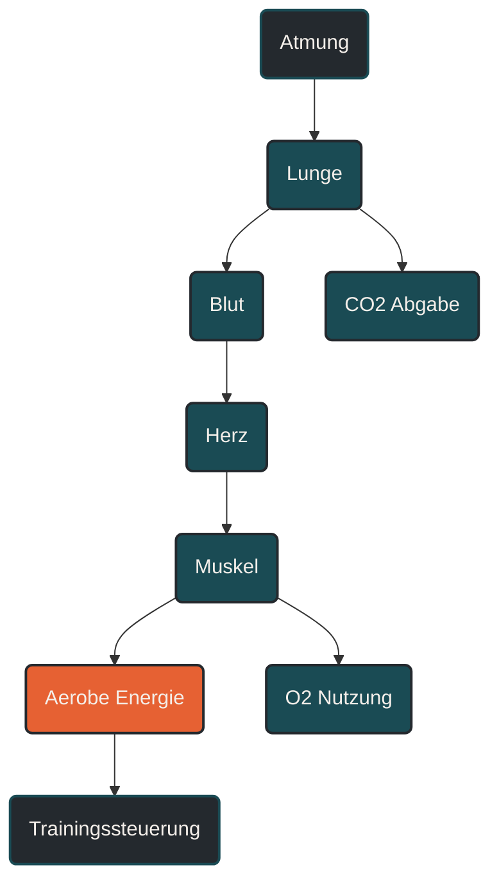

# Atmung und Sauerstoffaufnahme

Atmung und Sauerstoffaufnahme beschreiben, wie Sauerstoff aus der Umgebungsluft über Lunge, Blut und Herz-Kreislauf-System zu den arbeitenden Muskeln gelangt. Im Ausdauertraining ist das wichtig, weil die Sauerstoffversorgung eine zentrale Grundlage für aerobe Energieproduktion, Belastbarkeit und Leistungsfähigkeit ist. Entscheidend ist nicht nur, wie viel Luft eingeatmet wird, sondern wie gut Sauerstoff aufgenommen, transportiert und in der Muskulatur genutzt werden kann. [[1]](#quelle-1) [[2]](#quelle-2) [[3]](#quelle-3)

## Was Atmung und Sauerstoffaufnahme bedeutet

Bei jeder Einatmung gelangt Luft in die Lunge. Dort wird Sauerstoff über die Lungenbläschen in das Blut aufgenommen. Gleichzeitig wird Kohlendioxid aus dem Blut abgegeben und ausgeatmet. Dieser Austausch wird als Gasaustausch bezeichnet. [[4]](#quelle-4)

Für Ausdauersport ist dieser Prozess besonders wichtig, weil die Muskulatur bei längerer Belastung überwiegend aerob arbeitet. Das bedeutet: Sie nutzt Sauerstoff, um aus Kohlenhydraten und Fetten Energie bereitzustellen. [[1]](#quelle-1) [[3]](#quelle-3)

Sauerstoffaufnahme ist deshalb kein einzelner Vorgang, sondern eine Kette aus mehreren Schritten:

- Luft wird eingeatmet.
- Sauerstoff gelangt in die Lungenbläschen.
- Sauerstoff diffundiert ins Blut.
- Hämoglobin transportiert Sauerstoff im Blut.
- Das Herz pumpt sauerstoffreiches Blut zur Muskulatur.
- Die Muskelzellen nutzen Sauerstoff in den Mitochondrien.

Wenn ein Glied dieser Kette limitiert ist, kann die aerobe Leistungsfähigkeit begrenzt werden. [[1]](#quelle-1) [[3]](#quelle-3)

## Warum Atmung und Sauerstoffaufnahme wichtig ist

Ausdauerleistung entsteht nicht allein durch eine starke Lunge oder ein großes Atemvolumen. Entscheidend ist das Zusammenspiel aus Atmung, Herz-Kreislauf-System, Blut, Gefäßen und Muskulatur. [[1]](#quelle-1) [[2]](#quelle-2) [[3]](#quelle-3)

Die Atmung sorgt dafür, dass Sauerstoff verfügbar wird und Kohlendioxid abgegeben werden kann. Das Herz-Kreislauf-System verteilt diesen Sauerstoff. Die Muskulatur entscheidet schließlich, wie gut der Sauerstoff für die Energieproduktion genutzt werden kann. [[4]](#quelle-4)

Im Training zeigt sich das besonders deutlich: Bei niedriger Intensität reicht eine ruhige, kontrollierte Atmung meist aus. Mit steigender Belastung nimmt die Atemfrequenz zu, weil mehr Sauerstoff benötigt und mehr Kohlendioxid abgegeben werden muss. Ab einer bestimmten Intensität steigt die Ventilation überproportional an. Das hängt unter anderem mit metabolischer Belastung, Laktatbildung, Säure-Basen-Regulation und zunehmendem Atemantrieb zusammen. [[4]](#quelle-4) [[5]](#quelle-5)

## Wie Sauerstoff im Körper aufgenommen wird

Der Gasaustausch findet in den Alveolen statt. Das sind kleine Lungenbläschen mit sehr großer Oberfläche. Dort liegt die eingeatmete Luft dicht an feinen Blutgefäßen. Sauerstoff wandert entlang eines Konzentrationsgefälles aus der Luft ins Blut. [[4]](#quelle-4)

Im Blut bindet Sauerstoff überwiegend an Hämoglobin in den roten Blutkörperchen. Dadurch kann deutlich mehr Sauerstoff transportiert werden, als wenn er nur frei im Blut gelöst wäre.

Die eigentliche Sauerstoffaufnahme im sportlichen Sinn endet aber nicht in der Lunge. Erst wenn Sauerstoff in der arbeitenden Muskulatur ankommt und dort in den Mitochondrien genutzt wird, wird er für die Ausdauerleistung wirksam.

## Zentrale Einflussfaktoren

### Ventilation

Ventilation beschreibt die Menge Luft, die pro Minute ein- und ausgeatmet wird. Sie setzt sich aus Atemfrequenz und Atemzugvolumen zusammen. Bei Belastung steigen beide Faktoren an. [[4]](#quelle-4) [[5]](#quelle-5)

Eine hohe Ventilation allein bedeutet aber nicht automatisch eine hohe Ausdauerleistung. Entscheidend ist, ob die Atmung ökonomisch bleibt und ob der Sauerstoff tatsächlich ins Blut und weiter in die Muskulatur gelangt. [[4]](#quelle-4) [[5]](#quelle-5)

### Diffusion

Diffusion beschreibt den Übertritt von Sauerstoff aus den Lungenbläschen ins Blut. Dieser Prozess hängt unter anderem von der Oberfläche der Alveolen, der Durchblutung der Lunge und dem Konzentrationsgefälle zwischen Atemluft und Blut ab. [[4]](#quelle-4)

Bei gesunden Ausdauersportlern ist die Lunge im Alltag meist nicht der erste limitierende Faktor. Bei sehr hoher Belastung, großer Höhe oder bestehenden Atemwegserkrankungen kann der pulmonale Anteil jedoch relevanter werden.

### Sauerstofftransport

Nach der Aufnahme in der Lunge muss Sauerstoff über das Blut transportiert werden. Hier sind Herzminutenvolumen, Blutvolumen, Hämoglobingehalt und Gefäßversorgung entscheidend. [[1]](#quelle-1) [[2]](#quelle-2)

Das Herz-Kreislauf-System bestimmt, wie viel sauerstoffreiches Blut pro Minute zur arbeitenden Muskulatur gelangt. Deshalb hängen Atmung und Sauerstoffaufnahme eng mit Schlagvolumen, Herzfrequenz und Herzminutenvolumen zusammen. [[1]](#quelle-1) [[2]](#quelle-2)

### Sauerstoffausschöpfung

Die Muskulatur muss den gelieferten Sauerstoff auch nutzen können. Dafür sind Kapillarisierung, Mitochondriendichte, Enzymaktivität und lokale Durchblutung wichtig. [[2]](#quelle-2) [[3]](#quelle-3)

Ausdauertraining verbessert häufig nicht nur den Transport, sondern auch die Fähigkeit der Muskulatur, Sauerstoff aus dem Blut aufzunehmen und aerob zu verwerten. [[1]](#quelle-1) [[3]](#quelle-3)

## Atmung, VO2 und VO2max

Die Sauerstoffaufnahme wird häufig als VO2 beschrieben. Sie gibt an, wie viel Sauerstoff der Körper pro Minute aufnimmt und verwertet. Die VO2max beschreibt die maximale Sauerstoffaufnahme unter starker Belastung. [[1]](#quelle-1) [[2]](#quelle-2) [[6]](#quelle-6)

VO2max ist ein wichtiger Leistungsmarker, aber nicht der einzige. Zwei Menschen mit ähnlicher VO2max können unterschiedlich leistungsfähig sein, weil auch Laufökonomie, Schwellenleistung, Ermüdungsresistenz, Technik und Trainingszustand eine große Rolle spielen. [[1]](#quelle-1) [[2]](#quelle-2) [[6]](#quelle-6)

Für die Praxis ist deshalb wichtig: Eine hohe Sauerstoffaufnahme zeigt ein großes aerobes Potenzial. Wie gut dieses Potenzial in Tempo, Leistung oder Wettkampffähigkeit umgesetzt wird, hängt von mehreren weiteren Faktoren ab. [[1]](#quelle-1) [[3]](#quelle-3)

## Atemmuster und Belastungssteuerung

Die Atmung kann helfen, Belastung subjektiv einzuordnen. Bei lockeren Dauerläufen ist meist noch ruhiges Sprechen möglich. Bei moderater Intensität werden Sätze kürzer. Bei hoher Intensität ist oft nur noch einzelne Wortkommunikation möglich. [[7]](#quelle-7)

Das ist kein Ersatz für Leistungsdiagnostik, kann aber im Alltag eine hilfreiche Orientierung sein. Gerade im Ausdauertraining zeigt die Atmung oft früher als die Pace, ob eine Einheit wirklich locker, moderat oder hart ist.

Ein bewusst ruhiger Atemrhythmus kann helfen, die Belastung besser wahrzunehmen. Er macht Training aber nicht automatisch effektiver. Entscheidend bleibt die tatsächliche Intensität, nicht nur das Gefühl einer kontrollierten Atmung.

## Bedeutung für Läufer

Für Läufer ist Atmung und Sauerstoffaufnahme besonders relevant, weil Laufen eine kontinuierliche, rhythmische Ausdauerbelastung ist. Je besser Sauerstoff aufgenommen, transportiert und genutzt wird, desto stabiler kann ein aerobes Tempo gehalten werden. [[1]](#quelle-1) [[3]](#quelle-3)

Lockere Dauerläufe fördern vor allem die aerobe Basis. Sie unterstützen Anpassungen wie bessere Kapillarisierung, effizientere Sauerstoffnutzung und ökonomischere Belastungsverarbeitung. Intensive Einheiten können die maximale Sauerstoffaufnahme und die Belastungstoleranz in höheren Intensitätsbereichen ansprechen. [[1]](#quelle-1) [[3]](#quelle-3) [[2]](#quelle-2) [[6]](#quelle-6)

Wichtig ist aber: Mehr Atemanstrengung ist nicht automatisch besseres Training. Wenn jede Einheit stark außer Atem macht, fehlt oft die Grundlage für langfristige Anpassung. Gutes Ausdauertraining nutzt unterschiedliche Intensitäten, damit Atmung, Kreislauf und Muskulatur sinnvoll belastet und ausreichend regeneriert werden.

## Häufige Fehler

Ein häufiger Fehler ist die Annahme, dass Luftnot immer bedeutet, dass die Lunge der limitierende Faktor ist. Oft entsteht hohe Atemarbeit durch die Gesamtbelastung des Körpers, steigende Kohlendioxidproduktion, muskuläre Ermüdung oder zu hohe Intensität. [[4]](#quelle-4)

Ein weiterer Fehler ist, Atmung isoliert zu betrachten. Sauerstoffaufnahme hängt nicht nur von der Lunge ab, sondern von der gesamten Transport- und Nutzungskette.

Auch Atemtechniken werden manchmal überschätzt. Sie können Wahrnehmung, Rhythmus und Entspannung unterstützen, ersetzen aber keine passende Trainingssteuerung, keine Grundlagenausdauer und keine ausreichende Erholung.

## Praktische Einordnung

Atmung und Sauerstoffaufnahme bilden eine zentrale Grundlage der Ausdauerleistung. Für das Training bedeutet das: Nicht nur harte Einheiten verbessern die Sauerstoffaufnahme. Auch regelmäßige, kontrollierte Grundlageneinheiten sind wichtig, weil sie die Fähigkeit des Körpers verbessern, Sauerstoff effizient zu transportieren und zu nutzen.

Der wichtigste Merksatz lautet: Ausdauer entsteht nicht durch möglichst viel Luft, sondern durch das Zusammenspiel aus Atmung, Kreislauf, Blut und arbeitender Muskulatur. [[1]](#quelle-1) [[2]](#quelle-2) [[3]](#quelle-3)

----

----

## Häufige Fragen zu Atmung und Sauerstoffaufnahme

### Was ist Atmung und Sauerstoffaufnahme einfach erklärt?

Atmung und Sauerstoffaufnahme beschreiben, wie Sauerstoff aus der Luft in die Lunge gelangt, ins Blut aufgenommen, zum Muskel transportiert und dort für die Energieproduktion genutzt wird.

### Warum ist Sauerstoffaufnahme im Ausdauertraining wichtig?

Sauerstoffaufnahme ist wichtig, weil längere Belastungen überwiegend aerob ablaufen. Je besser Sauerstoff transportiert und genutzt werden kann, desto stabiler kann der Körper Ausdauerleistung erbringen.

### Ist die Lunge beim Laufen immer der limitierende Faktor?

Nicht unbedingt. Bei vielen gesunden Sportlern liegt die Begrenzung eher im Zusammenspiel aus Herz-Kreislauf-System, Bluttransport, muskulärer Sauerstoffnutzung und Belastungssteuerung.

### Was bedeutet VO2max?

VO2max beschreibt die maximale Menge Sauerstoff, die der Körper pro Minute aufnehmen und verwerten kann. Sie ist ein wichtiger Marker für das aerobe Potenzial, erklärt die Ausdauerleistung aber nicht allein.

### Kann man Sauerstoffaufnahme trainieren?

Ja, regelmäßiges Ausdauertraining kann die Sauerstoffaufnahme, den Sauerstofftransport und die Sauerstoffnutzung verbessern. Je nach Trainingsform werden dabei unterschiedliche Teile der aeroben Leistungsfähigkeit angesprochen.

### Woran merkt man eine zu hohe Belastung über die Atmung?

Wenn ruhiges Sprechen kaum noch möglich ist, die Atmung stark beschleunigt und die Belastung dauerhaft schwer kontrollierbar wird, liegt die Intensität meist deutlich höher. Das kann für intensive Einheiten sinnvoll sein, sollte aber nicht jede Trainingseinheit prägen.

----

## Quellen

### Quelle 1

[1] Bassett, D. R. Jr., & Howley, E. T. (2000): [Limiting Factors for Maximum Oxygen Uptake and Determinants of Endurance Performance](https://www.bisp-surf.de/Record/PU199912405333). Medicine & Science in Sports & Exercise.

### Quelle 2

[2] Lundby, C., Montero, D., & Joyner, M. (2017): [Biology of VO₂max: Looking Under the Physiology Lamp](https://mayoclinic.elsevierpure.com/en/publications/biology-of-vosub2submax-looking-under-the-physiology-lamp/). Acta Physiologica.

### Quelle 3

[3] Joyner, M. J., & Coyle, E. F. (2008): [Endurance Exercise Performance: The Physiology of Champions](https://pubmed.ncbi.nlm.nih.gov/17901124/). The Journal of Physiology.

### Quelle 4

[4] Hopkins, S. R. et al. (2021): [Pulmonary Gas Exchange and Acid-Base Balance During Exercise](https://pmc.ncbi.nlm.nih.gov/articles/PMC8315793/). Comprehensive Physiology.

### Quelle 5

[5] Stickland, M. K., & Lovering, A. T. (2019): [Respiratory Limitations to Exercise in Health: A Brief Review](https://www.sciencedirect.com/science/article/pii/S2468867319300987). Current Opinion in Physiology.

### Quelle 6

[6] Helgerud, J. et al. (2007): [Aerobic High-Intensity Intervals Improve VO₂max More Than Moderate Training](https://pubmed.ncbi.nlm.nih.gov/17414804/). Medicine & Science in Sports & Exercise.

### Quelle 7

[7] Bok, D., Rakovac, M., & Foster, C. (2022): [An Examination and Critique of Subjective Methods to Determine Exercise Intensity](https://link.springer.com/article/10.1007/s40279-022-01690-3). Sports Medicine.

----

*Hinweis: Dieser Artikel dient der allgemeinen Information und ersetzt keine medizinische oder therapeutische Beratung. Mehr dazu im [**Gesundheits- und Quellenhinweis**](/ausdauersport/disclaimer/).*

