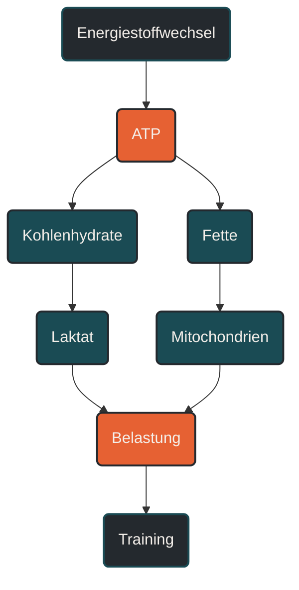

# Energiestoffwechsel

Energiestoffwechsel beschreibt, wie der Körper aus gespeicherter oder zugeführter Energie nutzbare Bewegungsenergie gewinnt. Im Ausdauertraining ist das wichtig, weil jede Belastung Energie benötigt und unterschiedliche Intensitäten verschiedene Stoffwechselwege stärker beanspruchen. Entscheidend ist, dass Fettstoffwechsel, Kohlenhydratstoffwechsel und kurzfristige Energiesysteme immer zusammenarbeiten, aber je nach Belastung unterschiedlich stark beteiligt sind. [[1]](#quelle-1) [[2]](#quelle-2)

## Was Energiestoffwechsel bedeutet

Der Körper kann Energie nicht direkt aus Nahrung oder Körperspeichern für Bewegung nutzen. Er muss sie zuerst in eine unmittelbar verfügbare Form überführen. Diese zentrale Energiewährung heißt ATP. [[1]](#quelle-1) [[2]](#quelle-2)

ATP wird bei jeder Muskelkontraktion verbraucht und muss ständig neu gebildet werden. Dafür nutzt der Körper vor allem Kohlenhydrate und Fette. In bestimmten Situationen können auch Proteine eine Rolle spielen, sie sind aber im normalen Ausdauertraining nicht die bevorzugte Energiequelle. [[1]](#quelle-1) [[2]](#quelle-2)

Der Energiestoffwechsel ist deshalb kein einzelner Prozess, sondern ein Zusammenspiel mehrerer Systeme:

- kurzfristige Energiebereitstellung über gespeicherte Phosphate
- Kohlenhydratabbau über Glykolyse
- aerobe Energiegewinnung in den Mitochondrien
- Fettverbrennung bei niedriger bis moderater Intensität
- Laktatbildung und Laktatnutzung bei steigender Belastung

Diese Systeme laufen nicht nacheinander wie ein Schalter, sondern überlappen sich.

## Warum Energiestoffwechsel wichtig ist

Ausdauerleistung hängt stark davon ab, wie gut der Körper Energie über längere Zeit bereitstellen kann. Bei lockeren Belastungen kann ein großer Teil der Energie aus Fetten gewonnen werden. Bei höheren Intensitäten steigt der Anteil der Kohlenhydrate, weil sie schneller Energie liefern können. [[1]](#quelle-1)

Das erklärt, warum ein lockerer Dauerlauf anders wirkt als ein Intervalltraining. Beide trainieren den Energiestoffwechsel, aber mit unterschiedlichem Schwerpunkt. Niedrige Intensitäten fördern vor allem die Fähigkeit, Energie ökonomisch und lange bereitzustellen. Höhere Intensitäten fordern stärker den Kohlenhydratstoffwechsel, die Laktatverarbeitung und die maximale aerobe Leistungsfähigkeit. [[4]](#quelle-4) [[1]](#quelle-1)

Für Läufer ist der Energiestoffwechsel deshalb eine Grundlage, um Intensitäten, Ermüdung, Ernährung und Leistungsentwicklung besser einzuordnen. [[1]](#quelle-1)

## Wie Energiestoffwechsel im Training wirkt

Training setzt wiederholte Energieanforderungen. Der Körper reagiert darauf mit Anpassungen. Dazu gehören unter anderem eine bessere Sauerstoffnutzung, mehr oder leistungsfähigere Mitochondrien, eine verbesserte Kapillarisierung und eine effizientere Nutzung von Kohlenhydraten und Fetten. [[1]](#quelle-1) [[2]](#quelle-2) [[5]](#quelle-5)

Bei regelmäßigem Ausdauertraining kann die Muskulatur lernen, bei gleicher Belastung weniger stark auf schnell verfügbare Kohlenhydrate angewiesen zu sein. Gleichzeitig verbessert sich die Fähigkeit, Laktat nicht nur zu bilden, sondern auch wieder zu nutzen. [[1]](#quelle-1) [[4]](#quelle-4)

Das ist wichtig, weil Laktat kein reines Abfallprodukt ist. Es entsteht vor allem, wenn Kohlenhydrate schnell umgesetzt werden. Es kann innerhalb des Körpers weitertransportiert und in anderen Geweben wieder als Energiequelle genutzt werden. [[1]](#quelle-1) [[4]](#quelle-4)

## Zentrale Einflussfaktoren

### Intensität

Die Trainingsintensität bestimmt stark, welche Energiequellen dominieren. Bei niedriger Intensität ist der relative Fettanteil höher. Mit steigender Intensität nimmt der Kohlenhydratanteil zu, weil Kohlenhydrate schneller ATP bereitstellen können. [[1]](#quelle-1) [[2]](#quelle-2)

Das bedeutet nicht, dass niedrige Intensität automatisch besser ist. Es bedeutet nur, dass unterschiedliche Intensitäten unterschiedliche Stoffwechselanteile betonen. [[1]](#quelle-1)

### Trainingsdauer

Je länger eine Belastung dauert, desto wichtiger wird eine stabile Energieversorgung. Bei langen Läufen spielen Glykogenspeicher, Fettstoffwechsel, Flüssigkeitshaushalt und Belastungssteuerung zusammen. [[1]](#quelle-1) [[6]](#quelle-6)

Wenn Kohlenhydratspeicher stark sinken, kann die Leistung deutlich abfallen. Das wird umgangssprachlich oft als Einbruch oder „gegen die Wand laufen“ beschrieben.

### Trainingszustand

Trainierte Ausdauersportler können bei gleicher absoluter Belastung häufig ökonomischer arbeiten. Sie nutzen Sauerstoff besser, verarbeiten Laktat effizienter und können Energie über längere Zeit stabiler bereitstellen. [[4]](#quelle-4) [[1]](#quelle-1)

Ein besserer Trainingszustand bedeutet aber nicht, dass Ermüdung verschwindet. Er verschiebt nur, bei welcher Belastung bestimmte Stoffwechselgrenzen erreicht werden. [[1]](#quelle-1) [[4]](#quelle-4)

### Ernährung und Energieverfügbarkeit

Der Energiestoffwechsel hängt auch davon ab, ob ausreichend Energie und Nährstoffe verfügbar sind. Zu wenig Energiezufuhr kann Training, Regeneration, Hormonhaushalt und Anpassung beeinträchtigen.

Für die Praxis ist wichtig: Training setzt den Reiz, aber Energieverfügbarkeit und Regeneration entscheiden mit darüber, ob daraus Anpassung entsteht.

## Fettstoffwechsel und Kohlenhydratstoffwechsel

Fette liefern sehr viel Energie, können aber vergleichsweise langsam genutzt werden. Sie sind besonders wichtig für lange, niedrige bis moderate Belastungen.

Kohlenhydrate liefern schneller Energie und werden mit steigender Intensität wichtiger. Sie sind begrenzt gespeichert, vor allem als Glykogen in Muskulatur und Leber. [[1]](#quelle-1)

Gutes Ausdauertraining verbessert nicht nur einen dieser Wege. Es verbessert das Zusammenspiel. Der Körper soll bei niedriger Intensität ökonomisch arbeiten, bei höherer Intensität ausreichend Kohlenhydrate nutzen können und Belastungswechsel möglichst stabil verarbeiten. [[1]](#quelle-1)

## Laktat und metabolische Belastung

Laktat entsteht besonders dann, wenn Kohlenhydrate schnell abgebaut werden. Lange wurde Laktat vor allem als Zeichen von Übersäuerung verstanden. Heute ist die Einordnung differenzierter: Laktat ist auch ein Energieträger und ein Signalstoff. [[1]](#quelle-1) [[4]](#quelle-4)

Im Training ist Laktat trotzdem ein wichtiger Hinweis auf die Belastungsintensität. Wenn die Laktatbildung und die Laktatverwertung nicht mehr im Gleichgewicht bleiben, steigt die metabolische Beanspruchung deutlich. Das zeigt sich oft durch schwerere Atmung, brennende Muskulatur und schneller zunehmende Ermüdung. [[4]](#quelle-4) [[1]](#quelle-1)

Für die Trainingssteuerung sind deshalb Schwellenbereiche wichtig. Sie helfen einzuordnen, ab wann eine Belastung nicht mehr locker, sondern zunehmend fordernd wird. [[4]](#quelle-4)

## Bedeutung für Läufer

Für Läufer erklärt der Energiestoffwechsel, warum nicht jede Einheit hart sein sollte. Lockere Dauerläufe entwickeln eine andere Grundlage als Intervalle oder Tempodauerläufe. Beide sind sinnvoll, aber sie erfüllen unterschiedliche Aufgaben.

Lockere Einheiten unterstützen die aerobe Basis, Fettstoffwechsel, mitochondriale Anpassung und Belastungsverträglichkeit. Intensive Einheiten sprechen stärker Kohlenhydratstoffwechsel, Laktatdynamik und hohe Sauerstoffumsätze an. [[4]](#quelle-4)

In der Praxis hilft dieses Verständnis, Trainingsbereiche sinnvoll zu trennen. Wer jeden Lauf zu schnell läuft, belastet häufig den Kohlenhydratstoffwechsel stärker als geplant und riskiert, dass Erholung und langfristige Anpassung leiden.

## Häufige Fehler

Ein häufiger Fehler ist die Vorstellung, dass der Körper entweder nur Fett oder nur Kohlenhydrate verbrennt. Tatsächlich laufen beide Prozesse fast immer parallel. [[1]](#quelle-1)

Ein weiterer Fehler ist die Annahme, Laktat sei grundsätzlich schlecht. Laktat zeigt Belastung an, kann aber auch weiterverwertet werden und ist Teil eines normalen Stoffwechselprozesses. [[4]](#quelle-4)

Auch Nüchterntraining wird oft überschätzt. Es kann bestimmte Stoffwechselreize setzen, ist aber kein Wundermittel und ersetzt keine gute Trainingsstruktur. Bei zu hoher Belastung oder schlechter Energieverfügbarkeit kann es auch kontraproduktiv sein. [[6]](#quelle-6) [[7]](#quelle-7)

## Praktische Einordnung

Energiestoffwechsel hilft zu verstehen, warum unterschiedliche Trainingsformen unterschiedliche Wirkungen haben. Lockere Läufe, lange Läufe, Tempodauerläufe und Intervalle sprechen den Körper nicht gleich an, sondern setzen verschiedene metabolische Schwerpunkte.

Der wichtigste Merksatz lautet: Ausdauer entsteht nicht durch einen einzelnen Energiestoffwechselweg, sondern durch das Zusammenspiel von ATP-Bereitstellung, Fettstoffwechsel, Kohlenhydratstoffwechsel, Laktatverarbeitung und Erholung. [[1]](#quelle-1) [[2]](#quelle-2) [[4]](#quelle-4)

----

----

## Häufige Fragen zu Energiestoffwechsel

### Was ist Energiestoffwechsel einfach erklärt?

Energiestoffwechsel beschreibt, wie der Körper aus Kohlenhydraten, Fetten und anderen Energiequellen ATP bildet. ATP ist die unmittelbar nutzbare Energieform für Muskelarbeit.

### Warum ist Energiestoffwechsel im Ausdauertraining wichtig?

Er erklärt, warum unterschiedliche Intensitäten unterschiedlich wirken. Lockere Läufe beanspruchen den Stoffwechsel anders als Intervalle, Tempodauerläufe oder lange Läufe.

### Verbrennt man beim lockeren Laufen nur Fett?

Nein. Der Körper nutzt fast immer Fett und Kohlenhydrate gleichzeitig. Bei niedriger Intensität ist der relative Fettanteil höher, bei steigender Intensität nimmt der Kohlenhydratanteil zu.

### Ist Laktat ein Abfallprodukt?

Laktat ist kein reines Abfallprodukt. Es entsteht bei intensiverem Kohlenhydratstoffwechsel und kann im Körper weiter als Energiequelle genutzt werden.

### Warum sind Kohlenhydrate bei hoher Intensität wichtig?

Kohlenhydrate können schneller Energie bereitstellen als Fette. Deshalb werden sie bei höherer Intensität wichtiger, besonders bei Tempoarbeit, Intervallen und Wettkämpfen.

### Was ist ein häufiger Fehler beim Energiestoffwechsel?

Ein häufiger Fehler ist, einzelne Stoffwechselwege isoliert zu betrachten. In der Praxis arbeiten Fettstoffwechsel, Kohlenhydratstoffwechsel, Laktatverarbeitung und Sauerstoffnutzung immer zusammen.

----

## Quellen

### Quelle 1

[1] Hargreaves, M., & Spriet, L. L. (2020): [Skeletal Muscle Energy Metabolism During Exercise](https://pubmed.ncbi.nlm.nih.gov/32747792/). Nature Metabolism.

### Quelle 2

[2] Hawley, J. A., Hargreaves, M., Joyner, M. J., & Zierath, J. R. (2014): [Integrative Biology of Exercise](https://www.cell.com/fulltext/S0092-8674%2814%2901317-8). Cell.

### Quelle 3

[3] Egan, B., & Zierath, J. R. (2013): [Exercise Metabolism and the Molecular Regulation of Skeletal Muscle Adaptation](https://www.sciencedirect.com/science/article/pii/S1550413112005037). Cell Metabolism.

### Quelle 4

[4] Brooks, G. A. (2018): [The Science and Translation of Lactate Shuttle Theory](https://www.sciencedirect.com/science/article/pii/S1550413118301864). Cell Metabolism.

### Quelle 5

[5] Granata, C., Jamnick, N. A., & Bishop, D. J. (2018): [Training-Induced Changes in Mitochondrial Content and Respiratory Function in Human Skeletal Muscle](https://link.springer.com/article/10.1007/s40279-018-0936-y). Sports Medicine.

### Quelle 6

[6] Jeukendrup, A. E. (2017): [Training the Gut for Athletes](https://pubmed.ncbi.nlm.nih.gov/28332114/). Sports Medicine.

### Quelle 7

[7] Mountjoy, M. et al. (2018): [IOC Consensus Statement on Relative Energy Deficiency in Sport (RED-S)](https://pubmed.ncbi.nlm.nih.gov/29773536/). British Journal of Sports Medicine.

----

*Hinweis: Dieser Artikel dient der allgemeinen Information und ersetzt keine medizinische oder therapeutische Beratung. Mehr dazu im [**Gesundheits- und Quellenhinweis**](/ausdauersport/disclaimer/).*

