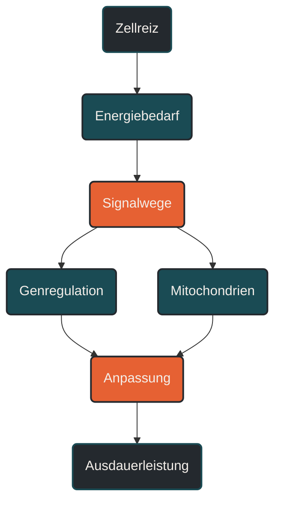

# Zellmetabolismus und Epigenetik

Zellmetabolismus und Epigenetik beschreiben, wie Muskelzellen Energie verarbeiten und wie Trainingsreize die Aktivität bestimmter Gene beeinflussen können, ohne die DNA selbst zu verändern. Im Ausdauertraining ist das wichtig, weil Anpassungen nicht nur im Herzen, in der Lunge oder im Blut entstehen, sondern tief in der Zelle beginnen. Entscheidend ist: Training wirkt als wiederholtes Signal, auf das Zellen mit Stoffwechselanpassung, besserer Energieverwertung und veränderter Genregulation reagieren können. [[1]](#quelle-1) [[2]](#quelle-2) [[4]](#quelle-4)

## Was Zellmetabolismus und Epigenetik bedeutet

Zellmetabolismus beschreibt alle Stoffwechselprozesse innerhalb einer Zelle. Dazu gehören Energiegewinnung, Energieverbrauch, Reparaturprozesse, Signalweiterleitung und Anpassung an Belastung. [[1]](#quelle-1) [[2]](#quelle-2)

Für Ausdauersport ist vor allem die Muskelzelle wichtig. Sie muss während Belastung ATP bereitstellen, Sauerstoff nutzen, Kohlenhydrate und Fette verwerten und gleichzeitig mit Ermüdung, Temperatur, mechanischer Belastung und metabolischem Stress umgehen. [[2]](#quelle-2)

Epigenetik beschreibt Mechanismen, die beeinflussen können, welche Gene stärker oder schwächer abgelesen werden. Die DNA-Sequenz wird dabei nicht verändert. Es geht also nicht darum, dass Training die Gene „umschreibt“, sondern darum, dass bestimmte genetische Programme je nach Reizlage anders reguliert werden können. [[4]](#quelle-4) [[5]](#quelle-5)

## Warum Zellmetabolismus und Epigenetik wichtig ist

Ausdauertraining führt nicht nur dazu, dass man sich subjektiv fitter fühlt. Es setzt wiederholte molekulare Signale. Diese Signale entstehen unter anderem durch Energieverbrauch, veränderte Kalziumkonzentrationen, mechanische Belastung, Sauerstoffumsatz und Stoffwechselprodukte. [[1]](#quelle-1) [[2]](#quelle-2)

Die Zelle reagiert darauf mit Anpassungen. Dazu gehören eine bessere mitochondriale Funktion, veränderte Enzymaktivität, effizientere Nutzung von Fetten und Kohlenhydraten sowie eine verbesserte Belastungstoleranz. [[2]](#quelle-2) [[3]](#quelle-3) [[6]](#quelle-6)

Epigenetische Mechanismen helfen zu erklären, warum regelmäßiges Training langfristige Anpassungen auslösen kann. Sie sind eine Art Regulationsschicht zwischen Trainingsreiz und biologischer Antwort.

## Wie Zellmetabolismus im Training wirkt

Während einer Ausdauerbelastung steigt der Energiebedarf der Muskelzelle. ATP wird fortlaufend verbraucht und muss neu gebildet werden. Je nach Intensität und Dauer nutzt die Zelle unterschiedliche Anteile aus Kohlenhydraten und Fetten.

Bei längeren und niedrigeren Intensitäten spielt die aerobe Energiegewinnung eine große Rolle. Dabei werden Sauerstoff, Mitochondrien und oxidative Enzyme besonders wichtig. Bei höheren Intensitäten steigt der Anteil des Kohlenhydratstoffwechsels, und die metabolische Beanspruchung nimmt schneller zu.

Training fordert diese Systeme wiederholt heraus. Dadurch können Muskelzellen lernen, Energie stabiler bereitzustellen und Belastungswechsel besser zu verarbeiten.

## Wie Epigenetik im Training wirkt

Epigenetik ist keine magische Zusatzebene, sondern ein biologischer Regulationsmechanismus. Trainingsreize können beeinflussen, wie bestimmte Gene abgelesen werden. Das betrifft unter anderem Gene, die mit Energieproduktion, Mitochondrien, Entzündungsregulation, Glukosestoffwechsel und Anpassungsprozessen zusammenhängen.

Wichtige epigenetische Mechanismen sind DNA-Methylierung, Histon-Modifikationen und nicht-kodierende RNA. Diese Begriffe beschreiben unterschiedliche Wege, wie die Zugänglichkeit oder Aktivität genetischer Informationen verändert werden kann. [[4]](#quelle-4) [[5]](#quelle-5)

Für die Trainingspraxis bedeutet das: Nicht eine einzelne Einheit entscheidet, sondern wiederholte Reize über Zeit. Regelmäßigkeit, Intensitätsverteilung, Erholung und Energieverfügbarkeit bestimmen mit, ob die Zelle Anpassung aufbauen kann. [[1]](#quelle-1) [[2]](#quelle-2)

## Zentrale Einflussfaktoren

### Energiestatus

Der Energiestatus der Zelle ist ein starkes Signal. Wenn ATP verbraucht wird und der Energiebedarf steigt, werden zelluläre Sensoren aktiviert. Diese Sensoren helfen der Zelle einzuschätzen, ob Energie knapp ist und welche Anpassungen notwendig sind. [[2]](#quelle-2) [[7]](#quelle-7)

Ein wichtiger Zusammenhang ist: Belastung erzeugt einen Energiebedarf, und dieser Energiebedarf kann Anpassungssignale auslösen. Zu viel Belastung ohne Erholung kann diesen Prozess aber stören. [[1]](#quelle-1) [[2]](#quelle-2)

### Mitochondrien

Mitochondrien sind zentrale Orte der aeroben Energiegewinnung. Sie helfen dabei, aus Kohlenhydraten und Fetten ATP zu bilden. Ausdauertraining kann die mitochondriale Leistungsfähigkeit verbessern. [[3]](#quelle-3) [[6]](#quelle-6)

Das ist besonders wichtig für lange Belastungen, weil eine gut trainierte Muskulatur Sauerstoff und Energieträger effizienter nutzen kann.

### Signalwege

In der Zelle wirken viele Signalwege zusammen. Dazu gehören unter anderem Energiesensoren, Kalziumsignale, oxidative Signale und mechanische Reize. Sie übersetzen Training in biologische Anpassung. [[2]](#quelle-2) [[7]](#quelle-7)

Diese Signalwege sind nicht isoliert. Ein lockerer Dauerlauf, ein langer Lauf und ein intensives Intervalltraining setzen unterschiedliche Schwerpunkte und können unterschiedliche zelluläre Antworten auslösen. [[2]](#quelle-2) [[7]](#quelle-7)

### Erholung

Anpassung entsteht nicht nur während der Belastung. Viele Umbauprozesse laufen in der Erholungsphase. Schlaf, Ernährung, Trainingsabstand und Gesamtbelastung beeinflussen, ob ein Trainingsreiz verarbeitet werden kann. [[1]](#quelle-1) [[2]](#quelle-2)

Ohne ausreichende Erholung kann ein sinnvoller Reiz zu einer dauerhaft erhöhten Stressbelastung werden. Dann verbessert sich Zellfunktion nicht automatisch, sondern kann auch beeinträchtigt werden. [[1]](#quelle-1) [[2]](#quelle-2)

## Bedeutung für Läufer

Für Läufer erklärt dieses Thema, warum Ausdauertraining langfristig wirkt. Jede einzelne Einheit ist nur ein Reiz. Die eigentliche Anpassung entsteht, wenn Muskelzellen wiederholt auf diese Reize reagieren und ihre Stoffwechselorganisation verbessern.

Lockere Dauerläufe fördern vor allem eine stabile aerobe Grundlage. Längere Läufe fordern Energieverfügbarkeit und Ermüdungsresistenz. Intensive Einheiten setzen stärkere Signale für hohe Stoffwechselraten, Sauerstoffumsatz und Belastungstoleranz.

Das Ziel ist nicht, möglichst viele molekulare Signale gleichzeitig zu erzwingen. Sinnvoller ist ein Training, das Reiz und Erholung so kombiniert, dass die Zelle Anpassung aufbauen kann. [[1]](#quelle-1) [[2]](#quelle-2)

## Häufige Fehler

Ein häufiger Fehler ist die Vorstellung, Epigenetik bedeute, dass Training die DNA verändert. Das stimmt so nicht. Epigenetik beeinflusst die Genaktivität, nicht die grundlegende DNA-Sequenz.

Ein weiterer Fehler ist, Zellmetabolismus nur mit „Fettverbrennung“ oder „Kalorienverbrauch“ gleichzusetzen. In Wirklichkeit geht es um Energiefluss, Signalwege, Mitochondrien, Enzyme, Substratnutzung und Anpassung. [[2]](#quelle-2) [[7]](#quelle-7)

Auch Biohacking-Versprechen sollten vorsichtig betrachtet werden. Einzelne Maßnahmen können interessant sein, aber regelmäßiges Training, ausreichende Energiezufuhr, Schlaf und Erholung bleiben die stärkeren Grundlagen. [[1]](#quelle-1) [[2]](#quelle-2) [[4]](#quelle-4) [[7]](#quelle-7)

## Praktische Einordnung

Zellmetabolismus und Epigenetik machen sichtbar, dass Ausdauertraining tief in der Zelle wirkt. Gute Trainingsplanung ist deshalb mehr als Kilometer sammeln. Sie steuert wiederholte Reize, damit der Körper auf zellulärer Ebene Anpassung aufbauen kann.

Der wichtigste Merksatz lautet: Training verändert nicht einfach die Gene, sondern setzt Signale, auf die Zellen mit veränderter Stoffwechselorganisation und Genregulation reagieren können.

----

----

## Häufige Fragen zu Zellmetabolismus und Epigenetik

### Was ist Zellmetabolismus einfach erklärt?

Zellmetabolismus beschreibt die Stoffwechselprozesse in einer Zelle. Im Ausdauertraining geht es vor allem darum, wie Muskelzellen Energie bereitstellen, Sauerstoff nutzen und sich an Belastung anpassen.

### Was bedeutet Epigenetik im Training?

Epigenetik beschreibt Mechanismen, die beeinflussen können, wie stark bestimmte Gene abgelesen werden. Training kann solche Regulationsprozesse anstoßen, ohne die DNA-Sequenz selbst zu verändern.

### Verändert Ausdauertraining die Gene?

Ausdauertraining verändert nicht einfach die DNA. Es kann aber beeinflussen, welche genetischen Programme stärker oder schwächer aktiv sind.

### Warum sind Mitochondrien wichtig?

Mitochondrien sind zentrale Orte der aeroben Energiegewinnung. Sie helfen der Muskulatur, Sauerstoff, Fette und Kohlenhydrate für ATP-Bildung zu nutzen.

### Was ist ein häufiger Fehler bei Epigenetik?

Ein häufiger Fehler ist, Epigenetik als einfache Biohacking-Abkürzung zu verstehen. In der Praxis zählen vor allem regelmäßiges Training, passende Belastung, Erholung, Schlaf und ausreichende Energieverfügbarkeit.

### Für wen ist Zellmetabolismus und Epigenetik besonders relevant?

Das Thema ist für alle Ausdauersportler relevant, die verstehen möchten, warum Training langfristige Anpassungen erzeugt und warum Reiz, Ernährung und Erholung zusammengehören.

----

## Quellen

### Quelle 1

[1] Hawley, J. A., Hargreaves, M., Joyner, M. J., & Zierath, J. R. (2014): [Integrative Biology of Exercise](https://www.cell.com/fulltext/S0092-8674%2814%2901317-8). Cell.

### Quelle 2

[2] Egan, B., & Zierath, J. R. (2013): [Exercise Metabolism and the Molecular Regulation of Skeletal Muscle Adaptation](https://www.sciencedirect.com/science/article/pii/S1550413112005037). Cell Metabolism.

### Quelle 3

[3] Granata, C., Jamnick, N. A., & Bishop, D. J. (2018): [Training-Induced Changes in Mitochondrial Content and Respiratory Function in Human Skeletal Muscle](https://link.springer.com/article/10.1007/s40279-018-0936-y). Sports Medicine.

### Quelle 4

[4] Jacques, M. et al. (2019): [Epigenetic Changes in Healthy Human Skeletal Muscle Following Exercise: A Systematic Review](https://pmc.ncbi.nlm.nih.gov/articles/PMC6557592/). Epigenomics.

### Quelle 5

[5] Seaborne, R. A. et al. (2018): [Human Skeletal Muscle Possesses an Epigenetic Memory of Hypertrophy](https://www.nature.com/articles/s41598-018-20287-3). Scientific Reports.

### Quelle 6

[6] Mølmen, K. S., Almquist, N. W., & Skattebo, Ø. (2025): [Effects of Exercise Training on Mitochondrial and Capillary Growth in Human Skeletal Muscle](https://link.springer.com/article/10.1007/s40279-024-02120-2). Sports Medicine.

### Quelle 7

[7] Viollet, B. et al. (2010): [AMPK: Lessons from Transgenic and Knockout Animals](https://pubmed.ncbi.nlm.nih.gov/21050904/). Frontiers in Bioscience.

----

*Hinweis: Dieser Artikel dient der allgemeinen Information und ersetzt keine medizinische oder therapeutische Beratung. Mehr dazu im [**Gesundheits- und Quellenhinweis**](/ausdauersport/disclaimer/).*

