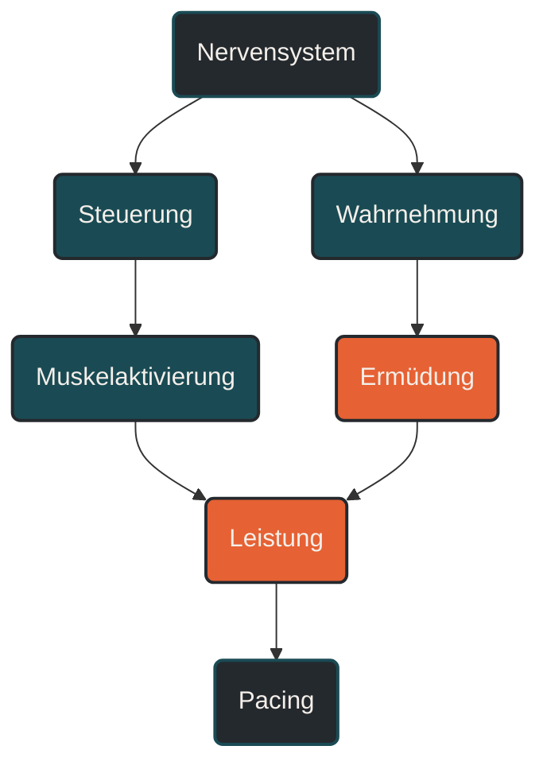

# Nervensystem und zentrale Ermüdung

Nervensystem und zentrale Ermüdung beschreiben, wie Gehirn, Rückenmark und Nerven die Ausdauerleistung steuern und begrenzen können. Im Ausdauertraining ist das wichtig, weil Ermüdung nicht nur in der Muskulatur entsteht, sondern auch durch Wahrnehmung, Motivation, Schutzmechanismen, Temperatur, Stoffwechselstress und neuronale Signalverarbeitung beeinflusst wird. Entscheidend ist: Leistung wird nicht nur durch den Muskel erzeugt, sondern vom Nervensystem reguliert.

## Was Nervensystem und zentrale Ermüdung bedeutet

Das Nervensystem steuert Bewegung, Muskelaktivierung, Belastungswahrnehmung und viele automatische Körperfunktionen. Beim Laufen entscheidet es unter anderem, welche Muskeln aktiviert werden, wie stark motorische Einheiten rekrutiert werden und wie Bewegung koordiniert bleibt.

Zentrale Ermüdung meint eine nachlassende Fähigkeit des zentralen Nervensystems, die Muskulatur vollständig oder dauerhaft anzusteuern. Sie unterscheidet sich von peripherer Ermüdung, die direkt im Muskel entsteht, zum Beispiel durch lokale Stoffwechselbelastung, Energiemangel oder Störung der Muskelkontraktion.

In der Praxis treten zentrale und periphere Ermüdung fast immer gemeinsam auf. Ein langer Lauf ermüdet nicht nur die Beine, sondern auch die Steuerung, Wahrnehmung und Bereitschaft, eine bestimmte Intensität weiter aufrechtzuerhalten.

## Warum zentrale Ermüdung wichtig ist

Ausdauerleistung entsteht aus dem Zusammenspiel von Körper und Nervensystem. Selbst wenn Muskulatur, Herz-Kreislauf-System und Energiestoffwechsel noch arbeiten können, kann die Belastung subjektiv so schwer werden, dass Tempo, Schrittfrequenz oder Bewegungsqualität abfallen.

Das Nervensystem verarbeitet ständig Rückmeldungen aus dem Körper. Dazu gehören Signale aus Muskeln, Sehnen, Gelenken, Herz-Kreislauf-System, Atmung und Temperaturregulation. Aus diesen Informationen entsteht ein Belastungseindruck.

Dieser Belastungseindruck beeinflusst, wie lange ein Tempo gehalten werden kann. Deshalb ist Ermüdung nicht nur eine objektive Größe, sondern auch eine regulierte Wahrnehmung.

## Wie zentrale Ermüdung im Training wirkt

Bei steigender Belastung muss das Nervensystem immer mehr koordinieren. Es aktiviert Muskeln, stabilisiert Bewegungen, verarbeitet Schmerz- und Drucksignale und reguliert die Intensität.

Wenn die Belastung lange dauert oder sehr intensiv wird, können zentrale Schutzmechanismen stärker werden. Das kann dazu führen, dass die mögliche Muskelaktivierung reduziert wird. Der Körper versucht dadurch, Überlastung, Überhitzung oder ein zu starkes inneres Ungleichgewicht zu vermeiden.

Das zeigt sich im Training oft als nachlassender Abdruck, schwerere Beine, sinkende Konzentration, schlechtere Koordination oder das Gefühl, „nicht mehr richtig antreiben“ zu können.

## Zentrale Einflussfaktoren

### Belastungswahrnehmung

Die subjektive Belastungswahrnehmung ist ein wichtiger Hinweis auf zentrale Ermüdung. Sie entsteht nicht nur aus Muskelarbeit, sondern aus vielen Signalen des Körpers.

Ein Tempo kann sich an einem Tag leicht und an einem anderen Tag schwer anfühlen, obwohl Pace und Herzfrequenz ähnlich sind. Schlaf, Stress, Hitze, Ernährung und Vorermüdung verändern, wie Belastung im Nervensystem bewertet wird.

### Motorische Steuerung

Das Nervensystem steuert, welche Muskeln wann und wie stark aktiv sind. Mit zunehmender Ermüdung kann diese Steuerung unpräziser werden.

Beim Laufen kann das zu kürzerem Schritt, weniger Abdruck, mehr Bodenkontaktzeit oder einer unruhigeren Bewegung führen. Solche Veränderungen sind nicht automatisch schlecht, aber sie zeigen, dass der Körper die Bewegung unter Ermüdung anpasst.

### Afferente Rückmeldungen

Afferente Rückmeldungen sind Signale aus dem Körper zum Gehirn und Rückenmark. Sie informieren über Muskelspannung, Stoffwechselbelastung, Schmerz, Temperatur und mechanische Beanspruchung.

Je stärker diese Signale werden, desto mehr kann das Nervensystem die Belastung als kritisch einordnen. Dadurch kann die weitere Leistungsabgabe begrenzt werden.

### Temperatur und Hitze

Hitze belastet das Nervensystem stark. Der Körper muss nicht nur Bewegung erzeugen, sondern auch die Körpertemperatur regulieren.

Bei hoher Temperatur steigt die Belastungswahrnehmung oft deutlich. Das Tempo fühlt sich früher hart an, die Konzentration kann sinken und die Bereitschaft, hohe Intensität zu halten, nimmt ab.

### Schlaf und Stress

Schlafmangel und Alltagsstress können zentrale Ermüdung verstärken. Das Nervensystem startet dann bereits mit höherer Grundbelastung in das Training.

Das bedeutet nicht, dass jedes Training bei Stress schlecht ist. Aber harte Einheiten sind unter hoher mentaler und körperlicher Vorbelastung oft schwerer zu verarbeiten.

## Zentrale Ermüdung und Pacing

Pacing beschreibt die bewusste oder unbewusste Einteilung der Belastung. Das Nervensystem spielt dabei eine zentrale Rolle, weil es aktuelle Rückmeldungen mit der erwarteten Dauer der Belastung verbindet.

Bei einem Wettkampf wird ein Tempo nicht nur durch die Muskulatur bestimmt. Auch Erfahrung, Motivation, Erwartung, Temperatur, Schmerz, Angst vor Einbruch und Vertrauen in die eigene Belastbarkeit beeinflussen die Intensitätswahl.

Gutes Pacing bedeutet deshalb nicht nur, eine Zielpace zu kennen. Es bedeutet auch, Körpersignale realistisch einzuordnen und nicht zu früh zu viel zentrale und periphere Ermüdung aufzubauen.

## Bedeutung für Läufer

Für Läufer ist zentrale Ermüdung besonders relevant, weil Laufleistung stark von Rhythmus, Koordination und mentaler Belastungstoleranz abhängt. Wenn das Nervensystem ermüdet, kann die Bewegung ineffizienter werden, auch wenn die Muskulatur noch nicht vollständig erschöpft ist.

Lockere Läufe helfen, Bewegungsrhythmus und Belastungsverträglichkeit aufzubauen. Lange Läufe trainieren nicht nur Energiestoffwechsel und Muskulatur, sondern auch die Fähigkeit, über längere Zeit konzentriert und stabil zu bleiben.

Intensive Einheiten fordern das Nervensystem besonders stark. Deshalb brauchen sie ausreichend Abstand, damit nicht nur Muskeln, sondern auch zentrale Steuerung und Belastungsverarbeitung regenerieren können.

## Häufige Fehler

Ein häufiger Fehler ist, Ermüdung nur als Muskelproblem zu betrachten. Schwere Beine können muskulär entstehen, aber auch durch Schlafmangel, Hitze, Stress, mentale Erschöpfung oder zentrale Vorermüdung verstärkt werden.

Ein weiterer Fehler ist, mentale Härte mit dauerhaftem Ignorieren von Körpersignalen zu verwechseln. Belastung auszuhalten ist wichtig, aber zentrale Warnsignale dauerhaft zu übergehen, kann Training und Erholung verschlechtern.

Auch Motivation wird manchmal überschätzt. Hohe Motivation kann helfen, Belastung länger zu tolerieren. Sie ersetzt aber keine Energieverfügbarkeit, keinen Schlaf und keine sinnvolle Trainingssteuerung.

## Praktische Einordnung

Nervensystem und zentrale Ermüdung zeigen, dass Ausdauertraining mehr ist als Herz, Lunge und Muskulatur. Training fordert auch Steuerung, Wahrnehmung, Konzentration und Belastungstoleranz.

Der wichtigste Merksatz lautet: Ermüdung entsteht nicht nur im Muskel, sondern auch in der zentralen Steuerung, die entscheidet, wie viel Leistung der Körper noch freigibt.

----

----

## Häufige Fragen zu Nervensystem und zentrale Ermüdung

### Was ist zentrale Ermüdung einfach erklärt?

Zentrale Ermüdung beschreibt, dass Gehirn und Rückenmark die Muskulatur nicht mehr mit gleicher Stärke oder Stabilität ansteuern können. Die Ermüdung sitzt dann nicht nur im Muskel, sondern auch in der Steuerung.

### Warum ist das Nervensystem im Ausdauertraining wichtig?

Das Nervensystem steuert Bewegung, Muskelaktivierung, Koordination und Belastungswahrnehmung. Es beeinflusst deshalb, wie lange ein Tempo gehalten werden kann.

### Ist Ermüdung immer ein Muskelproblem?

Nein. Ermüdung kann im Muskel entstehen, aber auch durch zentrale Steuerung, Schlafmangel, Hitze, Stress, Motivation, Schmerzsignale und Belastungswahrnehmung beeinflusst werden.

### Wie merkt man zentrale Ermüdung beim Laufen?

Typische Hinweise können schwere Beine, nachlassender Abdruck, schlechtere Koordination, sinkende Konzentration oder ein stark erhöhtes Belastungsgefühl sein.

### Kann man zentrale Ermüdung trainieren?

Man kann die Belastungstoleranz und das Pacing verbessern. Das geschieht vor allem durch regelmäßiges, sinnvoll gesteuertes Training, ausreichend Erholung und Erfahrung mit unterschiedlichen Belastungen.

### Was ist ein häufiger Fehler bei zentraler Ermüdung?

Ein häufiger Fehler ist, Warnsignale dauerhaft zu ignorieren und jede Einheit über Willenskraft zu erzwingen. Langfristig braucht das Nervensystem genauso Erholung wie Muskulatur und Energiestoffwechsel.

----

*Hinweis: Dieser Artikel dient der allgemeinen Information und ersetzt keine medizinische oder therapeutische Beratung. Mehr dazu im [**Gesundheits- und Quellenhinweis**](/ausdauersport/disclaimer/).*

