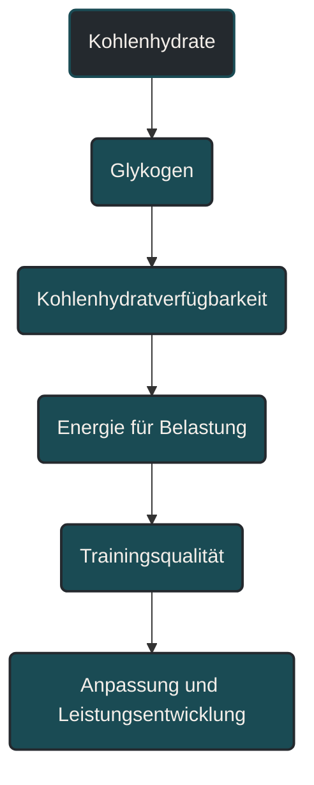
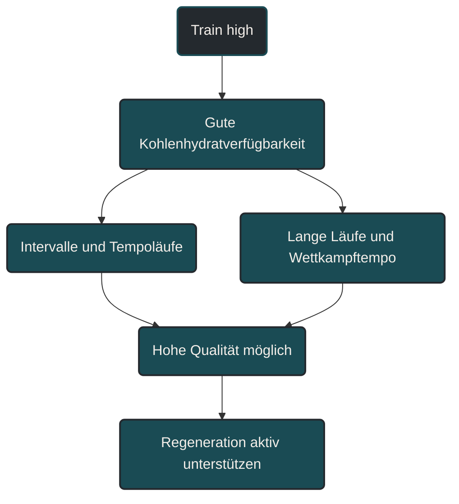
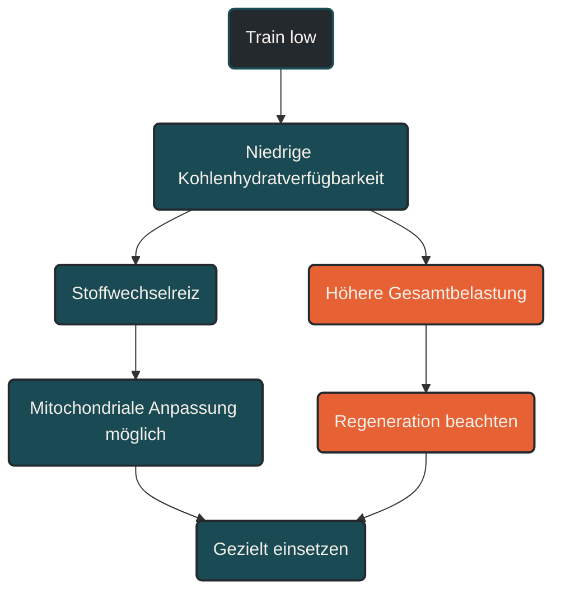

# Kohlenhydrate und Trainingsanpassung

Energieverfügbarkeit beschreibt, wie viel Energie dem Körper nach dem Training für grundlegende Funktionen, Anpassung und Regeneration bleibt. Makronährstoffe liefern diese Energie und erfüllen unterschiedliche Aufgaben: Kohlenhydrate unterstützen intensive Belastungen, Proteine helfen bei Reparatur und Anpassung, Fette sichern langfristige Energieversorgung und hormonelle Funktionen. Entscheidend ist nicht nur, was gegessen wird, sondern ob Energiezufuhr, Trainingsbelastung und Erholung zusammenpassen.

## Was Energieverfügbarkeit bedeutet

Energieverfügbarkeit ist nicht einfach dasselbe wie Kalorienzufuhr. Sie beschreibt, wie viel Energie nach Abzug des trainingsbedingten Energieverbrauchs noch für den Körper übrig bleibt.

Der Körper braucht diese Energie für viele Prozesse: Immunsystem, Hormonhaushalt, Knochenstoffwechsel, Muskelreparatur, Schlafqualität, Konzentration und Trainingsanpassung. Wenn über längere Zeit zu wenig Energie verfügbar ist, kann Training zwar kurzfristig noch funktionieren, die Anpassung wird aber schlechter und die Belastbarkeit nimmt ab.

Im Ausdauersport ist das besonders relevant, weil lange Läufe, hohe Wochenumfänge oder zusätzliche Einheiten den Energiebedarf stark erhöhen können. Wer nur auf Körpergewicht oder „leichter werden“ schaut, übersieht leicht, dass zu wenig Energie die Leistungsentwicklung bremsen kann.

## Warum Energieverfügbarkeit wichtig ist

Ausdauertraining setzt Reize. Anpassung entsteht aber erst, wenn der Körper genug Ressourcen hat, um auf diese Reize zu reagieren. Dazu gehören Schlaf, Erholung, Flüssigkeit, Mikronährstoffe und vor allem ausreichend Energie.

Eine dauerhaft niedrige Energieverfügbarkeit kann verschiedene Bereiche beeinflussen:

- schlechtere Regeneration
- erhöhte Müdigkeit
- sinkende Trainingsqualität
- erhöhte Infektanfälligkeit
- stagnierende Leistungsentwicklung
- schlechtere Knochengesundheit
- hormonelle Dysregulation
- erhöhte Verletzungsanfälligkeit

Das bedeutet nicht, dass jede müde Phase automatisch ein Ernährungsproblem ist. Müdigkeit kann viele Ursachen haben. Energieverfügbarkeit ist aber ein zentraler Baustein, wenn Training, Alltag und Regeneration nicht mehr zusammenpassen.

## Wie Makronährstoffe im Ausdauersport wirken

Makronährstoffe sind Kohlenhydrate, Proteine und Fette. Sie liefern Energie und unterstützen unterschiedliche Prozesse im Körper. Im Ausdauersport ist keine dieser Gruppen grundsätzlich „gut“ oder „schlecht“. Entscheidend ist der Kontext.

### Kohlenhydrate

Kohlenhydrate sind besonders wichtig für intensivere Belastungen. Sie werden als Glykogen in Muskulatur und Leber gespeichert und stehen bei Tempoeinheiten, Intervallen, langen Läufen mit Endbeschleunigung oder Wettkämpfen schnell zur Verfügung.

Wenn Kohlenhydratspeicher stark geleert sind, kann sich eine Einheit deutlich schwerer anfühlen. Die Pace fällt, die subjektive Belastung steigt und die technische Qualität kann leiden. Für lockere Einheiten kann eine geringere Kohlenhydratverfügbarkeit je nach Zielsetzung vorkommen, sie sollte aber nicht dauerhaft zum Standard werden.

Praktisch wichtig ist: Je höher Intensität und Dauer einer Einheit sind, desto wichtiger wird eine passende Kohlenhydratversorgung.

### Proteine

Protein ist vor allem für Reparatur, Umbau und Anpassung wichtig. Ausdauertraining belastet nicht nur das Herz-Kreislauf-System, sondern auch Muskeln, Sehnen, Bindegewebe und Enzymsysteme. Protein unterstützt den Erhalt und Aufbau von Körperstrukturen und hilft, Trainingsreize zu verarbeiten.

Gerade bei hohen Umfängen, Krafttraining, Kaloriendefizit oder älteren Sportlern wird eine ausreichende Proteinversorgung wichtiger. Dabei geht es nicht darum, extrem hohe Mengen aufzunehmen, sondern regelmäßig genug Protein über den Tag zu verteilen.

Protein ersetzt keine ausreichende Energiezufuhr. Wenn insgesamt zu wenig Energie vorhanden ist, kann auch eine gute Proteinzufuhr die Regeneration nur begrenzt retten.

### Fette

Fette sind ein wichtiger Energieträger und unterstützen unter anderem hormonelle Funktionen, Zellmembranen und die Aufnahme fettlöslicher Vitamine. Im Ausdauersport spielen sie besonders bei niedrigen bis moderaten Intensitäten eine große Rolle.

Ein sehr niedriger Fettanteil in der Ernährung kann problematisch sein, vor allem wenn gleichzeitig die Gesamtenergiezufuhr knapp ist. Das Ziel ist nicht, Fett möglichst stark zu reduzieren, sondern eine ausreichende und qualitativ sinnvolle Versorgung sicherzustellen.

Fettverbrennung bedeutet außerdem nicht automatisch bessere Leistung. Wettkampftempo und intensive Trainingsreize hängen stark davon ab, wie gut Kohlenhydrate verfügbar und verwertbar sind.

## Zentrale Einflussfaktoren

### Trainingsumfang

Je mehr Umfang trainiert wird, desto höher ist der Energiebedarf. Besonders lange Läufe, Doppelbelastungen, Rad-Lauf-Kombinationen oder zusätzliche Kraft- und Stabilitätseinheiten können den Bedarf deutlich erhöhen.

Ein häufiger Fehler ist, nur die Haupteinheit zu berücksichtigen. Auch Alltagsbewegung, Berufsstress und unvollständige Erholung beeinflussen, wie viel Energie tatsächlich verfügbar bleibt.

### Trainingsintensität

Lockere Dauerläufe und intensive Intervalle stellen unterschiedliche Anforderungen. Niedrige Intensitäten können stärker über Fettstoffwechsel abgedeckt werden, während höhere Intensitäten deutlich stärker von Kohlenhydraten abhängen.

Wer harte Einheiten dauerhaft mit zu wenig Kohlenhydraten absolviert, riskiert eine schlechtere Trainingsqualität. Die Einheit wird dann nicht unbedingt „effektiver“, sondern oft nur belastender.

### Timing

Nicht nur die Tagesbilanz zählt, sondern auch der Zeitpunkt der Energiezufuhr. Eine hohe Trainingsbelastung am Morgen nach sehr geringer Energiezufuhr kann anders wirken als dieselbe Einheit nach ausreichender Versorgung.

Nach dem Training braucht der Körper Energie, Flüssigkeit und Baustoffe, um Reparaturprozesse einzuleiten. Besonders bei mehreren Einheiten innerhalb kurzer Zeit wird das Timing wichtiger.

### Körpergewicht und Leistungsdenken

Im Ausdauersport wird Körpergewicht oft stark mit Leistung verknüpft. Ein niedrigeres Gewicht kann unter bestimmten Bedingungen die relative Belastung beeinflussen, ist aber kein automatischer Leistungsfaktor.

Wenn Gewichtsreduktion auf Kosten von Energieverfügbarkeit, Regeneration, Knochenstoffwechsel oder Trainingsqualität geht, kann sie langfristig schaden. Leistungsfähigkeit entsteht nicht nur durch weniger Gewicht, sondern durch belastbare Strukturen, stabile Energieversorgung und gute Anpassung.

## Bedeutung für Läufer

Für Läufer ist Energieverfügbarkeit besonders wichtig, weil Lauftraining eine hohe mechanische Belastung erzeugt. Knochen, Sehnen und Muskulatur brauchen nicht nur Trainingsreize, sondern auch Energie, um sich anzupassen.

Bei langen Läufen, intensiven Einheiten und hohen Wochenumfängen sollte die Ernährung deshalb nicht nur „gesund“ sein, sondern zur Belastung passen. Eine sehr nährstoffreiche Ernährung kann trotzdem zu wenig Energie liefern, wenn die Portionen oder die Kohlenhydratmenge nicht zur Trainingsphase passen.

Praktisch bedeutet das: Lockere Einheiten, harte Einheiten, lange Läufe und Regenerationsphasen dürfen ernährungsseitig unterschiedlich begleitet werden. Nicht jede Einheit braucht dieselbe Strategie, aber die Gesamtbelastung muss durch ausreichend Energie abgedeckt sein.

## Häufige Fehler

Ein häufiger Fehler ist, Energieverfügbarkeit nur über Hunger zu steuern. Nach intensiven oder langen Belastungen ist Hunger nicht immer ein zuverlässiges Signal. Manche Sportler essen trotz hohem Verbrauch zu wenig, weil Appetit, Stress oder Zeitdruck die Wahrnehmung verzerren.

Ein zweiter Fehler ist die pauschale Angst vor Kohlenhydraten. Kohlenhydrate sind kein Zeichen schlechter Ernährung, sondern ein zentraler Energieträger für intensive Ausdauerleistung.

Ein dritter Fehler ist, Protein isoliert zu betrachten. Protein ist wichtig, aber ohne ausreichende Gesamtenergie und passende Kohlenhydrate bleibt die Regeneration unvollständig.

Ein vierter Fehler ist die dauerhafte Orientierung am Körpergewicht. Gewicht kann schwanken, ohne dass sich Fitness oder Körperzusammensetzung sinnvoll verändert haben. Entscheidend ist, ob Training, Erholung, Leistungsentwicklung und Gesundheit zusammenpassen.

## Praktische Einordnung

Energieverfügbarkeit und Makronährstoffe sollten immer im Zusammenhang mit Trainingsphase, Belastung und Ziel betrachtet werden. In einer intensiven Trainingsphase braucht der Körper andere Ressourcen als in einer Entlastungswoche. Ein langer Lauf stellt andere Anforderungen als ein kurzer lockerer Dauerlauf.

Für die Praxis ist hilfreich, Ernährung nicht als Zusatzthema zu sehen, sondern als Teil der Trainingssteuerung. Wer regelmäßig trainiert, sollte nicht nur fragen, wie viel gelaufen wurde, sondern auch, ob genug Energie für Anpassung und Regeneration vorhanden ist.

Der wichtigste Merksatz lautet: Training setzt den Reiz, aber ausreichende Energieverfügbarkeit entscheidet mit darüber, ob daraus Anpassung wird.

----

----

## Häufige Fragen zu Energieverfügbarkeit und Makronährstoffen

### Was ist Energieverfügbarkeit einfach erklärt?

Energieverfügbarkeit beschreibt, wie viel Energie dem Körper nach dem Training noch für grundlegende Funktionen, Regeneration und Anpassung bleibt. Sie ist deshalb mehr als nur die tägliche Kalorienmenge.

### Warum ist Energieverfügbarkeit im Ausdauertraining wichtig?

Ausdauertraining erzeugt Belastung. Damit daraus Anpassung entsteht, braucht der Körper genügend Energie für Muskeln, Knochen, Immunsystem, Hormonhaushalt und Reparaturprozesse.

### Welche Rolle spielen Kohlenhydrate?

Kohlenhydrate sind besonders wichtig für intensive Belastungen, Tempoläufe, Intervalle, lange Läufe und Wettkämpfe. Sie helfen, Trainingsqualität und Leistungsfähigkeit zu sichern.

### Reicht viel Protein für gute Regeneration?

Nein. Protein ist wichtig für Reparatur und Anpassung, aber ohne ausreichende Gesamtenergie und passende Kohlenhydratversorgung bleibt Regeneration oft unvollständig.

### Sind Fette für Ausdauersportler wichtig?

Ja. Fette liefern Energie, unterstützen hormonelle Funktionen und sind wichtig für Zellstrukturen sowie die Aufnahme fettlöslicher Vitamine. Sehr niedrige Fettzufuhr kann problematisch werden.

### Was ist ein häufiger Fehler bei Makronährstoffen?

Ein häufiger Fehler ist, einzelne Nährstoffe isoliert zu bewerten. Entscheidend ist nicht nur Kohlenhydrat, Protein oder Fett allein, sondern ob die gesamte Ernährung zur Trainingsbelastung passt.

----

*Hinweis: Dieser Artikel dient der allgemeinen Information und ersetzt keine medizinische oder therapeutische Beratung. Mehr dazu im [**Gesundheits- und Quellenhinweis**](/ausdauersport/disclaimer/).*

