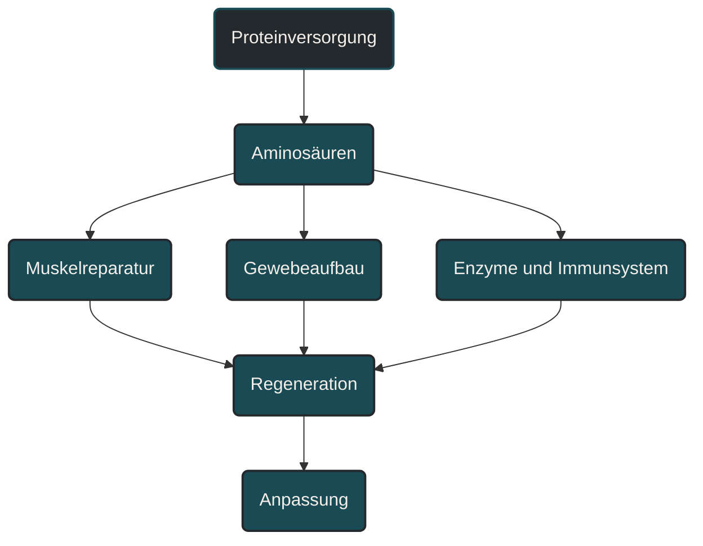
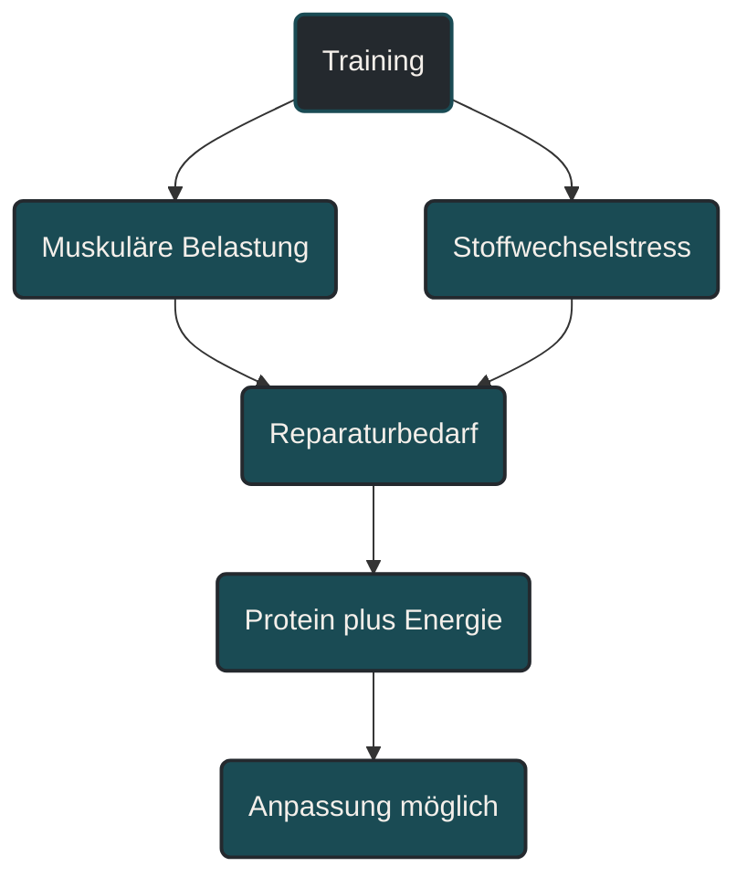
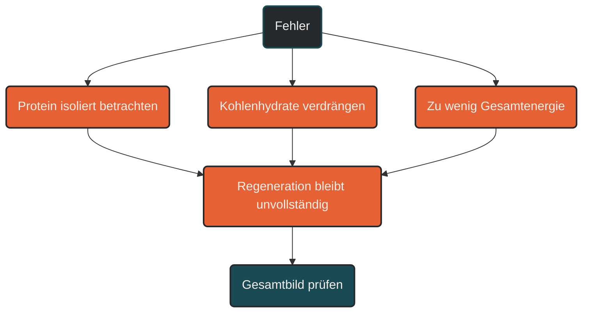

# Proteinversorgung im Ausdauersport

Proteinversorgung beschreibt, ob dem Körper genügend Eiweißbausteine für Reparatur, Anpassung und Erhalt von Gewebe zur Verfügung stehen. Im Ausdauersport ist Protein nicht nur für Muskeln wichtig, sondern auch für Sehnen, Bindegewebe, Immunsystem und Regeneration. Entscheidend ist, dass Proteinmenge, Energiezufuhr, Kohlenhydrate, Trainingsbelastung und Erholung zusammenpassen.

## Was Proteinversorgung bedeutet

Protein besteht aus Aminosäuren. Diese Aminosäuren nutzt der Körper unter anderem für Muskelproteine, Enzyme, Transportproteine, Immunfunktionen und Gewebereparatur.

Im Ausdauersport wird Protein manchmal unterschätzt, weil der Fokus häufig auf Kohlenhydraten, Fettstoffwechsel und Energieverbrauch liegt. Dabei belastet Ausdauertraining nicht nur das Herz-Kreislauf-System, sondern auch Muskulatur, Sehnen, Knochen und Bindegewebe.

Proteinversorgung bedeutet deshalb nicht nur: „genug Eiweiß essen“. Es geht darum, dem Körper regelmäßig genügend Baustoffe zur Verfügung zu stellen, damit Training nicht nur ermüdet, sondern auch verarbeitet werden kann.

## Warum Protein im Ausdauersport wichtig ist

Ausdauertraining erzeugt wiederholte mechanische und metabolische Belastung. Besonders beim Laufen entstehen viele kleine Belastungsreize in Muskulatur, Sehnen und Bindegewebe. Diese Strukturen müssen sich nach dem Training reparieren und anpassen.

Protein unterstützt diesen Prozess. Es hilft beim Erhalt von Muskelmasse, bei Reparaturprozessen und bei der Anpassung an Training. Das ist besonders wichtig bei hohen Umfängen, intensiven Trainingsphasen, Krafttraining, Energiedefizit oder zunehmendem Alter.

Wichtig ist aber: Protein allein löst keine gute Regeneration aus. Wenn insgesamt zu wenig Energie vorhanden ist oder Kohlenhydrate für harte Einheiten fehlen, kann auch eine hohe Proteinzufuhr die Belastung nicht vollständig ausgleichen.

## Wie Protein im Körper wirkt

Nach der Verdauung werden Proteine in Aminosäuren zerlegt. Diese Aminosäuren gelangen ins Blut und stehen dem Körper als Baustoffe zur Verfügung.

Ein Teil wird für die Muskelproteinsynthese genutzt. Das bedeutet: Der Körper baut Muskelprotein auf, repariert beschädigte Strukturen und passt Gewebe an wiederkehrende Belastungen an.

Im Ausdauersport betrifft das nicht nur sichtbare Muskulatur. Auch Enzyme des Energiestoffwechsels, Transportstrukturen und regenerative Prozesse hängen von einer ausreichenden Eiweißversorgung ab.

## Zentrale Einflussfaktoren

### Gesamtenergiezufuhr

Protein wirkt am besten, wenn insgesamt genug Energie verfügbar ist. Wenn der Körper dauerhaft zu wenig Energie bekommt, kann Protein teilweise als Energiequelle genutzt werden, statt vollständig für Reparatur und Anpassung bereitzustehen.

Deshalb sollte Proteinversorgung immer zusammen mit Energieverfügbarkeit betrachtet werden. Eine proteinreiche Ernährung ist nicht automatisch ausreichend, wenn die Gesamtzufuhr zu niedrig bleibt.

### Trainingsumfang

Je höher der Trainingsumfang, desto größer ist die Belastung für Muskulatur, Sehnen und Stoffwechsel. Lange Läufe, häufige Einheiten, Doppelbelastungen oder zusätzliche Krafteinheiten erhöhen den Bedarf an Regeneration.

In solchen Phasen wird regelmäßige Proteinversorgung wichtiger. Nicht, weil Protein das Training ersetzt, sondern weil der Körper mehr Reparatur- und Anpassungsarbeit leisten muss.

### Trainingsintensität

Intensive Einheiten belasten den Körper anders als lockere Dauerläufe. Intervalle, Tempoläufe, Bergläufe und lange Läufe mit höherer Endbelastung erzeugen stärkere Ermüdung und können mehr muskuläre Reparaturprozesse erfordern.

Protein unterstützt die Verarbeitung dieser Reize. Gleichzeitig brauchen solche Einheiten meist auch eine gute Kohlenhydratverfügbarkeit. Protein und Kohlenhydrate erfüllen unterschiedliche Aufgaben und sollten nicht gegeneinander ausgespielt werden.

### Alter

Mit zunehmendem Alter kann die muskuläre Antwort auf Trainings- und Ernährungsreize schwächer werden. Häufig wird dafür der Begriff anabole Resistenz verwendet.

Das bedeutet nicht, dass Anpassung nicht mehr möglich ist. Es bedeutet eher, dass regelmäßiges Krafttraining, ausreichende Energiezufuhr und eine bewusstere Proteinverteilung wichtiger werden können.

### Ernährungsform

Protein kann aus tierischen und pflanzlichen Quellen stammen. Entscheidend sind Menge, Verträglichkeit, Alltagstauglichkeit und Aminosäureprofil.

Bei pflanzenbasierter Ernährung kann es sinnvoll sein, verschiedene Proteinquellen zu kombinieren, zum Beispiel Hülsenfrüchte, Sojaprodukte, Getreide, Nüsse, Samen oder andere geeignete Lebensmittel. So lässt sich die Aminosäureversorgung breiter abdecken.

## Protein-Timing

Für viele Freizeitsportler ist die Tagesbilanz wichtiger als ein perfektes Timing. Trotzdem kann die Verteilung über den Tag sinnvoll sein.

Wenn Protein nur einmal am Tag sehr hoch aufgenommen wird, stehen dem Körper nicht über den gesamten Tag gleichmäßig Baustoffe zur Verfügung. Regelmäßige proteinreiche Mahlzeiten können deshalb praktischer sein als eine sehr große Einzelportion.

Nach harten oder langen Einheiten kann eine Mahlzeit mit Protein und Kohlenhydraten sinnvoll sein. Protein unterstützt Reparaturprozesse, Kohlenhydrate helfen bei der Wiederauffüllung der Glykogenspeicher. Beide erfüllen unterschiedliche, aber ergänzende Aufgaben.

## Protein und Krafttraining

Für Läufer und andere Ausdauersportler ist Krafttraining ein wichtiger Reiz für Muskel- und Sehnenbelastbarkeit. Protein unterstützt die Anpassung an diesen Reiz.

Das bedeutet nicht, dass Ausdauersportler wie Bodybuilder essen müssen. Es bedeutet, dass Krafttraining ohne ausreichende Baustoffe weniger gut verarbeitet werden kann.

Besonders bei älteren Sportlern, Verletzungsphasen oder hoher Laufbelastung kann die Kombination aus Krafttraining, ausreichender Energiezufuhr und guter Proteinversorgung eine wichtige Grundlage für Belastbarkeit sein.

## Protein und Regeneration

Regeneration ist mehr als Muskelreparatur. Sie umfasst Schlaf, Nervensystem, Immunsystem, Energiespeicher, Gewebereparatur und psychische Erholung.

Protein ist ein Baustein dieses Systems. Es kann helfen, muskuläre Reparaturprozesse zu unterstützen und den Erhalt von Muskelmasse zu sichern. Es ersetzt aber keinen Schlaf, keine Entlastungswoche und keine ausreichende Energiezufuhr.

Wenn Müdigkeit, Leistungsabfall oder Verletzungsanfälligkeit zunehmen, sollte Proteinversorgung immer im Gesamtbild betrachtet werden: Trainingsumfang, Intensität, Alltag, Schlaf, Kohlenhydrate, Energieverfügbarkeit und Erholung.

## Proteinquellen

Gute Proteinquellen sind Lebensmittel, die regelmäßig vertragen werden und in den Alltag passen. Dazu können Milchprodukte, Eier, Fisch, Fleisch, Hülsenfrüchte, Sojaprodukte, Getreide, Nüsse und Samen gehören.

Proteinshakes oder Proteinpulver können praktisch sein, sind aber nicht automatisch notwendig. Sie sind eher ein Werkzeug, wenn es im Alltag schwierig ist, den Bedarf über normale Mahlzeiten zu decken.

Wichtiger als ein einzelnes Produkt ist die Gesamtstruktur der Ernährung: ausreichend Energie, abwechslungsreiche Lebensmittel, passende Kohlenhydrate, genügend Flüssigkeit und eine regelmäßige Verteilung.

## Bedeutung für Läufer

Für Läufer ist Proteinversorgung besonders wichtig, weil Lauftraining viele wiederholte Stoßbelastungen erzeugt. Muskeln, Sehnen, Knochen und Bindegewebe müssen diese Belastung aufnehmen und sich daran anpassen.

Bei hohen Wochenumfängen, intensiven Trainingsphasen oder zusätzlichem Krafttraining sollte Protein nicht zufällig passieren. Es sollte ein stabiler Bestandteil der Ernährung sein.

Praktisch bedeutet das: Nach harten Einheiten, langen Läufen und Krafteinheiten sollte der Körper nicht nur „irgendwann“ etwas bekommen, sondern zeitnah wieder mit Energie und Baustoffen versorgt werden. Das muss nicht kompliziert sein, sollte aber regelmäßig gelingen.

## Häufige Fehler

Ein häufiger Fehler ist, Protein nur mit Muskelaufbau zu verbinden. Im Ausdauersport geht es auch um Reparatur, Belastbarkeit, Erhalt von Muskelmasse und Anpassung.

Ein zweiter Fehler ist, Protein gegen Kohlenhydrate auszuspielen. Kohlenhydrate sichern Trainingsqualität, Protein unterstützt Reparatur und Anpassung. Beide erfüllen unterschiedliche Aufgaben.

Ein dritter Fehler ist, Protein sehr unregelmäßig zu essen. Eine bessere Verteilung über den Tag kann für viele Sportler sinnvoller sein als eine große Portion am Abend.

Ein vierter Fehler ist, Protein als Lösung für Übertraining oder schlechte Regeneration zu betrachten. Wenn Trainingsbelastung, Schlaf und Gesamtenergie nicht passen, kann Protein allein das Problem nicht lösen.

## Praktische Einordnung

Proteinversorgung ist ein wichtiger Teil der Ernährung im Ausdauersport, aber kein isolierter Leistungshebel. Sie wirkt am besten, wenn sie mit ausreichender Energiezufuhr, guter Kohlenhydratversorgung, Schlaf und sinnvoller Trainingssteuerung zusammenkommt.

Für die Praxis reicht oft eine einfache Frage: Bekommt der Körper über den Tag verteilt genug hochwertige Baustoffe, um die aktuelle Trainingsbelastung zu verarbeiten?

Der wichtigste Merksatz lautet: Protein baut keine Ausdauerleistung allein auf, aber ohne ausreichende Proteinversorgung werden Reparatur, Anpassung und Belastbarkeit unnötig erschwert.

----

---

## Häufige Fragen zu Proteinversorgung im Ausdauersport

### Warum ist Protein im Ausdauersport wichtig?

Protein unterstützt Reparatur, Anpassung und Erhalt von Gewebe. Im Ausdauersport betrifft das nicht nur Muskeln, sondern auch Sehnen, Bindegewebe, Enzyme, Immunsystem und Regeneration.

### Brauchen Ausdauersportler Protein oder nur Kohlenhydrate?

Ausdauersportler brauchen beides. Kohlenhydrate unterstützen vor allem Trainingsqualität und Energieversorgung, während Protein Reparatur und Anpassung unterstützt.

### Ist Protein direkt nach dem Training Pflicht?

Nicht jede Einheit braucht ein perfektes Timing. Nach langen, intensiven oder kraftbetonten Einheiten kann eine Mahlzeit mit Protein und Kohlenhydraten aber sinnvoll sein, um Regeneration und Speicherauffüllung zu unterstützen.

### Sind Proteinshakes notwendig?

Nein. Proteinshakes sind nicht zwingend notwendig. Sie können praktisch sein, wenn der Alltag es erschwert, genug Protein über normale Mahlzeiten aufzunehmen.

### Was ist bei pflanzenbasierter Ernährung wichtig?

Bei pflanzenbasierter Ernährung ist eine gute Kombination verschiedener Proteinquellen wichtig. Hülsenfrüchte, Sojaprodukte, Getreide, Nüsse und Samen können helfen, die Aminosäureversorgung breiter abzudecken.

### Was ist ein häufiger Fehler bei Proteinversorgung?

Ein häufiger Fehler ist, Protein isoliert zu betrachten. Ohne ausreichende Gesamtenergie, passende Kohlenhydrate, Schlaf und sinnvolle Trainingssteuerung bleibt die Regeneration trotzdem begrenzt.

----

*Hinweis: Dieser Artikel dient der allgemeinen Information und ersetzt keine medizinische oder therapeutische Beratung. Mehr dazu im [**Gesundheits- und Quellenhinweis**](/ausdauersport/disclaimer/).*

