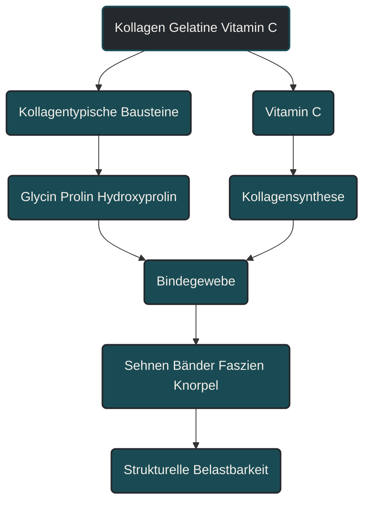
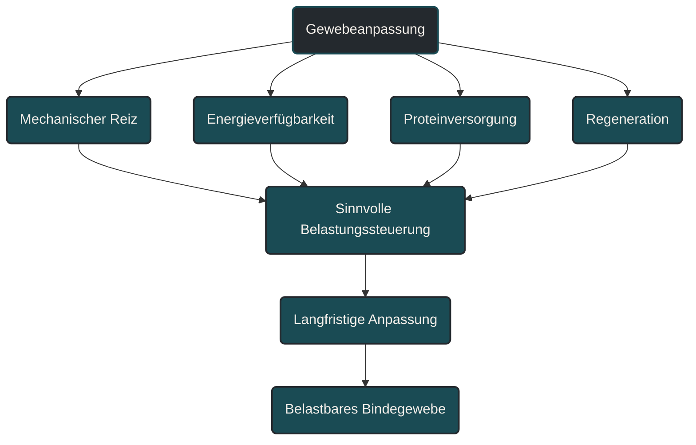

# Kollagen, Gelatine und Vitamin C

Kollagen, Gelatine und Vitamin C werden im Ausdauersport häufig im Zusammenhang mit Sehnen, Bändern, Knorpel und Bindegewebe diskutiert. Kollagen und Gelatine liefern bestimmte Aminosäuren, Vitamin C ist an der körpereigenen Kollagenbildung beteiligt. Entscheidend ist aber: Supplemente ersetzen keinen passenden Trainingsreiz, keine ausreichende Energiezufuhr und keine langfristige Belastungssteuerung.

## Was Kollagen, Gelatine und Vitamin C bedeuten

Kollagen ist ein Strukturprotein. Es kommt unter anderem in Sehnen, Bändern, Faszien, Knorpel, Knochen und Haut vor. Im Ausdauersport ist es deshalb interessant, weil diese Gewebe durch wiederholte Belastung ständig mechanisch beansprucht werden.

Gelatine ist eine verarbeitete Form von Kollagen. Kollagenhydrolysat oder Kollagenpeptide sind weiter aufgespaltene Formen, die leichter in kleinere Bestandteile zerlegt werden. Nach der Aufnahme werden diese Proteine im Verdauungstrakt in Aminosäuren und kleinere Peptide zerlegt.

Vitamin C ist kein Kollagenbaustein im engeren Sinn, aber es ist an Prozessen beteiligt, die für die stabile Kollagenstruktur wichtig sind. Deshalb wird Vitamin C häufig zusammen mit Gelatine oder Kollagenpeptiden diskutiert.

## Warum das im Ausdauersport wichtig ist

Laufen belastet Sehnen, Bänder, Knochen und Bindegewebe wiederholt. Diese Strukturen passen sich langsamer an als Herz-Kreislauf-System oder Muskulatur. Genau deshalb entstehen viele Überlastungsprobleme nicht plötzlich, sondern über Wochen oder Monate.

Kollagenbezogene Ernährung wird oft mit der Hoffnung verbunden, Sehnen und Bindegewebe gezielt zu unterstützen. Das ist grundsätzlich nachvollziehbar, muss aber vorsichtig eingeordnet werden. Bindegewebe passt sich nicht allein durch einen Nährstoff an. Es braucht einen passenden mechanischen Reiz, ausreichende Energie und genügend Zeit.

Der wichtigste Punkt lautet: Erst die Kombination aus Belastungssteuerung, gezieltem Kraft- oder Sehnentraining, ausreichender Energiezufuhr, Proteinversorgung und Mikronährstoffen schafft ein Umfeld, in dem Gewebeanpassung sinnvoll stattfinden kann.

## Wie Kollagenbildung funktioniert

Kollagen wird vom Körper selbst aufgebaut. Dafür benötigt er Aminosäuren, Energie, Vitamin C und weitere Stoffwechselprozesse. Besonders häufig werden im Zusammenhang mit Kollagen Aminosäuren wie Glycin, Prolin und Hydroxyprolin genannt.

Diese Stoffe sind aber keine Garantie für stärkere Sehnen. Sie liefern mögliche Bausteine. Ob daraus eine belastbarere Struktur entsteht, hängt stark davon ab, ob das Gewebe überhaupt sinnvoll belastet wird.

Sehnen reagieren vor allem auf mechanische Spannung. Ein Supplement ohne Trainingsreiz ist deshalb deutlich weniger relevant als ein gut dosierter Belastungsreiz. Umgekehrt kann ein Trainingsreiz ohne ausreichende Energie und Baustoffe ebenfalls schlechter verarbeitet werden.

## Kollagen und Gelatine

Kollagen, Gelatine und Kollagenpeptide unterscheiden sich in Verarbeitung, Löslichkeit und praktischer Anwendung. Für den Körper ist entscheidend, welche Aminosäuren und Peptide nach der Verdauung verfügbar werden.

Gelatine wird häufig als klassische, gelierende Form genutzt. Kollagenpeptide sind meist besser löslich und werden deshalb oft als Pulver verwendet. Beide liefern kollagentypische Aminosäuren.

Für die Praxis ist aber wichtiger als die Produktform: Passt die Maßnahme überhaupt zum Ziel? Wer ein Sehnenproblem nur mit Kollagen angeht, aber Trainingslast, Laufumfang, Schlaf, Energiezufuhr und Krafttraining ignoriert, behandelt nur einen kleinen Teil des Systems.

## Vitamin C

Vitamin C spielt eine Rolle bei der körpereigenen Kollagensynthese. Es unterstützt enzymatische Prozesse, die für die Stabilität der Kollagenstruktur wichtig sind.

Das bedeutet aber nicht, dass sehr hohe Vitamin-C-Mengen automatisch bessere Anpassung erzeugen. Entscheidend ist zunächst eine ausreichende Versorgung. Eine ausgewogene Ernährung mit Obst und Gemüse kann hier bereits viel abdecken.

Bei Supplementen ist Vorsicht sinnvoll. Mehr ist nicht automatisch besser. Besonders bei bestehenden Erkrankungen, Medikamenteneinnahme oder Unsicherheit sollte eine individuelle Abklärung erfolgen.

## Zentrale Einflussfaktoren

### Mechanischer Reiz

Bindegewebe passt sich vor allem an Belastung an. Sehnen brauchen Zugspannung, Knochen brauchen mechanische Reize, Knorpel braucht angemessene Druck- und Entlastungswechsel.

Kollagenbezogene Ernährung kann diesen Reiz nicht ersetzen. Sie kann höchstens ein Umfeld unterstützen, in dem der Körper auf den Reiz reagieren kann.

### Energieverfügbarkeit

Wenn dem Körper insgesamt zu wenig Energie zur Verfügung steht, werden Reparatur und Anpassung erschwert. Das betrifft auch Bindegewebe.

Eine niedrige Energieverfügbarkeit kann besonders problematisch sein, wenn gleichzeitig hohe Laufumfänge, intensive Einheiten oder ein Kaloriendefizit bestehen. Dann fehlt dem Körper nicht nur Energie, sondern oft auch die Ruhe, um strukturelle Anpassungen umzusetzen.

### Gesamtprotein

Kollagen ist kein vollständiger Ersatz für eine gute Proteinversorgung. Es enthält bestimmte Aminosäuren reichlich, aber nicht alle essenziellen Aminosäuren in idealer Zusammensetzung.

Deshalb sollte Kollagen nicht als Ersatz für hochwertige Proteinquellen verstanden werden. Es ist eher ein möglicher Zusatz in einem Ernährungskonzept, nicht die Grundlage der Proteinversorgung.

### Timing

Im Sport wird häufig diskutiert, Kollagen oder Gelatine zeitlich vor einer gezielten Sehnen- oder Kraftbelastung einzunehmen. Die Idee dahinter ist, Baustoffe im Blut verfügbar zu haben, wenn das Gewebe mechanisch stimuliert wird.

Für die praktische Einordnung reicht: Timing kann interessant sein, ist aber zweitrangig gegenüber Regelmäßigkeit, Trainingssteuerung, Energieverfügbarkeit und sinnvoller Belastung. Ein perfektes Timing macht keinen schlecht dosierten Trainingsreiz gut.

### Trainingsplanung

Sehnen und Bindegewebe reagieren langsamer als Ausdauerleistung. Deshalb sollte die Belastung nicht nur nach Herzfrequenz, Pace oder subjektiver Fitness gesteuert werden.

Gerade nach Trainingspausen, Verletzungen, Schuhwechsel, Untergrundwechsel oder starkem Umfangsanstieg kann das Bindegewebe hinter der kardiovaskulären Leistungsfähigkeit zurückbleiben. Dann fühlt sich das Training möglich an, aber die Strukturen sind noch nicht ausreichend angepasst.

## Bedeutung für Läufer

Für Läufer ist das Thema besonders relevant, weil Sehnen, Faszien, Knochen und Knorpel bei jedem Schritt belastet werden. Achillessehne, Plantarfaszie, Patellarsehne, Hüfte, Knie und Fußstrukturen sind typische Bereiche, in denen Belastung und Anpassung sorgfältig gesteuert werden müssen.

Kollagen, Gelatine und Vitamin C können in diesem Kontext als unterstützende Bausteine betrachtet werden. Sie stehen aber nicht an erster Stelle. Wichtiger sind Trainingsaufbau, Krafttraining, ausreichende Energie, Schlaf, Regeneration und ein vorsichtiger Umgang mit Schmerzsignalen.

Wer Beschwerden hat, sollte nicht versuchen, diese allein über Supplemente zu lösen. Schmerz, Schwellung, wiederkehrende Überlastung oder Belastungsabbrüche gehören ärztlich oder therapeutisch abgeklärt.

## Häufige Fehler

Ein häufiger Fehler ist, Kollagen als Reparaturlösung für Sehnenprobleme zu sehen. Sehnen reagieren auf Belastungssteuerung, nicht nur auf Nährstoffe.

Ein zweiter Fehler ist, Kollagen mit vollständigem Protein gleichzusetzen. Kollagen liefert bestimmte Aminosäuren, ersetzt aber keine ausgewogene Proteinversorgung.

Ein dritter Fehler ist, Vitamin C nach dem Motto „viel hilft viel“ einzusetzen. Entscheidend ist eine ausreichende Versorgung, nicht automatisch eine möglichst hohe Menge.

Ein vierter Fehler ist, Supplemente höher zu bewerten als Schlaf, Energiezufuhr und Trainingsprogression. Gerade Bindegewebe braucht Geduld und einen langfristig passenden Reiz.

## Praktische Einordnung

Kollagen, Gelatine und Vitamin C können im Ausdauersport sinnvoll diskutiert werden, wenn es um Bindegewebe, Sehnen und strukturelle Belastbarkeit geht. Sie sind aber keine Abkürzung.

Die Grundlage bleibt ein sinnvoll aufgebautes Training. Bindegewebe braucht dosierte Belastung, ausreichend Erholung und genug Energie. Ernährung kann diesen Prozess unterstützen, aber nicht erzwingen.

Der wichtigste Merksatz lautet: Kollagen liefert mögliche Bausteine, aber belastbares Bindegewebe entsteht vor allem durch passenden Reiz, ausreichende Energie und langfristige Belastungssteuerung.

----

----

## Häufige Fragen zu Kollagen, Gelatine und Vitamin C

### Was ist Kollagen einfach erklärt?

Kollagen ist ein Strukturprotein des Körpers. Es kommt unter anderem in Sehnen, Bändern, Faszien, Knorpel, Knochen und Haut vor.

### Was ist der Unterschied zwischen Kollagen und Gelatine?

Gelatine ist eine verarbeitete Form von Kollagen. Kollagenpeptide sind weiter aufgespaltene Formen, die meist besser löslich sind. Alle liefern kollagentypische Aminosäuren.

### Warum wird Vitamin C zusammen mit Kollagen genannt?

Vitamin C ist an Prozessen beteiligt, die für die körpereigene Kollagenbildung und die Stabilität von Kollagenstrukturen wichtig sind.

### Können Kollagen oder Gelatine Sehnenprobleme lösen?

Nicht allein. Sehnenprobleme hängen stark mit Belastungssteuerung, mechanischem Reiz, Regeneration und individueller Situation zusammen. Beschwerden sollten bei Bedarf ärztlich oder therapeutisch abgeklärt werden.

### Ersetzt Kollagen normales Protein?

Nein. Kollagen liefert bestimmte Aminosäuren, ist aber kein vollständiger Ersatz für eine ausgewogene Proteinversorgung aus unterschiedlichen Quellen.

### Was ist ein häufiger Fehler bei Kollagen-Supplementen?

Ein häufiger Fehler ist, Kollagen als Abkürzung zu sehen. Ohne passenden Trainingsreiz, ausreichende Energie und gute Regeneration bleibt die Wirkung begrenzt.

----

*Hinweis: Dieser Artikel dient der allgemeinen Information und ersetzt keine medizinische oder therapeutische Beratung. Mehr dazu im [**Gesundheits- und Quellenhinweis**](/ausdauersport/disclaimer/).*

