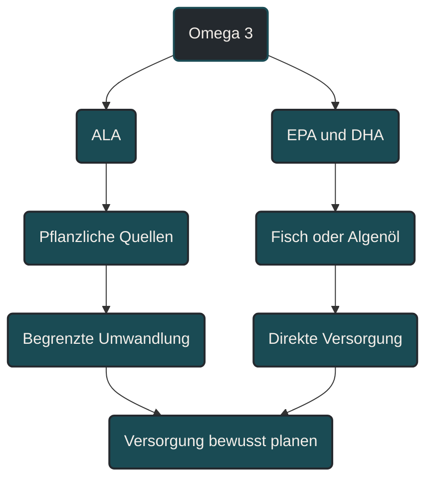

# Fettsäuren und Omega-3

Fettsäuren sind wichtige Energieträger und Bausteine von Zellmembranen. Im Ausdauersport sind sie relevant für Grundversorgung, Hormonhaushalt, Entzündungsregulation, Zellfunktion und langfristige Gesundheit. Omega-3-Fettsäuren werden besonders häufig diskutiert, weil EPA und DHA an Prozessen beteiligt sind, die mit Entzündungsmodulation, Herz-Kreislauf-Gesundheit und Regeneration zusammenhängen. Entscheidend ist aber nicht ein einzelnes Supplement, sondern die gesamte Ernährungsqualität.

## Was Fettsäuren bedeuten

Fettsäuren sind Bestandteile von Fetten. Der Körper nutzt sie als Energiequelle, als Bestandteil von Zellmembranen und als Ausgangsstoff für verschiedene Signalstoffe.

Im Ausdauertraining spielen Fette vor allem bei niedrigen bis moderaten Intensitäten eine wichtige Rolle als Energieträger. Je höher die Intensität wird, desto stärker steigt normalerweise die Bedeutung von Kohlenhydraten. Trotzdem bleiben Fette wichtig, weil sie nicht nur Energie liefern, sondern auch strukturelle und regulatorische Aufgaben haben.

Fettsäuren unterscheiden sich in ihrer chemischen Struktur. Für die praktische Einordnung reicht zunächst die Unterscheidung zwischen gesättigten, einfach ungesättigten und mehrfach ungesättigten Fettsäuren.

## Was Omega-3-Fettsäuren sind

Omega-3-Fettsäuren gehören zu den mehrfach ungesättigten Fettsäuren. Besonders wichtig sind drei Formen: ALA, EPA und DHA.

ALA kommt vor allem in pflanzlichen Quellen wie Leinsamen, Chiasamen, Walnüssen und bestimmten Pflanzenölen vor. EPA und DHA kommen vor allem in fettreichem Fisch und in Algenöl vor.

Der Körper kann ALA nur begrenzt in EPA und DHA umwandeln. Deshalb ist die reine Aufnahme von ALA nicht immer gleichbedeutend mit einer hohen Versorgung mit EPA und DHA. Für Menschen, die keinen Fisch essen, kann Algenöl eine direkte Quelle für EPA und DHA sein.

## Warum Fettsäuren im Ausdauersport wichtig sind

Ausdauertraining belastet den Körper nicht nur während der Einheit. Auch danach laufen Reparatur-, Anpassungs- und Regulationsprozesse ab. Fettsäuren sind an vielen dieser Prozesse beteiligt.

Sie beeinflussen Zellmembranen, dienen als Energiespeicher, unterstützen die Aufnahme fettlöslicher Vitamine und spielen eine Rolle bei Signalstoffen, die mit Entzündung und Anpassung zusammenhängen.

Das bedeutet nicht, dass mehr Fett automatisch besser ist. Es bedeutet, dass eine zu niedrige Fettzufuhr oder eine sehr einseitige Fettqualität langfristig problematisch sein kann.

## Omega-3 und Entzündungsregulation

Training erzeugt kontrollierte Belastung und damit auch entzündungsähnliche Signale. Diese Signale sind nicht grundsätzlich schlecht. Sie gehören zur Anpassung dazu.

Omega-3-Fettsäuren werden häufig diskutiert, weil EPA und DHA an Signalwegen beteiligt sind, die Entzündungsprozesse modulieren können. Das ist vor allem im Zusammenhang mit Regeneration, Muskelkater, Gelenkbelastung und allgemeiner Gesundheit interessant.

Wichtig ist aber die Einordnung: Entzündung ist nicht automatisch ein Feind. Zu starke oder chronische Entzündungsprozesse können problematisch sein, aber ein gewisses Maß an Trainingsstress ist notwendig, damit Anpassung entsteht.

## Omega-3 und Regeneration

Omega-3 wird im Sport oft mit besserer Regeneration verbunden. Dabei geht es vor allem um mögliche Einflüsse auf Muskelkater, Entzündungsreaktionen, Zellmembranen und neuronale Funktionen.

Für die Praxis sollte das vorsichtig betrachtet werden. Omega-3 kann ein sinnvoller Baustein in einer hochwertigen Ernährung sein, ersetzt aber keine ausreichende Energiezufuhr, keine Kohlenhydrate nach harten Einheiten, kein Protein und keinen Schlaf.

Wenn Regeneration schlecht ist, sollte zuerst das Gesamtbild geprüft werden: Trainingsbelastung, Schlaf, Energieverfügbarkeit, Kohlenhydrate, Protein, Stress und Erholung.

## Omega-6 und Omega-3

Omega-6-Fettsäuren sind ebenfalls mehrfach ungesättigte Fettsäuren. Sie sind nicht grundsätzlich schlecht und erfüllen wichtige Aufgaben im Körper.

Problematisch wird es eher, wenn die Ernährung sehr einseitig ist: viel stark verarbeitetes Fett, wenig fettreicher Fisch oder Algenöl, wenig Nüsse und Samen, wenig hochwertige Pflanzenöle und insgesamt geringe Ernährungsqualität.

Statt Omega-6 pauschal zu verteufeln, ist eine bessere Frage: Ist die Fettqualität insgesamt sinnvoll? Gibt es regelmäßig Quellen für Omega-3? Passt die Ernährung zur Trainingsbelastung?

## Zentrale Einflussfaktoren

### Fettqualität

Nicht nur die Fettmenge ist wichtig, sondern auch die Qualität der Fettquellen. Eine Ernährung mit Nüssen, Samen, Olivenöl, Rapsöl, Avocado, fettreichem Fisch oder Algenöl ist anders zu bewerten als eine Ernährung, die vor allem aus stark verarbeiteten Fettquellen besteht.

### Energieverfügbarkeit

Fette liefern viel Energie. Wenn Ausdauersportler sehr fettarm essen und gleichzeitig hohe Umfänge trainieren, kann die Gesamtenergiezufuhr zu niedrig werden. Das kann Regeneration, Hormonhaushalt und Anpassung beeinträchtigen.

### Ernährungsform

Bei vegetarischer oder veganer Ernährung sollte Omega-3 bewusst eingeplant werden. ALA-Quellen wie Leinsamen, Chiasamen und Walnüsse sind sinnvoll, liefern aber nicht direkt EPA und DHA. Algenöl kann hier eine direkte EPA- und DHA-Quelle sein.

### Trainingsphase

In intensiven Trainingsphasen ist die gesamte Energieversorgung wichtiger als einzelne Details. Bei hohen Umfängen, langen Läufen oder mehreren Einheiten pro Woche sollte die Ernährung nicht unnötig fettarm sein.

### Supplementqualität

Omega-3-Supplemente sind nicht automatisch gleichwertig. Qualität, Lagerung, Oxidation, Dosierung, Verträglichkeit und mögliche Wechselwirkungen spielen eine Rolle. Besonders bei Medikamenteneinnahme, Blutgerinnungsthemen oder Erkrankungen sollte eine individuelle Abklärung erfolgen.

## Bedeutung für Läufer

Für Läufer sind Fettsäuren vor allem als Teil der langfristigen Grundversorgung wichtig. Sie unterstützen Energiehaushalt, Zellfunktion, Hormonhaushalt und allgemeine Gesundheit.

Omega-3 kann besonders interessant sein, wenn die Ernährung wenig fettreichen Fisch oder keine direkte EPA- und DHA-Quelle enthält. Das gilt vor allem bei pflanzenbasierter Ernährung.

Trotzdem sollte Omega-3 nicht als Reparaturmittel für zu hohe Belastung verstanden werden. Wenn Laufumfang, Intensität, Schlaf und Energiezufuhr nicht passen, kann ein Supplement diese Probleme nicht ausgleichen.

## Häufige Fehler

Ein häufiger Fehler ist, Fett generell zu meiden. Eine sehr fettarme Ernährung kann langfristig problematisch sein, besonders wenn gleichzeitig viel trainiert wird.

Ein zweiter Fehler ist, Omega-3 als direkte Leistungssteigerung zu betrachten. Omega-3 ist eher ein Gesundheits- und Regulationsbaustein als ein klassisches Akut-Performance-Supplement.

Ein dritter Fehler ist, pflanzliches ALA automatisch mit EPA und DHA gleichzusetzen. ALA ist wichtig, wird aber nur begrenzt in EPA und DHA umgewandelt.

Ein vierter Fehler ist, Supplemente wichtiger zu nehmen als die gesamte Ernährung. Omega-3 wirkt nicht isoliert, sondern im Kontext von Energie, Protein, Kohlenhydraten, Schlaf und Trainingssteuerung.

## Praktische Einordnung

Fettsäuren und Omega-3 sollten im Ausdauersport als Teil der Basisernährung verstanden werden. Sie sind wichtig für langfristige Gesundheit, Zellfunktion, Energiehaushalt und Regulationsprozesse.

Für die Praxis ist entscheidend, regelmäßig hochwertige Fettquellen einzubauen und Omega-3 bewusst mitzudenken. Bei Fischverzicht kann Algenöl eine sinnvolle Option sein, sollte aber individuell und qualitätsbewusst betrachtet werden.

Der wichtigste Merksatz lautet: Omega-3 kann die Ernährungsbasis sinnvoll ergänzen, ersetzt aber keine passende Energiezufuhr, keine Regeneration und keine saubere Trainingssteuerung.

----

----

## Häufige Fragen zu Fettsäuren und Omega-3

### Was sind Fettsäuren einfach erklärt?

Fettsäuren sind Bestandteile von Fetten. Der Körper nutzt sie als Energiequelle, als Bausteine von Zellmembranen und als Ausgangsstoffe für verschiedene Signalprozesse.

### Warum ist Omega-3 im Ausdauersport interessant?

Omega-3-Fettsäuren werden im Sport vor allem wegen ihrer Rolle bei Zellfunktion, Entzündungsregulation, Herz-Kreislauf-Gesundheit und Regeneration diskutiert.

### Was ist der Unterschied zwischen ALA, EPA und DHA?

ALA kommt vor allem in pflanzlichen Quellen vor. EPA und DHA sind langkettige Omega-3-Fettsäuren und kommen vor allem in fettreichem Fisch oder Algenöl vor.

### Reichen Leinsamen und Walnüsse für Omega-3 aus?

Sie liefern ALA und können sinnvoll sein. Da die Umwandlung von ALA zu EPA und DHA begrenzt ist, kann bei Fischverzicht eine direkte EPA- und DHA-Quelle wie Algenöl relevant sein.

### Macht Omega-3 direkt schneller?

Omega-3 ist kein klassisches Akut-Performance-Supplement. Es ist eher ein Baustein für langfristige Gesundheit, Zellfunktion und Regulationsprozesse.

### Was ist ein häufiger Fehler bei Omega-3?

Ein häufiger Fehler ist, Omega-3 isoliert zu betrachten. Entscheidend bleibt die gesamte Ernährung, ausreichend Energie, gute Regeneration und eine sinnvolle Trainingssteuerung.

----

*Hinweis: Dieser Artikel dient der allgemeinen Information und ersetzt keine medizinische oder therapeutische Beratung. Mehr dazu im [**Gesundheits- und Quellenhinweis**](/ausdauersport/disclaimer/).*

