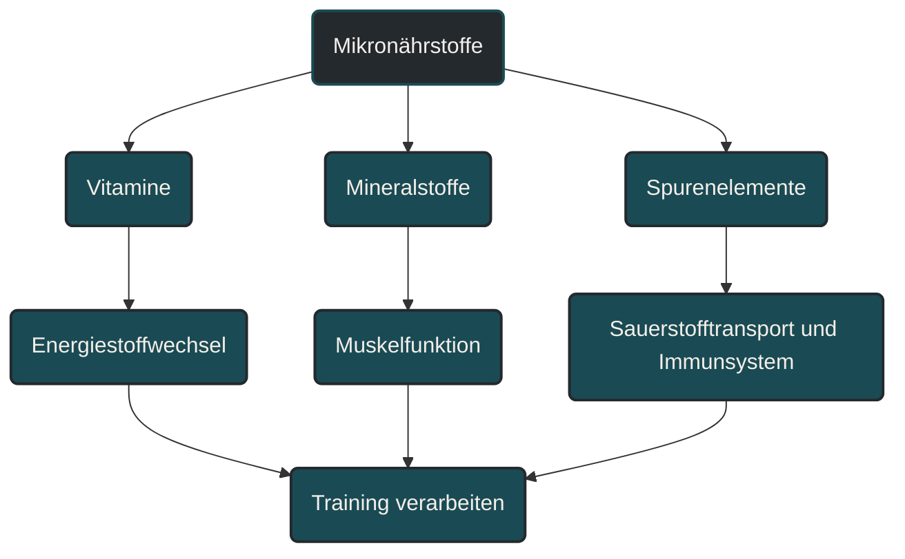
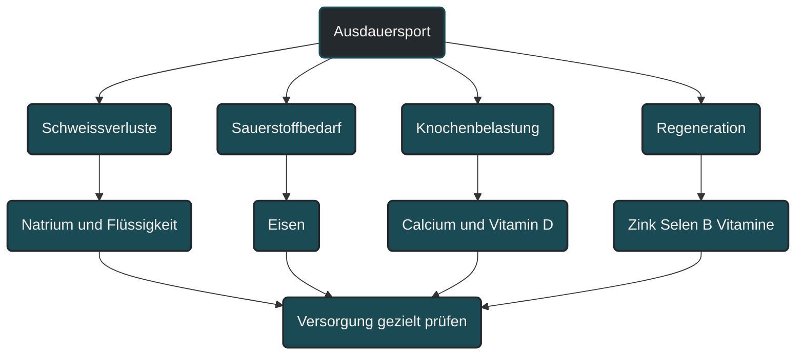

# Mikronährstoffe und Mineralstoffe

Mikronährstoffe und Mineralstoffe liefern keine direkte Trainingsenergie, sind aber für viele Prozesse im Ausdauersport wichtig. Sie unterstützen Sauerstofftransport, Energiestoffwechsel, Muskelfunktion, Knochenstoffwechsel, Immunsystem und Regeneration. Entscheidend ist nicht, möglichst viele Präparate einzunehmen, sondern Ernährung, Energieverfügbarkeit, Trainingsbelastung und individuelle Versorgung sinnvoll einzuordnen. [[1]](#quelle-1) [[2]](#quelle-2) [[8]](#quelle-8)

## Was Mikronährstoffe und Mineralstoffe bedeuten

Mikronährstoffe sind Nährstoffe, die der Körper nur in kleinen Mengen benötigt. Dazu gehören Vitamine, Mineralstoffe und Spurenelemente. Obwohl sie keine Energie wie Kohlenhydrate, Fette oder Proteine liefern, sind sie an vielen Stoffwechselprozessen beteiligt. [[1]](#quelle-1) [[2]](#quelle-2) [[8]](#quelle-8)

Mineralstoffe werden häufig in Mengenelemente und Spurenelemente eingeteilt. Mengenelemente wie Calcium, Magnesium, Natrium, Kalium und Phosphor kommen in größeren Mengen im Körper vor. Spurenelemente wie Eisen, Zink, Jod und Selen werden nur in kleineren Mengen benötigt, können aber trotzdem sehr wichtig sein. [[1]](#quelle-1) [[2]](#quelle-2) [[8]](#quelle-8)

Im Ausdauersport sind Mikronährstoffe deshalb relevant, weil Training den Stoffwechsel fordert, Schweißverluste entstehen, Gewebe repariert wird und das Immunsystem belastet sein kann. [[1]](#quelle-1) [[2]](#quelle-2) [[8]](#quelle-8)

## Warum Mikronährstoffe im Ausdauersport wichtig sind

Ausdauertraining erhöht nicht automatisch den Bedarf an jedem einzelnen Mikronährstoff. Es kann aber die Bedeutung einer guten Grundversorgung erhöhen, weil der Körper regelmäßig belastet wird.

Einige Mikronährstoffe sind besonders wichtig für Prozesse, die im Ausdauersport zentral sind: Eisen für Sauerstofftransport, Calcium und Vitamin D für Knochenstoffwechsel, Natrium für Flüssigkeitshaushalt, Magnesium und Kalium für Muskelfunktion sowie B-Vitamine für den Energiestoffwechsel. [[1]](#quelle-1) [[2]](#quelle-2) [[8]](#quelle-8)

Wichtig ist: Ein Mangel kann Leistung, Regeneration und Gesundheit beeinträchtigen. Eine zusätzliche Einnahme ohne Mangel verbessert aber nicht automatisch die Leistung. Deshalb sollte Supplementierung nicht nach Gefühl, sondern nach Bedarf, Ernährungssituation und bei Bedarf mit Blutwerten eingeordnet werden. [[1]](#quelle-1) [[4]](#quelle-4)

## Eisen

Eisen ist im Ausdauersport besonders relevant, weil es eine zentrale Rolle beim Sauerstofftransport spielt. Es ist Bestandteil von Hämoglobin und Myoglobin und damit wichtig für die Sauerstoffversorgung von Blut und Muskulatur. [[4]](#quelle-4) [[9]](#quelle-9)

Eine unzureichende Eisenversorgung kann sich durch Müdigkeit, Leistungsabfall, höhere Belastungswahrnehmung oder schlechtere Regeneration bemerkbar machen. Diese Symptome sind aber unspezifisch und können viele Ursachen haben. [[4]](#quelle-4) [[9]](#quelle-9)

Besonders bei hohen Laufumfängen, pflanzenbasierter Ernährung, geringer Energiezufuhr oder wiederkehrender Müdigkeit kann es sinnvoll sein, Eisenstatus ärztlich abklären zu lassen. Eine eigenständige Eisensupplementierung ist nicht ideal, weil zu viel Eisen ebenfalls problematisch sein kann. [[4]](#quelle-4) [[9]](#quelle-9)

## Calcium und Vitamin D

Calcium ist wichtig für Knochen, Muskelfunktion und Signalprozesse. Vitamin D unterstützt unter anderem den Calciumstoffwechsel und wird häufig im Zusammenhang mit Knochenstoffwechsel, Immunsystem und Muskelgesundheit diskutiert. [[1]](#quelle-1) [[3]](#quelle-3) [[5]](#quelle-5)

Für Läufer ist dieser Bereich wichtig, weil Knochen durch wiederholte Stoßbelastung gefordert werden. Training kann Knochen stärken, aber nur, wenn Belastung, Energieverfügbarkeit, Hormonhaushalt, Calciumversorgung und Regeneration zusammenpassen. [[1]](#quelle-1) [[3]](#quelle-3) [[5]](#quelle-5)

Bei niedriger Energieverfügbarkeit, Stressfrakturen, sehr einseitiger Ernährung oder wenig Sonnenexposition sollte die Versorgung besonders aufmerksam betrachtet werden. [[3]](#quelle-3)

## Natrium, Kalium und Flüssigkeitshaushalt

Natrium und Kalium sind Elektrolyte. Sie spielen eine wichtige Rolle für Flüssigkeitshaushalt, Nervenleitung und Muskelfunktion. [[6]](#quelle-6)

Beim Schwitzen gehen Wasser und Elektrolyte verloren. Wie hoch diese Verluste sind, hängt von Temperatur, Luftfeuchtigkeit, Trainingsdauer, Intensität, Kleidung, individueller Schweißrate und Akklimatisation ab.

Für kurze lockere Einheiten ist meist keine komplizierte Strategie nötig. Bei langen Einheiten, Hitze, hoher Schweißrate oder Wettkämpfen kann eine gezielte Flüssigkeits- und Elektrolytstrategie wichtiger werden.

## Magnesium

Magnesium ist an vielen enzymatischen Prozessen beteiligt und wird häufig mit Muskelfunktion, Energiestoffwechsel und Krämpfen verbunden. [[7]](#quelle-7)

In der Praxis wird Magnesium oft vorschnell als Lösung für Muskelkrämpfe gesehen. Krämpfe können aber viele Ursachen haben: Ermüdung, ungewohnte Belastung, Hitze, Flüssigkeitsverluste, neuromuskuläre Faktoren oder Trainingssteuerung. [[7]](#quelle-7)

Eine ausreichende Magnesiumversorgung ist sinnvoll. Sehr hohe Mengen oder eine ungezielte Supplementierung sind aber nicht automatisch besser und können je nach Verträglichkeit auch Verdauungsprobleme verursachen. [[7]](#quelle-7)

## Zink, Selen und Immunsystem

Zink und Selen sind Spurenelemente, die unter anderem für Immunfunktionen und antioxidative Systeme relevant sind. Ausdauertraining kann das Immunsystem phasenweise belasten, besonders bei hoher Gesamtbelastung, wenig Schlaf oder niedriger Energieverfügbarkeit. [[1]](#quelle-1) [[2]](#quelle-2)

Trotzdem sollten Zink und Selen nicht als einfache „Immunschutz-Supplemente“ verstanden werden. Entscheidend bleibt das Gesamtbild: ausreichend Energie, gute Kohlenhydratversorgung bei harten Einheiten, Schlaf, Regeneration und eine abwechslungsreiche Ernährung. [[1]](#quelle-1) [[2]](#quelle-2)

Zu hohe Mengen einzelner Spurenelemente können problematisch sein. Deshalb ist eine gezielte Einordnung wichtiger als eine breite Einnahme ohne Anlass.

## B-Vitamine

B-Vitamine sind an vielen Prozessen des Energiestoffwechsels beteiligt. Sie helfen dem Körper, Energie aus Kohlenhydraten, Fetten und Proteinen nutzbar zu machen. [[1]](#quelle-1) [[8]](#quelle-8)

Das bedeutet aber nicht, dass zusätzliche B-Vitamine automatisch mehr Energie erzeugen. Sie ermöglichen Stoffwechselprozesse, ersetzen aber keine Energiezufuhr. Wer zu wenig isst oder zu wenig Kohlenhydrate für harte Einheiten zuführt, wird durch B-Vitamine allein nicht leistungsfähiger. [[1]](#quelle-1) [[8]](#quelle-8)

Bei sehr einseitiger Ernährung, veganer Ernährung oder Verdacht auf Mangel kann eine gezielte Prüfung sinnvoll sein. Besonders Vitamin B12 muss bei veganer Ernährung bewusst berücksichtigt werden.

## Zentrale Einflussfaktoren

### Energieverfügbarkeit

Eine gute Mikronährstoffversorgung ist schwer, wenn insgesamt zu wenig gegessen wird. Wer dauerhaft zu wenig Energie zuführt, nimmt oft auch weniger Vitamine, Mineralstoffe und Spurenelemente auf. [[1]](#quelle-1) [[2]](#quelle-2) [[8]](#quelle-8)

Deshalb ist niedrige Energieverfügbarkeit ein zentraler Risikofaktor. Sie betrifft nicht nur Makronährstoffe, sondern auch die Versorgung mit Mikronährstoffen. [[1]](#quelle-1) [[2]](#quelle-2) [[8]](#quelle-8)

### Ernährungsqualität

Eine abwechslungsreiche Ernährung mit Gemüse, Obst, Vollkornprodukten, Hülsenfrüchten, Nüssen, Samen, hochwertigen Fettquellen und passenden Proteinquellen verbessert die Wahrscheinlichkeit einer guten Versorgung.

Einzelne Supplemente können eine schwache Grundstruktur nicht vollständig ausgleichen. Sie können sinnvoll sein, wenn ein konkreter Bedarf besteht, ersetzen aber keine insgesamt tragfähige Ernährung.

### Trainingsumfang und Schweißverluste

Hohe Umfänge, lange Läufe, Hitze und hohe Schweißraten erhöhen die Bedeutung von Flüssigkeit, Natrium und allgemeiner Versorgung. Dabei ist der Bedarf individuell sehr unterschiedlich. [[6]](#quelle-6)

Wer nach langen Einheiten regelmäßig stark erschöpft ist, Kopfschmerzen bekommt, stark salzige Schweißränder sieht oder bei Hitze deutlich einbricht, sollte Flüssigkeits- und Elektrolytstrategie genauer betrachten.

### Ernährungsform

Vegetarische oder vegane Ernährung kann sehr gut funktionieren, braucht aber eine bewusste Planung bestimmter Nährstoffe. Besonders relevant können Eisen, Vitamin B12, Jod, Zink, Calcium, Vitamin D und Omega-3 sein. [[4]](#quelle-4) [[9]](#quelle-9)

Das bedeutet nicht, dass pflanzenbasierte Ernährung automatisch mangelhaft ist. Es bedeutet nur, dass einige Nährstoffe gezielter geplant werden sollten.

### Blutwerte und individuelle Abklärung

Bei Verdacht auf Mangel, anhaltender Müdigkeit, Leistungsabfall, wiederkehrenden Infekten, Stressfrakturen oder ungeklärten Beschwerden ist eine medizinische Abklärung sinnvoll.

Gerade Eisen, Vitamin D, Vitamin B12 und andere Marker sollten nicht allein nach Gefühl beurteilt werden. Werte, Symptome, Ernährung und Trainingsbelastung gehören zusammen betrachtet. [[4]](#quelle-4) [[9]](#quelle-9)

## Bedeutung für Läufer

Für Läufer sind Mikronährstoffe und Mineralstoffe besonders wichtig, weil Lauftraining gleichzeitig Stoffwechsel, Muskulatur, Knochen, Sehnen und Immunsystem belastet. [[1]](#quelle-1) [[2]](#quelle-2) [[8]](#quelle-8)

Eisen, Calcium, Vitamin D und Natrium sind dabei häufig besonders praxisrelevant. Eisen betrifft Sauerstofftransport, Calcium und Vitamin D betreffen Knochenstoffwechsel, Natrium betrifft Flüssigkeitshaushalt bei langen oder heißen Einheiten.

Trotzdem sollte der Blick nicht nur auf einzelne Nährstoffe gehen. Ein Läufer mit hoher Trainingsbelastung braucht eine Ernährung, die insgesamt zur Belastung passt. Dazu gehören Energie, Kohlenhydrate, Protein, Fette, Flüssigkeit und Mikronährstoffe.

## Häufige Fehler

Ein häufiger Fehler ist, Mikronährstoffe als schnelle Leistungssteigerung zu betrachten. Sie sind wichtig, aber sie wirken nicht wie ein direkter Turbo.

Ein zweiter Fehler ist, Mängel nur nach Symptomen zu vermuten. Müdigkeit, Krämpfe oder Leistungsabfall können viele Ursachen haben und sollten nicht automatisch einem einzelnen Nährstoff zugeschrieben werden.

Ein dritter Fehler ist, viele Präparate gleichzeitig einzunehmen. Dadurch wird unklar, was wirklich gebraucht wird, und das Risiko unnötiger oder zu hoher Zufuhr steigt.

Ein vierter Fehler ist, Supplemente wichtiger zu nehmen als Energieverfügbarkeit, Schlaf und Trainingssteuerung. Wenn die Basis nicht passt, lösen Mikronährstoffe allein das Problem nicht.

## Praktische Einordnung

Mikronährstoffe und Mineralstoffe sind im Ausdauersport Teil der Basisversorgung. Sie unterstützen viele Prozesse, die Training überhaupt erst verarbeitbar machen.

Für die Praxis ist sinnvoll, zuerst Ernährung und Energieverfügbarkeit zu prüfen. Danach können konkrete Risikofaktoren betrachtet werden: hohe Umfänge, Hitze, starke Schweißverluste, pflanzenbasierte Ernährung, wiederkehrende Müdigkeit oder Verletzungshistorie.

Der wichtigste Merksatz lautet: Mikronährstoffe liefern keine Trainingsenergie, aber ohne ausreichende Versorgung funktionieren Sauerstofftransport, Knochenstoffwechsel, Muskelfunktion, Immunsystem und Regeneration schlechter.

----

----
## Häufige Fragen zu Mikronährstoffen und Mineralstoffen

### Was sind Mikronährstoffe einfach erklärt?

Mikronährstoffe sind Vitamine, Mineralstoffe und Spurenelemente. Sie liefern keine direkte Energie, sind aber an vielen Stoffwechselprozessen beteiligt.

### Warum sind Mineralstoffe im Ausdauersport wichtig?

Mineralstoffe unterstützen unter anderem Muskelfunktion, Flüssigkeitshaushalt, Knochenstoffwechsel und Nervenleitung. Beim Schwitzen können besonders Wasser und Elektrolyte relevant werden.

### Welche Mikronährstoffe sind für Läufer besonders wichtig?

Häufig relevant sind Eisen, Calcium, Vitamin D, Natrium, Magnesium, Zink, Selen und B-Vitamine. Welche davon wirklich kritisch sind, hängt von Ernährung, Belastung, Schweißverlusten und individueller Situation ab.

### Sollte man Mikronährstoffe vorsorglich supplementieren?

Nicht pauschal. Supplemente können sinnvoll sein, wenn ein konkreter Bedarf oder Mangel besteht. Ohne Anlass ist eine breite Einnahme nicht automatisch besser.

### Warum ist Eisen im Ausdauersport wichtig?

Eisen ist wichtig für den Sauerstofftransport im Blut und in der Muskulatur. Bei Verdacht auf niedrige Eisenversorgung sollte der Status medizinisch abgeklärt werden.

### Was ist ein häufiger Fehler bei Mikronährstoffen?

Ein häufiger Fehler ist, Müdigkeit oder Leistungsabfall sofort einem einzelnen Nährstoff zuzuschreiben. Training, Schlaf, Energieverfügbarkeit, Stress und Gesundheit müssen immer mit betrachtet werden.

## Quellen

### Quelle 1

Thomas, D. T.; Erdman, K. A.; Burke, L. M.: [Position of the Academy of Nutrition and Dietetics, Dietitians of Canada, and the American College of Sports Medicine: Nutrition and Athletic Performance](https://pubmed.ncbi.nlm.nih.gov/26891166/), Journal of the Academy of Nutrition and Dietetics / Medicine & Science in Sports & Exercise, 2016.

### Quelle 2

Maughan, R. J. et al.: [IOC Consensus Statement: Dietary Supplements and the High-Performance Athlete](https://bjsm.bmj.com/content/52/7/439), British Journal of Sports Medicine, 2018.

### Quelle 3

Mountjoy, M. et al.: [2023 International Olympic Committee’s consensus statement on Relative Energy Deficiency in Sport (REDs)](https://bjsm.bmj.com/content/57/17/1073), British Journal of Sports Medicine, 2023.

### Quelle 4

McCormick, R. et al.: [Iron considerations for the athlete: a narrative review](https://link.springer.com/article/10.1007/s00421-019-04157-y), European Journal of Applied Physiology, 2020.

### Quelle 5

Larson-Meyer, D. E.; Willis, K. S.: [Vitamin D and athletes](https://pubmed.ncbi.nlm.nih.gov/20622540/), Current Sports Medicine Reports, 2010.

### Quelle 6

Sawka, M. N. et al.: [American College of Sports Medicine Position Stand: Exercise and Fluid Replacement](https://pubmed.ncbi.nlm.nih.gov/17277604/), Medicine & Science in Sports & Exercise, 2007.

### Quelle 7

Zhang, Y. et al.: [Effects of magnesium supplementation on muscle soreness in different type of physical activities: a systematic review](https://pmc.ncbi.nlm.nih.gov/articles/PMC11227245/), Journal of Translational Medicine, 2024.

### Quelle 8

Volpe, S. L.: [Micronutrient Requirements for Athletes](https://pubmed.ncbi.nlm.nih.gov/17465688/), Clinics in Sports Medicine, 2007.

### Quelle 9

Peeling, P. et al.: [Iron Status and the Acute Post-Exercise Hepcidin Response in Athletes](https://pubmed.ncbi.nlm.nih.gov/22634964/), PLoS ONE, 2014.

----

*Hinweis: Dieser Artikel dient der allgemeinen Information und ersetzt keine medizinische oder therapeutische Beratung. Mehr dazu im [**Gesundheits- und Quellenhinweis**](/ausdauersport/disclaimer/).*

